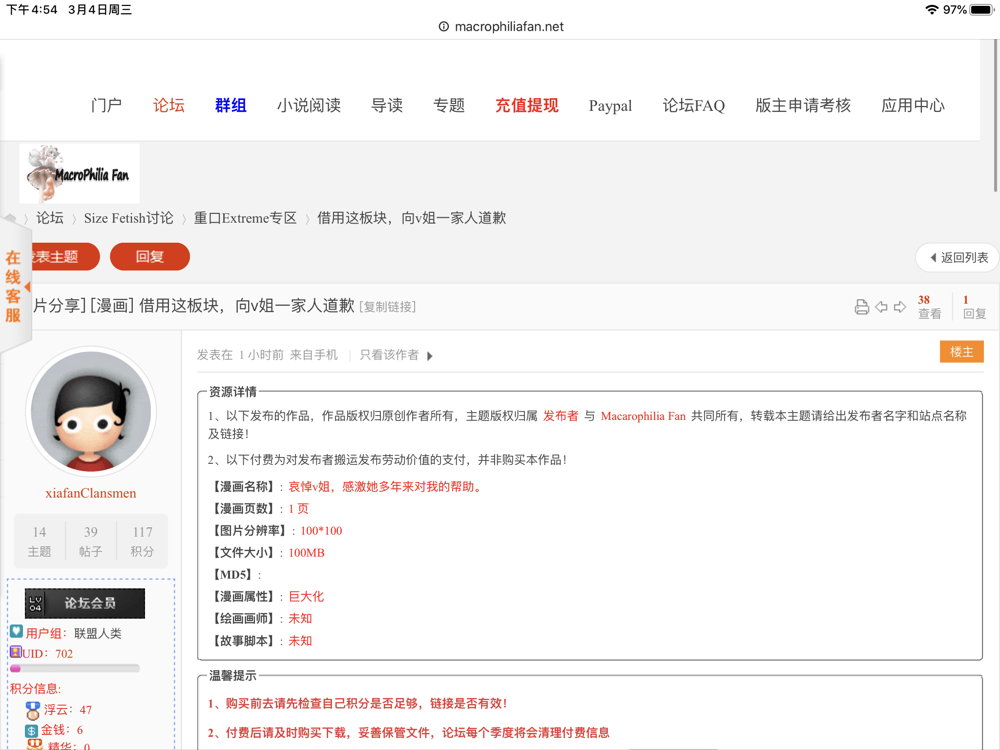
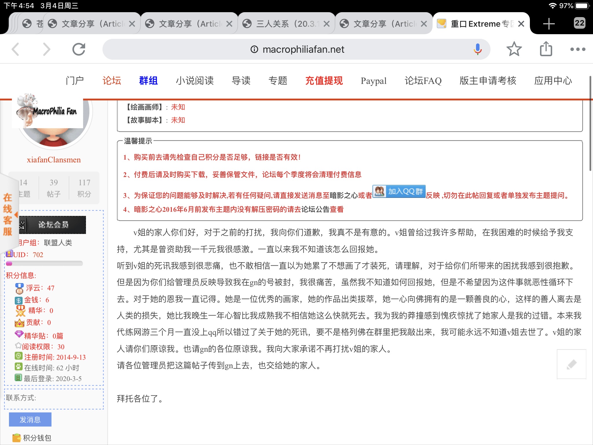

# 关于之前骚扰到Vivian家人的吧友

作者：Malph

TID：28201

<title>1</title> <link href="../Styles/Style.css" type="text/css" rel="stylesheet">

# 1

这是他在macrophilia 吧的回复，转发到这里。他由于很长一段时间都没上线qq所以不知道Vivian的死讯然后不了解情况下做出骚扰在Vivian家人的举动然后在此致歉，希望取得大家和Vivian家人的原谅。
<title>2</title> <link href="../Styles/Style.css" type="text/css" rel="stylesheet">

# 2

 <ignore_js_op>[213398BD-C05E-430B-A742-595F3D6012E8.png](forum.php?mod=attachment&aid=ODE3NTd8MjRhMWZmNWR8MTY3NDA2NjU0NXwxODIzMHwyODIwMQ%3D%3D&nothumb=yes) *(793.2 KB, 下載次數: 2)*

[下載附件](forum.php?mod=attachment&aid=ODE3NTd8MjRhMWZmNWR8MTY3NDA2NjU0NXwxODIzMHwyODIwMQ%3D%3D&nothumb=yes)

2020-3-5 09:02 上傳  

</ignore_js_op> <ignore_js_op>[860C8828-437C-482D-8412-BF9D61379094.png](forum.php?mod=attachment&aid=ODE3NTh8YmViN2ZkMzV8MTY3NDA2NjU0NXwxODIzMHwyODIwMQ%3D%3D&nothumb=yes) *(1017.31 KB, 下載次數: 0)*

[下載附件](forum.php?mod=attachment&aid=ODE3NTh8YmViN2ZkMzV8MTY3NDA2NjU0NXwxODIzMHwyODIwMQ%3D%3D&nothumb=yes)

2020-3-5 09:02 上傳  

</ignore_js_op> <title>3</title> <link href="../Styles/Style.css" type="text/css" rel="stylesheet">

# 3

道歉的对象搞错了，在所谓的圈子里致歉和之前的“推理”一样，只是自我表现 <title>4</title> <link href="../Styles/Style.css" type="text/css" rel="stylesheet">

# 4

事情原委请看名为 请对逝去的人的家属表示出应有的尊重吧 的管理员帖 <title>5</title> <link href="../Styles/Style.css" type="text/css" rel="stylesheet">

# 5

让他继续演吧，互联网并不是完全没有记忆的。
另外，因为该帖子涉及会导致一系列的问题，所以锁定处理。