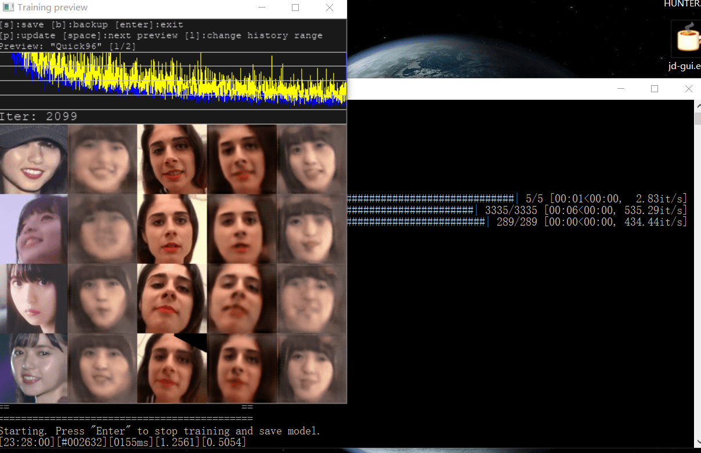

# 关于依靠ai换脸解决片荒的可行性

作者：cghg

TID：27965

<title>1</title> <link href="../Styles/Style.css" type="text/css" rel="stylesheet">

# 1

*本帖最後由 ZZ04086439 於 2020-2-5 14:46 編輯*

P站视频10部里就1个能看的, 100部可能才有个精品, 考虑下通过换脸拯救那些 互动不错的 欧美大妈们的视频....
换脸技术已经很成熟了(DeepFaceLab什么的), 也没见着有老哥们去尝试.

比如做个斋藤飞鸟的pov,想想就兴奋

---------------------------
尝试了一下.....发个初次半成品,gtx1660ti 深度学习3小时, 运算10万次的结果(推荐值为300万次...), 由于素材肤色差别严重(飞鸟脸型又很小),导致就像带了个面具一样, 相信后边通过调整素材(换人),增加学习时间(目测至少30小时) , 应该可以达到预期效果.

有兴趣的同学可以diy一下,软件很成熟, 没什么学习成本.

----------------------------
怕大家认为看着高大上, 门槛很高, 这里初步安利下:
项目地址 github.com/iperov/DeepFaceLab  , 下面说明里的Releases 中可以直接下载,解压后目录下有项目自带的示例视频, 还有10多个批处理文件, 执行一下就好了, 相关教程网上很多,提一下大致流程(步骤2-6都有相应的批处理可以一键执行):
1) 找好你要替换的目标片源(gts视频) 和 素材片源(你要替换的各种明星视频), 放入workspce里并修改名称
2) 将2个视频解析成图片,这一步需要手动删除非相关的素材图片
3) DeepFaceLab智能识别图片中的脸,生成头像文件
4) 进行深度学习
5) 一段时间的学习后,生成合成的帧图片
6)将图片合并成视频

全程无需编程基础, 我也是外行刚入门2天, 看了评论感觉论坛里藏着很多老司机......
对于刚接触的人, 有可能遇到一些坑点, 网上都有相应的解决方法, 另外, 两个片源最好高清, 光线变化越少越好, 人物最好肤色相近.

训练结果是一直存在,第一次训练比较费时, 玩久了后边换目标片源, 学习所需的时间也比第一次大大降低, 所以直接用别人的训练文件可以极大增加效率.

对于没有显卡条件的同学, 极度推荐使用DeepFaceLab_Colab 进行免费的云渲染, 性能也很强, 还省电, 挂着就好了. github地址:github.com/dream80/DeepFaceLab_Colab,  也很容易入门.
<title>2</title> <link href="../Styles/Style.css" type="text/css" rel="stylesheet">

# 2

 <ignore_js_op>[result -output.gif](forum.php?mod=attachment&aid=ODEyMTd8OGUzYWE3Nzl8MTY3NDA2NjUzN3wxODIzMHwyNzk2NQ%3D%3D&nothumb=yes) *(2.45 MB, 下載次數: 31)*

[下載附件](forum.php?mod=attachment&aid=ODEyMTd8OGUzYWE3Nzl8MTY3NDA2NjUzN3wxODIzMHwyNzk2NQ%3D%3D&nothumb=yes)

2020-2-4 19:16 上傳  

</ignore_js_op> <title>3</title> <link href="../Styles/Style.css" type="text/css" rel="stylesheet">

# 3

要是有这种技术，我做梦都能乐醒 <title>4</title> <link href="../Styles/Style.css" type="text/css" rel="stylesheet">

# 4

> [宇宙巨娘大和号 發表於 2020-2-3 22:44](https://giantessnight.cf/gnforum2012/forum.php?mod=redirect&goto=findpost&pid=424677&ptid=27965)
> 要是有这种技术，我做梦都能乐醒

真有...我先倒腾一下据说面部学习程序跑一天基本就差不多了.....实在不行就有偿找相关专业人士了

<title>5</title> <link href="../Styles/Style.css" type="text/css" rel="stylesheet">

# 5

 <ignore_js_op>[20200203232819.png](forum.php?mod=attachment&aid=ODEyMDl8ZGQ3ZWRlMmF8MTY3NDA2NjUzN3wxODIzMHwyNzk2NQ%3D%3D&nothumb=yes) *(533.91 KB, 下載次數: 0)*

[下載附件](forum.php?mod=attachment&aid=ODEyMDl8ZGQ3ZWRlMmF8MTY3NDA2NjUzN3wxODIzMHwyNzk2NQ%3D%3D&nothumb=yes)

2020-2-3 23:31 上傳  

</ignore_js_op> <title>6</title> <link href="../Styles/Style.css" type="text/css" rel="stylesheet">

# 6

預測不可行 這種題材的影片常常貼在超小的地方 照到嘴巴裡面的時候你是要怎麼換臉 <title>7</title> <link href="../Styles/Style.css" type="text/css" rel="stylesheet">

# 7

1.你给有一张不错的显卡(至少GTX1080)
2.你要有耐心学习技术(Python，CUDA和深度学习配置)
3.不是整张脸的片段识别不出来的可能性很大，再加上吞人之类的环节就更麻烦了
4.视频除了脸其他都没改(身子什么的) <title>8</title> <link href="../Styles/Style.css" type="text/css" rel="stylesheet">

# 8

> [3213213210 發表於 2020-2-4 00:15](https://giantessnight.cf/gnforum2012/forum.php?mod=redirect&goto=findpost&pid=424690&ptid=27965)
> 預測不可行 這種題材的影片常常貼在超小的地方 照到嘴巴裡面的時候你是要怎麼換臉 ...

我觉得可以用来弄那些非vore题材的视频，比如自慰和踩踏
<title>9</title> <link href="../Styles/Style.css" type="text/css" rel="stylesheet">

# 9

会不会涉及法律问题？ <title>10</title> <link href="../Styles/Style.css" type="text/css" rel="stylesheet">

# 10

> [study 發表於 2020-2-4 01:20](https://giantessnight.cf/gnforum2012/forum.php?mod=redirect&goto=findpost&pid=424699&ptid=27965)
> 1.你给有一张不错的显卡(至少GTX1080)
> 2.你要有耐心学习技术(Python，CUDA和深度学习配置)
> 3.不是整张脸的 ...

2不需要，现在deepfakes已经类似于傻瓜式一键操作了
<title>11</title> <link href="../Styles/Style.css" type="text/css" rel="stylesheet">

# 11

1680ti是不存在的，只有1660ti <title>12</title> <link href="../Styles/Style.css" type="text/css" rel="stylesheet">

# 12

只是听说过，居然真在论坛里看到大神了！ <title>13</title> <link href="../Styles/Style.css" type="text/css" rel="stylesheet">

# 13

可以试试，有了显卡和一定的资源后需要很长的训练的时间。 <title>14</title> <link href="../Styles/Style.css" type="text/css" rel="stylesheet">

# 14

这张gif的原作叫啥？ <title>15</title> <link href="../Styles/Style.css" type="text/css" rel="stylesheet">

# 15

能做到，有很多的av片都换成了明星脸，虽然有点违和。但就是电脑配置的非常好，要不然渲染时得耗费大量资源，太烂的机子撑不住。。。 <title>16</title> <link href="../Styles/Style.css" type="text/css" rel="stylesheet">

# 16

LZ！我想求一下GIF这个资源啊~~~
<title>17</title> <link href="../Styles/Style.css" type="text/css" rel="stylesheet">

# 17

LZ用的是现成的吗 求分享一下github地址 <title>18</title> <link href="../Styles/Style.css" type="text/css" rel="stylesheet">

# 18

mark这帖，看大佬技术讨论 <title>19</title> <link href="../Styles/Style.css" type="text/css" rel="stylesheet">

# 19

> [000000 發表於 2020-2-5 11:58](https://giantessnight.cf/gnforum2012/forum.php?mod=redirect&goto=findpost&pid=424858&ptid=27965)
> LZ用的是现成的吗 求分享一下github地址

**github.com    /iperov/DeepFaceLab** <title>20</title> <link href="../Styles/Style.css" type="text/css" rel="stylesheet">

# 20

> [ReiAyanami 發表於 2020-2-5 08:05](https://giantessnight.cf/gnforum2012/forum.php?mod=redirect&goto=findpost&pid=424834&ptid=27965)
> 这张gif的原作叫啥？

p站标题 GIANTESS VIOLETTA (ORIGINALLY 332236 PLZ ADD ME BACK) ASDFLAHS;LHL;CJLLJLB

<title>21</title> <link href="../Styles/Style.css" type="text/css" rel="stylesheet">

# 21

白人大妈是真的......现在真的连预览都没耐心看完 <title>22</title> <link href="../Styles/Style.css" type="text/css" rel="stylesheet">

# 22

我觉得可以【手动滑稽】

<title>23</title> <link href="../Styles/Style.css" type="text/css" rel="stylesheet">

# 23

其实感觉还好，网络和人家train好的模型都是现成的。最后跑一下网络合成，显卡只要不是太烂应该都行 <title>24</title> <link href="../Styles/Style.css" type="text/css" rel="stylesheet">

# 24

我觉得还行，欧美大妈看不来

<title>25</title> <link href="../Styles/Style.css" type="text/css" rel="stylesheet">

# 25

真有大神这样干吗，如果真这样就可以解决片荒就好了
<title>26</title> <link href="../Styles/Style.css" type="text/css" rel="stylesheet">

# 26

我喜欢这个视频，完整的可以发我吗楼主
<title>27</title> <link href="../Styles/Style.css" type="text/css" rel="stylesheet">

# 27

试过换脸Tywest的视频 但是总是训练好模型之后替换出问题 后来就没在搞了 <title>28</title> <link href="../Styles/Style.css" type="text/css" rel="stylesheet">

# 28

*本帖最後由 didi 於 2020-3-15 21:29 編輯*

剧情相似我都觉得难受，更别说除了脸意外都一样，顺带一提，我觉得看片主要更是看动作（虽然我不看）