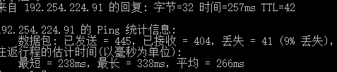
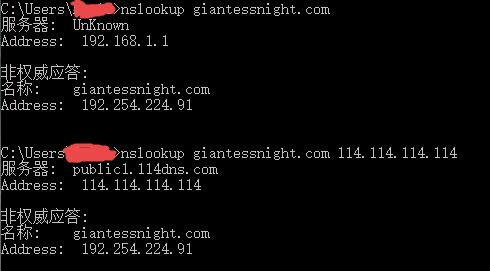
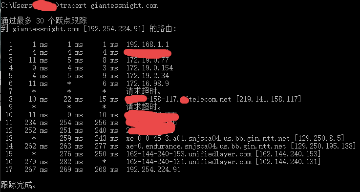
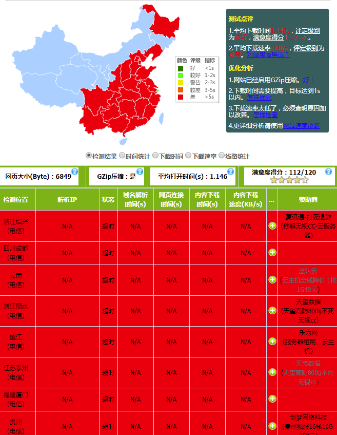
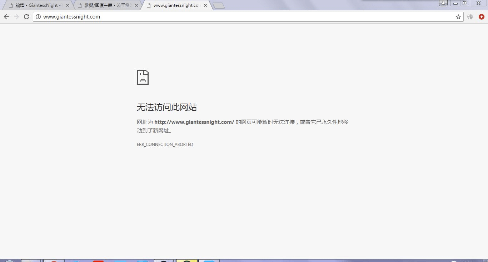

# 关于修改HOST访问GN

作者：xxx1137727897

TID：23896

<title>1</title> <link href="../Styles/Style.css" type="text/css" rel="stylesheet">

# 1

在几周前GN在大陆被墙了，我等就只能翻墙上了，很麻烦。记得之前查过墙算是一种DNS劫持？那么是不是吧DNS服务器改到国外就能上了？之前看修改HOST也行，那么有没有大神能提供下GN的全部域名对应的IP地址呢？ <title>2</title> <link href="../Styles/Style.css" type="text/css" rel="stylesheet">

# 2

发这个贴主要是翻墙太麻烦了看看有没有简单易行的办法，如果内容不应发在这个区，麻烦告知我，我会删掉 <title>3</title> <link href="../Styles/Style.css" type="text/css" rel="stylesheet">

# 3

这个应该找[@Dante](https://giantessnight.cf/gnforum2012/home.php?mod=space&uid=1) 但大。。。。。。 <title>4</title> <link href="../Styles/Style.css" type="text/css" rel="stylesheet">

# 4

emmmmm 现在我都是翻墙才能上的 P站也是 不过现在P站我看贴吧 他们好像就是改host能行 这边不知道怎样 <title>5</title> <link href="../Styles/Style.css" type="text/css" rel="stylesheet">

# 5

听说是dns污染什么的 <title>6</title> <link href="../Styles/Style.css" type="text/css" rel="stylesheet">

# 6

刚刚简单研究测试了一下，大致知道了被墙的问题所在。
首先比较确信的是，GN并不是因为DNS污染而被墙，在未翻墙状态，GN的IP地址是可以被ping通的，虽然略有丢包；
<ignore_js_op>

**ping.png** *(5.66 KB, 下載次數: 0)*

[下載附件](forum.php?mod=attachment&aid=Njk1OTh8ZmQ5YmMyMjh8MTY3NDA2NzMzM3wxODIzMHwyMzg5Ng%3D%3D&nothumb=yes)

2017-9-30 01:22 上傳

分别用运营商默认DNS和114DNS测试，都能正常的解析出来192.254.224.91这个IP，我确认这个也是GN正确的IP地址；
<ignore_js_op>

**nslookup.png** *(9.04 KB, 下載次數: 0)*

[下載附件](forum.php?mod=attachment&aid=Njk1OTd8ZjBjZmZlN2R8MTY3NDA2NzMzM3wxODIzMHwyMzg5Ng%3D%3D&nothumb=yes)

2017-9-30 01:22 上傳

使用Tracert可以发现其中有电信在做干扰，不过最后仍然能够解析到最终的IP上；
<ignore_js_op>

**tracert.png** *(21.22 KB, 下載次數: 0)*

[下載附件](forum.php?mod=attachment&aid=Njk1OTl8NDFjZjY4OTJ8MTY3NDA2NzMzM3wxODIzMHwyMzg5Ng%3D%3D&nothumb=yes)

2017-9-30 01:22 上傳

使用站长工具测试可以确认，GN确实是100%被封锁的；
<ignore_js_op>

**block.png** *(96.74 KB, 下載次數: 0)*

[下載附件](forum.php?mod=attachment&aid=Njk1OTZ8YmM1MmI5OTd8MTY3NDA2NzMzM3wxODIzMHwyMzg5Ng%3D%3D&nothumb=yes)

2017-9-30 01:22 上傳

而直接打开站点的报错是“连接被重置”；
通过修改Hosts把域名giantessnight.com引导到192.254.224.91后，依然无法访问。

那么可以总结一下：Ping没问题，DNS解析正常，IP未被封锁，那么很可能是触发了关键字拦截导致链接被重置，也可能是域名被加入了关键字阻断列表；

结论：由于网站使用http，信息会被墙以某些关键字拦截，那么如果站点能够升级到https，可以有效解决目前被墙的问题；如果能为站点增加一个备用域名，有一定几率可以解决被墙问题；本机修改host，无法解决被墙问题。
<title>7</title> <link href="../Styles/Style.css" type="text/css" rel="stylesheet">

# 7

> [wxy112300 發表於 2017-9-30 01:38](https://giantessnight.cf/gnforum2012/forum.php?mod=redirect&goto=findpost&pid=348416&ptid=23896)
> 刚刚简单研究测试了一下，大致知道了被墙的问题所在。
> 首先比较确信的是，GN并不是因为DNS污染而被墙，在未 ...

大概懂了，多谢大佬解答
<title>8</title> <link href="../Styles/Style.css" type="text/css" rel="stylesheet">

# 8

> [wxy112300 發表於 2017-9-30 01:38](https://giantessnight.cf/gnforum2012/forum.php?mod=redirect&goto=findpost&pid=348416&ptid=23896)
> 刚刚简单研究测试了一下，大致知道了被墙的问题所在。
> 首先比较确信的是，GN并不是因为DNS污染而被墙，在未 ...

也就是说平常人除了挂VPN翻墙，没别的办法喽
<title>9</title> <link href="../Styles/Style.css" type="text/css" rel="stylesheet">

# 9

> [476894213 發表於 2017-9-30 21:46](https://giantessnight.cf/gnforum2012/forum.php?mod=redirect&goto=findpost&pid=348445&ptid=23896)
> 也就是说平常人除了挂VPN翻墙，没别的办法喽

可以这么理解，因为GN只有单一IP和单一域名，基本上很容易被定向墙掉了
<title>10</title> <link href="../Styles/Style.css" type="text/css" rel="stylesheet">

# 10

> [wxy112300 發表於 2017-10-1 02:57](https://giantessnight.cf/gnforum2012/forum.php?mod=redirect&goto=findpost&pid=348464&ptid=23896)
> 可以这么理解，因为GN只有单一IP和单一域名，基本上很容易被定向墙掉了
> ...

嘛，也感谢大佬分析了
<title>11</title> <link href="../Styles/Style.css" type="text/css" rel="stylesheet">

# 11

其实不用这么麻烦的，直接输入网址就行了 <title>12</title> <link href="../Styles/Style.css" type="text/css" rel="stylesheet">

# 12

> [xxx1137727897 發表於 2017-10-1 22:00](https://giantessnight.cf/gnforum2012/forum.php?mod=redirect&goto=findpost&pid=348501&ptid=23896)
> 其实不用这么麻烦的，直接输入网址就行了

然而刚刚测试了一下并不行，还是需要梯子……
<title>13</title> <link href="../Styles/Style.css" type="text/css" rel="stylesheet">

# 13

 <ignore_js_op>[捕获.JPG](forum.php?mod=attachment&aid=Njk2MDl8YjhhYmM3OGJ8MTY3NDA2NzM0M3wxODIzMHwyMzg5Ng%3D%3D&nothumb=yes) *(53.44 KB, 下載次數: 0)*

[下載附件](forum.php?mod=attachment&aid=Njk2MDl8YjhhYmM3OGJ8MTY3NDA2NzM0M3wxODIzMHwyMzg5Ng%3D%3D&nothumb=yes)

2017-10-1 22:37 上傳  

</ignore_js_op> <title>14</title> <link href="../Styles/Style.css" type="text/css" rel="stylesheet">

# 14

VPN……好麻烦啊……就没其他办法嘞 <title>15</title> <link href="../Styles/Style.css" type="text/css" rel="stylesheet">

# 15

对于论坛来说好像目前http升级成https不现实 <title>16</title> <link href="../Styles/Style.css" type="text/css" rel="stylesheet">

# 16

目前把ssr部署到梅林路由器解决问题，dns解析也通过ssr。目前只能这样</ignore_js_op></ignore_js_op></ignore_js_op></ignore_js_op>