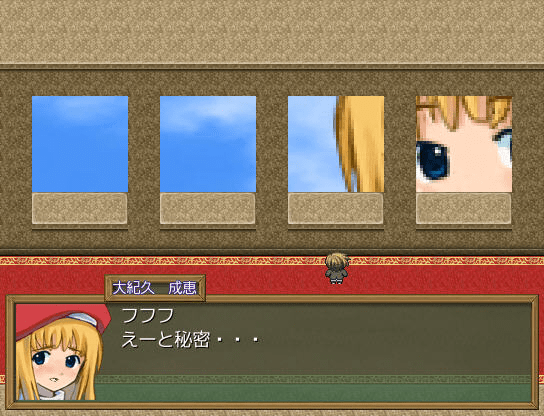
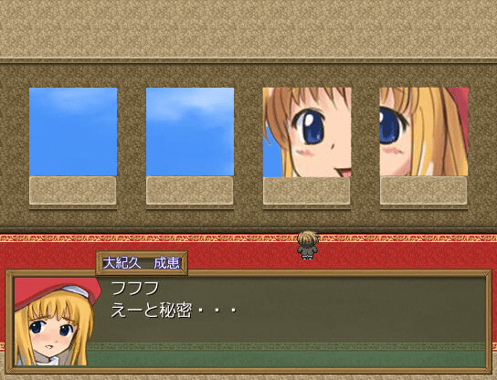

# 关于创作《缩》同人图的一些问题

作者：xnr

TID：8515

<title>1</title> <link href="../Styles/Style.css" type="text/css" rel="stylesheet">

# 1

《缩小学园》是一部神作，虽然今年8月份刚刚出了加强版，但是仍然有很大的改进和补完的空间。
在下小X想继续借这部神作，出一些手绘同人图作品，在此请大家给些意见和建议。

首先有两个重要的问题摆在眼前：
第一，要不要画？这是一个需要谨慎考虑的问题。虽然以前我有画过（当时不知道会出加强版，所以就画了），这次再画又会有很多潜在的问题产生。
第二，画什么？这个大家集思广益吧。

不赞同画的理由：
1\. 他人的版权作品，不容得其他人插手，这是最基本的尊重的原则。无论是翻译版也好，同人图也好，都会让原作者感到不快。
2\. 日本人在本国文化方面相对比较保守，不希望外国人的作品涉及到其内容，尤其是像《缩》这样投入了很多爱的神作，进而可能让他们对某国人产生更多的反感。
3\. 若是添加了原作中没有的情节和内容，会让那些死忠和FANS感到不快，玷污了神作。
4\. 若是补完了原作中没有的情节和内容，会让原创作者感到不快，一方面羞辱了他们的创作力和投入的时间精力，另一方面会间接影响到未来可能出现的新版本《缩》的开发和制作。
5\. 万一不小心画的不比原画师差，原画师就有罢工的理由了，我们就很难再看到他们的新作了。
6\. XNR画的很烂，业余人士也敢画同人图出来到处贴，真是丢人现眼，赶紧收手啦。

先解决上面这个问题吧。
另外如果决定要画了，大家希望看到哪些内容的同人图呢？

以下是一些个人想法：
游戏主菜单画面太渣了，完全配不上这部神作，可以像GAL游戏那样唯美一点嘛。

游戏后期的GTS画面太渣了：
<ignore_js_op>

**Snap1.jpg** *(51.28 KB, 下載次數: 1)*

[下載附件](forum.php?mod=attachment&aid=MjE2Nzl8ZDRkYjMzMTZ8MTY3NDA2ODgzNXwxODIzMHw4NTE1&nothumb=yes)

2010-11-12 00:02 上傳

于是采用了原绘师SS的一副同人作品：
[http://www.pixiv.net/member_illust.php?id=5097&p=2](http://www.pixiv.net/member_illust.php?id=5097&p=2)

修改如下：
<ignore_js_op>

**Snap1g.jpg** *(155.93 KB, 下載次數: 0)*

[下載附件](forum.php?mod=attachment&aid=MjE2Nzh8NDY3YjExNGR8MTY3NDA2ODgzNXwxODIzMHw4NTE1&nothumb=yes)

2010-11-11 23:11 上傳

这样会不会更好一点呢？

其他方面，还有很多可以补完的图，不过我还是想先听听大家的想法。
我打算画8-12张同人图，前提是允许我画。
在此抛砖引玉，希望大家多多交流，请勿灌水，谢谢！

[ *本帖最後由 xnr 於 2010-11-12 00:04 編輯* ] <title>2</title> <link href="../Styles/Style.css" type="text/css" rel="stylesheet">

# 2

我覺得先停一下,練習一下畫功再畫會更好...

P.S 話說你有進軍DA的覺悟了嗎 <title>3</title> <link href="../Styles/Style.css" type="text/css" rel="stylesheet">

# 3

> 原帖由 *killer9999* 於 2010-11-11 23:15 發表 
> 我覺得先停一下,練習一下畫功再畫會更好...
> 
> P.S 話說你有進軍DA的覺悟了嗎

若确定要画了也不会现在就画，手头还有几张正在做的作品，要画也是明年春节过后的事情。
所以想趁早开这个帖子多积累一些灵感，准备一些素材。

我的目标是：做GTS圈内一流的画师，对我这个业余的来讲，这已经是一个很难实现的宏伟目标了。
出了圈子，单纯比画功，我就是个渣渣，所以暂不考虑进军DA和PIXIV。 <title>4</title> <link href="../Styles/Style.css" type="text/css" rel="stylesheet">

# 4

首先，作者有没有表达他对二次同人的态度0.0这个只有作者说了算，他高兴就高兴不高兴就不高兴，其他人谁也不能决定作者的想法吧……
其次，读者高不高兴……嘛，我只能说二次同人水平参差不齐，但喜欢的有很多0.0就我自己而言我基本上是个原作党，原作是漫画基本上就不看动画版，但也有东方这种让我去刷同人本的存在= = <title>5</title> <link href="../Styles/Style.css" type="text/css" rel="stylesheet">

# 5

同人而已，随便画吧= =
顾忌太多就干脆别画= =
真要那么想的话，看看这么多届漫展的同人作品吧
那原作者岂不是都要气得要死要活的？
所以想画的话就尽管撒手去画吧 <title>6</title> <link href="../Styles/Style.css" type="text/css" rel="stylesheet">

# 6

X哥……你这谦虚的态度让我们这种死宅情何以堪。。
作为一个技术宅，
要做的就是给我们一个美好的梦，
去吧！
成为创作王吧！！ <title>7</title> <link href="../Styles/Style.css" type="text/css" rel="stylesheet">

# 7

玩游戏的人很多。。。想看同人图的人这么少么。。。

那就画少一点，画8张好了：

躲避女仆踩踏 一张
躲避巫女踩踏 一张
饲养员踩踏   一张
合成室被抓   一张
部长相关     一张
红毛绿毛相关 一张
成惠相关     一张
战巫女       一张

这样够了么。。。希望能有更好的建议。

[ *本帖最後由 xnr 於 2010-11-13 11:52 編輯* ] <title>8</title> <link href="../Styles/Style.css" type="text/css" rel="stylesheet">

# 8

补张吞食相关的好不~~~
1张，就1张~~~
拜托啦~~~ <title>9</title> <link href="../Styles/Style.css" type="text/css" rel="stylesheet">

# 9

游泳部更衣室那張POV
在藍髮少女更衣時跑進運動鞋裡的POV
成惠進縮小城市時的POV

以上大愛 <title>10</title> <link href="../Styles/Style.css" type="text/css" rel="stylesheet">

# 10

(没玩过游戏的厚颜无耻地来插一句)
东方那边的红白~~~

当然如果需要的话，我这个请求可以随时无视~ <title>11</title> <link href="../Styles/Style.css" type="text/css" rel="stylesheet">

# 11

> 原帖由 *eventually* 於 2010-11-13 12:23 發表 
> (没玩过游戏的厚颜无耻地来插一句)
> 东方那边的红白~~~
> 
> 当然如果需要的话，我这个请求可以随时 ...

这个建议不错，我也考虑是否可以让博丽灵梦（红白）客串一下，毕竟绿发巫女，白兔大大已经画了很多张了。

如图，图片取自PIXIV： <title>12</title> <link href="../Styles/Style.css" type="text/css" rel="stylesheet">

# 12

 <ignore_js_op>[7460075.jpg](forum.php?mod=attachment&aid=MjE3MjB8NTVhMDY5YzB8MTY3NDA2ODgzOXwxODIzMHw4NTE1&nothumb=yes) *(190.03 KB, 下載次數: 0)*

[下載附件](forum.php?mod=attachment&aid=MjE3MjB8NTVhMDY5YzB8MTY3NDA2ODgzOXwxODIzMHw4NTE1&nothumb=yes)

2010-11-13 14:29 上傳  

</ignore_js_op> <title>13</title> <link href="../Styles/Style.css" type="text/css" rel="stylesheet">

# 13

> 原帖由 *lg83449447* 於 2010-11-13 11:56 發表 
> 补张吞食相关的好不~~~
> 1张，就1张~~~
> 拜托啦~~~

一定会有吞食内容的，请放心！ <title>14</title> <link href="../Styles/Style.css" type="text/css" rel="stylesheet">

# 14

> 原帖由 *killer9999* 於 2010-11-13 12:01 發表 
> 游泳部更衣室那張POV
> 在藍髮少女更衣時跑進運動鞋裡的POV
> 成惠進縮小城市時的POV
> 
> 以上大愛

1\. 游泳部更衣室已经有POV镜头了，不过我倒是希望今后能有与游泳部其他角色互动的内容（比如那个走来走去的红发女生）。
2\. 运动鞋里已经有POV镜头了呀。。。我不可能画的比SS更好。。。
3\. 已经有成惠进入缩小都市的镜头了。。。再画就有抬杠的嫌疑了，不太好。。。 <title>15</title> <link href="../Styles/Style.css" type="text/css" rel="stylesheet">

# 15

说起游泳部更衣室有的吧~~
面包MM的那张CG感觉不是太赞啊。。
所以说~~~ <title>16</title> <link href="../Styles/Style.css" type="text/css" rel="stylesheet">

# 16

> 原帖由 *lg83449447* 於 2010-11-13 14:49 發表 
> 
> 说起游泳部更衣室有的吧~~
> 面包MM的那张CG感觉不是太赞啊。。
> 所以说~~~

别人画过的，不管怎样我都不会再画，这不是画的好不好的问题，这是最起码的尊重的问题，对原作者的尊重。 <title>17</title> <link href="../Styles/Style.css" type="text/css" rel="stylesheet">

# 17

11L:  

作为一名红白控，这个必须大力支持~~~

绿白？绿白有什么好萌的！？（被早苗党群殴拖走 <title>18</title> <link href="../Styles/Style.css" type="text/css" rel="stylesheet">

# 18

先畫畫吧，支持創作
作者沒有說不喜歡，那就沒問題吧。
至於重複的問題，我覺得X大想多了，不要任何顧慮，畫下來就是了。
如果日本那邊真的有人不高興[ 你知道的日本人還是很排外，加上最近的事件影響]，最多只放到這裡吧。

P.S.gs-uploader好像沒有人說不喜歡你的作品，加強版都應用了你大部分畫了的場景[只不過角度不同而已]，原作者有跟你接觸嗎?

[ *本帖最後由 wongvict 於 2010-11-13 22:37 編輯* ] <title>19</title> <link href="../Styles/Style.css" type="text/css" rel="stylesheet">

# 19

> 原帖由 *wongvict* 於 2010-11-13 22:16 發表 
> 先畫畫吧，支持創作
> 作者沒有說不喜歡，那就沒問題吧。
> 至於重複的問題，我覺得X大想多了，不要任何顧慮，畫下來就是了。
> 如果日本那邊真的有人不高興[ 你知道的日本人還是很排外 ...

要是真能联系上原作者就好了。。。 <title>20</title> <link href="../Styles/Style.css" type="text/css" rel="stylesheet">

# 20

另希望X大的同人圖有

描述繼承部長，迎征服世界時的過程，可以表達人類試圖抵抗先科研，但在巨大化了的三人娘面前如同褸蟻一般的存在了，毫無抵抗力。

也可以表達巨大化了的三人娘只需要幾分鐘便可以毀掉一個城市那種震撼力。 <title>21</title> <link href="../Styles/Style.css" type="text/css" rel="stylesheet">

# 21

首先感叹下X大这个名字。。。。
然后就默默支持下好了，X大加油
就酱紫 <title>22</title> <link href="../Styles/Style.css" type="text/css" rel="stylesheet">

# 22

> 原帖由 *wongvict* 於 2010-11-13 22:39 發表 
> 另希望X大的同人圖有
> 
> 描述繼承部長，迎征服世界時的過程，可以表達人類試圖抵抗先科研，但在巨大化了的三人娘面前如同褸蟻一般的存在了，毫無抵抗力。
> 
> 也可以表達巨大化了的三人娘只需要幾分鐘便可以毀掉一個城 ...

这可是要漫画才能表达的内容，我早就想过了，预计明年中下旬发布此短篇漫画。 <title>23</title> <link href="../Styles/Style.css" type="text/css" rel="stylesheet">

# 23

> 原帖由 *xnr* 於 2010-11-13 22:52 發表 
> 
> 这可是要漫画才能表达的内容，我早就想过了，预计明年中下旬发布此短篇漫画。

那成惠會不會有黑化的表現?畢竟破壊好像不是她這種溫柔系會做的。 [或者成惠其實是天然呆屬性 ]
[從巨大3人娘的結局CG看出成惠皺著眉頭踩踏城市 ]

[ *本帖最後由 wongvict 於 2010-11-13 23:07 編輯* ] <title>24</title> <link href="../Styles/Style.css" type="text/css" rel="stylesheet">

# 24

她那叫支援,也就是RPG中的"後衛"位置啦 <title>25</title> <link href="../Styles/Style.css" type="text/css" rel="stylesheet">

# 25

> 原帖由 *killer9999* 於 2010-11-13 23:08 發表 
> 她那叫支援,也就是RPG中的"後衛"位置啦

如何"支援"，請具體描述一下 <title>26</title> <link href="../Styles/Style.css" type="text/css" rel="stylesheet">

# 26

这个，实际上那部短篇漫画内容不是这样的。

我打算画的是部长她们征服世界后的事情。。。

成惠此后的行为确实很难表现。。。所以暂时观望中。。。希望能有一些好的建议。 <title>27</title> <link href="../Styles/Style.css" type="text/css" rel="stylesheet">

# 27

刚刚发觉这一贴。惭愧~~ <title>28</title> <link href="../Styles/Style.css" type="text/css" rel="stylesheet">

# 28

求游戏的人很多，求CG的人也有不少，这个帖子就无人问津吗？ <title>29</title> <link href="../Styles/Style.css" type="text/css" rel="stylesheet">

# 29

坐纸飞机飞过成惠一定要画，图太烂了啦！ <title>30</title> <link href="../Styles/Style.css" type="text/css" rel="stylesheet">

# 30

> 原帖由 *小E* 於 2010-12-5 20:51 發表 
> 坐纸飞机飞过成惠一定要画，图太烂了啦！

本论坛已经有人重新画过了，你去翻翻旧帖就知道了。

我是不会再去重画的。一来有人画过了，二来也是出于对原作者的尊重考虑。 <title>31</title> <link href="../Styles/Style.css" type="text/css" rel="stylesheet">

# 31

如果可以多畫幾張CG，可以增加一些玩遊戲的樂趣
這遊戲還很多地方可以多幾張圖的 <title>32</title> <link href="../Styles/Style.css" type="text/css" rel="stylesheet">

# 32

> 原帖由 *rock1633* 於 2010-12-5 23:18 發表 
> 如果可以多畫幾張CG，可以增加一些玩遊戲的樂趣
> 這遊戲還很多地方可以多幾張圖的

对呀，还有哪里可以多些图呢？为什么不多说几句呢？ <title>33</title> <link href="../Styles/Style.css" type="text/css" rel="stylesheet">

# 33

LZ画完后在哪里出售 <title>34</title> <link href="../Styles/Style.css" type="text/css" rel="stylesheet">

# 34

> 原帖由 *毒物的魔鬼* 於 2010-12-13 10:41 發表 
> LZ画完后在哪里出售

不出售，在这里发帖只是求灵感，求交流，求讨论。

拜托你们拿出玩《缩小学园》的热情，积极一点好不好。</ignore_js_op></ignore_js_op>