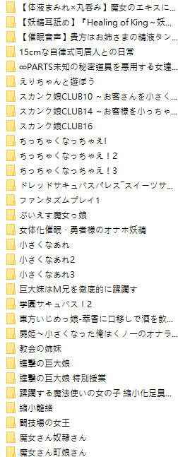

# 关于制作的中字视频被搬运到b站的事…

作者：jack369605

TID：31454

<title>1</title> <link href="../Styles/Style.css" type="text/css" rel="stylesheet">

# 1

偶然发现这个链接中的视频被发到了b站[https://giantessnight.com/gnforu ... hread&tid=26950](https://giantessnight.com/gnforum2012/forum.php?mod=viewthread&tid=26950) <ignore_js_op>

**IMG_20210811_104417.jpg** *(311.49 KB, 下載次數: 0)*

[下載附件](forum.php?mod=attachment&aid=OTAyNjd8NWViZTc3OGV8MTY3NDA2NTkyN3wxODIzMHwzMTQ1NA%3D%3D&nothumb=yes)

2021-8-11 10:46 上傳

此前也被人搬到艾彩盈利过(没错就是那个叫特殊的)，基本上那之后就没有在做过视频的字幕了。
个人是不太喜欢自己做的东西被搬到别的网站，而且这种视频发到b站这种公共平台不太好吧？好在没有投自制，还说来自gn。嘛，希望这位兄弟看到了自觉删除吧。另外个人做的所有中文字幕视频也已经取消分享，以后大概也不会做了。

<title>2</title> <link href="../Styles/Style.css" type="text/css" rel="stylesheet">

# 2

未被告知的情况下被转载不爽是肯定的，而且还是b站这种公共平台== <title>3</title> <link href="../Styles/Style.css" type="text/css" rel="stylesheet">

# 3

已经没了，这也有点快吧。这位和别的那些故意投错区糊弄审核的确实不太一样，搬得很认真 <title>4</title> <link href="../Styles/Style.css" type="text/css" rel="stylesheet">

# 4

这种估计很快就会被封的，这么敏感的内容 <title>5</title> <link href="../Styles/Style.css" type="text/css" rel="stylesheet">

# 5

> [湮雨平生 發表於 2021-8-11 12:17](https://giantessnight.cf/gnforum2012/forum.php?mod=redirect&goto=findpost&pid=476179&ptid=31454)
> 未被告知的情况下被转载不爽是肯定的，而且还是b站这种公共平台==

只能说已经被搬运的搞得没有动力了。。。
<title>6</title> <link href="../Styles/Style.css" type="text/css" rel="stylesheet">

# 6

B站相关内容审核蛮严的，基本就剩一些擦边球，这个估计··· <title>7</title> <link href="../Styles/Style.css" type="text/css" rel="stylesheet">

# 7

好惨一jk，摸摸不哭（摸到jk的缝了，好爽.jpg） <title>8</title> <link href="../Styles/Style.css" type="text/css" rel="stylesheet">

# 8

怎麼到處都在吵這個，不過轉載我翻譯的都沒標註來源，GL昨天又一個，還好只是初版而已www

這種事防不勝防，找些同好組個小圈子自娛自樂就好，找了不少人，而且漢化完全沒流出過
<ignore_js_op>

**811.png** *(28.28 KB, 下載次數: 0)*

[下載附件](forum.php?mod=attachment&aid=OTAyOTB8ZmI4MDFlZGZ8MTY3NDA2NTkyN3wxODIzMHwzMTQ1NA%3D%3D&nothumb=yes)

2021-8-11 23:54 上傳

<title>9</title> <link href="../Styles/Style.css" type="text/css" rel="stylesheet">

# 9

> [花丸一生推 發表於 2021-8-11 23:54](https://giantessnight.cf/gnforum2012/forum.php?mod=redirect&goto=findpost&pid=476257&ptid=31454)
> 怎麼到處都在吵這個，不過轉載我翻譯的都沒標註來源，GL昨天又一個，還好只是初版而已www
> 
> 這種事防不勝防 ...

卧槽……翻译这么多了吗……

可惜没什么加入小圈子的沟道，也没用qq什么的
<title>10</title> <link href="../Styles/Style.css" type="text/css" rel="stylesheet">

# 10

> 花丸一生推 發表於 2021-8-11 23:54
> 怎麼到處都在吵這個，不過轉載我翻譯的都沒標註來源，GL昨天又一個，還好只是初版而已www
> 
> 這種事防不勝防 ...

！請問怎麼可以混入大佬的圈子（ <title>11</title> <link href="../Styles/Style.css" type="text/css" rel="stylesheet">

# 11

> [花丸一生推 發表於 2021-8-11 23:54](https://giantessnight.cf/gnforum2012/forum.php?mod=redirect&goto=findpost&pid=476257&ptid=31454)
> 怎麼到處都在吵這個，不過轉載我翻譯的都沒標註來源，GL昨天又一個，還好只是初版而已www
> 
> 這種事防不勝防 ...

确实。防不胜防，这种东西要是在意流出就只能小圈分享了
<title>12</title> <link href="../Styles/Style.css" type="text/css" rel="stylesheet">

# 12

> [jack369605 發表於 2021-8-12 12:47](https://giantessnight.cf/gnforum2012/forum.php?mod=redirect&goto=findpost&pid=476298&ptid=31454)
> 确实。防不胜防，这种东西要是在意流出就只能小圈分享了

主要是流出后就很麻烦了，容易引来各种乱七八糟的人，还会把那群吃饱了撑的的举报党给引来</ignore_js_op></ignore_js_op>