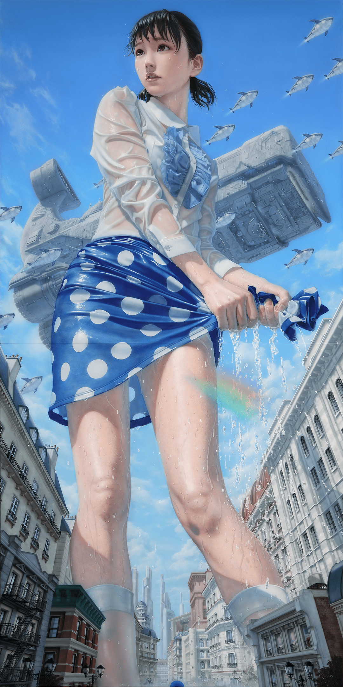

# 关于坂本友由的静香

作者：freepenguin2

TID：34700

<title>1</title> <link href="../Styles/Style.css" type="text/css" rel="stylesheet">

# 1

*本帖最後由 freepenguin2 於 2023-1-4 11:36 編輯*

换新手机已经很久了，各种原因吧，很多东西都没有在新的机子里保存下来。昨天翻到四年前的QQ相册，突然看到这张图，有种恍如隔世的感觉。就还记得，第一次见到这张图的惊艳感。真的是美的出水一般，画面也是细腻异常，还贯穿着一些童真的回忆。真的是，非同凡响的感觉。

其实gts作为一个小众圈子，基本95%以上的内容，在圈外人看来，要不是无感，要不就是抵触了。而圈内能看到的，真正普世意义的艺术品，圈内外共赏的，我想应该就是这张画了（不一定唯一）。如果真的有论坛藏品展，这张画也应该因为蕴涵的丰富特殊意义，成为首当其冲的展品了。

但是它已经被拍走了...还是被一个中国人，发小红书上了。
[https://km6pli.smartapps.cn/subp ... bFromHost=mibrowser](https://km6pli.smartapps.cn/subpackage/pages/webview/webview?link=https%3A%2F%2Fwww.xiaohongshu.com%2Fdiscovery%2Fitem%2F60f0134d000000000102c080%3Fgroupid%3D5f3a12b7bc197a0001a60cbf%26from%3Dbdshare&_swebfr=1&_swebFromHost=mibrowser)（我的电脑谷歌浏览器打不开，手机是可以的，不知道大家会不会遇到这个问题）

想起来那应该也不是一个特别大的画展，哆啦A梦主题，只在日本本土举行。17年画展的画了，在21年被一个并不算知名（应该吧，我不玩小红书，不清楚）的小红书up拍下。大概推测一下，应该也不会是特别高的价格。如果被我们论坛集资拍下来，当做镇馆之宝一类的东西，而不是被就这样挂在小红书上，甚至评论都没有几条，那该多好。

如果以后我们也能搞个线下博物馆，记录论坛和圈子（看实际情况在乡下搞个二十平小木屋也不错了...）。除了讲解论坛的起源，发展史，一些知名的人物，还有放置一些实体本子、手办之类以外，应该就是放一些像这样的，算是真正艺术品的画作了。
<title>2</title> <link href="../Styles/Style.css" type="text/css" rel="stylesheet">

# 2

 <ignore_js_op>[巨大静香.jpg](forum.php?mod=attachment&aid=MTAxMzYzfDEzZTJhOTIxfDE2NzQwNjUxMjB8MTgyMzB8MzQ3MDA%3D&nothumb=yes) *(1.54 MB, 下載次數: 5)*

[下載附件](forum.php?mod=attachment&aid=MTAxMzYzfDEzZTJhOTIxfDE2NzQwNjUxMjB8MTgyMzB8MzQ3MDA%3D&nothumb=yes)

2023-1-4 11:02 上傳  

巨大静香

</ignore_js_op> <title>3</title> <link href="../Styles/Style.css" type="text/css" rel="stylesheet">

# 3

为什么我感觉现在都年轻人（主要是男性）只要是美少女基本不会抵触，很多人根本不在意是不是巨大娘 <title>4</title> <link href="../Styles/Style.css" type="text/css" rel="stylesheet">

# 4

*本帖最後由 freepenguin2 於 2023-1-5 01:52 編輯*

> [s孙晓美 發表於 2023-1-4 13:05](https://giantessnight.cf/gnforum2012/forum.php?mod=redirect&goto=findpost&pid=523605&ptid=34700)
> 为什么我感觉现在都年轻人（主要是男性）只要是美少女基本不会抵触，很多人根本不在意是不是巨大娘 ...

不是，男性为什么会抵触美少女呢。除非是弯的或者性无能吧...这不是正常的天性吗lol。至于是不是巨大娘，我觉得温柔系也不要涉及过多敏感部位的play，我觉得普通人也不是不能接受的。真的就像，哆啦A梦里的一样了（好吧看漏几行字...前面的回复可能有点问题，看后半就好了）