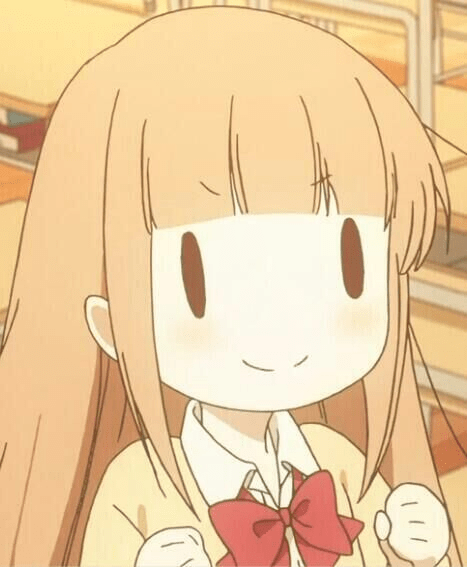
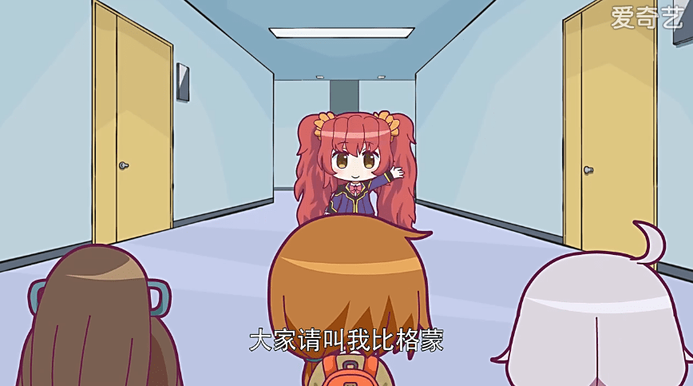
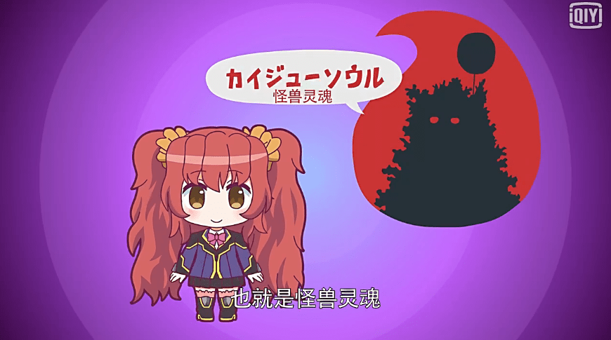
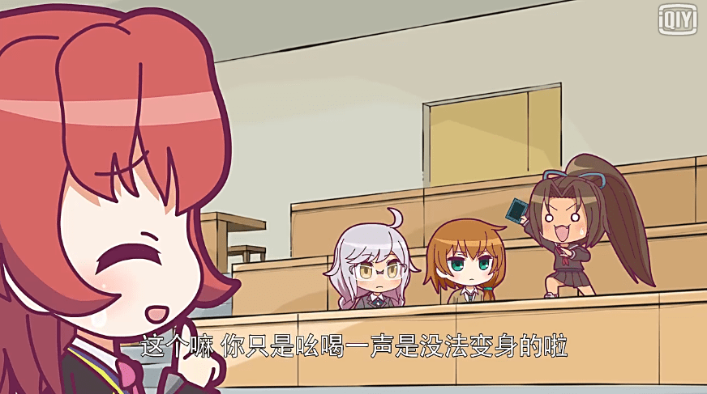

# 关于奥特怪兽娘化计划

作者：jack369605

TID：21912

<title>1</title> <link href="../Styles/Style.css" type="text/css" rel="stylesheet">

# 1

总的来说，可能会很残念，目前只出了第一集[http://m.iqiyi.com/v_19rr9ghja8.html#vfrm=2-3-0-1](http://m.iqiyi.com/v_19rr9ghja8.html#vfrm=2-3-0-1)
不过战斗方式可能就只是那样，巨大化的内容目前没有表现出来
<title>2</title> <link href="../Styles/Style.css" type="text/css" rel="stylesheet">

# 2

其实我也没多少期待，毕竟就那个样子 <title>3</title> <link href="../Styles/Style.css" type="text/css" rel="stylesheet">

# 3

就算巨大化了大概也是Q版的畫風...

看有沒有同人作了(茶 <title>4</title> <link href="../Styles/Style.css" type="text/css" rel="stylesheet">

# 4

画风不是很喜欢，太卡通了 <title>5</title> <link href="../Styles/Style.css" type="text/css" rel="stylesheet">

# 5

一点都不觉得残念！
反而开心透了
<ignore_js_op>

**呼哈哈哈.jpg** *(29.4 KB, 下載次數: 0)*

[下載附件](forum.php?mod=attachment&aid=NjQ2Njh8NWQ4MzIyYWR8MTY3NDA2Nzg4MHwxODIzMHwyMTkxMg%3D%3D&nothumb=yes)

2016-10-2 16:59 上傳

显然这个动画根本不可能出现GTS，只是专供给特摄宅玩梗用的。从头到尾看的超开心，主角竟然是胶囊废柴三人（兽？）组，屁股萌的气球迷之刷存在感，最后的杰顿妹纸真是萌爆了
<ignore_js_op>

**QQ截图20161002165428.png** *(215.26 KB, 下載次數: 0)*

[下載附件](forum.php?mod=attachment&aid=NjQ2Njl8ODE5M2Y3Yjd8MTY3NDA2Nzg4MHwxODIzMHwyMTkxMg%3D%3D&nothumb=yes)

2016-10-2 16:59 上傳

<ignore_js_op>

**QQ截图20161002165542.png** *(267.4 KB, 下載次數: 0)*

[下載附件](forum.php?mod=attachment&aid=NjQ2NzF8NzA5NDQ3YTN8MTY3NDA2Nzg4MHwxODIzMHwyMTkxMg%3D%3D&nothumb=yes)

2016-10-2 17:00 上傳

↓这是在吐槽东映特摄吗2333333333
<ignore_js_op>

**QQ截图20161002165525.png** *(319.76 KB, 下載次數: 0)*

[下載附件](forum.php?mod=attachment&aid=NjQ2NzB8NTE3M2U4NTV8MTY3NDA2Nzg4MHwxODIzMHwyMTkxMg%3D%3D&nothumb=yes)

2016-10-2 17:00 上傳

<title>6</title> <link href="../Styles/Style.css" type="text/css" rel="stylesheet">

# 6

一直在追人设，怪物娘化的人设还是很不错的，也有不少小说 <title>7</title> <link href="../Styles/Style.css" type="text/css" rel="stylesheet">

# 7

Q版+搞笑劇情就跟GTS沒啥關聯了吧(苦笑
不過動畫不是這部真的有點可惜啊
奥特怪兽拟人化计划
[http://www.dm5.com/manhua-aoteguaishounirenhuajihua/](http://www.dm5.com/manhua-aoteguaishounirenhuajihua/)

老實說我比較喜歡這部的人設.然後傑頓的無口屬性是公認的嗎? <title>8</title> <link href="../Styles/Style.css" type="text/css" rel="stylesheet">

# 8

追这个漫画的表示,GTS因素=0,不要想太多 <title>9</title> <link href="../Styles/Style.css" type="text/css" rel="stylesheet">

# 9

> [葬儀社 發表於 2016-10-2 20:06](https://giantessnight.cf/gnforum2012/forum.php?mod=redirect&goto=findpost&pid=310245&ptid=21912)
> Q版+搞笑劇情就跟GTS沒啥關聯了吧(苦笑
> 不過動畫不是這部真的有點可惜啊
> 奥特怪兽拟人化计划

我也喜欢风上旬&POP老师的版本 <title>10</title> <link href="../Styles/Style.css" type="text/css" rel="stylesheet">

# 10

應該是不會巨大化，感覺更像假面騎士的變身</ignore_js_op></ignore_js_op></ignore_js_op></ignore_js_op>