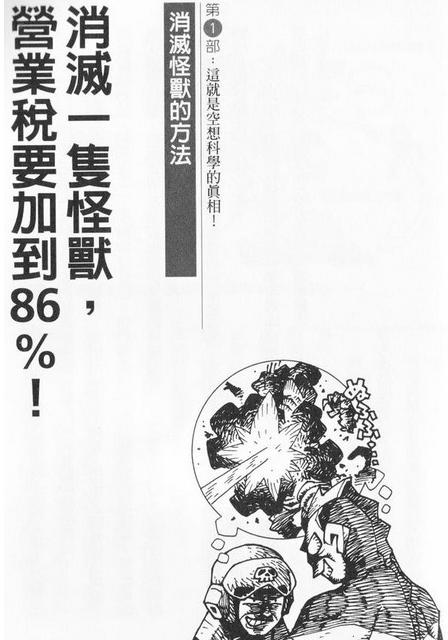
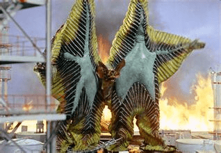
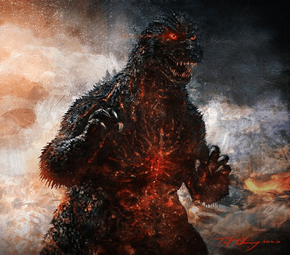
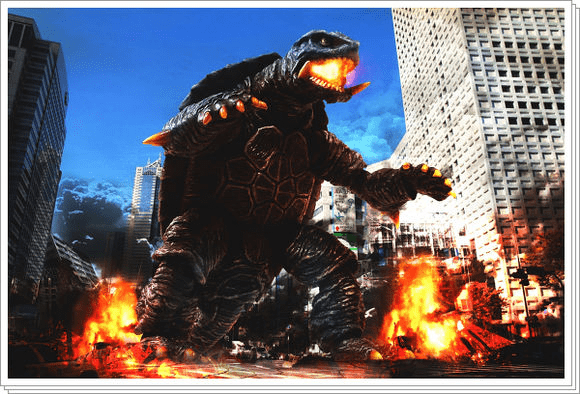
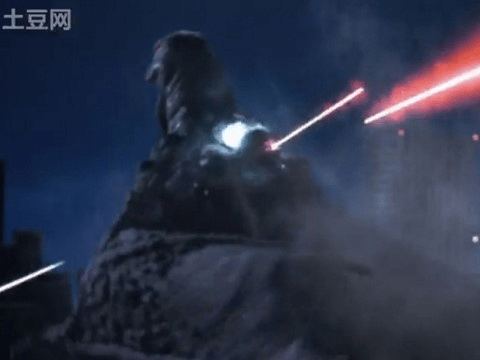
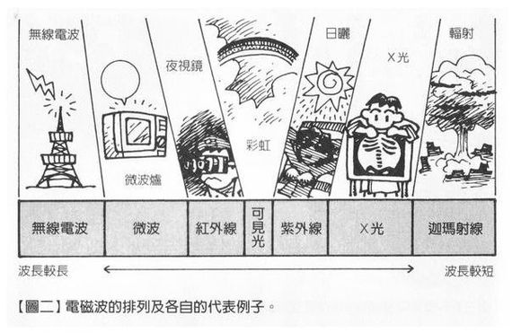

# 关于女巨人吐火及口吐其他能量

作者：445566

TID：19839

<title>1</title> <link href="../Styles/Style.css" type="text/css" rel="stylesheet">

# 1

   gts一定是巨大充满能量的 最初对gts吐火来自于女超人系列里女超人狂吹呼吸的
镜头 觉得有力量有性感 一些gts影片有吐火的镜头 一些文章有相关描写 非常彰显女巨人的能量
想调查一下大家对女巨人口吐火焰及其他能量的看法
<title>2</title> <link href="../Styles/Style.css" type="text/css" rel="stylesheet">

# 2

個人觀點：**不喜歡**
你看女巨人又不是火龍
更不是火蜥蜴
也不是超人力霸王對手一樣的怪獸

是巨人不是巨怪也不是巨獸
只需要符合人一樣的動作就好了
破壞建築要是去噴火
而不是用身體去破壞
——還有意思嗎？

特別是有性慾
生殖器和女性一樣
有陰蒂——而且很敏感~~~多美好啊
<title>3</title> <link href="../Styles/Style.css" type="text/css" rel="stylesheet">

# 3

噴火巨龍 基本上女巨人就超出現實了 現在還要噴火........太不可思議了 <title>4</title> <link href="../Styles/Style.css" type="text/css" rel="stylesheet">

# 4

不喜歡
女巨人这种东西当然是单纯地用身体比较好啦 <title>5</title> <link href="../Styles/Style.css" type="text/css" rel="stylesheet">

# 5

*本帖最後由 餃子 於 2015-9-23 13:57 編輯*

感觉这和女巨人拿着枪械清扫城市没什么区别。。。
太不带感了，请务必还是使用肉体破坏技吧

<title>6</title> <link href="../Styles/Style.css" type="text/css" rel="stylesheet">

# 6

我觉得人应该是不会吐火的... <title>7</title> <link href="../Styles/Style.css" type="text/css" rel="stylesheet">

# 7

不太喜歡從嘴巴吐火
感覺很怪
<title>8</title> <link href="../Styles/Style.css" type="text/css" rel="stylesheet">

# 8

连一秒钟都不用考虑，我想正常一般向还是最好的 <title>9</title> <link href="../Styles/Style.css" type="text/css" rel="stylesheet">

# 9

有这些乱七八糟的能力的话，变大就没有意义了。 <title>10</title> <link href="../Styles/Style.css" type="text/css" rel="stylesheet">

# 10

我最初对女巨人吐火有感是因为女超人电影和系列短片里的super breath镜头 然后一些女j巨人mtv里也有  其实这是力量的体现 <title>11</title> <link href="../Styles/Style.css" type="text/css" rel="stylesheet">

# 11

个人感觉不太喜欢吐火。 <title>12</title> <link href="../Styles/Style.css" type="text/css" rel="stylesheet">

# 12

这种事情当然要看设定啦，如果女主是龙族或是火元素，不会吐火才奇怪吧。而其他的能量也要看人物设定来决定啦。 <title>13</title> <link href="../Styles/Style.css" type="text/css" rel="stylesheet">

# 13

女巨人能吐槽能量吗 <title>14</title> <link href="../Styles/Style.css" type="text/css" rel="stylesheet">

# 14

是女巨人不是歌吉拉啊
噴火會使形象崩壞的 <title>15</title> <link href="../Styles/Style.css" type="text/css" rel="stylesheet">

# 15

像我这种选3的居然是非主流么…… <title>16</title> <link href="../Styles/Style.css" type="text/css" rel="stylesheet">

# 16

我觉得如果女巨人能用一些微小的动作放出一些强大的能量的话会比喷火会更有能量感 <title>17</title> <link href="../Styles/Style.css" type="text/css" rel="stylesheet">

# 17

这种能力还是不要的好，没感觉啊 <title>18</title> <link href="../Styles/Style.css" type="text/css" rel="stylesheet">

# 18

那种能力我个人感觉能用一些特殊器官或腺体把人吸进去，比如说菊花啦，鼻孔啦，rutou啦，私处啦
【啊呀~~比较重口啦】
但是这种压迫感，绝望感我觉得要比杀戮感，要令人愉悦很多\(°∀°)\(°∀°)/(°∀°)/ <title>19</title> <link href="../Styles/Style.css" type="text/css" rel="stylesheet">

# 19

吐火就算了，下面可以吐水(ಡωಡ) <title>20</title> <link href="../Styles/Style.css" type="text/css" rel="stylesheet">

# 20

*本帖最後由 zsd 於 2016-8-26 21:00 編輯*

【以下转自《空想科学读本》台译本】

<ignore_js_op>

**98114b166d224f4a36b3b48309f790529922d166.jpg** *(44.25 KB, 下載次數: 0)*

[下載附件](forum.php?mod=attachment&aid=NjMzNzR8NWQ0ODdmZmJ8MTY3NDA2NzkyN3wxODIzMHwxOTgzOQ%3D%3D&nothumb=yes)

2016-8-26 20:12 上傳

**●第六章 喷火吧～～大怪兽！！！**
想当初在Ultra Q 剧集中，怪兽并不会喷火的……但是到了超人力霸王登场后，因为力霸王有宇宙元素光线这种卑劣的飞行道具，所以怪兽们自然不能落后，也要会射出一点什么来对抗才行。否则每回力霸王出场就只要躲得远远的，然后一发光线技解决，这种剧情谁要看……因此为了配合编剧方便，怪兽们开始喷火了……如果是机械兽，要喷什么都简单。嘴里装火炎放射器就能喷火，装雷射炮就能喷光线，装抽水马达就能喷水，装飞弹就能喷飞弹……可是怪兽是一种生物呀！作者柳田理科雄指出，要喷火，至少要有两样东西：一是要有燃料、二是要有点火装置！！
首先来看燃料：根据圆谷、东宝的怪兽图鉴，会喷火的怪兽多半是以石油、铀矿为食，例如卡波拉（初代超人中出现）、恐龙王三世（新超人之敌）等等……都是以铀为食。但是吃下铀矿是吐不出火的！只会全身布满放射能而死……吃下铀矿后还必需在身体中引发核分裂反应才行！
<ignore_js_op>

**f565d01349540923cb7ca5699458d109b2de49e0.jpg** *(17.93 KB, 下載次數: 0)*

[下載附件](forum.php?mod=attachment&aid=NjMzNzZ8ZGI5YzJhYmN8MTY3NDA2NzkyN3wxODIzMHwxOTgzOQ%3D%3D&nothumb=yes)

2016-8-26 20:52 上傳

【↑卡波拉，登场于初代超人力霸王13话的石油怪兽】
当然，聚集一定量的铀到达临界量发生核分裂后，强烈的中子线引发连锁反应，这样是会放出热能没错。但……怎么控制反应呢？如果控制的不好，就像车诺比、三哩岛、或者JA 那样……95年底最后一部大恐龙哥吉拉电影恐龙帝国中，哥吉拉就是无法控制好体内的核反应，发生了炉心熔融状况……一直到95年，才有人注意到这些怪兽的体内调节的问题吗？生物体内的反应都是酵素、激素在控制的。然而这些东西对控制核分裂反应可帮不上忙！理由很简单：怕热！能耐100度的酵素已经不多见了，何况是那种温度的反应……以铀为食，利用体内核反应来喷火的怪兽，最重大的不合理就在控制问题上……其次，像达孔格（新超人的敌人）、贝斯达（初代超人之敌）等怪兽是以石油为食的，所以它们是把胃中的石油反刍出来当燃料来喷火……
<ignore_js_op>

**红莲哥斯拉.jpg** *(69.83 KB, 下載次數: 0)*

[下載附件](forum.php?mod=attachment&aid=NjMzNzd8ZTNkYTUwMWN8MTY3NDA2NzkyN3wxODIzMHwxOTgzOQ%3D%3D&nothumb=yes)

2016-8-26 20:52 上傳

【↑红莲哥吉拉，登场于平成哥吉拉最终作《哥吉拉VS帝斯托龙尼亚》】
嗯，以石油为食还算可理解，因为确实有微生物能分解消化石油为养分的。不过石油在自然状态下含有大量土砂，那就是分馏时会留下的沥青，用来铺柏油路的。这些土砂想必怪兽们也不能消化。因此，应该请这些怪兽要解放的时候来一下咱们的北二高 这一来只要用压路机把它们留下的米田共压一压，就不用花钱买沥青铺柏油路了……：)用胃里的石油当燃料还算有点道理，因为要停止喷火时只要嘴一闭，隔绝氧气，油就会停止燃烧。不过这里有个超不合理的，就是飞天大乌龟嘎美拉（这里指的是旧版的嘎美拉的设定）嘎美拉是以煤炭为食而喷火的！煤炭可不像石油，因为是固态，里面混有许多空气。即使闭上嘴，胃里的煤炭仍然会继续燃烧！所以嘎美拉只要喷一次火就再也停不下来了……
<ignore_js_op>

**加美拉.jpg** *(79.38 KB, 下載次數: 0)*

[下載附件](forum.php?mod=attachment&aid=NjMzNzh8MjM5ODQ1ZTF8MTY3NDA2NzkyN3wxODIzMHwxOTgzOQ%3D%3D&nothumb=yes)

2016-8-26 20:53 上傳

【↑日本三大怪兽之一，大映招牌怪兽卡美拉（必杀技为口吐火焰）】
第二个问题是：如何点火？第一个构想是：怪兽的牙齿有打火石功能，只要磨牙发出火花就能点火！话虽如此，打火石是成份类似水晶的矿物，生物体中并无此物质，就算有些鸟类会摄食一些小石头，那也是放在砂囊中帮助消化。放在嘴里当打火石？有点奇怪……而且在嘴里会被唾液弄湿，这一来打火石就点不着火了……图标：怪兽为了喷火，努力的拼命磨牙……（超人力霸王是等的太累回家睡觉了吗？）要到达燃点的温度，生物体内的化学反应是做不来的（理由同前）。另一个方法就是磨擦生热怪兽不停的磨擦上下颚以达燃点……算了，我们改来看看发射光线的可能性……先不管有什么破坏光线、杀人光线、岩浆光线还是发条光线、或者什么冷冻光线、重力遮断光线……
<ignore_js_op>

**63300608201110100139042741118952181_008.jpg** *(20.3 KB, 下載次數: 0)*

[下載附件](forum.php?mod=attachment&aid=NjMzNzl8NWYyZWI0ZGJ8MTY3NDA2NzkyN3wxODIzMHwxOTgzOQ%3D%3D&nothumb=yes)

2016-8-26 20:55 上傳

总之我们先从最基本的来想，怪兽能不能发出Laser（激光）？雷射的原理大家都知道了，要发出雷射，要有红宝石、碳酸或半导体等发振体。再来是能源：生物的能源是碳水化合物等等，要像电影中一样发出一秒钟内能溶化一辆战车的雷射光大约要770万kcal。大约要用3．1吨的碳水化合物来进行呼吸作用……不过这一点还好，这些怪兽体重多达数万吨，消耗3．1吨的碳水化合物还算小意思……发振体也不是不可能，因为我们眼睛的水晶体之类就是由角质蛋白构成的透镜。但困难的是，红宝石之类能做发振体的物质，主要是靠氧化铝中混杂着铬，雷射发振主要是靠这些铬，但是铬这种重金属对生物而言是毒！而且发振体的两面要有反射镜，镜子就是要在透明的物体的一面涂上水银，但是水银对生物体也是剧毒！
<ignore_js_op>

**d6e99a45d688d43f2bde56627d1ed21b0ff43b11.jpg** *(47.15 KB, 下載次數: 0)*

[下載附件](forum.php?mod=attachment&aid=NjMzNzV8MDI3MGRhZTF8MTY3NDA2NzkyN3wxODIzMHwxOTgzOQ%3D%3D&nothumb=yes)

2016-8-26 20:12 上傳

<title>21</title> <link href="../Styles/Style.css" type="text/css" rel="stylesheet">

# 21

偶尔用来加餐就可以了( ˘•ω•˘ ) <title>22</title> <link href="../Styles/Style.css" type="text/css" rel="stylesheet">

# 22

感觉火这种形态的攻击太过于……凡人化了。
而且用嘴喷一点也不优雅。
<title>23</title> <link href="../Styles/Style.css" type="text/css" rel="stylesheet">

# 23

喷火就算了，喷喷口水会不会很有意思？ <title>24</title> <link href="../Styles/Style.css" type="text/css" rel="stylesheet">

# 24

吐火女巨人不仅优雅 而且高贵 <title>25</title> <link href="../Styles/Style.css" type="text/css" rel="stylesheet">

# 25

其实我更喜欢女巨人能够吸收某种白色来液体获取能量，我觉得我已经病入膏肓，无药可医， <title>26</title> <link href="../Styles/Style.css" type="text/css" rel="stylesheet">

# 26

> wuliaojianke 發表於 2016-8-29 23:47
> 吐火女巨人不仅优雅 而且高贵

只有你这么觉得……(￣□￣；) <title>27</title> <link href="../Styles/Style.css" type="text/css" rel="stylesheet">

# 27

楼上 其实有人这么认为拉 <title>28</title> <link href="../Styles/Style.css" type="text/css" rel="stylesheet">

# 28

*本帖最後由 ckw 於 2016-9-3 13:54 編輯*

的確是個人感觀問題
基本上我不反對，但也不表示愛好吐火。之於高貴優雅……
在我眼中女巨人概然是指定女性的巨人，很自然關注點便是女性生理特徵以及巨體（應該還有肉體壓迫感但我不肯定），用巨大身體做出幹甚麼甚麼事幾乎是必然。在GTS中身體已經是最好的力量。
有作者覺得光有物理上力量不夠，那就要用非物理手段，統稱叫超能力好了。
有些人反對有超能力，身體變大是沒意思，光用超能力就好了。
二次元找真實感是對，在二次元找真實感必定是有問題也是正確。但太極端的找真實，極端反真實是絕對錯誤的。
在GTS前提下，超能力僅是一種次要或附加設定，而在作品裡超能力很多時是在表現上更抽象化一些，並非很必然。如果對劇情沒有作用是浪費的。好比某個太空詩人作品內經常提及的母海，律譜（也是很抽象但非常萬用），在形式上也算是超能大卻在作內起非常關鍵作用。力霸王／超人／奧特曼和死光是一體，死光是力霸王大招，因為它起了關鍵作用，每每一擊把敵獸打倒。
為了更合理化，複雜化故事，有些人會加上條件或副作用。光用超能力就好？那加個只能在巨大化後方能使用就好合理了。
只是噴火，有人提出了女巨人又不是火龍、Ｏ吉拉已經很明了原因。噴火脫離了人型所應有感覺（真實感作怪），可是反過來不是噴而是變出火好像沒甚麼違和（因為用「口」太違和？）。
超能力抽象化，如沒甚麼原因就飛天，沒甚麼原因就能瞬移，也許是避重就輕。

Q.你的字好多，請用30字總結你的感想
A.我的感想：GTS首要賣點就是巨大女性的肉體</ignore_js_op></ignore_js_op></ignore_js_op></ignore_js_op></ignore_js_op></ignore_js_op>