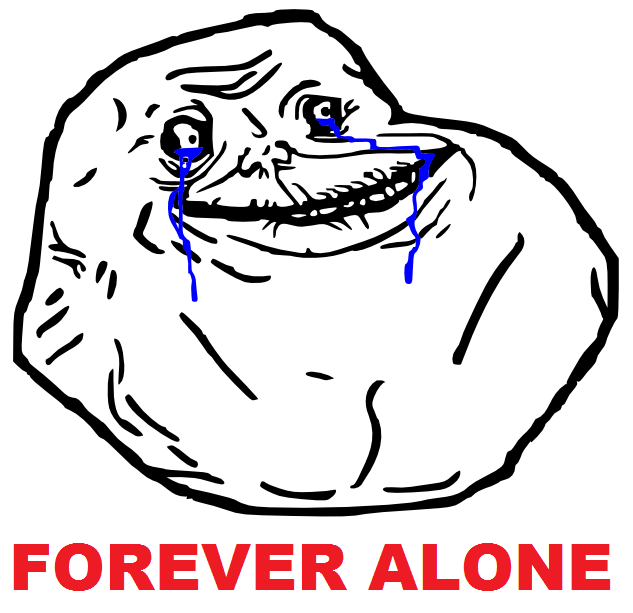

# 关于对GTS爱好看法的投票

作者：xnr

TID：14446

<title>1</title> <link href="../Styles/Style.css" type="text/css" rel="stylesheet">

# 1

*本文章最後由 xnr 於 2013-5-22 21:37 編輯*

这个问题很早就想过了，我相信很多同好会跟我有一样的想法。
曾经在QQ群里问过几个人，但是很遗憾没有得到理想的效果，所以想在GN发起这个投票。

引子：
如果给你一个药丸，吃下去就会变得更爱学习更爱读书，但是你会对游戏动漫（或其他娱乐爱好）失去兴趣，你会去吃吗？
从理性的角度讲，吃药似乎是更好的选择，但是你在做选择之前真的能割舍下这份爱吗？
（吃药丸后就完全忘记这份兴趣爱好，不会有记忆残留，也不会再次苏醒）

同理，如果给你一个药丸，吃下去就会忘记“GTS属性的爱好”，变成“正常向”的男人：
体验正常的性生活，像普通男人一样看A片H漫；
交往正常向的女朋友，结婚生子过日子；
不再沉迷网络，不再沉迷二次元，不再意淫和幻想，不再对足部踩踏之类的感兴趣；
不再费尽心思搜集GTS资源，感受正常男人一样的性快感，你愿意吗？

相关投票：《GTS同好对普通A片H漫的看法调查》
[http://giantessnight.com/gnforum2012/forum.php?mod=viewthread&tid=8126&extra=page%3D2](http://giantessnight.com/gnforum2012/forum.php?mod=viewthread&tid=8126&extra=page%3D2)

欢迎大家投票之后，留下理性和善意的评论，谢谢。

每个人只投一票哦！

<title>2</title> <link href="../Styles/Style.css" type="text/css" rel="stylesheet">

# 2

遊戲動漫學習讀書GTS愛好三樣全精通的人參淫家表示毫無壓力蛤蛤蛤蛤蛤 <title>3</title> <link href="../Styles/Style.css" type="text/css" rel="stylesheet">

# 3

碰到這個問題後讓我想了很多，也放下手中的報告與忙事來回文

我已經觸碰sw這個愛好算有點時日了，雖然比起論壇某些也有接觸這方面愛好的元老來說，我算是小輩了

在剛碰到這個愛好的成熟期，也就是有固定的圖畫可以看、有固定的故事可以閱讀，我也只是單純每天撸完管，洗洗睡，對於縮小女界怎麼樣，根本就與我無關，只要每天有可以讓我撸管的東西，我就滿足了

這段時期，只要是能讓我撸管的東西，不管是巨大娘或是縮小女，有萌有感覺就好，相對的，要是不對我胃口的縮小女，我也可以完全不看

直到我遇到了這個愛好的重大傷害，才迫使我重新思考我的愛好

我覺得世界上的每個人都會與其他人有相異之處，縮小女就是我與他人的相異之處，要是我不重視這個愛好，那我的一生大概也沒什麼可以誇口的了

從縮小女這個東西上我真的得到了很多，要是沒有縮小女我大概就不會去碰觸英文日文、要是沒有縮小女我大概也不會學到一些事情、要是沒有縮小女我大概也不會學到許多交人處事的深層方面

相對的，我也可以把重心放在遊戲上面，每天打打遊戲，過關，寫寫心得，然後刪遊戲，就這樣過完一生，但是我選擇把重心放在我真正喜歡的愛好上，到現在也不反悔

很多人不重視自己的這個愛好，也將它視為殘疾，但是我並沒有這樣認為，一個愛好能夠利用的方面太廣泛了，能夠練習文筆與語文能力、能夠沉思一些平常不會去思考的事、能夠與國外人交流、能夠接觸商業方面的事情、能夠學會待人處事，這對即將要踏入社會的我來說，都是很寶貴的學習經驗

剛決定要興起這個圈子的時候，縮小女這一塊已經被摧殘的體無亡膚了，當時上任的qq版主也是以低姿態保持著只要giantess nights還有縮小女版塊就好，光是要如何起步就非常困擾了

不過也因為這個想要復興縮小女的想法，我得到了很多平常不可能得到的東西，像是作者們的檯面下的"想法"、元老們私底下的"評論"、被臭名的人們想對這個論壇的反抗"聲音"、無法容忍其他愛好的"團體"、就算努力也無法得到的"成果"，太多太多是我無法沒有這個愛好得到的東西了

我很高興我有這個愛好，要是普通人的性交愛好，那我大概只會每天下載A片，撸完後就洗洗睡了，但是有這個愛好，以及它的對立面，讓我得到了很多東西

<title>4</title> <link href="../Styles/Style.css" type="text/css" rel="stylesheet">

# 4

無緣無故的我幹嘛要捨棄我的GTS愛好啊？

當然啦，如果GTS愛好會嚴重影響到我日常生活，那麼能**完全割捨**也是一種值得考慮的選擇

但是，無緣無故的我幹嘛要捨棄我的GTS愛好啊？因為很重要所以(RY
<title>5</title> <link href="../Styles/Style.css" type="text/css" rel="stylesheet">

# 5

> 小虎 發表於 2013-5-23 02:04 
> 無緣無故的我幹嘛要捨棄我的GTS愛好啊？

对很多人来讲，这不能完全说“无缘无故”。

比如当你最爱的女人因为你的特殊爱好而不能跟你在一起，你就不会这么想了。
<title>6</title> <link href="../Styles/Style.css" type="text/css" rel="stylesheet">

# 6

*本文章最後由 小虎 於 2013-5-24 00:59 編輯*

> xnr 發表於 2013-5-23 17:58 
> 对很多人来讲，这不能完全说“无缘无故”。
> 
> 比如当你最爱的女人因为你的特殊爱好而不能跟你在一起，你 ...

<title>7</title> <link href="../Styles/Style.css" type="text/css" rel="stylesheet">

# 7

 <ignore_js_op>[ForeverAlone.png](forum.php?mod=attachment&aid=MzQ1MDF8YjI0ZDhmNGR8MTY3NDA2ODM5MXwxODIzMHwxNDQ0Ng%3D%3D&nothumb=yes) *(72.03 KB, 下載次數: 0)*

[下載附件](forum.php?mod=attachment&aid=MzQ1MDF8YjI0ZDhmNGR8MTY3NDA2ODM5MXwxODIzMHwxNDQ0Ng%3D%3D&nothumb=yes)

2013-5-24 00:59 上傳  

</ignore_js_op> <title>8</title> <link href="../Styles/Style.css" type="text/css" rel="stylesheet">

# 8

> 小虎 發表於 2013-5-23 18:27 

嗯，幸好这事没发生在我身上，所以我选第二项。
<title>9</title> <link href="../Styles/Style.css" type="text/css" rel="stylesheet">

# 9

*本文章最後由 克里亞 於 2013-6-1 01:14 編輯*

> xnr 發表於 2013-5-23 17:58 
> 对很多人来讲，这不能完全说“无缘无故”。
> 
> 比如当你最爱的女人因为你的特殊爱好而不能跟你在一起，你 ...

首先...有些羨慕2樓的人參淫家..
因為長期的潛水.到現在我還是不太習慣上岸.實際在這領域的體驗就沒辦法像許兄那麼深刻...
雖然的要比的話我還是純動漫的經驗比較多.因為從小到大幾乎人生體悟都是那來的.現實讓我體驗失意的占大多數
回想起來國高中好像就是努力學習跟空閒玩遊戲放鬆心情的循環而已..想得到的好像都是考試相關 = =...

GTS跟動漫在我心中的地位都很重要.其中蠻多動漫也是根據GTS的同人創作才去跟的
現在仔細想想...GTS我會喜歡溫柔系可能也是由於現實的需求才會偏那方向妄想..
從小印象中母親患病.病痊癒後從事保險業務.幾乎很少在家中互動的行為(雖然也可能是從小愛往外跑的緣故= =)
雖然在上有兩位姐姐.但小時不外乎就是會搶一些玩物.搞得我一直都不太想和女生互動.現在長大後覺得挺慚愧的..   
可能多少有影響偏好溫柔系的原因..而後幻想百合.GTS.可愛偽娘等等相關素材也都是溫柔系為出發點

雖然沒有交到女友的自信.但如果真的有的話,也是希望對方能接受GTS的愛好.如何開口.怎樣表達都是很難完整詮釋的清楚@@
現在還是會有跟姐姐同睡的情況;可能是因為我習慣熬夜.睡眠不足.作息不正常,說夢話的經驗不少.也有類似夢遊的事發生
曾經有一.兩次...我姊問過我做了甚麼噩夢..聽她描述我說的夢話.馬上聯想到是被GTS吞食的情況0.0(因為有關鍵詞...)
當下只能說是被怪物吃之類的..偶爾還是怕說相關情況太多.所以入睡前都盡量避免讀&想GTS的事
雖然很想夢到...但偏偏我是一睡就完全入眠的..夢中遇過GTS的次數很少.印象深刻的反倒是驚悚電影情節

曾經幾次想向最親的二姐解釋GTS的文化.印象中有看過她看"小南的戀人"這部,原本想從那點出發.但還是接不太下去
其實我之前在和但大面交拿火山的Fate足本時.我二姐有在場.只是我繞了一下.刻意1對1交易
連最熟的家人都很難細說...xnr姊的舉例的確是一大難題啊....
還是只能希望對方能接受.當然前提是要有對象..

...題外話(不知道為甚麼還是想說...)
."撸管"這詞我實在是有點用不下去..大概是寺田本跟V姊本看多了..我在自行發洩情緒時.大多是從女性角度妄想...
因為我...敏感部位其實蠻多的.實際上整體都玩到,其實可以耗到一小時多..但這樣一來做為男性的角度就有點亂掉的感覺....
...我居然花了一個多小時在打這篇回復文..

<title>10</title> <link href="../Styles/Style.css" type="text/css" rel="stylesheet">

# 10

這個問題每個人的想法不一樣吧...
我會喜歡GTS就純粹只是喜歡
我從很小時就發現了
自己的愛好 沒有分好與壞 就是要讓自己開心而已
我不會放棄我從小以來的愛好
人活著不是為了單純的工作吃喝拉撒睡
能找到自己真正的愛好才不會活得跟死人一樣 <title>11</title> <link href="../Styles/Style.css" type="text/css" rel="stylesheet">

# 11

……其实我想断除我的一切肉欲…… <title>12</title> <link href="../Styles/Style.css" type="text/css" rel="stylesheet">

# 12

> hentai 發表於 2013-7-31 19:36 
> ……其实我想断除我的一切肉欲……

欲练神功必先自宫
<title>13</title> <link href="../Styles/Style.css" type="text/css" rel="stylesheet">

# 13

大爱gts，希望娶个好老婆～ <title>14</title> <link href="../Styles/Style.css" type="text/css" rel="stylesheet">

# 14

> [xnr 發表於 2013-5-23 17:58](https://giantessnight.cf/gnforum2012/forum.php?mod=redirect&goto=findpost&pid=189683&ptid=14446)
> 对很多人来讲，这不能完全说“无缘无故”。
> 
> 比如当你最爱的女人因为你的特殊爱好而不能跟你在一起，你 ...

我也会让我对象爱上gts的
<title>15</title> <link href="../Styles/Style.css" type="text/css" rel="stylesheet">

# 15

其实，理性往往会败给一时的性欲，不过长久来说，理性才是人类的标志 <title>16</title> <link href="../Styles/Style.css" type="text/css" rel="stylesheet">

# 16

只要知道自己以后不会记得就好吧。人往往不会想到不存在/自己不知道的东西。 <title>17</title> <link href="../Styles/Style.css" type="text/css" rel="stylesheet">

# 17

吃药之后就不感兴趣了，也就不会后悔吧 <title>18</title> <link href="../Styles/Style.css" type="text/css" rel="stylesheet">

# 18

> [zzzqw1 發表於 2014-6-29 09:03](https://giantessnight.cf/gnforum2012/forum.php?mod=redirect&goto=findpost&pid=225713&ptid=14446)
> 吃药之后就不感兴趣了，也就不会后悔吧

问题是你会不会去吃？吃了之后就再也不会有GTS带给你的快乐了。
<title>19</title> <link href="../Styles/Style.css" type="text/css" rel="stylesheet">

# 19

看完这个投票很我高兴自己没有几乎做这个选择，特殊爱好，很有可能让我在正常的方面失去兴趣，也可能导致恋人的离开，不过GTS真的带给我很多快感，尤其是加入论坛后，我想还是中庸一些，在保持爱好的前提下克制自己