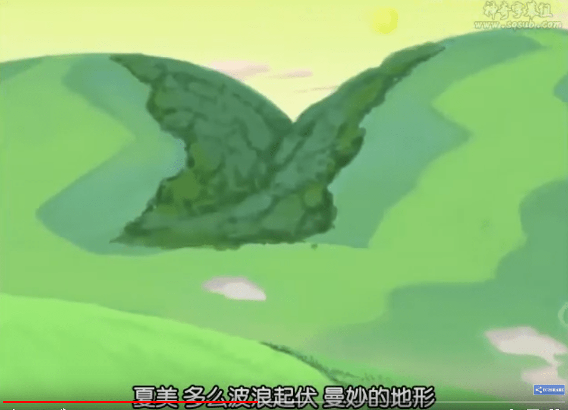
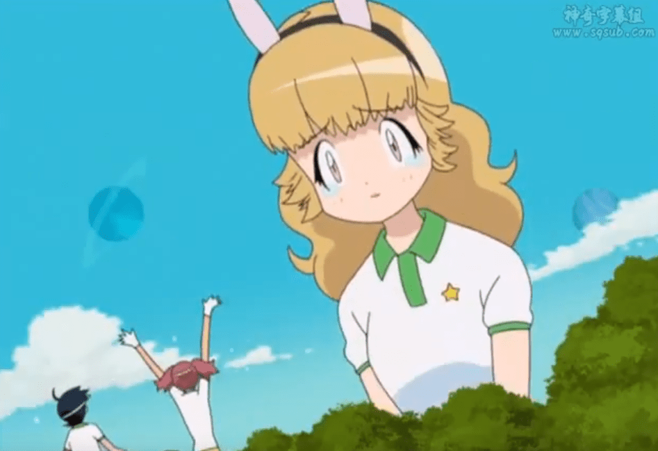

# 关于山峰拟人化（突发的脑洞）

作者：904904cx

TID：25786

<title>1</title> <link href="../Styles/Style.css" type="text/css" rel="stylesheet">

# 1

最近看了许多XX拟人（娘）化的同人文，突然脑洞大开，要是想要巨大娘的话，将山峰拟人化不是更好吗，不同的山峰的高度可以变为多重大小，不同的山的分类则可以表述成不同的性格，比如活火山可以是性格开放，充满活力的；休眠火山则是外表沉稳，但内心却是十分火热的；褶皱山是底蕴深厚而温柔的……
脑洞的珠峰的人设：
身高：8848公尺
体重：80亿吨
外貌：高挑的黄种人，面容清秀，常身着白底红边的旗袍，上面有一些波浪状的纹饰，在手腕、脚腕、脖子上有佩戴一些远古时期的化石饰物，穿赭色的布鞋，头上有纯白晶莹的头饰
性格：大抵是个理性而稳重的人，但内心也有作为世界最高者的骄傲，知道自己尚在成长期，有时会为此冒出苦恼的表情
对人类的立场：混沌·中立
地位：“天空之女神”（来自尼泊尔语名Sagarmatha），是喜马拉雅姐妹中的三妹

<title>2</title> <link href="../Styles/Style.css" type="text/css" rel="stylesheet">

# 2

大家有没有什么其他想拟人化的山峰呢？
不过我也不知道这些脑洞出来的人设究竟有什么用 <title>3</title> <link href="../Styles/Style.css" type="text/css" rel="stylesheet">

# 3

我還以為是某種體型差很多的蜜蜂

你只是有身高差很多的人設是要怎麼寫故事 <title>4</title> <link href="../Styles/Style.css" type="text/css" rel="stylesheet">

# 4

主要是喜欢山的人估计都不混ACG。。。 <title>5</title> <link href="../Styles/Style.css" type="text/css" rel="stylesheet">

# 5

這個畫面應該能稍微滿足你的想像：
關鍵字：keroro 275話
注意：有GT
[https://www.youtube.com/watch?v=qbOZeEtNUjY](https://www.youtube.com/watch?v=qbOZeEtNUjY)
<ignore_js_op>

**Keroro275-2.PNG** *(634.94 KB, 下載次數: 0)*

[下載附件](forum.php?mod=attachment&aid=NzQwNTJ8NmQ4OTVkOTd8MTY3NDA2NzAxM3wxODIzMHwyNTc4Ng%3D%3D&nothumb=yes)

2018-9-7 22:37 上傳

<ignore_js_op>

**Keroro275-1.PNG** *(701.2 KB, 下載次數: 0)*

[下載附件](forum.php?mod=attachment&aid=NzQwNTN8YjA2MGU2NTd8MTY3NDA2NzAxM3wxODIzMHwyNTc4Ng%3D%3D&nothumb=yes)

2018-9-7 22:39 上傳

<title>6</title> <link href="../Styles/Style.css" type="text/css" rel="stylesheet">

# 6

很想来一波，不过奈何地理学知识不够……其实这个设定挺带感啊</ignore_js_op></ignore_js_op>