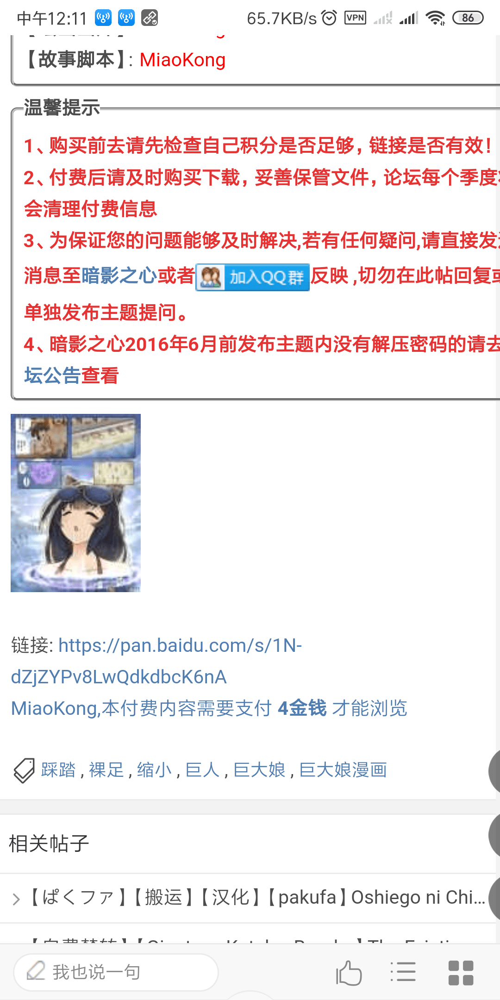
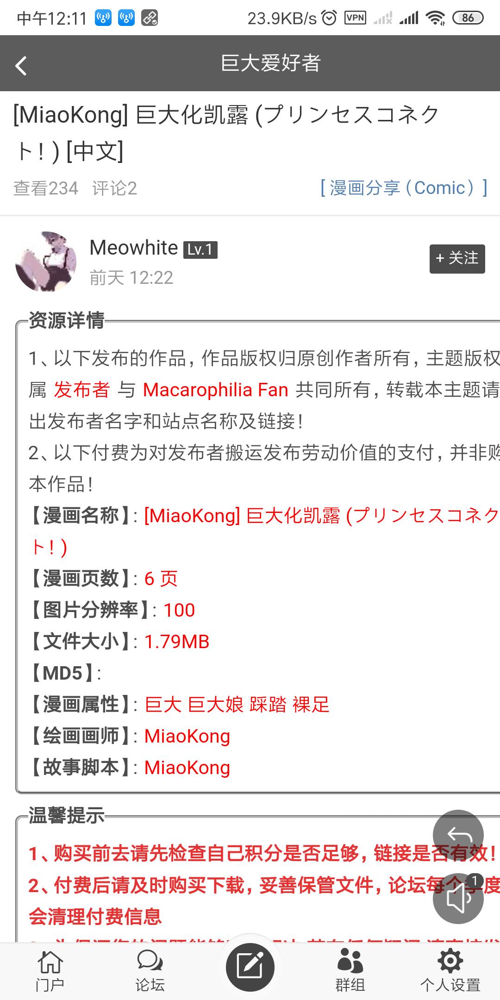
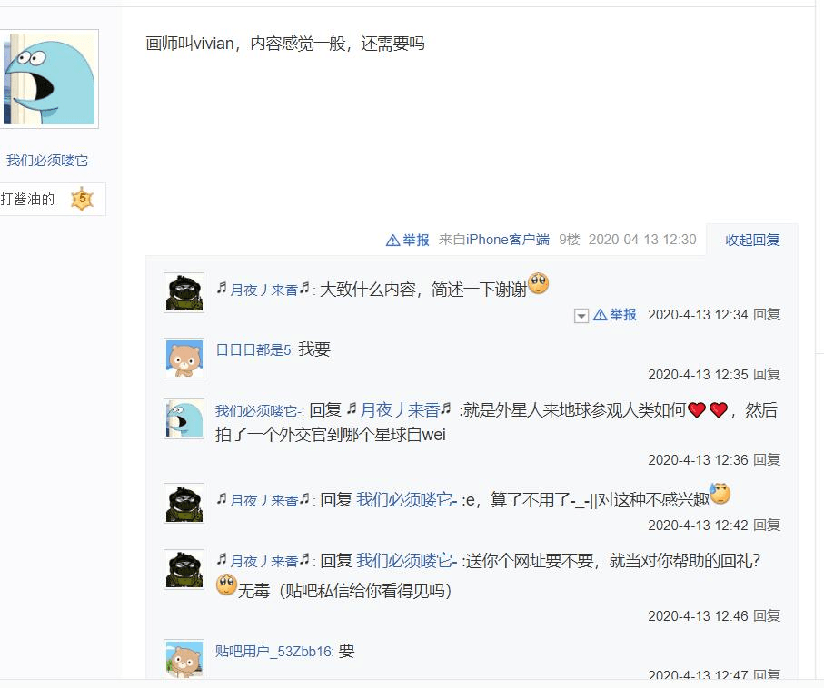
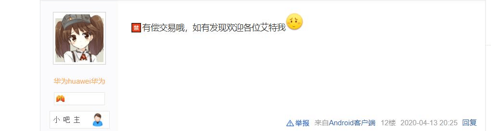

# 关于我的作品被人擅自转载贩卖

作者：(别）看我的

TID：28778

<title>1</title> <link href="../Styles/Style.css" type="text/css" rel="stylesheet">

# 1

我发现我在pixiv，deviantart，gn免费发布的短篇漫画，被人未经同意就转载到gl上进行不合理贩卖。为此我来挂他一波并强烈谴责，也提醒还没看过但想看我的作品的大家不要被他坑了。拒绝二道贩子嗷 <title>2</title> <link href="../Styles/Style.css" type="text/css" rel="stylesheet">

# 2

 <ignore_js_op>[Screenshot_2020-05-27-12-11-10-375_com.android.chrome.png](forum.php?mod=attachment&aid=ODMxNTd8MzI5YmQ1NTN8MTY3NDA2NjM4MnwxODIzMHwyODc3OA%3D%3D&nothumb=yes) *(435.95 KB, 下載次數: 5)*

[下載附件](forum.php?mod=attachment&aid=ODMxNTd8MzI5YmQ1NTN8MTY3NDA2NjM4MnwxODIzMHwyODc3OA%3D%3D&nothumb=yes)

2020-5-27 12:30 上傳  

</ignore_js_op> <ignore_js_op>[Screenshot_2020-05-27-12-11-01-688_com.android.chrome.png](forum.php?mod=attachment&aid=ODMxNTZ8YWU4YjZlN2R8MTY3NDA2NjM4MnwxODIzMHwyODc3OA%3D%3D&nothumb=yes) *(345.08 KB, 下載次數: 0)*

[下載附件](forum.php?mod=attachment&aid=ODMxNTZ8YWU4YjZlN2R8MTY3NDA2NjM4MnwxODIzMHwyODc3OA%3D%3D&nothumb=yes)

2020-5-27 12:30 上傳  

</ignore_js_op> <title>3</title> <link href="../Styles/Style.css" type="text/css" rel="stylesheet">

# 3

只能说gl这种行为也不是一次两次了。在未经过原作者同意的前提下，转载他人的作品，甚至将免费的作品收费。这种风气也会让原创作者深恶痛疾吧 <title>4</title> <link href="../Styles/Style.css" type="text/css" rel="stylesheet">

# 4

隔壁的一贯性操作了
举报也没用，反正那边是为了真金白银的 <title>5</title> <link href="../Styles/Style.css" type="text/css" rel="stylesheet">

# 5

我记得有个论坛是倒卖图文的，是这个了吧，还有个叫ma什么什么的也是。 <title>6</title> <link href="../Styles/Style.css" type="text/css" rel="stylesheet">

# 6

*本帖最後由 Kiosk 於 2020-5-27 22:18 編輯*

(由于言论过激，已整改)

建议在所有发布来源声明禁止GL转载，虽然不见得有效，至少是对自身权益的明确宣告，也能以此对GL抗议。

<title>7</title> <link href="../Styles/Style.css" type="text/css" rel="stylesheet">

# 7

*本帖最後由 充气的妹妹 於 2020-5-27 14:19 編輯*

GL的确恶心，绝大部分（非原创）内容都需要付费，甚至付费还不算还要充会员。随着贴吧、女神、前线等网站一年年的消失，这个圈子不知道还能全存在世间多久，利用这个赚钱（当然原创收费我表示赞同），真替这个文化圈子感到可悲。 <title>8</title> <link href="../Styles/Style.css" type="text/css" rel="stylesheet">

# 8

GL 是指？giantess lover? 我只聽過但沒進過去 <title>9</title> <link href="../Styles/Style.css" type="text/css" rel="stylesheet">

# 9

我简单说一下
转不转载的什么都不重要了，毕竟这么多年了，尿性大家都知道。
我最不能容忍的是管理员发布的所有资源全部打上了他们论坛的水印，我曾经在d站一位作者下方评论过:你的作品被其他人打上了自己的水印转载并带有一定的商业用途，请问你这边允许么?
作者没在评论区回复我但是私信了我。
他让我告诉网址，并且询问我是什么人做的。
我回复了句开玩笑。
现在gl就像一个中转站，碍于防火墙以及国内某部分年轻同好认知偏低，只要有人能从国外搬运作品过去，那么就肯定会有人买账。
管理员自己这种尿性就是一种诱导，各种qq群铺天盖地的卖资源，开各种几十人的黑车现在已经屡见不鲜。。。
我想，这种情况会持续很久很久，很久很久!
作者的创作收益真的非常的不可观，非常，非常。。。
希望会有好的一天，会吗?

<title>10</title> <link href="../Styles/Style.css" type="text/css" rel="stylesheet">

# 10

gtslover这一点是最恶心的，明明很多资源，创作者本身都不收费，免费分享，但这些人居然好意思用这来收费，还要点脸么 <title>11</title> <link href="../Styles/Style.css" type="text/css" rel="stylesheet">

# 11

某樓這樣講 那世上就沒有所謂盜圖文這種事情了 著作權也都沒用
因為全部都只是”搬運“
盜賣就盜賣 哪來那麼多文字遊戲 <title>12</title> <link href="../Styles/Style.css" type="text/css" rel="stylesheet">

# 12

在原创都没有收到费用来支付劳动价值的时候，搬运者却有资格获得劳动价值吗？ <title>13</title> <link href="../Styles/Style.css" type="text/css" rel="stylesheet">

# 13

*本帖最後由 白色胡椒℃ 於 2020-5-27 17:16 編輯*

<ignore_js_op>

**64665a26a99a8638.jpg** *(57.69 KB, 下載次數: 0)*

[下載附件](forum.php?mod=attachment&aid=ODMxNTh8N2JjYzE1MjB8MTY3NDA2NjQwMXwxODIzMHwyODc3OA%3D%3D&nothumb=yes)

2020-5-27 16:43 上傳

<ignore_js_op>

**-e05788cee8e99a6.jpg** *(15.92 KB, 下載次數: 0)*

[下載附件](forum.php?mod=attachment&aid=ODMxNTl8YTQ4M2ZiYTd8MTY3NDA2NjQwMXwxODIzMHwyODc3OA%3D%3D&nothumb=yes)

2020-5-27 16:44 上傳

<title>14</title> <link href="../Styles/Style.css" type="text/css" rel="stylesheet">

# 14

> [白色胡椒℃ 發表於 2020-5-27 16:46](https://giantessnight.cf/gnforum2012/forum.php?mod=redirect&goto=findpost&pid=437648&ptid=28778)
> 前一阵贴吧里还有人有偿交易vivian的作品，日期是4.13，这人还是大超萌小吧主
> ...

你看错了吧，这个小吧写的是禁止有偿交易，发现了@ 一下告诉他
<title>15</title> <link href="../Styles/Style.css" type="text/css" rel="stylesheet">

# 15

> [Kiosk 發表於 2020-5-27 13:40](https://giantessnight.cf/gnforum2012/forum.php?mod=redirect&goto=findpost&pid=437631&ptid=28778)
> GL贩售的页面已经说明的很清楚，费用是支付发布者搬运发布劳动价值，并非购买本作品，同时也强调作品版权归 ...

还搁这给他们洗呐？他搬运得有多辛苦要收钱呀？这样说全世界盗图的只要说句版权属于原作者就可以擅自盗图去贩卖了？我也没说禁止转载，但转载前告诉我一声，只要不是用于不合理的事上我都会乐意被转载的，也没有针对哪个网站了。甚至再退一步，就算不告诉我，转载后表明原作者和地址，我都不会很介意的。但如果在我不知情的情况下被人拿去贩卖，这怎么可以容忍？
<title>16</title> <link href="../Styles/Style.css" type="text/css" rel="stylesheet">

# 16

GL他妈的恶心的不行 钱钱钱 整个网站都是铜臭味

最可笑的是这种搬运还好意思要钱 说的想自己翻译的一样
GN没梯子其实也挺麻烦的 之前那几个整天捣乱的也很烦人 <title>17</title> <link href="../Styles/Style.css" type="text/css" rel="stylesheet">

# 17

> [茶道赛高 發表於 2020-5-27 17:06](https://giantessnight.cf/gnforum2012/forum.php?mod=redirect&goto=findpost&pid=437652&ptid=28778)
> 你看错了吧，这个小吧写的是禁止有偿交易，发现了@ 一下告诉他

是眼花，看错了（捂脸）
<title>18</title> <link href="../Styles/Style.css" type="text/css" rel="stylesheet">

# 18

我是觉得有了金币还要冲VIP，一个VIP已经可以够支援一个作者了 <title>19</title> <link href="../Styles/Style.css" type="text/css" rel="stylesheet">

# 19

> [18号 發表於 2020-5-27 14:40](https://giantessnight.cf/gnforum2012/forum.php?mod=redirect&goto=findpost&pid=437638&ptid=28778)
> 我简单说一下
> 转不转载的什么都不重要了，毕竟这么多年了，尿性大家都知道。
> 我最不能容忍的是管理员发布的 ...

不是很希望gn开放，真的，这样挺好。
因为真的不清楚会来几个安若雨，几个gt老哥，几个奇葩。。。到时候又污眼一片。。。
<title>20</title> <link href="../Styles/Style.css" type="text/css" rel="stylesheet">

# 20

    虽然之前暗大帮过些忙，但完全洗不动隔壁的某些毒瘤用户，之前搬了大量的GN文章，跑去语气平和的问是否得到过GN作者的许可，要么当没看见，要么就装傻说不知道GN，是在别的网站找的，问他别的网站是哪就不说话了。后来看到没作品搬了，被举报的多了，马上创个小号去爱卡复制粘贴英文作品，看不懂？没事儿，机翻伺候上，一天发个十几篇，介绍也懒得写，重复了也不管，金币够了就买资源，被封了就再注册新号。反正为了金币是无所不用其极。那边也有类似起点的文库，然后你会发现把几个作者的作品总字数加在一起能破十万，然而他们的积分加在一起还没搬运工的零头多。
    合购我就不评价了，如果不是真的想要却又没境外支付手段，谁TM会腆着脸去那边找合购。自己出的钱，还拿不到原作，非要每一页都打上水印才肯发，说是防止有人二次贩卖（打了水印生怕别人不知道你二次贩卖？），实际目的这里就不用多说了吧。
<title>21</title> <link href="../Styles/Style.css" type="text/css" rel="stylesheet">

# 21

隔壁不一直都这德行么，白嫖完再拿去卖钱 美滋滋 <title>22</title> <link href="../Styles/Style.css" type="text/css" rel="stylesheet">

# 22

沒事，直接舉報網站，直接讓他們関了就好，一來杜絕這種垃圾，二來他們都已經是慣犯了，也不是第一次，如果免費分享都還算合理，但是還要收費那實在是説不過去，不過那邊這都已經是慣用手段了，其實不過是我們這圈子是比較小的群衆，所以才會有這樣的問題

其實現在在版權方面已經比以前好一點了，以前隨便下載隨便分享好像就覺得是應該就是這樣，還有一些人覺得你憑什麽收錢，我自己下載的爲什麽要付錢的道理

所以我建議都去直接檢舉他們網站簡單得多，而且上次V大的圖也被放到某網站去收費了，只能說已經不知道誰是第一個，只希望都是最後一個，不過這顯然這是幻想，所以還是有必要作出回應才是好事 <title>23</title> <link href="../Styles/Style.css" type="text/css" rel="stylesheet">

# 23

没办法，我以前翻译过的文章、漫画也被卖了 <title>24</title> <link href="../Styles/Style.css" type="text/css" rel="stylesheet">

# 24

太过分了，强烈谴责！真的为好多未经授权，作品就被搬运到那边的作者感到心疼，希望这些对原创作者的侵权行为早日结束！真的非常打击创作者的热情！ <title>25</title> <link href="../Styles/Style.css" type="text/css" rel="stylesheet">

# 25

害，我发在gl的自购还被那边的人举报了，那边的人素质也没有好到哪儿去，低定价自己不买还举报真的恶心，而且那边乱搬运的情况太普遍了，我现在绝对不在那边发资源，只在gn上发发就算了 <title>26</title> <link href="../Styles/Style.css" type="text/css" rel="stylesheet">

# 26

教堂壁画上面也没写禁止转载，我是不是应该扣一块儿？ <title>27</title> <link href="../Styles/Style.css" type="text/css" rel="stylesheet">

# 27

上面那个给gl洗地的，简直笑死，言论各种可笑 <title>28</title> <link href="../Styles/Style.css" type="text/css" rel="stylesheet">

# 28

我寻思着暗影之心这个老狗不就靠这个赚钱吗？真的恶心，从别人的免费劳动成果中压榨不属于自己的价值，欺负不会翻墙的同好，真的是个人渣 <title>29</title> <link href="../Styles/Style.css" type="text/css" rel="stylesheet">

# 29

还有个办法就是哪里盗作品去哪里建号 然后自己发布作品 就算讨厌那个网站也没办法因为自己不发就会有人发。。永远抓不玩 碰到好的站主给他删掉封号 碰到不好的直接理都不理你 而且这种本子类的还不能通过正当途径解决。。漫画小说侵权还能告呢本子告的的话估计自己也没了 水印其实也没啥用很多人知道是盗版也一样会去看。。最后要么打击作者热情以后再也不做 要么就只能眼不见为净。。 <title>30</title> <link href="../Styles/Style.css" type="text/css" rel="stylesheet">

# 30

你这个去找那边管理员应该可以给他删掉 当时那个巨大领域萌游戏也被卖来着 然后也是作者去找管理员给他改成免费的了 <title>31</title> <link href="../Styles/Style.css" type="text/css" rel="stylesheet">

# 31

*本帖最後由 hubert 於 2020-6-3 21:49 編輯*

我觉得我还是啥都不好比较好呢。 <title>32</title> <link href="../Styles/Style.css" type="text/css" rel="stylesheet">

# 32

人家的理念和这里就不一样。。。所以基本说了也不会听的 <title>33</title> <link href="../Styles/Style.css" type="text/css" rel="stylesheet">

# 33

盈利论坛就是这样，说管吧还真不好管，毕竟大家都是小众圈子 <title>34</title> <link href="../Styles/Style.css" type="text/css" rel="stylesheet">

# 34

> [hubert 發表於 2020-5-27 23:48](https://giantessnight.cf/gnforum2012/forum.php?mod=redirect&goto=findpost&pid=437696&ptid=28778)
> 直接把那个站的站长的支付宝@给网路坚管单位，说他散布情色消息。有违善良风俗。估计他就出事了。 ...

微信支付就炸过了，支付宝和QQ为主要的
<title>35</title> <link href="../Styles/Style.css" type="text/css" rel="stylesheet">

# 35

它这个论坛主要是因为咱这个论坛的漫画要积分相对累积困难，而且巨男巨兽区的文和漫等重口味也有和分类，氪金即积分相对好整，以及理念是不一样，没法弄 <title>36</title> <link href="../Styles/Style.css" type="text/css" rel="stylesheet">

# 36

目前来讲只能先想办法让新人别去GL这种垃圾桶……
当初懵懂无知在哪注册了个号，没两天就弃置掉了。
只希望这种垃圾玩意早点消失掉，别再换个名字祸害圈子了
<title>37</title> <link href="../Styles/Style.css" type="text/css" rel="stylesheet">

# 37

*本帖最後由 spacewolves 於 2020-5-28 13:36 編輯*

[http://m.dmzj.com/info/54555.html](http://m.dmzj.com/info/54555.html)

现在还被人上传去了大妈之家

还有楼里某人我见你好几次了，我个人觉得你应该也不真的是那种判断力差的人，所以我劝你收手吧，有的钱是拿不得的，拿钱办事替人消灾可不适用于这件事。
<title>38</title> <link href="../Styles/Style.css" type="text/css" rel="stylesheet">

# 38

你给翻译翻译什么叫搬运？
不用翻译人家是汉语。
我就想让你翻译翻译什么叫■■的搬运？
什么■■叫搬运啊。
搬运就是我把你免费的画放到我网站上卖，赚我的钱，这就叫搬运！
哦，原来这■■就叫搬运啊。 <title>39</title> <link href="../Styles/Style.css" type="text/css" rel="stylesheet">

# 39

来个暴躁老哥打一发赵弹就能让那个破站上天真要整治也不难 <title>40</title> <link href="../Styles/Style.css" type="text/css" rel="stylesheet">

# 40

是的，原创作者本身是免费，他们却收个搬运费，挺恶心人的 <title>41</title> <link href="../Styles/Style.css" type="text/css" rel="stylesheet">

# 41

我沒進過GL,也不清楚怎麽回事,不過到GL那邊說這邊是免費的估計那邊也就賣不出了吧 <title>42</title> <link href="../Styles/Style.css" type="text/css" rel="stylesheet">

# 42

这个网站里有些人真的恶心明明都是些免费的资源，他们就拿来做倒卖
真就从很多人兜里抢钱</ignore_js_op></ignore_js_op>