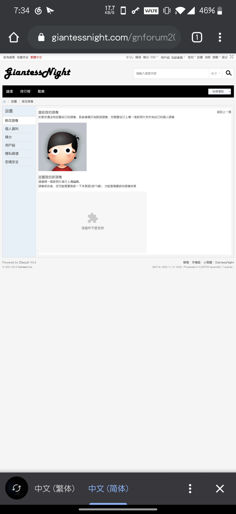

# 关于手机版修改资料的问题

作者：B1Zu

TID：29801

<title>1</title> <link href="../Styles/Style.css" type="text/css" rel="stylesheet">

# 1

要flash播放器插件吗 还是换个浏览器
<title>2</title> <link href="../Styles/Style.css" type="text/css" rel="stylesheet">

# 2

 <ignore_js_op>[Screenshot_20201114-193436.jpg](forum.php?mod=attachment&aid=ODYwMTB8MWJmZmJhNmN8MTY3NDA2NjI0M3wxODIzMHwyOTgwMQ%3D%3D&nothumb=yes) *(374.27 KB, 下載次數: 0)*

[下載附件](forum.php?mod=attachment&aid=ODYwMTB8MWJmZmJhNmN8MTY3NDA2NjI0M3wxODIzMHwyOTgwMQ%3D%3D&nothumb=yes)

2020-11-14 19:41 上傳  

</ignore_js_op> <title>3</title> <link href="../Styles/Style.css" type="text/css" rel="stylesheet">

# 3

+1，同疑惑这个问题，切成电脑版后头像改不了 <title>4</title> <link href="../Styles/Style.css" type="text/css" rel="stylesheet">

# 4

嘛，是这样子吧，只用电脑改ip地址的方式上gn改过头像