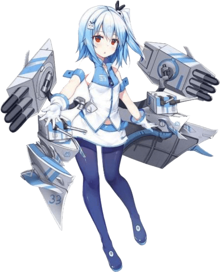
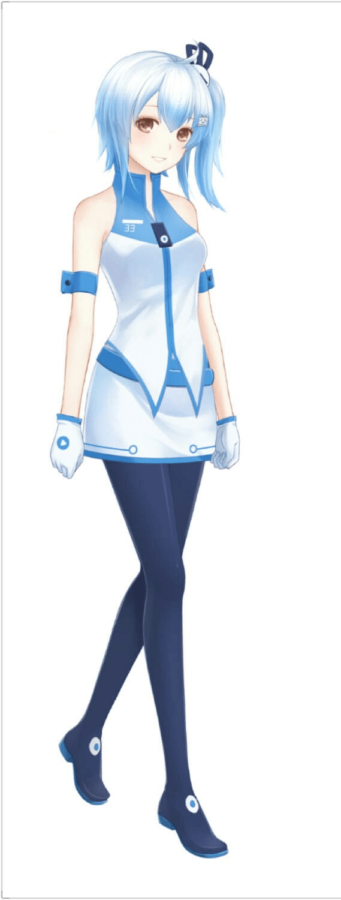

# 关于抖m，大家是喜欢主动m还是被动m？以及巨大女生的态度

作者：酱鱼233

TID：30622

<title>1</title> <link href="../Styles/Style.css" type="text/css" rel="stylesheet">

# 1

在gts故事里，屈辱是很重要的内容，大家更倾向的视角是哪种呢？
主动型m：主角是抖m，会直接跪拜舔脚，或者大多数小人都是被驯化的，见到女神就会跪拜。这体现了读者的真实感官
被动型m：主角或民众都是尊严众，被强大力量胁迫，被迫跪舔臣服，这种被现实所迫被迫违背内型想法的屈辱，其实更为常见
中性m：不存在跪拜，只是无意中体现出的力量差距，让人自卑。
（三选一）

另外，关于巨大女性对小人的态度(相当于s)，大家喜欢那种呢。(下面按友善程度排序）
杀戮取乐：顾名思义
欺凌取乐：顾名思义
生活用品：顾名思义
打发时间：比方说等待时(身上没有手机)踢地上的小石子或用脚拂弄尘土，这种打发时间
捉弄取笑：这算是友善了，几乎没有伤害
本性善良但是无意识破坏：
主动爱护但是不小心破坏：

（七选二）
<title>2</title> <link href="../Styles/Style.css" type="text/css" rel="stylesheet">

# 2

我倒是喜欢主动控制巨大娘对自己S这算啥 <title>3</title> <link href="../Styles/Style.css" type="text/css" rel="stylesheet">

# 3

完蛋了除了善良的我全都要

我已经抖m得没救了

<title>4</title> <link href="../Styles/Style.css" type="text/css" rel="stylesheet">

# 4

被动M想被捉弄算口嫌体正直吗 <title>5</title> <link href="../Styles/Style.css" type="text/css" rel="stylesheet">

# 5

个人还是比较喜欢被动M，女S不仅身体巨大，而且在玩法上也占主导地位 <title>6</title> <link href="../Styles/Style.css" type="text/css" rel="stylesheet">

# 6

个人对M属性自己都不是很明白，但感觉温柔系什么的最棒了~ <title>7</title> <link href="../Styles/Style.css" type="text/css" rel="stylesheet">

# 7

我是lsp，这里面无论哪一种描述都能让我硬起来。但是具体一点聊的话我是属于中性M。
关于女s
本意善良但是由于巨大的体型差距不小心造成破坏，然后哭鼻子的巨大娘，实在是太戳我了。 <title>8</title> <link href="../Styles/Style.css" type="text/css" rel="stylesheet">

# 8

在gts故事里我更喜欢被动型m <title>9</title> <link href="../Styles/Style.css" type="text/css" rel="stylesheet">

# 9

与巨大娘博弈那种，喜欢征服s的巨大娘 <title>10</title> <link href="../Styles/Style.css" type="text/css" rel="stylesheet">

# 10

喜欢打发时间的，而且对巨人来说很普通的举动对小人们来说是致命的那种0.0 <title>11</title> <link href="../Styles/Style.css" type="text/css" rel="stylesheet">

# 11

哈哈 看来大家都喜欢温柔系呢 被可爱巨大的女孩温柔爱护才是最棒哒！ <title>12</title> <link href="../Styles/Style.css" type="text/css" rel="stylesheet">

# 12

破案了，我不是m
女孩子打打杀杀的戾气那么重可不好 <title>13</title> <link href="../Styles/Style.css" type="text/css" rel="stylesheet">

# 13

hhh咱也是偏向于温柔系多一点呢，可能是巨人而温柔的女孩子所散发出的母性实在是太吸引人了吧（趴） <title>14</title> <link href="../Styles/Style.css" type="text/css" rel="stylesheet">

# 14

喜欢温柔系的，但是最喜欢那种外冷内热的，就是那种表面上看上去冷若冰山甚至有点残忍的冰山美人，但是实际上很关心身边的人的这种性格 <title>15</title> <link href="../Styles/Style.css" type="text/css" rel="stylesheet">

# 15

本能上會排斥虐待他人為樂的類型，但看久了也會跟著樂在其中，意識到這點時總覺得自己的癖好是不是增加了（？ <title>16</title> <link href="../Styles/Style.css" type="text/css" rel="stylesheet">

# 16

> [德玛西亚皇子 發表於 2021-3-29 21:35](https://giantessnight.cf/gnforum2012/forum.php?mod=redirect&goto=findpost&pid=464026&ptid=30622)
> 喜欢温柔系的，但是最喜欢那种外冷内热的，就是那种表面上看上去冷若冰山甚至有点残忍的冰山美人，但是实际 ...

你让我想起了B站的站娘33，无口无心无表情但是偶尔腹黑

<title>17</title> <link href="../Styles/Style.css" type="text/css" rel="stylesheet">

# 17

就没有无意识的选项吗，巨大娘甚至都没有意识到对小人的凌虐行为，m感爆表 <title>18</title> <link href="../Styles/Style.css" type="text/css" rel="stylesheet">

# 18

都喜欢的该怎么办，可惜我只能选三个 <title>19</title> <link href="../Styles/Style.css" type="text/css" rel="stylesheet">

# 19

> [asdfqwer1234 發表於 2021-3-30 01:30](https://giantessnight.cf/gnforum2012/forum.php?mod=redirect&goto=findpost&pid=464054&ptid=30622)
> 你让我想起了B站的站娘33，无口无心无表情但是偶尔腹黑

这是谁呀，是这种性格的吗？不过怎么没有听过呀 <title>20</title> <link href="../Styles/Style.css" type="text/css" rel="stylesheet">

# 20

> [159623abc 發表於 2021-3-30 08:22](https://giantessnight.cf/gnforum2012/forum.php?mod=redirect&goto=findpost&pid=464063&ptid=30622)
> 就没有无意识的选项吗，巨大娘甚至都没有意识到对小人的凌虐行为，m感爆表 ...

写了“本性善良但是无意识破坏”这个属于发现了就不会破坏的，如果发现了还是破坏，就和故意破坏没区别了，这里讨论的是妹子自身的态度，不是说喜欢什么文 <title>21</title> <link href="../Styles/Style.css" type="text/css" rel="stylesheet">

# 21

*本帖最後由 asdfqwer1234 於 2021-3-30 22:39 編輯*

> [德玛西亚皇子 發表於 2021-3-30 15:34](https://giantessnight.cf/gnforum2012/forum.php?mod=redirect&goto=findpost&pid=464082&ptid=30622)
> 这是谁呀，是这种性格的吗？不过怎么没有听过呀

33你都不知道呀，看来你很少逛哔哩哔哩吧。
是哔哩哔哩的站娘之一，给你看俩33娘的图片。
外冷内热，喜怒不形于色（因为是机娘），但是一点也不残忍，很萌，偶尔腹黑。 
<ignore_js_op></ignore_js_op> **33.jpg** *(163.96 KB, 下載次數: 0)*

[下載附件](forum.php?mod=attachment&aid=ODgxMzN8OWVjY2YyNTJ8MTY3NDA2NTUwNHwxODIzMHwzMDYyMg%3D%3D&nothumb=yes)

2021-3-30 22:35 上傳

            <ignore_js_op></ignore_js_op> **33娘.jpeg** *(59.68 KB, 下載次數: 0)*

[下載附件](forum.php?mod=attachment&aid=ODgxMzJ8OTg4ODc0Njd8MTY3NDA2NTUwNHwxODIzMHwzMDYyMg%3D%3D&nothumb=yes)

2021-3-30 22:35 上傳 

<title>22</title> <link href="../Styles/Style.css" type="text/css" rel="stylesheet">

# 22

> [asdfqwer1234 發表於 2021-3-30 22:37](https://giantessnight.cf/gnforum2012/forum.php?mod=redirect&goto=findpost&pid=464126&ptid=30622)
> 33你都不知道呀，看来你很少逛哔哩哔哩吧。
> 是哔哩哔哩的站娘之一，给你看俩33娘的图片。
> 外冷内热，喜怒 ...

也经常逛b站的啦，只不过这个角色，确实没见过
<title>23</title> <link href="../Styles/Style.css" type="text/css" rel="stylesheet">

# 23

> [asdfqwer1234 發表於 2021-3-30 22:37](https://giantessnight.cf/gnforum2012/forum.php?mod=redirect&goto=findpost&pid=464126&ptid=30622)
> 33你都不知道呀，看来你很少逛哔哩哔哩吧。
> 是哔哩哔哩的站娘之一，给你看俩33娘的图片。
> 外冷内热，喜怒 ...

很常在bilibili的登入頁面看到，但現在才知道是誰~ <title>24</title> <link href="../Styles/Style.css" type="text/css" rel="stylesheet">

# 24

主动征服失败后被征服被S算什么类型的？
<title>25</title> <link href="../Styles/Style.css" type="text/css" rel="stylesheet">

# 25

真的很喜欢那种被动型的，一般我都是自主性比较强但是心里希望有人来指挥自己 <title>26</title> <link href="../Styles/Style.css" type="text/css" rel="stylesheet">

# 26

> [bb5336289 發表於 2021-4-2 09:18](https://giantessnight.cf/gnforum2012/forum.php?mod=redirect&goto=findpost&pid=464361&ptid=30622)
> 主动征服失败后被征服被S算什么类型的？

这算是主动s变成了被动m吧，（被妹子征服就是被动m，主动m指本身就是抖m，见到妹子就跪舔认主这种主动下贱的行为） <title>27</title> <link href="../Styles/Style.css" type="text/css" rel="stylesheet">

# 27

果然大家还是喜欢被欺负而不是被碾死啊 <title>28</title> <link href="../Styles/Style.css" type="text/css" rel="stylesheet">

# 28

啊这，我觉得我就是融合怪了。主动被动都可以接受。温柔腹黑都可以。被踩死无所谓，被温柔的调戏/欺凌则最好不过。我是不是没救了。 <title>29</title> <link href="../Styles/Style.css" type="text/css" rel="stylesheet">

# 29

我个人感觉，这些选项里没有一个符合我想法的。倒也不是别的，只是我只喜欢giga而这种多没有互动。 <title>30</title> <link href="../Styles/Style.css" type="text/css" rel="stylesheet">

# 30

被动型m，残酷女主，日常无意识的行为所致小人的不幸，这种感觉简直不要太妙 <title>31</title> <link href="../Styles/Style.css" type="text/css" rel="stylesheet">

# 31

主动型m和欺凌取乐，其实被动m也挺带感，再加个无意识就更好了。 <title>32</title> <link href="../Styles/Style.css" type="text/css" rel="stylesheet">

# 32

本身就具有颠覆性的力量对比的时候，我感觉已经不纠结是主动还是被动了。 <title>33</title> <link href="../Styles/Style.css" type="text/css" rel="stylesheet">

# 33

就沒有純溫柔系的選擇的嗎...？
我選了9和10 <title>34</title> <link href="../Styles/Style.css" type="text/css" rel="stylesheet">

# 34

被动型M，感觉屈辱感更强，更喜欢两个女性的逆转剧情，高高在上的被缩小，屈辱的度日，感觉我的xp系统越来越奇怪了 <title>35</title> <link href="../Styles/Style.css" type="text/css" rel="stylesheet">

# 35

被动性的会比较好吧，感觉屈辱一点的会更好 <title>36</title> <link href="../Styles/Style.css" type="text/css" rel="stylesheet">

# 36

巨大娘温柔系很不错，，，，，，，， <title>37</title> <link href="../Styles/Style.css" type="text/css" rel="stylesheet">

# 37

相比主被动，单纯的体型对比带来的屈辱感就很令人兴奋了 <title>38</title> <link href="../Styles/Style.css" type="text/css" rel="stylesheet">

# 38

个人来说，还是单纯的被动受虐或者无意识比较好 <title>39</title> <link href="../Styles/Style.css" type="text/css" rel="stylesheet">

# 39

感觉温柔善良的巨大娘更让人喜欢一点 <title>40</title> <link href="../Styles/Style.css" type="text/css" rel="stylesheet">

# 40

杀戮取乐的票数竟然不多啊，大家都不喜欢残忍向的吗 <title>41</title> <link href="../Styles/Style.css" type="text/css" rel="stylesheet">

# 41

想被自己喜欢的巨人玩弄，不管做什么都在她里面 <title>42</title> <link href="../Styles/Style.css" type="text/css" rel="stylesheet">

# 42

话说回来这xp难到还有不m的吗 <title>43</title> <link href="../Styles/Style.css" type="text/css" rel="stylesheet">

# 43

个人最喜欢的就是强弱逆转的剧情 <title>44</title> <link href="../Styles/Style.css" type="text/css" rel="stylesheet">

# 44

我喜欢主动探索类型的！欸嘿嘿嘿 <title>45</title> <link href="../Styles/Style.css" type="text/css" rel="stylesheet">

# 45

还是屈辱地接受现实更有意思一点 <title>46</title> <link href="../Styles/Style.css" type="text/css" rel="stylesheet">

# 46

虽然觉得与现实心理有出入，但在作品中还是主动m更能带动我 <title>47</title> <link href="../Styles/Style.css" type="text/css" rel="stylesheet">

# 47

主动M会更好吧，这样才能进入节奏 <title>48</title> <link href="../Styles/Style.css" type="text/css" rel="stylesheet">

# 48

主动型M真的不是那种“你，让我舔脚”的这种吗 <title>49</title> <link href="../Styles/Style.css" type="text/css" rel="stylesheet">

# 49

> [广翼云 發表於 2021-9-16 02:37](https://giantessnight.cf/gnforum2012/forum.php?mod=redirect&goto=findpost&pid=479751&ptid=30622)
> 主动型M真的不是那种“你，让我舔脚”的这种吗

你这个是足控的s，主动m是主动低贱，

被动m是被羞辱
<title>50</title> <link href="../Styles/Style.css" type="text/css" rel="stylesheet">

# 50

选择主动的居然比中性还少，说明大家也没那么喜欢当M（？） <title>51</title> <link href="../Styles/Style.css" type="text/css" rel="stylesheet">

# 51

我也喜欢被动当m 主动总感觉像强求的。          <title>52</title> <link href="../Styles/Style.css" type="text/css" rel="stylesheet">

# 52

还是更喜欢杀戮取乐一点，番茄酱摩多 <title>53</title> <link href="../Styles/Style.css" type="text/css" rel="stylesheet">

# 53

被动抖m，非常喜欢捉弄取乐型，不希望小人缩的太小 <title>54</title> <link href="../Styles/Style.css" type="text/css" rel="stylesheet">

# 54

喜欢温柔系， 还是被动和捉弄比较好
<title>55</title> <link href="../Styles/Style.css" type="text/css" rel="stylesheet">

# 55

突然觉得本性善良但被迫vore的也不错 <title>56</title> <link href="../Styles/Style.css" type="text/css" rel="stylesheet">

# 56

其实都喜欢0.0，但温柔一点是在是太戳了。 <title>57</title> <link href="../Styles/Style.css" type="text/css" rel="stylesheet">

# 57

肯定是多方面的啊 有时候喜欢主动 有时候喜欢被动 人都是这样的 变来变去的 <title>58</title> <link href="../Styles/Style.css" type="text/css" rel="stylesheet">

# 58

我喜欢无意识的，妹子正常大小的日常生活中出现的小人，妹子完全没注意到或者注意到却因为无法看清小人过于渺小的体积而当成了蚂蚁跳蚤之类的虫子 <title>59</title> <link href="../Styles/Style.css" type="text/css" rel="stylesheet">

# 59

我喜欢被动的被妹子捉弄玩耍那样的温柔系的 <title>60</title> <link href="../Styles/Style.css" type="text/css" rel="stylesheet">

# 60

还是喜欢主动欺负加破坏城市的这种最戳我xp <title>61</title> <link href="../Styles/Style.css" type="text/css" rel="stylesheet">

# 61

女主的态度我其实不太在乎，看了这么多文了，温柔系的残忍系的沙雕系的都见过了，但有男主的话我个人是倾向被动m的，因为主动m需要很好的笔力，控制不好的话读者们只会觉得男主是犯贱