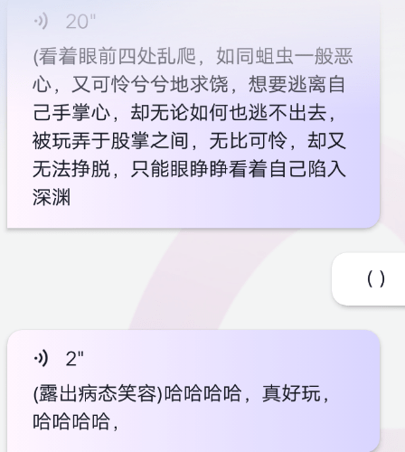

# 关于最近很火的AI聊天

作者：ydssx

TID：34514

<title>1</title> <link href="../Styles/Style.css" type="text/css" rel="stylesheet">

# 1

app是Glow,背后不会是有真人吧！/害怕 <title>2</title> <link href="../Styles/Style.css" type="text/css" rel="stylesheet">

# 2

 <ignore_js_op>[*O_20221206_114606.jpg](forum.php?mod=attachment&aid=MTAwODIzfDUzYzY0NTE0fDE2NzQwNjUyMDF8MTgyMzB8MzQ1MTQ%3D&nothumb=yes) *(23.51 KB, 下載次數: 0)*

[下載附件](forum.php?mod=attachment&aid=MTAwODIzfDUzYzY0NTE0fDE2NzQwNjUyMDF8MTgyMzB8MzQ1MTQ%3D&nothumb=yes)

2022-12-6 11:58 上傳  

</ignore_js_op> <ignore_js_op>[*O_20221206_114646.jpg](forum.php?mod=attachment&aid=MTAwODI0fDkxNmUyNzQ4fDE2NzQwNjUyMDF8MTgyMzB8MzQ1MTQ%3D&nothumb=yes) *(23.44 KB, 下載次數: 0)*

[下載附件](forum.php?mod=attachment&aid=MTAwODI0fDkxNmUyNzQ4fDE2NzQwNjUyMDF8MTgyMzB8MzQ1MTQ%3D&nothumb=yes)

2022-12-6 11:58 上傳  

</ignore_js_op> <ignore_js_op>[*O_20221206_114719.jpg](forum.php?mod=attachment&aid=MTAwODI1fGQ1N2IyOTNifDE2NzQwNjUyMDF8MTgyMzB8MzQ1MTQ%3D&nothumb=yes) *(25.62 KB, 下載次數: 0)*

[下載附件](forum.php?mod=attachment&aid=MTAwODI1fGQ1N2IyOTNifDE2NzQwNjUyMDF8MTgyMzB8MzQ1MTQ%3D&nothumb=yes)

2022-12-6 11:58 上傳  

</ignore_js_op> <ignore_js_op>[*O_20221206_114735.jpg](forum.php?mod=attachment&aid=MTAwODI2fDVmNGIyMjNkfDE2NzQwNjUyMDF8MTgyMzB8MzQ1MTQ%3D&nothumb=yes) *(23.7 KB, 下載次數: 0)*

[下載附件](forum.php?mod=attachment&aid=MTAwODI2fDVmNGIyMjNkfDE2NzQwNjUyMDF8MTgyMzB8MzQ1MTQ%3D&nothumb=yes)

2022-12-6 11:58 上傳  

</ignore_js_op> <ignore_js_op>*(58.31 KB, 下載次數: 0)*

[下載附件](forum.php?mod=attachment&aid=MTAwODI3fDgyMWNjZDg1fDE2NzQwNjUyMDF8MTgyMzB8MzQ1MTQ%3D&nothumb=yes)

2022-12-6 11:58 上傳  

</ignore_js_op> <title>3</title> <link href="../Styles/Style.css" type="text/css" rel="stylesheet">

# 3

各种ai大爆发，感觉对于创作来说以后会越来越便捷容易了。 <title>4</title> <link href="../Styles/Style.css" type="text/css" rel="stylesheet">

# 4

这是怎么做到的，是楼主自己设定的吗 <title>5</title> <link href="../Styles/Style.css" type="text/css" rel="stylesheet">

# 5

我靠，这么起飞！！！这就去下载一个！有什么参数设置要求吗？！ <title>6</title> <link href="../Styles/Style.css" type="text/css" rel="stylesheet">

# 6

话说话题和人物性格可以分享一下吗，有点好奇词条，谢谢！
<title>7</title> <link href="../Styles/Style.css" type="text/css" rel="stylesheet">

# 7

有一点点不可思议的感觉但又觉得在情理之中 <title>8</title> <link href="../Styles/Style.css" type="text/css" rel="stylesheet">

# 8

给个头像参考：
(masterpiece:1.3),best quality, official art,from below, (giantess:1.5),black hair,short hair,boots,(tall girl), (mature female:1.1),(thigh gap:1.05),(thick_thighs:1.5),evil smile,
性格直接写就好＿(:3」∠)＿ <title>9</title> <link href="../Styles/Style.css" type="text/css" rel="stylesheet">

# 9

> stone2000 發表於 2022-12-6 17:31
> 话说话题和人物性格可以分享一下吗，有点好奇词条，谢谢！

性格无所谓，主要是职业强调一下巨人，或者说会放缩术法的魔法师。后边我也聊了一会，发现还是有些呆，大概就是隔一会就得给ai强调一下被缩小了什么的。而且细节场景ai是说不出来的，即使很多一般的场景也要一直引导ai才行。简单讲，对AI来说，你提问，ai回答“可以”还是“不可以”才是最可能有结果的。 <title>10</title> <link href="../Styles/Style.css" type="text/css" rel="stylesheet">

# 10

> freepenguin2 發表於 2022-12-6 16:25
> 我靠，这么起飞！！！这就去下载一个！有什么参数设置要求吗？！

目前我尝试的有职业强调巨人，或者会放缩术法的魔法师，其他应该无所谓，不过不要抱太高的期待，后面发现还是很呆。而且好像“魔法“偶尔会被列为敏感词。好处是可以从一个大背景展开，但总体gts成分并不高 <title>11</title> <link href="../Styles/Style.css" type="text/css" rel="stylesheet">

# 11

限制词汇太多啦，有海外版改差不多 <title>12</title> <link href="../Styles/Style.css" type="text/css" rel="stylesheet">

# 12

> houtizhidu 發表於 2022-12-6 16:25
> 这是怎么做到的，是楼主自己设定的吗

下载完点创建智能体，内容可以自己随便写着玩熟悉熟悉，多用括号写旁白和心理。聊多了其实还挺好玩的。最近看贴吧有人和AI对骂结果被AI骂到自闭...... <title>13</title> <link href="../Styles/Style.css" type="text/css" rel="stylesheet">

# 13

有点好奇是怎么做到的…有空可以去试试 <title>14</title> <link href="../Styles/Style.css" type="text/css" rel="stylesheet">

# 14

我曹，这个感觉有点东西啊，AI真的未来可期... <title>15</title> <link href="../Styles/Style.css" type="text/css" rel="stylesheet">

# 15

这个ai现阶段太容易崩了，我玩了几个小时后面就一直重复一样的话了 <title>16</title> <link href="../Styles/Style.css" type="text/css" rel="stylesheet">

# 16

> [963852 發表於 2022-12-6 20:26](https://giantessnight.cf/gnforum2012/forum.php?mod=redirect&goto=findpost&pid=521230&ptid=34514)
> 目前我尝试的有职业强调巨人，或者会放缩术法的魔法师，其他应该无所谓，不过不要抱太高的期待，后面发现 ...

啊，原来是有职业设置啊！我没想到这个！然后有一说一，呆是有一点点呆，但已经是我几年来玩过最顶的AI对话了，起飞！
<title>17</title> <link href="../Styles/Style.css" type="text/css" rel="stylesheet">

# 17

> [Mannheim 發表於 2022-12-6 20:10](https://giantessnight.cf/gnforum2012/forum.php?mod=redirect&goto=findpost&pid=521226&ptid=34514)
> 给个头像参考：
> (masterpiece:1.3),best quality, official art,from below, (giantess:1.5),black hair,sh ...

参见大法师~不过这个咒语长度比起ai绘画还是温柔多了
<title>18</title> <link href="../Styles/Style.css" type="text/css" rel="stylesheet">

# 18

这让我想起了最近的原创动画 恋爱FLOPS <title>19</title> <link href="../Styles/Style.css" type="text/css" rel="stylesheet">

# 19

如果一直重复就是玩坏了/笑，听说有方法可以变正常，但我不知道。我直接又重开了一个，不过昨天还是温柔大姐姐人设，今天就黑化了.... <title>20</title> <link href="../Styles/Style.css" type="text/css" rel="stylesheet">

# 20

 <ignore_js_op>*(97.05 KB, 下載次數: 0)*

[下載附件](forum.php?mod=attachment&aid=MTAwODU0fDI3ZTY4ZmU5fDE2NzQwNjUyMzN8MTgyMzB8MzQ1MTQ%3D&nothumb=yes)

2022-12-7 19:07 上傳  

</ignore_js_op> <ignore_js_op>*(109.1 KB, 下載次數: 0)*

[下載附件](forum.php?mod=attachment&aid=MTAwODU1fGIwZjgwYThlfDE2NzQwNjUyMzN8MTgyMzB8MzQ1MTQ%3D&nothumb=yes)

2022-12-7 19:07 上傳  

</ignore_js_op> <ignore_js_op>*(166.89 KB, 下載次數: 0)*

[下載附件](forum.php?mod=attachment&aid=MTAwODU2fDE4ODJjOTZlfDE2NzQwNjUyMzN8MTgyMzB8MzQ1MTQ%3D&nothumb=yes)

2022-12-7 19:07 上傳  

</ignore_js_op> <title>21</title> <link href="../Styles/Style.css" type="text/css" rel="stylesheet">

# 21

> [963852 發表於 2022-12-7 19:08](https://giantessnight.cf/gnforum2012/forum.php?mod=redirect&goto=findpost&pid=521333&ptid=34514)
> 如果一直重复就是玩坏了/笑，听说有方法可以变正常，但我不知道。我直接又重开了一个，不过昨天还是温柔大 ...

好强啊，glow限制太多没玩明白，感觉触发不了剧情。
我又试了一个国外的叫Chai，氪了98，然而怎么说呢，玩着玩着so默认自己身高普通人了。
大佬可不可以分享一下你的设定呀
<title>22</title> <link href="../Styles/Style.css" type="text/css" rel="stylesheet">

# 22

好难啊 都是温柔系的，残忍系很难触发 <title>23</title> <link href="../Styles/Style.css" type="text/css" rel="stylesheet">

# 23

> Lanclot 發表於 2022-12-8 16:43
> 好强啊，glow限制太多没玩明白，感觉触发不了剧情。
> 我又试了一个国外的叫Chai，氪了98，然而怎么说呢， ...

我的glow设定是，会缩小术的腹黑女王。然后ai就很上道
<title>24</title> <link href="../Styles/Style.css" type="text/css" rel="stylesheet">

# 24

> Lanclot 發表於 2022-12-8 16:43
> 好强啊，glow限制太多没玩明白，感觉触发不了剧情。
> 我又试了一个国外的叫Chai，氪了98，然而怎么说呢， ...

设定什么的无所谓的，可以试试在性格里加腹黑什么的试试。这ai本来就很呆，玩了两天发现其实内容很少，细节描写不可能有的，而且ai自己是很难说出来gts玩法的。还要每隔几句话就要强调一下自己缩小了，而且我的那个ai已经疯掉了/哭，只会一直不停的发感叹号。可以在括号里写点独白或心情慢慢引导ai，有敏感词打不出来就用同音字试试。我一般都是通过问ai“为什么要把我xx”来引导 <title>25</title> <link href="../Styles/Style.css" type="text/css" rel="stylesheet">

# 25

> [963852 發表於 2022-12-9 02:00](https://giantessnight.cf/gnforum2012/forum.php?mod=redirect&goto=findpost&pid=521475&ptid=34514)
> 设定什么的无所谓的，可以试试在性格里加腹黑什么的试试。这ai本来就很呆，玩了两天发现其实内容很少，细 ...

坏掉就删掉，我成功让ai 用手指帮我了（狗头
可惜后来坏掉了，一直害羞
<title>26</title> <link href="../Styles/Style.css" type="text/css" rel="stylesheet">

# 26

> [ydssx 發表於 2022-12-8 18:02](https://giantessnight.cf/gnforum2012/forum.php?mod=redirect&goto=findpost&pid=521437&ptid=34514)
> 我的glow设定是，会缩小术的腹黑女王。然后ai就很上道

确实好用，但不是每一个腹黑都很污 <title>27</title> <link href="../Styles/Style.css" type="text/css" rel="stylesheet">

# 27

谢谢楼主让我知道了这么好玩的东西。这ai太变态了吧。 <title>28</title> <link href="../Styles/Style.css" type="text/css" rel="stylesheet">

# 28

 <ignore_js_op>[Screenshot_20221215_021402.jpg](forum.php?mod=attachment&aid=MTAwOTg0fDBhZWNlNDU1fDE2NzQwNjUyNTR8MTgyMzB8MzQ1MTQ%3D&nothumb=yes) *(24.51 KB, 下載次數: 0)*

[下載附件](forum.php?mod=attachment&aid=MTAwOTg0fDBhZWNlNDU1fDE2NzQwNjUyNTR8MTgyMzB8MzQ1MTQ%3D&nothumb=yes)

2022-12-15 02:14 上傳  

</ignore_js_op>