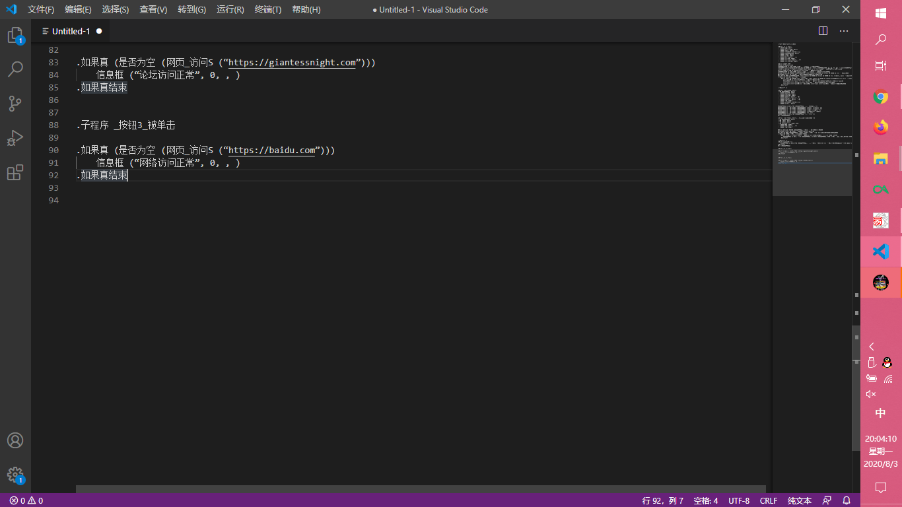
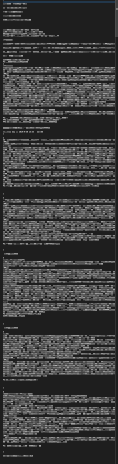

# 关于盗贴，要提高警惕（演示程序）

作者：Lcxzyr

TID：29198

<title>1</title> <link href="../Styles/Style.css" type="text/css" rel="stylesheet">

# 1

*本帖最後由 Lcxzyr 於 2020-8-4 13:32 編輯*

首先，我是很憎恨盗贴者的。在没有付出什么劳动的情况下，嫖走人家的无私奉献出来的成果自己牟利。
这个行为是绝对恶劣的，但那么多人，总会有**。
在私下交流中，有些人对文章被盗的风险不以为意，认为自己被盗的可能性不大，盗贴复制粘贴还要规避乱码，分段多的话还要一段段复制。
于是我决定进行一次演示，让大家看看盗文是多么轻松写意
这个是用来盗贴的程序
一次可以导出一篇文章（的第一页）
其代码量仅为不到100行(还有不少是用于声明变量的以及一些空行)
<ignore_js_op>

**1.png** *(124.07 KB, 下載次數: 0)*

[下載附件](forum.php?mod=attachment&aid=ODQyOTF8ZDc4OWI2YjN8MTY3NDA2NjM3NnwxODIzMHwyOTE5OA%3D%3D&nothumb=yes)

2020-8-3 20:04 上傳

（右侧是预览，底下有统计）
这是结果的预览，感受一下
<ignore_js_op>

**2.png** *(26.27 KB, 下載次數: 2)*

[下載附件](forum.php?mod=attachment&aid=ODQyOTJ8NTU4ZTI4MjB8MTY3NDA2NjM3NnwxODIzMHwyOTE5OA%3D%3D&nothumb=yes)

2020-8-3 20:12 上傳

（我才不会说我是拿了谁的文演示呢，反正我也没保存）
当然除了我以外，**不会有任何一个人可以通过它成功导出任何一篇文章**
如果有人做到了，我给各位作者开直播表演倒立吔屎

---------------------------------
該附件因爲會被某些別有用心者利用，因此予以移除，望見諒

by Prophet
-----------------------------------
想利用我的产出品是不可能的，但既然出于顾虑，移除也没什么
Lcxzyr

<title>2</title> <link href="../Styles/Style.css" type="text/css" rel="stylesheet">

# 2

*本帖最後由 吸水恶魔 於 2020-8-3 23:23 編輯*

如果有心做的话确实挺简单的.
方便的有直接引用网上的字符判断库然后一个一个字符进去判断是不是中文或者标点符号.
麻烦一点的搞个正则表达式什么的也行.
就算用笨方法一行一行复制其实也花不了太多时间也是个问题.或者更简单粗暴一点,直接手机拍/截图下来然后文字识别,因为干扰码不反选是看不到的,图片的文字识别也不会识别出来.
<title>3</title> <link href="../Styles/Style.css" type="text/css" rel="stylesheet">

# 3

受教了，我也要好好钻研和学习一下，有备无患
最后再说一遍，盗文过年买不到车票！
<title>4</title> <link href="../Styles/Style.css" type="text/css" rel="stylesheet">

# 4

謝謝你的提醒，現在清楚明白去掉亂碼要搜什麼關鍵字了，也完全理解該對追求防盜文功能死心了，透過這個帖子的說明，GN又卸除了一堵防盜文的牆，讓更多人知道如何破解亂碼與放棄抵抗文章被盜。 <title>5</title> <link href="../Styles/Style.css" type="text/css" rel="stylesheet">

# 5

> phone2345 發表於 2020-8-4 02:08
> 謝謝你的提醒，現在清楚明白去掉亂碼要搜什麼關鍵字了，也完全理解該對追求防盜文功能死心了，透過這個帖子 ...

上面那个人对于去除乱码的说法完全是错误的无稽之谈。我只是讲出了可能性，没有说出任何可行性的意见和提示 <title>6</title> <link href="../Styles/Style.css" type="text/css" rel="stylesheet">

# 6

> [吸水恶魔 發表於 2020-8-3 23:20](https://giantessnight.cf/gnforum2012/forum.php?mod=redirect&goto=findpost&pid=443721&ptid=29198)
> 如果有心做的话确实挺简单的.
> 方便的有直接引用网上的字符判断库然后一个一个字符进去判断是不是中文或者标 ...

确切地说没有这么麻烦了，因为DOM里都没在一起。

不过从完全没有阻碍变成稍微有一点阻碍，也足以挡住一半以上的人，效果肯定还是有的。
就像游戏，完全免费和$1，玩家数量的期望是完全不一样的。</ignore_js_op></ignore_js_op>