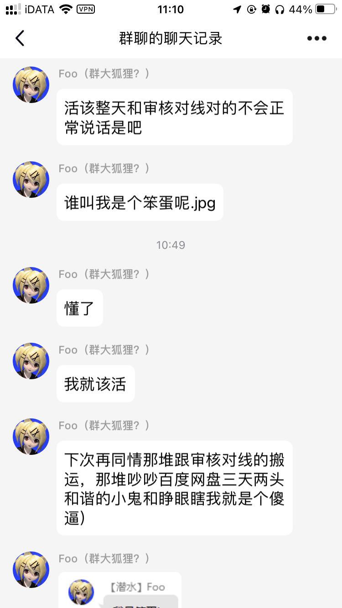

# 关于网盘防和谐的讨论

作者：gfktxds

TID：32923

<title>1</title> <link href="../Styles/Style.css" type="text/css" rel="stylesheet">

# 1

*本帖最後由 gfktxds 於 2022-3-25 16:48 編輯*

这个帖子也是因为发现论坛里有大量失效链接的帖子才发的如果你不用百度网盘这一类经常和谐文件得网盘，请忽略此贴。百度网盘本人也算是用了n年了，其中各种和谐都经历过，也找了很多应对方法，有的有效，有的无效。在这里聊一聊防网盘（包括但不限于百度网盘）和谐的办法。（本贴全都是基于文件需要分享的情况下且解压密码和后缀都告诉别人的情况下）1.分卷压缩（两个即可，百度网盘无论如何都无法在线解压）2.密码请＞8位，最好不止有数字，不要是常用密码（密码过短会很容易暴力破解的）3.文件名不要含有敏感词汇在文件需要分享的情况下，这三点同时运用，的确能够有效的防止和谐。
**那么肯定有人想问？**Q&AQ：改后缀＋密码行不行？A：不行。理由：百度网盘客户端本身可以直接改后缀，相当于没有去后缀，那么就不能杜绝在线解压的现象
Q：压缩两次（两次都带密码）+改后缀是否可行？A：虽然风险很小，但仍具有风险。理由：虽然客户端能够在线解压，解压出来之后是能够继续在线二次解压的（PS：没有被和谐过只是你分享得资源没人这么干过）
**疑问讨论？**1.后缀7z百度网盘无法在线解压，但是不加密码否有可能被和谐呢？2.PDF和谐的几率是否较低？（PS：本人的早期PDF敏感资源至今未被和谐，非常奇怪）3.有没有大佬提供更便捷且几乎无风险的方法呢---------------------------------------------------------------------------------------------------------
PS：我的压缩包一般是分卷压缩存在百度网盘里，旁边的一个文件夹名就是解压密码；压缩包名称至简（数字即可），资源是什么也写在旁边的空文件夹上。不过直接用mega等一些国外网盘自然是没有这方面的顾虑
最后，祝大家的资源都能安好！
<title>2</title> <link href="../Styles/Style.css" type="text/css" rel="stylesheet">

# 2

> [skyqiling 發表於 2022-3-25 19:49](https://giantessnight.cf/gnforum2012/forum.php?mod=redirect&goto=findpost&pid=498394&ptid=32923)
> 总有人喜欢在线解压。。我寻思在线解压你也下不了啊？

所以在线解压我觉得是属于无意的，应该很少有人故意在线解压。类似于那些只有手机的人，手机空间不是很大，就有可能在线解压在线播放等等；另外，有很多人其实后缀甚至都不会改就是了
<title>3</title> <link href="../Styles/Style.css" type="text/css" rel="stylesheet">

# 3

其实分享的话还是分卷最稳妥，即使是有人举报了资源依然可以下载，只是不能再去分享了而已（我个人觉得是百度无法察觉这到底是不是黄色资源，索性一刀切不让分享了） <title>4</title> <link href="../Styles/Style.css" type="text/css" rel="stylesheet">

# 4

对的。虽然我还是在用去后缀双重加密。但参考国内踩踏网站的文件。分卷确实靠谱不少。 <title>5</title> <link href="../Styles/Style.css" type="text/css" rel="stylesheet">

# 5

双7Z压缩两次分卷密码就是文件名，我合购群买半年了，复杂是复杂了一点，但是没有失效过。 <title>6</title> <link href="../Styles/Style.css" type="text/css" rel="stylesheet">

# 6

*本帖最後由 Foobarz 於 2022-3-27 02:32 編輯*

所以解决方案不是有了么，为什么在这种问题上浪费时间.jpg
IPFS 和 Arweave 之类的最难和谐，但是没人用。Google Drive / OneDrive 没这么多破事，但是容量不够得加钱。于是我还有病似地自己掏钱买 OneDrive for Business ……

<ignore_js_op>

**8b5d73522ff1bf8e9bd60bddd9a7298edaf1c410.png@1036w (1).png** *(256.62 KB, 下載次數: 0)*

[下載附件](forum.php?mod=attachment&aid=OTQ4MDd8NGY0MDZjMDN8MTY3NDA2NTU5NHwxODIzMHwzMjkyMw%3D%3D&nothumb=yes)

2022-3-26 19:19 上傳

所以链接失效就会有人不断来问，帖子就能浮在论坛上面，真就流量密码（x）
<title>7</title> <link href="../Styles/Style.css" type="text/css" rel="stylesheet">

# 7

> [s孙晓美 發表於 2022-3-26 10:47](https://giantessnight.cf/gnforum2012/forum.php?mod=redirect&goto=findpost&pid=498440&ptid=32923)
> 双7Z压缩两次分卷密码就是文件名，我合购群买半年了，复杂是复杂了一点，但是没有失效过。 ...

你这样弄也挺不错的，完美利用7z不能在线解压，相当保险，压缩文件也不用考虑每个分卷大小了，但是两次压缩，要是资源特别大，那真的就很费时间了
<title>8</title> <link href="../Styles/Style.css" type="text/css" rel="stylesheet">

# 8

百度云的话考虑一下用秒传链接？一个脚本的事，至少不会炸链，文件本身被和谐了就没办法了 <title>9</title> <link href="../Styles/Style.css" type="text/css" rel="stylesheet">

# 9

> [wanjingle 發表於 2022-3-28 19:08](https://giantessnight.cf/gnforum2012/forum.php?mod=redirect&goto=findpost&pid=498646&ptid=32923)
> 百度云的话考虑一下用秒传链接？一个脚本的事，至少不会炸链，文件本身被和谐了就没办法了 ...

脚本如果没有教程的话，对很多人来说还是有一定的门槛吧因人而异

<title>10</title> <link href="../Styles/Style.css" type="text/css" rel="stylesheet">

# 10

*本帖最後由 gfktxds 於 2022-3-28 23:22 編輯*

> [Foobarz 發表於 2022-3-26 19:17](https://giantessnight.cf/gnforum2012/forum.php?mod=redirect&goto=findpost&pid=498479&ptid=32923)
> 所以解决方案不是有了么，为什么在这种问题上浪费时间.jpg
> IPFS 和 Arweave 之类的最难和谐，但是没人用。G ...

其实目的是打着讨论的幌子告诉一些不清楚的人怎么发百度网盘（笑）顺便让自己的帖子显得不那么绝对和强势，发表言论还是要留一点余地的，不然我就直接把标题改成防百度网盘和谐教程了 <title>11</title> <link href="../Styles/Style.css" type="text/css" rel="stylesheet">

# 11

> [gfktxds 發表於 2022-3-28 23:16](https://giantessnight.cf/gnforum2012/forum.php?mod=redirect&goto=findpost&pid=498678&ptid=32923)
> 其实目的是打着讨论的幌子告诉一些不清楚的人怎么发百度网盘（笑）顺便让自己的帖子显得不那么绝对和强势 ...

结果就成了想要下载舒服需要上传的人努力，但是上传的人不想努力，于是就…… </ignore_js_op>