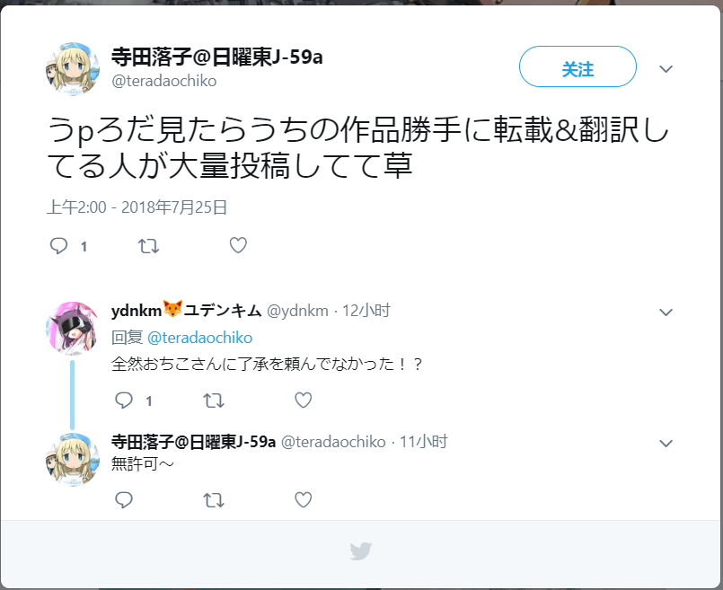

# 关于翻译嵌字的一些事情。

作者：ZetaWocorde

TID：25591

<title>1</title> <link href="../Styles/Style.css" type="text/css" rel="stylesheet">

# 1

*本帖最後由 ZetaWocorde 於 2018-7-26 09:52 編輯*

各位好！
最近，自学了一下ps，已经可以完成嵌字的工作了。
虽然还不熟练、嵌得也不好就是了。
于是，打算趁暑假有空，把自己以前翻过的图片修整一下。
其实就是把文字嵌到图片里去啦。
我会陆续把之前帖子里的图片替换掉。
这样效果应该会更好吧。
——————————————————————————————————————————————————
同时，我也开通了gs的主页。
我翻译的所有图片都可以在上面找到。
这样就方便大家查看图片了。
网址：[https://gs-uploader.jinja-modoki ... p?uname=ZetaWocorde](https://gs-uploader.jinja-modoki.com/upld-index.php?uname=ZetaWocorde)
希望大家喜欢。
Tip：在看之前，请把浏览限制全部打开，不然有些图片无法查看。
——————————————————————————————————————————————————
我的gs主页貌似被封了？
反正我现在无法查看gs上的内容、账号也登不进去了。
果然我还是只能在gn上更新了么……
<title>2</title> <link href="../Styles/Style.css" type="text/css" rel="stylesheet">

# 2

從英文翻譯沒關係，但用日文的圖來改比較好，因為中文在圖上大家習慣直式書寫 <title>3</title> <link href="../Styles/Style.css" type="text/css" rel="stylesheet">

# 3

建議多用筆畫等寬的黑體，會比細明體或標楷體看的更舒服些。 <title>4</title> <link href="../Styles/Style.css" type="text/css" rel="stylesheet">

# 4

可以支持一下楼主的工作 <title>5</title> <link href="../Styles/Style.css" type="text/css" rel="stylesheet">

# 5

那个，问一下
这个权限分别是什么意思
LPVCS都是什么？？
（借个楼）
<title>6</title> <link href="../Styles/Style.css" type="text/css" rel="stylesheet">

# 6

 <ignore_js_op>[QQ浏览器截图20180725184356.png](forum.php?mod=attachment&aid=NzMzODF8NDc0N2RjN2F8MTY3NDA2NjgzM3wxODIzMHwyNTU5MQ%3D%3D&nothumb=yes) *(883 Bytes, 下載次數: 3)*

[下載附件](forum.php?mod=attachment&aid=NzMzODF8NDc0N2RjN2F8MTY3NDA2NjgzM3wxODIzMHwyNTU5MQ%3D%3D&nothumb=yes)

2018-7-25 18:51 上傳  

</ignore_js_op> <title>7</title> <link href="../Styles/Style.css" type="text/css" rel="stylesheet">

# 7

> [study 發表於 2018-7-25 18:51](https://giantessnight.cf/gnforum2012/forum.php?mod=redirect&goto=findpost&pid=382882&ptid=25591)
> 那个，问一下
> 这个权限分别是什么意思
> LPVCS都是什么？？

L-陰唇
P-陰莖
V-吞食
C-虐殺
S-排泄
<title>8</title> <link href="../Styles/Style.css" type="text/css" rel="stylesheet">

# 8

希望用繁體嵌字
方便各地華語用戶人群 <title>9</title> <link href="../Styles/Style.css" type="text/css" rel="stylesheet">

# 9

你还不知道为什么被封是吧…………寺田已经发这样的推了
以及你发的巨人女王的翻译
我记得是Enty和Patreon支援 赞助过的才能看到的图吧？虽然我记得Exhentai好像偷跑过这张图

<title>10</title> <link href="../Styles/Style.css" type="text/css" rel="stylesheet">

# 10

 <ignore_js_op>[无标题.png](forum.php?mod=attachment&aid=NzMzOTh8MTIwNDVhZjZ8MTY3NDA2NjgzM3wxODIzMHwyNTU5MQ%3D%3D&nothumb=yes) *(80.86 KB, 下載次數: 0)*

[下載附件](forum.php?mod=attachment&aid=NzMzOTh8MTIwNDVhZjZ8MTY3NDA2NjgzM3wxODIzMHwyNTU5MQ%3D%3D&nothumb=yes)

2018-7-26 11:29 上傳  

</ignore_js_op> <title>11</title> <link href="../Styles/Style.css" type="text/css" rel="stylesheet">

# 11

最近论坛都不太活跃了，支持下楼主喽