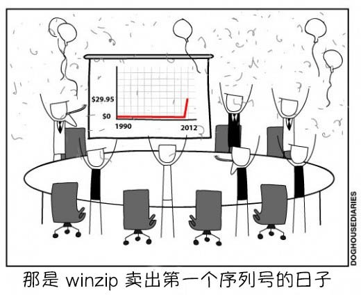

# 关于翻译是否向原作者请求许可的问题

作者：C-aki

TID：26423

<title>1</title> <link href="../Styles/Style.css" type="text/css" rel="stylesheet">

# 1

<title>2</title> <link href="../Styles/Style.css" type="text/css" rel="stylesheet">

# 2

*本帖最後由 闲余ノ 於 2019-2-16 01:20 編輯*

怎么说呢 确实侵犯了作者的著作权 但我们汉化的这些东西本来就不了台面 不符合国情（毕竟是黄*）而且一但授权 直接少一大堆人汉化 本来就小众 这么一折腾.. 个人觉得无需在翻译前取得版权 或许有些自私 但汉化是为大家服务 本身不存在利益 说白了就是用爱发电 顺便还帮别人加了波知名度  自己也开心 双赢

<title>3</title> <link href="../Styles/Style.css" type="text/css" rel="stylesheet">

# 3

*本帖最後由 葬儀社 於 2019-2-16 01:33 編輯*

理論上(禮貌上)給個尊重求個同意是應該的.但現實嗎...你懂得.存在著各式各樣的理由(嫌麻煩)與困難(語言)
我個人是覺得免費公開的作品.不經過同意OK.但至少標著作者與出處就沒問題了.尊重給到了.而且翻譯的東西因為是公開的.作者應該也不會介意才是
至於付費或明顯有規範的作品."最好"還是經過作者同意再貼會比較好.當然**前者(收費)**你去問.作者根本不可能會讓你免費去發布啊.因為那根本就是(逼----)
*一個腦袋清楚的人應該都知道如果自己努力的成果被整碗端走會有多不爽

BUT.一個圈子要活躍資源的分享是必要的.畢竟許多人（學生）沒有入手的管道與手段.還有更重要的是**沒有錢.沒有錢.沒。有。錢**
**（某極←台語）**
***或是其實我有錢.但這作品還不足以讓我拿出錢來(再惡霸一點就是"老子就是想白嫖.怎樣!!")**

無論如何.私底下的資源分享已經算是檯面下大家共認的所謂"合法的壞事".即便你有那個資格說.我從小到大沒下載過任何非法資源.但你也沒辦法完全指責這樣的行為是不對的.不過就算可以.但凡事都有所謂的**底線**.大夥都在做.不代表這種事情可以攤在大太陽底下說.也就是說無論做什麼事情都要有個**界線**.超過這個界線就"過分了點喔".或者說不太"厚道"了.大家想分享資源.關在小房間裡互相傳沒人知道.OK這樣可以.但如果把別人的資源拿來營利或當成自己的東西(或得意洋洋的說自己吃免錢飯之類的).那被人噹到爆炸也只能說你活該死好了

如果你覺得以上的話很做作.非常不舒服.或"異議阿里"之類的.我也沒意見.也不想去針對這種事情去辯駁.我的想法就很簡單"凡事都要有個底線".對超越底線而不自知的人.我覺得說得再多也沒啥屁用.畢竟他的底線不等於我的底線(道不同不相為謀).而且去爭辯這種事情的對錯與否真的很累人

<ignore_js_op>

**1402844236596.jpg** *(43.13 KB, 下載次數: 0)*

[下載附件](forum.php?mod=attachment&aid=NzY1NTF8ODJhN2U2NTJ8MTY3NDA2ODYzNXwxODIzMHwyNjQyMw%3D%3D&nothumb=yes)

2019-2-16 01:30 上傳

<title>4</title> <link href="../Styles/Style.css" type="text/css" rel="stylesheet">

# 4

本来就是小众圈子，非商用的作品在翻译者标明出处和作者的情况下，作者应该也不会介意吧。 <title>5</title> <link href="../Styles/Style.css" type="text/css" rel="stylesheet">

# 5

砂糖酱又有意愿翻译新作品了嘛 <title>6</title> <link href="../Styles/Style.css" type="text/css" rel="stylesheet">

# 6

理論上任何二次改作都得向作者徵詢，但通常發問的結果是沒人鳥你
付錢的東西比較麻煩，作者是收錢的大概也會比較積極檢查信箱吧
至於公開文章做翻譯這種事，我覺得可以先斬後奏，對方表示不悅再刪掉也ok <title>7</title> <link href="../Styles/Style.css" type="text/css" rel="stylesheet">

# 7

就我个人情况来说，我可以看懂外文，并且可以尝试翻译汉化
但是让我组织语言去表达一个事情，可能就会出现词不达意的情况……

<title>8</title> <link href="../Styles/Style.css" type="text/css" rel="stylesheet">

# 8

我觉得还是要先告知作者,然后作品标明出处和作者,之后作者不同意再删除。 <title>9</title> <link href="../Styles/Style.css" type="text/css" rel="stylesheet">

# 9

首先肯定要标明原作者的所有信息
可以先发出来 把给作者的付款渠道贴上
visa应该很好用 <title>10</title> <link href="../Styles/Style.css" type="text/css" rel="stylesheet">

# 10

我自己时常翻译大神们的作品，但不会拿人家收费的作品贴到网路上 <title>11</title> <link href="../Styles/Style.css" type="text/css" rel="stylesheet">

# 11

其实严格来说，没有得到许可授权的应该就属于侵权了吧。但是都不会认真对待吧？

根据百度《著作权法》
1.未经作者授权且未注明作者姓名，并翻译别人的作品是否可以认定为抄袭情况这个目前没有统一的定论，但是，肯定是不尊重的行为。译者在处理这类文章的时候，至少应该注明原作者的姓名，有网络链接的至少应该注明原作者链接。 
2.编译，在没有经过作者授权或者注明作者姓名的时候，应该是属于翻译权侵权的行为的，而后者经过作者本身增加了内容的行为，也同样在此列。
3.《伯尔尼公约》是国际通用的著作权保护性公约，在版权保护方面我国的《著作权法》对于作品著作权的保护期限与前者相同，皆为作者终生加死后的50年。但是，欧盟成员过和美国都是在作者终生和死后的70年进行著作权保护，这样的规定并不与《伯尔尼公约》相互冲突，国际间也遵循这样的情况。版权超过保护期以后便成为公共的版权作品，也就意味着任何人都可以不付费不获得授权进行任何形式的使用。那么在翻译某些作品的时候遇到著作权问题也应该遵循这样的原则。

如此一来，翻译（汉化）的时候
1.至少表明作者出处，甚至是原文链接。
2.尽可能的与原作者取得联系并且获得许可。
3.公开的文章不等于公共的版权，所以仍是原作者享有著作权，所以请参照前面两条。

那么由此衍生，编译应该注明作者出处。而续写则应该取得原作者的同意。

当然这些东西应该都不会认真遵守吧，稍微黑暗一点来说，作者不知道所以可以当做什么也没有发生应该属于一种常态，这种理解逻辑应该是【既然都公开了那么我翻译过来也无可厚非】，以及【尽管大家都感觉到不对但是为了欲我们大家就当什么都没有发生过】。

毕竟人和人之间是不同的，每个人的底线不同，也没有办法统一。

只是觉得吧，文学上有引用，道德上有尊重。我还是更加偏向于请求许可，底线则是注明作者出处原文地址。 <title>12</title> <link href="../Styles/Style.css" type="text/css" rel="stylesheet">

# 12

表明出处还是很有必要的，但是请求许可这点……有当然好，没有的话感觉也无大碍 <title>13</title> <link href="../Styles/Style.css" type="text/css" rel="stylesheet">

# 13

我觉得应该分情况，如果你翻译的目的仅仅是自己阅读方便和帮助身边的小伙伴（一对一），可以不用获得作者的授权。但如果是要作为翻译文章进行发布和传阅（一对多），就需要原作者的授权。虽然没有收费，但论坛发表也算是商业用途，因为你翻译的文章为论坛提高了人气。而与这个圈子大小和是否被公众所接受没有关系。 <title>14</title> <link href="../Styles/Style.css" type="text/css" rel="stylesheet">

# 14

自己写多好，干嘛翻译，除非你时间真的很多
<title>15</title> <link href="../Styles/Style.css" type="text/css" rel="stylesheet">

# 15

毕竟别人创作的东西，你愿意翻译也说明你也喜欢，对原作者都尊重还是要有的 <title>16</title> <link href="../Styles/Style.css" type="text/css" rel="stylesheet">

# 16

首先付费作品肯定是需要授权的，因为你的翻译行为包含了公开资源这一步。
至于免费作品嘛，国内网络环境里一直以来存在着一个实际上并不合规的词——“侵删”。其内涵也正如前面有朋友提到的，先斩后奏。
考虑到实际联络起来的各种不便利，“侵删”并不是不能理解的，不过它确实没有给作者以充分的尊重，这一点无法否认。
实际操作时怎么做，我个人还是觉得见仁见智，只要没有在作者明令禁止转载，或者事后提出抗议的情况下散播，都还没有到越界的地步。 <title>17</title> <link href="../Styles/Style.css" type="text/css" rel="stylesheet">

# 17

问肯定是要问的 这是给作者最基本的尊重吧 <title>18</title> <link href="../Styles/Style.css" type="text/css" rel="stylesheet">

# 18

觉得还是要先告知作者,然后作品标明出处和作者,之后作者不同意再删除</ignore_js_op>