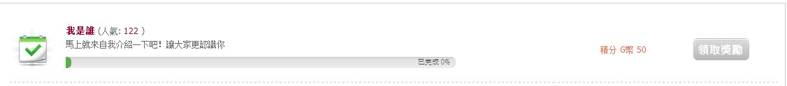

# 关于自我介绍区

作者：泡面

TID：14376

<title>1</title> <link href="../Styles/Style.css" type="text/css" rel="stylesheet">

# 1

感觉越来越水了，个人建议对那些优秀的自我介绍加分鼓励，提前晋级，让优秀的同好和人才更好的融入我们的圈子。

对水帖则直接砍掉。

<title>2</title> <link href="../Styles/Style.css" type="text/css" rel="stylesheet">

# 2

嗯。。。前一个同意。。。后一个还是算了吧。。。
本来现在的新人就懒得认真回复。。。水贴还砍。。。虽说不差多少但是打击积极性吧。。。 <title>3</title> <link href="../Styles/Style.css" type="text/css" rel="stylesheet">

# 3

看了一下 似乎是有什麼新手任務？

<title>4</title> <link href="../Styles/Style.css" type="text/css" rel="stylesheet">

# 4

> lovegts 發表於 2013-5-10 22:56 
> 看了一下 似乎是有什麼新手任務？

没有任务怎么可能有人去自我介绍╮(￣▽￣")╭ 虽然我貌似还没弄
<title>5</title> <link href="../Styles/Style.css" type="text/css" rel="stylesheet">

# 5

沒說我都不知道有這個系統@@ <title>6</title> <link href="../Styles/Style.css" type="text/css" rel="stylesheet">

# 6

新手任務，哪裡有啊？我咋就一次沒看到過啊。 <title>7</title> <link href="../Styles/Style.css" type="text/css" rel="stylesheet">

# 7

.
任務系統是論壇升級之後才有的。
各位其實也都可以去補作。
新人會去作是因為他們註冊之後就會自動被系統提醒要去作任務。

我會研議看看給那些寫得很充實的人直接晉級。 <title>8</title> <link href="../Styles/Style.css" type="text/css" rel="stylesheet">

# 8

我觉得新人找不到自我介绍区 <title>9</title> <link href="../Styles/Style.css" type="text/css" rel="stylesheet">

# 9

<ignore_js_op>

**QQ截图20130511221047.jpg** *(17.76 KB, 下載次數: 1)*

[下載附件](forum.php?mod=attachment&aid=MzQyNzZ8OTI3MzliMzJ8MTY3NDA2ODUxOHwxODIzMHwxNDM3Ng%3D%3D&nothumb=yes)

2013-5-11 22:11 上傳

这个任务我现在还挂着呢...
还有邮箱这个任务 根本接受不了了... 强迫症表示很难受
<ignore_js_op>

**QQ截图20130511221058.jpg** *(13.88 KB, 下載次數: 1)*

[下載附件](forum.php?mod=attachment&aid=MzQyNzd8MDg2Njg5MWF8MTY3NDA2ODUxOHwxODIzMHwxNDM3Ng%3D%3D&nothumb=yes)

2013-5-11 22:11 上傳

<title>10</title> <link href="../Styles/Style.css" type="text/css" rel="stylesheet">

# 10

> 390004989 發表於 2013-5-11 22:11 
> 这个任务我现在还挂着呢...
> 还有邮箱这个任务 根本接受不了了... 强迫症表示很难受

申请一个可用的邮箱，然后进去点击GN发给你的链接即可。
<title>11</title> <link href="../Styles/Style.css" type="text/css" rel="stylesheet">

# 11

> xnr 發表於 2013-5-11 22:44 
> 申请一个可用的邮箱，然后进去点击GN发给你的链接即可。

不不 是申请不了了... 这个任务貌似只有 等待驗證會員 才能申请</ignore_js_op></ignore_js_op>