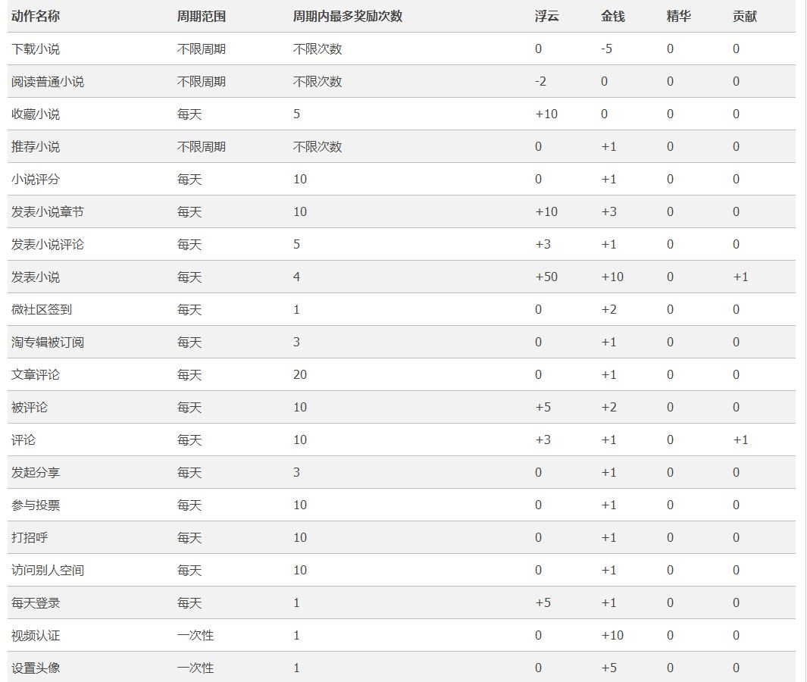
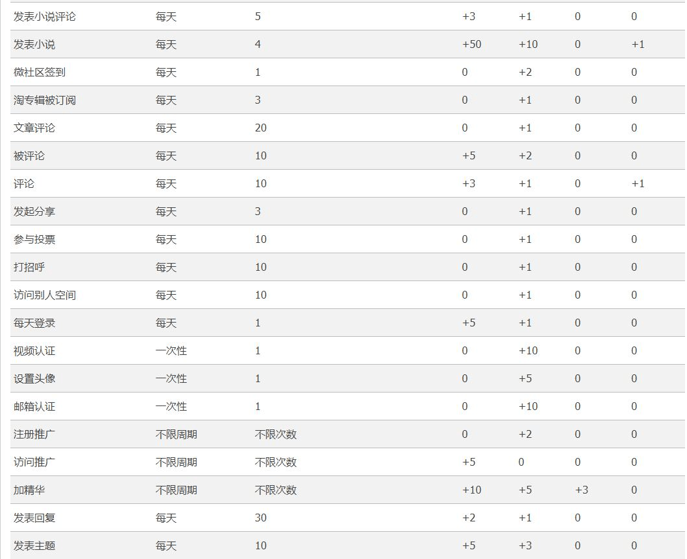
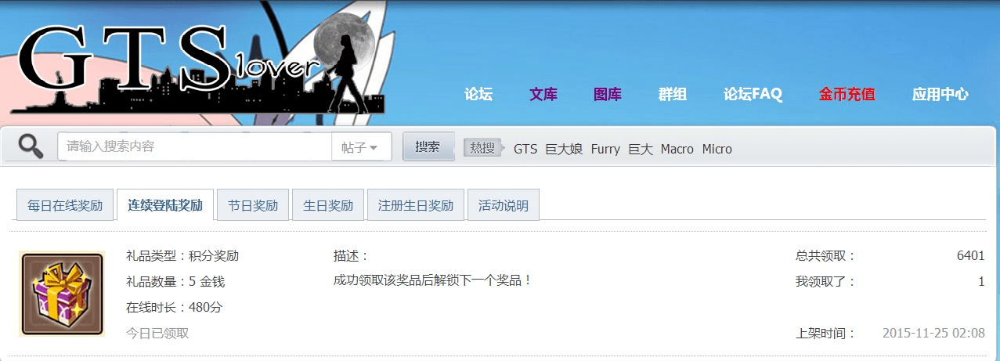
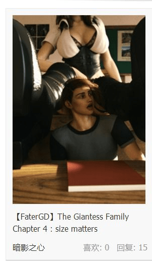

# 关于隔壁论坛的

作者：御姐脚上丝袜

TID：19808

<title>1</title> <link href="../Styles/Style.css" type="text/css" rel="stylesheet">

# 1

> [Ann 發表於 2015-9-15 15:11](https://giantessnight.cf/gnforum2012/forum.php?mod=redirect&goto=findpost&pid=268410&ptid=19808)
> 暗影之心和sillybat也是这么想的，用你们买邀请码得来的500元，咱去外国网站上买更新更火的资源来坛子分享 ...

我倒是希望是资源里的而不是邀请码，因为之后还要为资源买单
<title>2</title> <link href="../Styles/Style.css" type="text/css" rel="stylesheet">

# 2

> [Eighteen 發表於 2015-9-15 17:00](https://giantessnight.cf/gnforum2012/forum.php?mod=redirect&goto=findpost&pid=268413&ptid=19808)
> 好像并没有这么高。
> 隔壁公告说邀请码价格大概就20-40金币，兑换成RMB4-8元吧，需要有一定的用户等级才能买 ...

我截了张图，听说过年就不用那么贵了，到时再申请
<title>3</title> <link href="../Styles/Style.css" type="text/css" rel="stylesheet">

# 3

- -那个论坛要邀请码吗 我那时候是直接注册的  虽然现在上不了   <title>4</title> <link href="../Styles/Style.css" type="text/css" rel="stylesheet">

# 4

> [牛逼牛逼 發表於 2015-9-15 17:43](https://giantessnight.cf/gnforum2012/forum.php?mod=redirect&goto=findpost&pid=268421&ptid=19808)
> - -那个论坛要邀请码吗 我那时候是直接注册的  虽然现在上不了

我截了张图了，希望不要有什么误会
<title>5</title> <link href="../Styles/Style.css" type="text/css" rel="stylesheet">

# 5

我也是一开始直接注册的，资源嘛，也没有多少很新鲜的东西，几个老资源翻来覆去的发，这里求不到的那里也没有，最坑的是东西卖的越来越贵，金币却越来越难得到... <title>6</title> <link href="../Styles/Style.css" type="text/css" rel="stylesheet">

# 6

說真的，那裡的資源大部分也是網上載來的，會被坑的只有圈子菜鳥吧 <title>7</title> <link href="../Styles/Style.css" type="text/css" rel="stylesheet">

# 7

*本帖最後由 a8071504 於 2015-9-16 10:38 編輯*

那个论坛我也注册了一个号，但是不怎么上，原因很简单，就是基本下任何东西都要金币，而且觉得缺少那种和平讨论的氛围，人们都很功利化，去了就是找资源的。缺金币就要去分享资源。本来这种模式也无可厚非，因为人们也不应该做伸手党。但那个论坛上也有不少版权物，或者基本就是纯搬运，也要收钱。补充一下，还有一点，就是我们论坛经常会有作者无偿的去创作一些文章，或者去翻译些文，但是隔壁基本就都是搬运的。
<title>8</title> <link href="../Styles/Style.css" type="text/css" rel="stylesheet">

# 8

然而 gl 刚出的时候我已经注册了帐号 <title>9</title> <link href="../Styles/Style.css" type="text/css" rel="stylesheet">

# 9

刚开那会不用钱免费申请的呢 我还开了几个小号刷金币 现在基本靠水贴赚金币买资源了 <title>10</title> <link href="../Styles/Style.css" type="text/css" rel="stylesheet">

# 10

有多余的小号吗了给我一个吧，我想去看看
<title>11</title> <link href="../Styles/Style.css" type="text/css" rel="stylesheet">

# 11

> [lzmingzengcc 發表於 2015-9-16 13:52](https://giantessnight.cf/gnforum2012/forum.php?mod=redirect&goto=findpost&pid=268532&ptid=19808)
> 刚开那会不用钱免费申请的呢 我还开了几个小号刷金币 现在基本靠水贴赚金币买资源了 ...

有多余的小号吗了给我一个吧，我想去看看

<title>12</title> <link href="../Styles/Style.css" type="text/css" rel="stylesheet">

# 12

> [maker13 發表於 2015-9-17 08:03](https://giantessnight.cf/gnforum2012/forum.php?mod=redirect&goto=findpost&pid=268605&ptid=19808)
> 有多余的小号吗了给我一个吧，我想去看看

其实我账号已经忘记了。。。。
<title>13</title> <link href="../Styles/Style.css" type="text/css" rel="stylesheet">

# 13

永远都支持这里！作为一个老用户！ <title>14</title> <link href="../Styles/Style.css" type="text/css" rel="stylesheet">

# 14

其实还是最喜欢这里~~~~ <title>15</title> <link href="../Styles/Style.css" type="text/css" rel="stylesheet">

# 15

。。。幸好我注册的早。。。 <title>16</title> <link href="../Styles/Style.css" type="text/css" rel="stylesheet">

# 16

怎么说呢，这是相对的吧，有好有坏，毕竟理想中的情况只存在于理想中 <title>17</title> <link href="../Styles/Style.css" type="text/css" rel="stylesheet">

# 17

我说，貌似gtslover这个论坛已经没了吧 <title>18</title> <link href="../Styles/Style.css" type="text/css" rel="stylesheet">

# 18

> [457534223 發表於 2016-2-4 16:14](https://giantessnight.cf/gnforum2012/forum.php?mod=redirect&goto=findpost&pid=282612&ptid=19808)
> 我说，貌似gtslover这个论坛已经没了吧

现在已经恢复了。。。
<title>19</title> <link href="../Styles/Style.css" type="text/css" rel="stylesheet">

# 19

我都免费的，资源也可以弄好 <title>20</title> <link href="../Styles/Style.css" type="text/css" rel="stylesheet">

# 20

> [q12345 發表於 2016-2-4 23:43](https://giantessnight.cf/gnforum2012/forum.php?mod=redirect&goto=findpost&pid=282655&ptid=19808)
> 现在已经恢复了。。。

的确可以进了，但是要用VPN才进得去，以前不用VPN也能进，不知道怎么得
<title>21</title> <link href="../Styles/Style.css" type="text/css" rel="stylesheet">

# 21

我在那里发了个视频贴，收费4金，审核了半个月，目前还在审核，好想骂人 <title>22</title> <link href="../Styles/Style.css" type="text/css" rel="stylesheet">

# 22

> [457534223 發表於 2016-2-5 12:37](https://giantessnight.cf/gnforum2012/forum.php?mod=redirect&goto=findpost&pid=282725&ptid=19808)
> 的确可以进了，但是要用VPN才进得去，以前不用VPN也能进，不知道怎么得

可以直接登啊，我从没用过vpn
<title>23</title> <link href="../Styles/Style.css" type="text/css" rel="stylesheet">

# 23

几个月前，我注册的时候是免费的，现在这么坑 <title>24</title> <link href="../Styles/Style.css" type="text/css" rel="stylesheet">

# 24

> [q12345 發表於 2016-2-5 14:14](https://giantessnight.cf/gnforum2012/forum.php?mod=redirect&goto=findpost&pid=282739&ptid=19808)
> 可以直接登啊，我从没用过vpn

我不知道为什么，必须用vpn
<title>25</title> <link href="../Styles/Style.css" type="text/css" rel="stylesheet">

# 25

我感觉还可以吧呵呵呵呵啊 <title>26</title> <link href="../Styles/Style.css" type="text/css" rel="stylesheet">

# 26

又一个没听说过的论坛 看样子并没有去拜访的意义 <title>27</title> <link href="../Styles/Style.css" type="text/css" rel="stylesheet">

# 27

500的话去外网都有余 这无语 <title>28</title> <link href="../Styles/Style.css" type="text/css" rel="stylesheet">

# 28

> [huang123ja 發表於 2015-9-15 12:31](https://giantessnight.cf/gnforum2012/forum.php?mod=redirect&goto=findpost&pid=268398&ptid=19808)
> 不止要邀请码哦
> 里面的资源也是要收钱的哦
> gtslove我感觉像是一个为了赚钱而不是为了爱好做出来的网站 ...

我注册的时候没要钱，而且里面资源都不要钱的好吧，虚拟钱也叫钱？回复就能得的啊，你说要钱是啥时候的事。
<title>29</title> <link href="../Styles/Style.css" type="text/css" rel="stylesheet">

# 29

反正我一分没花，一直拿资源哈哈，注册好久了。 <title>30</title> <link href="../Styles/Style.css" type="text/css" rel="stylesheet">

# 30

gtslove就是传说中的女神论坛吗？ <title>31</title> <link href="../Styles/Style.css" type="text/css" rel="stylesheet">

# 31

去看了一下，美图好多啊，可惜全都要钱，买不起……
<title>32</title> <link href="../Styles/Style.css" type="text/css" rel="stylesheet">

# 32

起码作为游戏区而言我更喜欢这边，有值得分享的游戏和可以讨论的圈子，那边也就是偶尔看看有什么可看的视频和漫画吧（你说钱？嗯，抢搬一次MM去就有了不是么。（黑历史脸。。。）。。） <title>33</title> <link href="../Styles/Style.css" type="text/css" rel="stylesheet">

# 33

暂时没有可支配金钱的我表示还是呆在gn吧 <title>34</title> <link href="../Styles/Style.css" type="text/css" rel="stylesheet">

# 34

相比之下还是gn好啦，免费 <title>35</title> <link href="../Styles/Style.css" type="text/css" rel="stylesheet">

# 35

只是据说那里漫画资源比这里多很多，不过游戏还是这里好 <title>36</title> <link href="../Styles/Style.css" type="text/css" rel="stylesheet">

# 36

那个论坛连个号都注册不了 <title>37</title> <link href="../Styles/Style.css" type="text/css" rel="stylesheet">

# 37

> [maker13 發表於 2015-9-15 17:25](https://giantessnight.cf/gnforum2012/forum.php?mod=redirect&goto=findpost&pid=268415&ptid=19808)
> 我吐槽的是邀请码，不是资源价格，分清楚比较好，邀请码500，不是资源500
> ...

说得好，说不定进去还有什么权限，资源也不能下载 <title>38</title> <link href="../Styles/Style.css" type="text/css" rel="stylesheet">

# 38

楼主现在可以免费注册了。不过现在确实每日签到金币比以前少很多，资源也改为浮云和金币都能支付。现在那边比较火专区的是外国的3D图片分享帖，东西有些很贵但是图挺带感的=v=
我截了张里面积分规则的图你可以看看。
<ignore_js_op>

**22.JPG** *(100.72 KB, 下載次數: 0)*

[下載附件](forum.php?mod=attachment&aid=NjI0MDZ8MDdhZjRkNTh8MTY3NDA2NzY1N3wxODIzMHwxOTgwOA%3D%3D&nothumb=yes)

2016-7-19 17:37 上傳

<ignore_js_op>

**33.JPG** *(93.55 KB, 下載次數: 0)*

[下載附件](forum.php?mod=attachment&aid=NjI0MDd8OTQzZmRmNDZ8MTY3NDA2NzY1N3wxODIzMHwxOTgwOA%3D%3D&nothumb=yes)

2016-7-19 17:37 上傳

<ignore_js_op>

**44.JPG** *(80.08 KB, 下載次數: 0)*

[下載附件](forum.php?mod=attachment&aid=NjI0MDh8NjdiMzYzZmR8MTY3NDA2NzY1N3wxODIzMHwxOTgwOA%3D%3D&nothumb=yes)

2016-7-19 17:38 上傳

<ignore_js_op>

**55.JPG** *(31.45 KB, 下載次數: 0)*

[下載附件](forum.php?mod=attachment&aid=NjI0MDl8MTk2YmQwNDh8MTY3NDA2NzY1N3wxODIzMHwxOTgwOA%3D%3D&nothumb=yes)

2016-7-19 17:38 上傳

<title>39</title> <link href="../Styles/Style.css" type="text/css" rel="stylesheet">

# 39

我以前去的时候还不用还好我去得早嘿嘿</ignore_js_op></ignore_js_op></ignore_js_op></ignore_js_op>