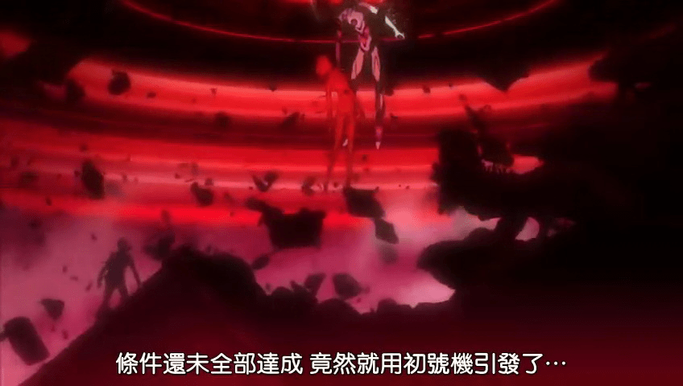
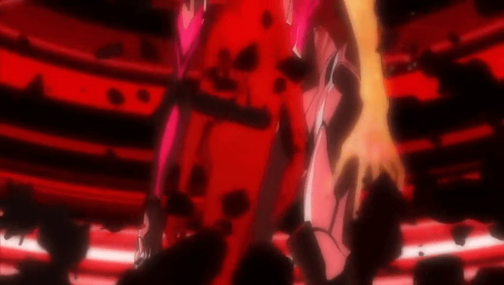
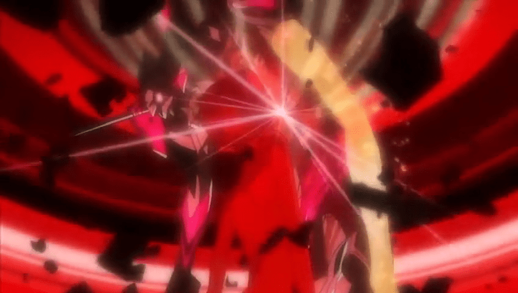

# 关键字：新剧场版：破

作者：毒蛋白

TID：8016

<title>1</title> <link href="../Styles/Style.css" type="text/css" rel="stylesheet">

# 1

嘛。。之所以发在这里是因为GTS含量不够
总之先上图。。。二楼再说明讨论主题

虽然说对于看过枪版的人来说我火星了....但是我还是想说枪版众退散啊啊啊啊啊!!!!!

[ *本帖最後由 JOYYSOSOSO 於 2010-5-27 03:47 編輯* ] <title>2</title> <link href="../Styles/Style.css" type="text/css" rel="stylesheet">

# 2

 <ignore_js_op>[暴&#39118;截屏20100527033121.jpg](forum.php?mod=attachment&aid=MjA2MzJ8OGZjMmViNDF8MTY3NDA2ODg3M3wxODIzMHw4MDE2&nothumb=yes) *(79.24 KB, 下載次數: 0)*

[下載附件](forum.php?mod=attachment&aid=MjA2MzJ8OGZjMmViNDF8MTY3NDA2ODg3M3wxODIzMHw4MDE2&nothumb=yes)

2010-5-27 03:38 上傳  

</ignore_js_op> <ignore_js_op>[暴&#39118;截屏20100527033220.jpg](forum.php?mod=attachment&aid=MjA2MzN8ZmQ0MjdmMzB8MTY3NDA2ODg3M3wxODIzMHw4MDE2&nothumb=yes) *(75.99 KB, 下載次數: 0)*

[下載附件](forum.php?mod=attachment&aid=MjA2MzN8ZmQ0MjdmMzB8MTY3NDA2ODg3M3wxODIzMHw4MDE2&nothumb=yes)

2010-5-27 03:38 上傳  

</ignore_js_op> <ignore_js_op>[暴&#39118;截屏20100527033222.jpg](forum.php?mod=attachment&aid=MjA2MzR8YTMxZDJhZTd8MTY3NDA2ODg3M3wxODIzMHw4MDE2&nothumb=yes) *(81.5 KB, 下載次數: 0)*

[下載附件](forum.php?mod=attachment&aid=MjA2MzR8YTMxZDJhZTd8MTY3NDA2ODg3M3wxODIzMHw4MDE2&nothumb=yes)

2010-5-27 03:38 上傳  

</ignore_js_op> <title>3</title> <link href="../Styles/Style.css" type="text/css" rel="stylesheet">

# 3

以上....先来抱怨...庵野痞子真的想破坏我们的童年印象.....虽然我也很萌真希波
人气不高的明日香代替大众脸成了破摸布...关于这一点不做评论....不过您的新战斗服我很感兴趣那.....
渚熏你一上来就叫父亲啊....结婚宣言啊啊啊?????
后面我实在是不确定看的是天元突破还是福音战士了。。。。。。

阿勒?我剧透了么?剧透是什么?我什么都不知道

话说回来主题啥的真的没有啊.........实际上只是来发发牢骚......嘛...我推荐认为不值得看的朋友们还是看一看的好...这回剧情变动挺大的...也许这回痞子能不虎头蛇尾......我知道这只是个奢望

[ *本帖最後由 JOYYSOSOSO 於 2010-5-27 03:52 編輯* ] <title>4</title> <link href="../Styles/Style.css" type="text/css" rel="stylesheet">

# 4

到现在还没下完的撸过……为了倒腾硬盘费了不少功夫……

嘛……这GTS含量还是少啊…… <title>5</title> <link href="../Styles/Style.css" type="text/css" rel="stylesheet">

# 5

咱在等待720P的资源啊。。。。。
开头浏览克5分钟左右，实在舍不得看呐。
喜欢的电影被非高清糟蹋了是件郁闷的事~ <title>6</title> <link href="../Styles/Style.css" type="text/css" rel="stylesheet">

# 6

话说，TV版还没看完.... <title>7</title> <link href="../Styles/Style.css" type="text/css" rel="stylesheet">

# 7

雖然去年已經去戲院看了...老實說
這段的GTS感覺不太大
再者
對於綾波派的我來說
明日香怎麼那沒所謂 <title>8</title> <link href="../Styles/Style.css" type="text/css" rel="stylesheet">

# 8

正在用電驢緩慢拖拽ing…… <title>9</title> <link href="../Styles/Style.css" type="text/css" rel="stylesheet">

# 9

哦哦哦哦~~~~~
某人驾驶初号机出现暴走中！！！
围观 <title>10</title> <link href="../Styles/Style.css" type="text/css" rel="stylesheet">

# 10

无所谓么？ 飞鸟可是被咬了啊啊啊！！！！！！！   <title>11</title> <link href="../Styles/Style.css" type="text/css" rel="stylesheet">

# 11

> 原帖由 *Yagami_ray* 於 2010-5-27 14:52 發表 
> 无所谓么？ 飞鸟可是被咬了啊啊啊！！！！！！！  

这叫有爱的咬杀 <title>12</title> <link href="../Styles/Style.css" type="text/css" rel="stylesheet">

# 12

这次是明日香巨大化？？我爱明日香 <title>13</title> <link href="../Styles/Style.css" type="text/css" rel="stylesheet">

# 13

枪版啊，破的剧情有点怨念。 <title>14</title> <link href="../Styles/Style.css" type="text/css" rel="stylesheet">

# 14

> 原帖由 *jijiang001* 於 2010-5-27 16:37 發表 
> 这次是明日香巨大化？？我爱明日香

理解有问题啊 这样的话有必要进行剧透哈哈！
变大的只可能是凌波啊-  - 明日香悲剧在《破》中她成为了3号机驾驶员被暴走初号机虐待
最后管子被咬断了 （这种情况下还不死明日香果然小强。。） <title>15</title> <link href="../Styles/Style.css" type="text/css" rel="stylesheet">

# 15

从明日香的例子可以看出，想攻克傲娇少女只要摧毁她的自尊心……
她就永远是你的了……
                                                                        ————傲娇攻略秘籍

[ *本帖最後由 lg83449447 於 2010-5-28 20:25 編輯* ] <title>16</title> <link href="../Styles/Style.css" type="text/css" rel="stylesheet">

# 16

围观中，发现EVA的杀伤力之大其实是可以被感情所洗刷的 <title>17</title> <link href="../Styles/Style.css" type="text/css" rel="stylesheet">

# 17

传说。。。只是传说，eva破有高清版了。。。好了不多说了，继续奋战去了。。。 <title>18</title> <link href="../Styles/Style.css" type="text/css" rel="stylesheet">

# 18

刚奋力看完了eva破 相当强力的片子啊，即使没有gts也值得看，太感动了，时隔15年的经典，这部绝对超tv的 <title>19</title> <link href="../Styles/Style.css" type="text/css" rel="stylesheet">

# 19

[http://220.170.79.109/html/anime/20100526/105813.html](http://220.170.79.109/html/anime/20100526/105813.html)
还有这样的EVA啊！！喂！！ <title>20</title> <link href="../Styles/Style.css" type="text/css" rel="stylesheet">

# 20

这个。。。这个。。。。这个。。。呃。。。。。小受暴动了呃。。。。。。
有空去看看BD有个同人文，相当不错的
传送门[http://tieba.baidu.com/f?kz=591475302](http://tieba.baidu.com/f?kz=591475302) <title>21</title> <link href="../Styles/Style.css" type="text/css" rel="stylesheet">

# 21

虽然剧情大幅改动，但个人认为基本上改得不错……值得一看啊

东治的妹妹好可爱~（咳，跑题了……）

明日香小强+1
那音乐那么伤感我还以为便当了……

GTS的戏份实在太少了啊喂！庵野你这家伙别就这么完了，最后一定要让巨大绫波出场久一点啊…… <title>22</title> <link href="../Styles/Style.css" type="text/css" rel="stylesheet">

# 22

又有这样的EVA了啊！！！喂！！！！
[http://220.170.79.109/html/ent/20100614/111308.html](http://220.170.79.109/html/ent/20100614/111308.html) <title>23</title> <link href="../Styles/Style.css" type="text/css" rel="stylesheet">

# 23

实在不行了，OP里Shinji一出来墨镜都碎了…… <title>24</title> <link href="../Styles/Style.css" type="text/css" rel="stylesheet">

# 24

看不懂  很迷茫