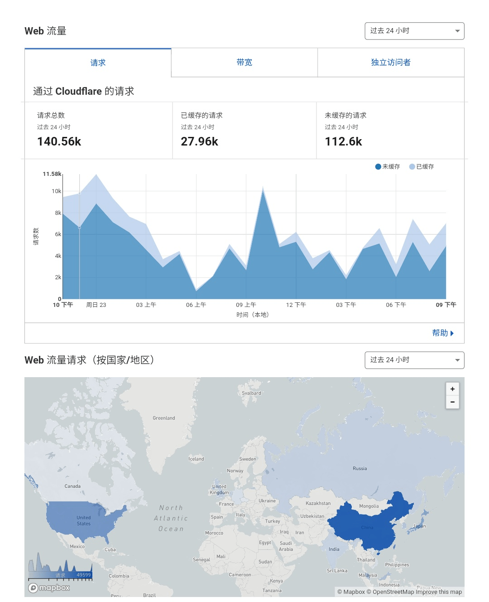

# 分享一个GTS资源收集网站

作者：Lcxzyr

TID：30944

<title>1</title> <link href="../Styles/Style.css" type="text/css" rel="stylesheet">

# 1

*本帖最後由 Lcxzyr 於 2021-7-12 21:04 編輯*

**首先地址是 [https://share.giantess.eu.org](https://share.giantess.eu.org)**

需要注意的是大陆用户必须使用https访问，eu.org在http上的链接在大陆是完全阻断的

~~现在整个giantess.eu.org被墙了，需要代理访问
过段时间我会上线新的免翻域名~~
**好像又放出来了？我整个迷糊了……
反正你们直连访问不了就加梯子试试吧……**

资源不多但会持续更新
 ~~请不要大量抓取该站内容!
这样做会导致API上限而所有人都无法使用!
为了更好的服务有需要的人，如果服务频繁被节流，我会对占用大量请求资源的用户采取强制措施。~~
**换了存储账户，如果不能访问就是暂时爬废了，耐心等等吧**

~~内部部分文件夹密码和主密码不是同一个，那都是不可公开的涉版权文件，不会公开
（密码提示是一样的，不想做单独适配，反正内部还要密码就不用尝试了）~~
**换存储以后版权相关删掉了**

<title>2</title> <link href="../Styles/Style.css" type="text/css" rel="stylesheet">

# 2

 <ignore_js_op>[Screenshot_2021-05-23-23-00-54-552_com.android.chrome.png](forum.php?mod=attachment&aid=ODg5MDZ8YWNmNTg0Mjh8MTY3NDA2OTM2MXwxODIzMHwzMDk0NA%3D%3D&nothumb=yes) *(192.28 KB, 下載次數: 31)*

[下載附件](forum.php?mod=attachment&aid=ODg5MDZ8YWNmNTg0Mjh8MTY3NDA2OTM2MXwxODIzMHwzMDk0NA%3D%3D&nothumb=yes)

2021-5-23 23:26 上傳  

</ignore_js_op> <title>3</title> <link href="../Styles/Style.css" type="text/css" rel="stylesheet">

# 3

*本帖最後由 Lcxzyr 於 2021-5-23 22:20 編輯*

另外说一句，FreelyGTS文件托管服务无限期暂停文件上传，已上传文件不受影响 <title>4</title> <link href="../Styles/Style.css" type="text/css" rel="stylesheet">

# 4

感谢楼主，好人一生平安          <title>5</title> <link href="../Styles/Style.css" type="text/css" rel="stylesheet">

# 5

资源还挺多的 要是能自己上传就好了 <title>6</title> <link href="../Styles/Style.css" type="text/css" rel="stylesheet">

# 6

> ak3223459 發表於 2021-5-22 15:03
> 资源还挺多的 要是能自己上传就好了

所有存货都在里面了，持续更新
有资源的可以直接发GN，自己的资源库本来就是单向分享 <title>7</title> <link href="../Styles/Style.css" type="text/css" rel="stylesheet">

# 7

哎呀偏偏GN的文章需要密码啊……（我最近有全部东西都要备份的习惯，GN的好多备份了但是有些文章已经删了） <title>8</title> <link href="../Styles/Style.css" type="text/css" rel="stylesheet">

# 8

感谢LZ大大的分享！不仅有GTS还有足控内容，双厨狂喜！
话说LZ这个服务器感觉挺不错的，阅览缩略图的反应效率很高。 <title>9</title> <link href="../Styles/Style.css" type="text/css" rel="stylesheet">

# 9

楼主大大   box的压缩包密码多少呀
<title>10</title> <link href="../Styles/Style.css" type="text/css" rel="stylesheet">

# 10

感谢分享，刚好百度网盘资源都被和谐了，真是及时 <title>11</title> <link href="../Styles/Style.css" type="text/css" rel="stylesheet">

# 11

楼主sizebox的的压缩包好像要解压密码 话说寺田enty那个合集好像是我自购整理限时分享在两三个qq群里的 <title>12</title> <link href="../Styles/Style.css" type="text/css" rel="stylesheet">

# 12

> leo1223 發表於 2021-5-22 18:00
> 哎呀偏偏GN的文章需要密码啊……（我最近有全部东西都要备份的习惯，GN的好多备份了但是有些文章已经删了） ...

这就是上面所谓的"版权问题"了。如果我抓取GN文章然后公开发的话，我想我一定会被搞的……吧 <title>13</title> <link href="../Styles/Style.css" type="text/css" rel="stylesheet">

# 13

> 月咏夜兮 發表於 2021-5-22 20:16
> 楼主大大   box的压缩包密码多少呀

SizeBox的资源源自某内部群组，你可以加QQ群931471900，这个包和那里面的应该是一样的，可以在群里获取密码 <title>14</title> <link href="../Styles/Style.css" type="text/css" rel="stylesheet">

# 14

> a4169884134 發表於 2021-5-22 22:03
> 楼主sizebox的的压缩包好像要解压密码 话说寺田enty那个合集好像是我自购整理限时分享在两三个qq群里的:dct ...

SBox的密码问题我就不赘述了，寺田的图集的确是QQ上一个老哥分享的，想必就是你了。
当时是说尽量不要到处发，我就当做版权内容设密码了。 <title>15</title> <link href="../Styles/Style.css" type="text/css" rel="stylesheet">

# 15

> coolyangzc 發表於 2021-5-22 19:50
> 感谢LZ大大的分享！不仅有GTS还有足控内容，双厨狂喜！
> 话说LZ这个服务器感觉挺不错的，阅览缩略图的反应效 ...

网页架设在US Los Angeles的CloudCone BGP服务器上，后端存储对接的是MicroSoft365 Sharepoint文件存储服务，速度还过得去 <title>16</title> <link href="../Styles/Style.css" type="text/css" rel="stylesheet">

# 16

> [Lcxzyr 發表於 2021-5-22 22:13](https://giantessnight.cf/gnforum2012/forum.php?mod=redirect&goto=findpost&pid=469168&ptid=30944)
> 这就是上面所谓的"版权问题"了。如果我抓取GN文章然后公开发的话，我想我一定会被搞的……吧 ...

啊……你是写爬虫保存下来的吗？就只是问问，不是要你教我 <title>17</title> <link href="../Styles/Style.css" type="text/css" rel="stylesheet">

# 17

> leo1223 發表於 2021-5-22 22:43
> 啊……你是写爬虫保存下来的吗？就只是问问，不是要你教我

是的，不过当时就不全，最近也没继续搞 <title>18</title> <link href="../Styles/Style.css" type="text/css" rel="stylesheet">

# 18

> [Lcxzyr 發表於 2021-5-22 23:10](https://giantessnight.cf/gnforum2012/forum.php?mod=redirect&goto=findpost&pid=469179&ptid=30944)
> 是的，不过当时就不全，最近也没继续搞

哎呀呀呀……算了不会写爬虫……我还是慢慢一页一页保存吧

自从PH倒了之后这些东西我挺紧张兮兮的
<title>19</title> <link href="../Styles/Style.css" type="text/css" rel="stylesheet">

# 19

哇这也太棒了，感谢lz分享！！！！ <title>20</title> <link href="../Styles/Style.css" type="text/css" rel="stylesheet">

# 20

老哥稳，这个网站看起来很好用的样子，简洁明了 <title>21</title> <link href="../Styles/Style.css" type="text/css" rel="stylesheet">

# 21

> [Lcxzyr 發表於 2021-5-22 22:18](https://giantessnight.cf/gnforum2012/forum.php?mod=redirect&goto=findpost&pid=469170&ptid=30944)
> SizeBox的资源源自某内部群组，你可以加QQ群931471900，这个包和那里面的应该是一样的，可以在群里获取密 ...

好的～        ......................         

<title>22</title> <link href="../Styles/Style.css" type="text/css" rel="stylesheet">

# 22

好耶！好多没看过的！顺便问一嘴，那个FrellyGTS是啥？感谢楼主 <title>23</title> <link href="../Styles/Style.css" type="text/css" rel="stylesheet">

# 23

请问有批量下载的的方法吗 ？一个一个点太费事了 <title>24</title> <link href="../Styles/Style.css" type="text/css" rel="stylesheet">

# 24

> gtsssssssssssss 發表於 2021-5-23 18:05
> 好耶！好多没看过的！顺便问一嘴，那个FrellyGTS是啥？感谢楼主

打错了，是freelygts

gn站内搜索就可以看到了 <title>25</title> <link href="../Styles/Style.css" type="text/css" rel="stylesheet">

# 25

*本帖最後由 Lcxzyr 於 2021-5-23 22:50 編輯*

> 核企鹅潜艇 發表於 2021-5-23 20:37
> 请问有批量下载的的方法吗 ？一个一个点太费事了

请不要大量抓取该站内容!

这样做会导致API上限而所有人都无法使用! <title>26</title> <link href="../Styles/Style.css" type="text/css" rel="stylesheet">

# 26

感谢楼主分享 ，资源真的很棒！ <title>27</title> <link href="../Styles/Style.css" type="text/css" rel="stylesheet">

# 27

> [a4169884134 發表於 2021-5-22 22:03](https://giantessnight.cf/gnforum2012/forum.php?mod=redirect&goto=findpost&pid=469167&ptid=30944)
> 楼主sizebox的的压缩包好像要解压密码 话说寺田enty那个合集好像是我自购整理限时分享在两三个qq群里的:dct ...

哇，想收集寺田过去enty的图来着，错过了（哭
<title>28</title> <link href="../Styles/Style.css" type="text/css" rel="stylesheet">

# 28

> [Lcxzyr 發表於 2021-5-23 22:24](https://giantessnight.cf/gnforum2012/forum.php?mod=redirect&goto=findpost&pid=469254&ptid=30944)
> 打错了，是freelygts
> 
> gn站内搜索就可以看到了

好哒，谢谢大佬指路我这就去看看
<title>29</title> <link href="../Styles/Style.css" type="text/css" rel="stylesheet">

# 29

感谢分享。架服务器的花销不小吧，老哥用爱发电真心不容易 <title>30</title> <link href="../Styles/Style.css" type="text/css" rel="stylesheet">

# 30

為甚麼gn的 "文章獲取" 進不去?? 點進去之後一直卡在輸入密碼的畫面 輸入了也沒用 <title>31</title> <link href="../Styles/Style.css" type="text/css" rel="stylesheet">

# 31

感谢分享，同时问一下这种网站建设是租用的服务器么？我也想把储存的资源整理一下放到云端 <title>32</title> <link href="../Styles/Style.css" type="text/css" rel="stylesheet">

# 32

> [Lcxzyr 發表於 2021-5-23 22:25](https://giantessnight.cf/gnforum2012/forum.php?mod=redirect&goto=findpost&pid=469255&ptid=30944)
> 请不要大量抓取该站内容!
> 
> 这样做会导致API上限而所有人都无法使用!

要是所有人都有素质，那就不用单独提醒百度云不能在线解压这件事了
<title>33</title> <link href="../Styles/Style.css" type="text/css" rel="stylesheet">

# 33

> 單身的貓 發表於 2021-5-25 11:26
> 為甚麼gn的 "文章獲取" 進不去?? 點進去之後一直卡在輸入密碼的畫面 輸入了也沒用 ...

也许你应该再看看帖子或者之前的回帖¯\_(ツ)_/¯ <title>34</title> <link href="../Styles/Style.css" type="text/css" rel="stylesheet">

# 34

> hyl501 發表於 2021-5-25 12:42
> 感谢分享，同时问一下这种网站建设是租用的服务器么？我也想把储存的资源整理一下放到云端 ...

是的，服务器是洛杉矶的cloudcone服务器，不过存储是微软的 <title>35</title> <link href="../Styles/Style.css" type="text/css" rel="stylesheet">

# 35

> [Lcxzyr 發表於 2021-5-25 16:53](https://giantessnight.cf/gnforum2012/forum.php?mod=redirect&goto=findpost&pid=469375&ptid=30944)
> 也许你应该再看看帖子或者之前的回帖¯\_(ツ)_/¯

啊啊 其實發完再看一遍就看到了，但沒辦法刪帖
<title>36</title> <link href="../Styles/Style.css" type="text/css" rel="stylesheet">

# 36

感謝樓主特地架網站分享
也請大家遵守規則
gts圈已經夠小了大家互相體諒 <title>37</title> <link href="../Styles/Style.css" type="text/css" rel="stylesheet">

# 37

*本帖最後由 phone2345 於 2021-5-25 19:24 編輯*

看到版主给了＋80的奖励点，似乎也代表着官方支持的态度吧！

版权的事大家都懂，建议不方便显示的东西直接看不见比较不会惹麻烦与钓人胃口。

至于爬虫或访问超量的问题，我想是避免不了的，既然你有爬GN文章的能力，别人一定也有爬你网站的能力，分散全球IP，随机设备号，智能延迟，仿人类爬虫之类的技术并不困难，如果因此网站被限流就休息一下吧，不用想太多让自己过于烦恼，现实生活更重要。 <title>38</title> <link href="../Styles/Style.css" type="text/css" rel="stylesheet">

# 38

> phone2345 發表於 2021-5-25 19:17
> 看到版主给了＋80的奖励点，似乎也代表着官方支持的态度吧！
> 
> 版权的事大家都懂，建议不方便显示的东西直接 ...

关于隐藏文件，由于目录程序不是我写的，近来我也一直没有精力去修改程序达到隐藏目录的目的，也许等我有空的时候会考虑。

至于爬虫，作为一名开发过爬虫的人，我非常理解爬虫er的心情。老实说如果文件在我服务器上，我并不反对这样的行为。

但是在我明确表示表示爬虫会导致API节流后，仍然坚持爬取的行为绝对是不道德的。因为所有用户将因为其自私行为无法享受到网站基本的服务。

你提到我爬取GN文章，我并不忌讳这一点。我仔细阅读了GN的相关规章后并没有发现关于爬虫的禁止条款。同时我设计的爬虫程序严守单线程爬取规则，在压力上相当于一个不停翻阅的一般用户，尽可能保证不影响服务器的正常工作。

作为一个计算机技术爱好者，我对爬虫攻防技术有一定的了解。我十分清楚针对爬虫的防御所存在的技术难度，特别是作为这么一个简单站点。我能做的只是通过一些基础防御手段表明自己的立场和态度。

最令我费解的是为什么没有任何一个爬虫er私聊我以索要所需的某份资源，而是不约而同地选择了爬取这种被明确反对的方式。难道是认为我建立分享站点是为了炫耀而不是真心共享？要知道，在频繁的限流下，爬虫也很难获取到完整的资源。 <title>39</title> <link href="../Styles/Style.css" type="text/css" rel="stylesheet">

# 39

感谢分享，这个质量真的不错 <title>40</title> <link href="../Styles/Style.css" type="text/css" rel="stylesheet">

# 40

Articles拼错了(小声)
(以及Games)

<title>41</title> <link href="../Styles/Style.css" type="text/css" rel="stylesheet">

# 41

> [libido 發表於 2021-5-25 22:24](https://giantessnight.cf/gnforum2012/forum.php?mod=redirect&goto=findpost&pid=469398&ptid=30944)
> Articles拼错了(小声)
> (以及Games)

感谢指正，文件夹名已修改
<title>42</title> <link href="../Styles/Style.css" type="text/css" rel="stylesheet">

# 42

感谢楼主分享，找到了几个巨大化入侵的视频，不胜感激，另外想请教一下，失传已久的giantess-6这集不知楼主是否有，可否分享一下 <title>43</title> <link href="../Styles/Style.css" type="text/css" rel="stylesheet">

# 43

很多人不守规矩啊，可惜了这么好的网站了 <title>44</title> <link href="../Styles/Style.css" type="text/css" rel="stylesheet">

# 44

*本帖最後由 leo1223 於 2021-5-27 23:15 編輯*

哈哈哈哈可惜很多人只顾着自己，根本不管其他人

如果我会爬GN文章就好了，一些好文被删了就找不回来了

PS: 话说看到限制全解害我以为是解除了文章密码……
<title>45</title> <link href="../Styles/Style.css" type="text/css" rel="stylesheet">

# 45

> beloved 發表於 2021-5-27 21:47
> 很多人不守规矩啊，可惜了这么好的网站了

理论上来说在虫灾不严重的情况下是可以正常使用的 <title>46</title> <link href="../Styles/Style.css" type="text/css" rel="stylesheet">

# 46

*本帖最後由 Lcxzyr 於 2021-5-27 23:53 編輯*

> 763604064 發表於 2021-5-27 21:09
> 感谢楼主分享，找到了几个巨大化入侵的视频，不胜感激，另外想请教一下，失传已久的giantess-6这集不知楼主 ...

没有。（当然也有可能是没转存完）
巨大化入侵也是很晚转存的，真·绝版的东西有的概率并不大。
另外网站上没有的就不用问我有没有了，全部家当都在了…… <title>47</title> <link href="../Styles/Style.css" type="text/css" rel="stylesheet">

# 47

> leo1223 發表於 2021-5-27 23:11
> 哈哈哈哈可惜很多人只顾着自己，根本不管其他人
> 
> 如果我会爬GN文章就好了，一些好文被删了就找不回来了

是的……
关于文章的话由于规章的限制是不可能公开发布的，这一点的权力不属于我，没法通融呢……
限制指的是技术上的反ddos之类解除了 <title>48</title> <link href="../Styles/Style.css" type="text/css" rel="stylesheet">

# 48

> [Lcxzyr 發表於 2021-5-27 23:48](https://giantessnight.cf/gnforum2012/forum.php?mod=redirect&goto=findpost&pid=469620&ptid=30944)
> 没有。
> 巨大化入侵也是很晚转存的，真·绝版的东西有的概率并不大。
> 另外网站上没有的就不用问我有没有了 ...

好吧，非常感谢，非常感谢大佬的劳动

<title>49</title> <link href="../Styles/Style.css" type="text/css" rel="stylesheet">

# 49

> [Lcxzyr 發表於 2021-5-27 23:51](https://giantessnight.cf/gnforum2012/forum.php?mod=redirect&goto=findpost&pid=469621&ptid=30944)
> 是的……
> 关于文章的话由于规章的限制是不可能公开发布的，这一点的权力不属于我，没法通融呢……
> 限制指 ...

啊……那么问问，爬虫你是自学的吗？虽然我是写程序的但是没接触过pyhton……
<title>50</title> <link href="../Styles/Style.css" type="text/css" rel="stylesheet">

# 50

> [leo1223 發表於 2021-5-27 23:58](https://giantessnight.cf/gnforum2012/forum.php?mod=redirect&goto=findpost&pid=469623&ptid=30944)
> 啊……那么问问，爬虫你是自学的吗？虽然我是写程序的但是没接触过pyhton……
> ...

爬虫也不是只有python能写。
我也同样没有接触过python
我是用很多程序员最看不起的易语言写的……
计算机的应用技术其实大部分都可以自学

技术上的问题可以私聊
<title>51</title> <link href="../Styles/Style.css" type="text/css" rel="stylesheet">

# 51

强啊！找到了很多之前遗失的东西，谢谢大佬！ <title>52</title> <link href="../Styles/Style.css" type="text/css" rel="stylesheet">

# 52

> [数据删除] 發表於 2021-5-28 10:14
> 强啊！找到了很多之前遗失的东西，谢谢大佬！

感谢肯定。
目前再换存储，可能有文件未同步 <title>53</title> <link href="../Styles/Style.css" type="text/css" rel="stylesheet">

# 53

> [Lcxzyr 發表於 2021-5-28 00:09](https://giantessnight.cf/gnforum2012/forum.php?mod=redirect&goto=findpost&pid=469624&ptid=30944)
> 爬虫也不是只有python能写。
> 我也同样没有接触过python
> 我是用很多程序员最看不起的易语言写的……

抱歉啊问一下，虽然你写了“网上找不到的资源应该也没有”，但是我还是想问问， Manzi_ss (acesces) 的影片你有印象吗?貌似他在油管的都删掉了……虽然有一些其他人重新上传的但是不知道缺了多少
<title>54</title> <link href="../Styles/Style.css" type="text/css" rel="stylesheet">

# 54

> leo1223 發表於 2021-5-28 19:43
> 抱歉啊问一下，虽然你写了“网上找不到的资源应该也没有”，但是我还是想问问， Manzi_ss (acesces) 的影 ...

如果盘里没有就是没有了，我全部家当都在这里了。
btw，我不怎么用油管 <title>55</title> <link href="../Styles/Style.css" type="text/css" rel="stylesheet">

# 55

楼主大大，这个能裸连么。。。。。 <title>56</title> <link href="../Styles/Style.css" type="text/css" rel="stylesheet">

# 56

> [幸虞美人 發表於 2021-5-29 00:30](https://giantessnight.cf/gnforum2012/forum.php?mod=redirect&goto=findpost&pid=469729&ptid=30944)
> 楼主大大，这个能裸连么。。。。。

关于访问的所有事项，我想我都已经说的很清楚了。
<title>57</title> <link href="../Styles/Style.css" type="text/css" rel="stylesheet">

# 57

牛呀·感谢楼主的付出·界面简单明了 <title>58</title> <link href="../Styles/Style.css" type="text/css" rel="stylesheet">

# 58

> 2878632 發表於 2021-5-29 15:41
> 牛呀·感谢楼主的付出·界面简单明了

其实界面应该感谢OneManger的开发者
可以去他的github点个star
https://github.com/qkqpttgf/OneManager-php <title>59</title> <link href="../Styles/Style.css" type="text/css" rel="stylesheet">

# 59

> [a4169884134 發表於 2021-5-22 22:03](https://giantessnight.cf/gnforum2012/forum.php?mod=redirect&goto=findpost&pid=469167&ptid=30944)
> 楼主sizebox的的压缩包好像要解压密码 话说寺田enty那个合集好像是我自购整理限时分享在两三个qq群里的:dct ...

什么群啊，能拉我进群嘛～～～～
<title>60</title> <link href="../Styles/Style.css" type="text/css" rel="stylesheet">

# 60

爬虫是批量大量下载的意思吗，一个一个慢慢下载算是爬虫吗 <title>61</title> <link href="../Styles/Style.css" type="text/css" rel="stylesheet">

# 61

網站的密碼提示是gts的全部拼寫，剛剛我一直打GIANTESS結果還是進不去，難道不是嗎? <title>62</title> <link href="../Styles/Style.css" type="text/css" rel="stylesheet">

# 62

> [幸虞美人 發表於 2021-5-29 00:30](https://giantessnight.cf/gnforum2012/forum.php?mod=redirect&goto=findpost&pid=469729&ptid=30944)
> 楼主大大，这个能裸连么。。。。。

看了一下，最近被墙了，可能和流量过大有关，过段时间会上新域名
<title>63</title> <link href="../Styles/Style.css" type="text/css" rel="stylesheet">

# 63

> [gfktxds 發表於 2021-5-30 15:11](https://giantessnight.cf/gnforum2012/forum.php?mod=redirect&goto=findpost&pid=469877&ptid=30944)
> 爬虫是批量大量下载的意思吗，一个一个慢慢下载算是爬虫吗

现在已经不限制了。
爬虫的判断由微软做出，但一个个手工下一般来说不属于
如果微软认为流量太大会节流
<title>64</title> <link href="../Styles/Style.css" type="text/css" rel="stylesheet">

# 64

> [s0936596123 發表於 2021-5-30 17:56](https://giantessnight.cf/gnforum2012/forum.php?mod=redirect&goto=findpost&pid=469897&ptid=30944)
> 網站的密碼提示是gts的全部拼寫，剛剛我一直打GIANTESS結果還是進不去，難道不是嗎? ...

是小写……
作为一个单词一般不大写的……吧
<title>65</title> <link href="../Styles/Style.css" type="text/css" rel="stylesheet">

# 65

> [Lcxzyr 發表於 2021-5-30 19:51](https://giantessnight.cf/gnforum2012/forum.php?mod=redirect&goto=findpost&pid=469906&ptid=30944)
> 是小写……
> 作为一个单词一般不大写的……吧

還真的是因為大小寫的問題，哈哈
<title>66</title> <link href="../Styles/Style.css" type="text/css" rel="stylesheet">

# 66

太全了，LZ牛逼，特别是巨大化入侵系列 <title>67</title> <link href="../Styles/Style.css" type="text/css" rel="stylesheet">

# 67

> [Lcxzyr 發表於 2021-5-30 19:51](https://giantessnight.cf/gnforum2012/forum.php?mod=redirect&goto=findpost&pid=469906&ptid=30944)
> 是小写……
> 作为一个单词一般不大写的……吧

我这边填小写了还是提示不对诶...
<title>68</title> <link href="../Styles/Style.css" type="text/css" rel="stylesheet">

# 68

> 〃恋·妹¨ 發表於 2021-5-31 14:59
> 我这边填小写了还是提示不对诶...

请检查拼写
别人输入都正确而你出错大概率是你自己的问题 <title>69</title> <link href="../Styles/Style.css" type="text/css" rel="stylesheet">

# 69

> [Lcxzyr 發表於 2021-5-31 15:04](https://giantessnight.cf/gnforum2012/forum.php?mod=redirect&goto=findpost&pid=469981&ptid=30944)
> 请检查拼写
> 别人输入都正确而你出错大概率是你自己的问题

挠头，开头进去的密码是和nongts密码是一样的吗，我开头填对了，nongts我就进不去
<title>70</title> <link href="../Styles/Style.css" type="text/css" rel="stylesheet">

# 70

> 〃恋·妹¨ 發表於 2021-5-31 15:09
> 挠头，开头进去的密码是和nongts密码是一样的吗，我开头填对了，nongts我就进不去
> ...

哦你说那个文件夹啊
之前为了解决总有人爬的问题加了个密码关闭了
换存储以后忘记关密码了
现在可以了 <title>71</title> <link href="../Styles/Style.css" type="text/css" rel="stylesheet">

# 71

> [Lcxzyr 發表於 2021-5-31 15:34](https://giantessnight.cf/gnforum2012/forum.php?mod=redirect&goto=findpost&pid=469984&ptid=30944)
> 哦你说那个文件夹啊
> 之前为了解决总有人爬的问题加了个密码关闭了
> 换存储以后忘记关密码了

可以进去了，非常感谢lz的分享！

<title>72</title> <link href="../Styles/Style.css" type="text/css" rel="stylesheet">

# 72

热度会慢慢下去的，不过确实这段时间gn的人流量大起来了，我再去aicai上看看有没啥好东西
<title>73</title> <link href="../Styles/Style.css" type="text/css" rel="stylesheet">

# 73

> dhl7457 發表於 2021-5-31 16:19
> 热度会慢慢下去的，不过确实这段时间gn的人流量大起来了，我再去aicai上看看有没啥好东西
> ...

微软API最怕短期大流量
热度低些我也乐的如此
如果有啥好的资源欢迎推荐毕竟我基本上所有资源也都是别人分享的
<title>74</title> <link href="../Styles/Style.css" type="text/css" rel="stylesheet">

# 74

弱弱的问一句，复制下载链接之后去哪里下载啊 <title>75</title> <link href="../Styles/Style.css" type="text/css" rel="stylesheet">

# 75

> wunder 發表於 2021-5-31 21:36
> 弱弱的问一句，复制下载链接之后去哪里下载啊

都是直链了啊……直接下载不就行了…… <title>76</title> <link href="../Styles/Style.css" type="text/css" rel="stylesheet">

# 76

弱弱的问一句怎么才能下载 文件夹 呢？ <title>77</title> <link href="../Styles/Style.css" type="text/css" rel="stylesheet">

# 77

> 禁止灌水 發表於 2021-6-1 18:17
> 弱弱的问一句怎么才能下载 文件夹 呢？

https://freemdict.com/2019/01/08/how-to-bulk-download/
这是一个使用类似程序的网站的教程
不过请注意，由于API节流的原因，大量下载很容易把整个站点暂时爬死，过一会才会恢复 <title>78</title> <link href="../Styles/Style.css" type="text/css" rel="stylesheet">

# 78

> [Lcxzyr 發表於 2021-6-1 18:26](https://giantessnight.cf/gnforum2012/forum.php?mod=redirect&goto=findpost&pid=470114&ptid=30944)
> https://freemdict.com/2019/01/08/how-to-bulk-download/
> 这是一个使用类似程序的网站的教程
> 不过请注意 ...

谢谢分享，辛苦了                                       
<title>79</title> <link href="../Styles/Style.css" type="text/css" rel="stylesheet">

# 79

> [awds713 發表於 2021-5-24 07:10](https://giantessnight.cf/gnforum2012/forum.php?mod=redirect&goto=findpost&pid=469279&ptid=30944)
> 哇，想收集寺田过去enty的图来着，错过了（哭

emmmm 3285541631 你加我qq 我找时间发你 当时我也是叫人私聊我拿的
<title>80</title> <link href="../Styles/Style.css" type="text/css" rel="stylesheet">

# 80

> [幸虞美人 發表於 2021-5-30 01:08](https://giantessnight.cf/gnforum2012/forum.php?mod=redirect&goto=findpost&pid=469837&ptid=30944)
> 什么群啊，能拉我进群嘛～～～～

emmmm 3285541631 你加我qq 我找时间发你 当时我也是叫人私聊我拿的 寺田这个资源买的挺贵的 我怕流出到隔壁去
<title>81</title> <link href="../Styles/Style.css" type="text/css" rel="stylesheet">

# 81

牛批，这个网站，就是有些东西都带密码…… <title>82</title> <link href="../Styles/Style.css" type="text/css" rel="stylesheet">

# 82

> 779776876 發表於 2021-6-8 08:13
> 牛批，这个网站，就是有些东西都带密码……

？
哪里
我记得换存储以后版权相关都删掉了啊 <title>83</title> <link href="../Styles/Style.css" type="text/css" rel="stylesheet">

# 83

更新：加入论坛分享的mel旧作54张
感谢坛友 [@o_0MorToy](https://giantessnight.cf/gnforum2012/home.php?mod=space&uid=1916)
<title>84</title> <link href="../Styles/Style.css" type="text/css" rel="stylesheet">

# 84

能问一下sizeboxmod的密码吗 解压全要密码加群人家几个群全都不放 <title>85</title> <link href="../Styles/Style.css" type="text/css" rel="stylesheet">

# 85

感謝分享!!!!裡面資源很多可以慢慢觀看，也有遊戲MOD等等，十分感謝樓主的分享，