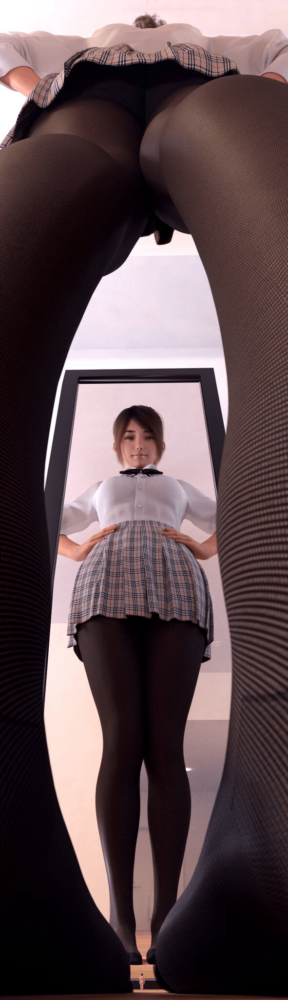

# 分享一張視角很厲害的圖

作者：大撸若愚

TID：32289

<title>1</title> <link href="../Styles/Style.css" type="text/css" rel="stylesheet">

# 1

*本帖最後由 Courant 於 2021-12-25 16:31 編輯*

我是在手機上看到的，第一眼以為只是普通的裙底圖，往下滑的過程中才發覺女主體型很大，滑到底部後又看到了鏡子和下面的小人的體格差，也算是體驗了一把小人的視角？把特殊視角的長圖和巨大娘結合起來，真厲害啊作者（p站id：夏瀬頼重）原图网盘
链接：[https://pan.baidu.com/s/1xZr5UGJtHNU8_kCBMEKCcQ](https://pan.baidu.com/s/1xZr5UGJtHNU8_kCBMEKCcQ)
提取码：0000
（資源已更新，下載後在文件名zi後面加上p就能解壓）

<title>2</title> <link href="../Styles/Style.css" type="text/css" rel="stylesheet">

# 2

 <ignore_js_op>[4cffbcbce83a04c1.jpg](forum.php?mod=attachment&aid=OTI5ODJ8N2Y2NDZhMGR8MTY3NDA2NTcxMXwxODIzMHwzMjI4OQ%3D%3D&nothumb=yes) *(141.59 KB, 下載次數: 4)*

[下載附件](forum.php?mod=attachment&aid=OTI5ODJ8N2Y2NDZhMGR8MTY3NDA2NTcxMXwxODIzMHwzMjI4OQ%3D%3D&nothumb=yes)

2021-12-23 21:37 上傳  

</ignore_js_op> <title>3</title> <link href="../Styles/Style.css" type="text/css" rel="stylesheet">

# 3

真的很不错，谢谢分享，原图发盘吧 <title>4</title> <link href="../Styles/Style.css" type="text/css" rel="stylesheet">

# 4

这个视角太棒了吧   emmm                                                                                1 <title>5</title> <link href="../Styles/Style.css" type="text/css" rel="stylesheet">

# 5

这就是摄影手法的一种 虽然不太用得到 <title>6</title> <link href="../Styles/Style.css" type="text/css" rel="stylesheet">

# 6

设计很巧妙！喜欢！希望多来点。   <title>7</title> <link href="../Styles/Style.css" type="text/css" rel="stylesheet">

# 7

巧妙地利用摄影角度制造出来一种视觉错觉，挺好的 <title>8</title> <link href="../Styles/Style.css" type="text/css" rel="stylesheet">

# 8

真的很棒，感谢分享，去关注作者了O(∩_∩)O <title>9</title> <link href="../Styles/Style.css" type="text/css" rel="stylesheet">

# 9

链接挂掉了...
建议把原图片加密压缩后，更改文件后缀名(例如123.rar→123.rarar)，能大幅度降低被和谐几率 <title>10</title> <link href="../Styles/Style.css" type="text/css" rel="stylesheet">

# 10

补个链接：
[https://pan.baidu.com/s/1KhHFvEHfY_UrR0sgdFNn1w](https://pan.baidu.com/s/1KhHFvEHfY_UrR0sgdFNn1w)
提取码：sn1f
解压密码：94900693 <title>11</title> <link href="../Styles/Style.css" type="text/css" rel="stylesheet">

# 11

美，但还是稍显不足：氛围已经营造的很好了，但小人对着这样巨大的GTS却仅仅是呆呆地站着，没有和GTS产生任何互动，如果可以联系作者，请建议他改改。 <title>12</title> <link href="../Styles/Style.css" type="text/css" rel="stylesheet">

# 12

很难得一见的赞图呀3 <title>13</title> <link href="../Styles/Style.css" type="text/css" rel="stylesheet">

# 13

这视角无敌了啊，太棒了！！！！！！！