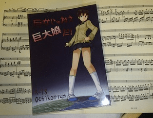

# 分享最近發生的趣事(：3)

作者：xiongzhiyao

TID：13460

<title>1</title> <link href="../Styles/Style.css" type="text/css" rel="stylesheet">

# 1

*本文章最後由 pliod 於 2012-10-13 23:58 編輯*

以下為我這幾天經歷的事情, 回想起來很心驚膽跳的
而且最主要都是**最近**怎麼GTS這種癖好都有點差點被掀底牌了...可能最近都走神了
 **1\. 驚! GN論壇被發現**的樣子

這星期三的樣子我獨自坐著地鐵, 沒有伴坐著長途的地鐵的人不是冥想就是低頭玩手機
我也不免俗的拿出手機來逛下GN. 逛了不久突然感到背有種毛骨悚然的殺氣, 轉頭一看~

"可惡! 本來要嚇你的!" 我同學很幼稚老愛無聲的黏到別人背後在突然大叫來嚇人家(我有時也會這樣啦~

"==你在我背後有多久了?"

"一陣子啦! 我只是在看你在上啥網而已, 那是啥阿, 什麼"**G什麼ss Night**"的, 怎麼**唸**阿?"
"喔...喔...那...就是那個阿..那個**Goodness night**啦呵呵... 反正就是看一些...欸...**文學歷史**的論壇啦..."

"是喔, 要介紹給我阿! 我很愛讀這些東西呢呵呵^^"

"呵呵...(會介紹給你才有鬼)"

**2\. 大驚! GTS本子被女生發現**

我之前有跟但大等人聚會並且我們有抽獎, 而我幸運的抽到了C81寺田畫的本子
後來我要去外地讀書工作了, 但是也想把本子帶著
但是要怎麼瞞過我那嚴格的母親帶在身邊呢? 於是我也是使出了大絕招－－－把本子夾在更大的本子裡
是個簡單有效百用不殆且99.9%不會被發現的方法
<ignore_js_op>

**DSC_0029.jpg** *(38.28 KB, 下載次數: 2)*

[下載附件](forum.php?mod=attachment&aid=MzEzODF8YmU4OGE2MmV8MTY3NDA2ODIzMnwxODIzMHwxMzQ2MA%3D%3D&nothumb=yes)

2012-10-14 06:58 上傳

我則夾在我的大樂譜裡
但是過久了 我也忘記有這本的存在, 而就在**今天**...
我去代個個別課, 幫一位可愛的小女孩上課
帶著我的譜們去上課, 我就把一堆本子丟在學生面前讓她看一下, 而我則準備下教室

"嘿! 這本是什麼阿? 好奇怪的封面喔!" 女孩好奇的問

"有嗎? 我看看?" 我心不在焉的回答, 並走了過去
這時剛好瞥見是這本!!! 心臟大跳了一下
然後眼見她將要把書翻了開來...

"阿喂喂噫! 不能打開!!" 我瞬間移動的飛到她身旁並裝做若無其事的把書拿了過來

"那個封面是日本漫畫嗎? 為什麼不能看阿? " 她一臉天真的問

"喔~喔..因為阿..因為那是我的秘密啦, 喔裡面是日記啦! 日記不能隨便給別人看喔!"

"日記阿..那你還特別用日本漫畫來當封面喔? 為什麼阿?" 12歲的小女孩就是打破沙鍋問到底就是了

"我...我就喜歡這樣子阿! 喔對了, 妳功課有妹有練阿? 進度在哪裡啊?" 話題轉

結果這課雖然她很不用功, 但因為那樣我也是都微笑的帶過了...因為被抓到把柄啦
不知道之後她會不會告訴別人我有動漫的日記, 被大家誤認成大宅宅

以上是我的週記 分享給各位gts迷的看官們(:3

<title>2</title> <link href="../Styles/Style.css" type="text/css" rel="stylesheet">

# 2

所以要私隱要好好保障,不然便會被公開處刑wwwwww
<title>3</title> <link href="../Styles/Style.css" type="text/css" rel="stylesheet">

# 3

在公眾地方逛GN我可真不敢試啊。
都是在家裡沒有人時再看。 <title>4</title> <link href="../Styles/Style.css" type="text/css" rel="stylesheet">

# 4

有随手锁门的习惯,电脑也有密码..所以并不担心. <title>5</title> <link href="../Styles/Style.css" type="text/css" rel="stylesheet">

# 5

幸好我隨時保持警覺
本子和資源也藏得很好
所以至今都沒被發現
P大下次要小心點啊
<title>6</title> <link href="../Styles/Style.css" type="text/css" rel="stylesheet">

# 6

這是在玩野外暴露PLAY嗎？
專門追求這種被抓包的刺激感哦www <title>7</title> <link href="../Styles/Style.css" type="text/css" rel="stylesheet">

# 7

呵呵  我锁的很好  没人能找到 <title>8</title> <link href="../Styles/Style.css" type="text/css" rel="stylesheet">

# 8

没有本子才是最高境界嗯
。。。。。。。。
（完全就是在安慰自己 <title>9</title> <link href="../Styles/Style.css" type="text/css" rel="stylesheet">

# 9

自從有了本子之後...我也不知道要藏哪...
好怕朋友來時會亂翻，因為我只放在抽屜裡... <title>10</title> <link href="../Styles/Style.css" type="text/css" rel="stylesheet">

# 10

為了免去看GTS時還要像壞事般偷偷摸摸左顧右盼，我直接向坐隔座的室友坦白
===========
我：      ...........(看GTS圖)

室友：   咦？這是什麼？好巨大的女生？(好奇觀望)

我：      專有名詞叫giantess啦，簡單來說就是一種尺寸上的差距，其實一般人都會$%$@#%$........(滔滔不絕專業貌)

室友：   嗯...你喜歡這類的喔？好奇怪(皺眉不解)

我：      (茶)你不也是喜歡觸手？

室友：   對吼....(恍然大悟又不明究理貌)原來是這樣...(不感興趣，轉回去做自己的事)

=========
呼攏成功！隨心所欲看GTS證，GET！

話說觸手控好像比較常見？
<title>11</title> <link href="../Styles/Style.css" type="text/css" rel="stylesheet">

# 11

> 自從有了本子之後...我也不知道要藏哪...
> 好怕朋友來時會亂翻，因為我只放在抽屜裡...

以前忘記是哪個高人告訴過我,
要藏的東西放的越明顯, 別人越不會在意; 反之, 則別人會去翻或啥的
實以虛之虛以實之乃高等的境界...沒想到要用於藏本子上
我這現代人真是墮落阿~
 <title>12</title> <link href="../Styles/Style.css" type="text/css" rel="stylesheet">

# 12

我每天都期待的这种事情发生 被人发现什么会让我有很大的快感 呵呵 呵呵呵 <title>13</title> <link href="../Styles/Style.css" type="text/css" rel="stylesheet">

# 13

给12岁的小LOLI上课 好羡慕
至于上GN我也被同学看到过 还好因为他看很多猎奇的东西 非常的重口 结果他还反而来介绍给我很多网站（当然我都没去看..重口猎奇不太习惯） <title>14</title> <link href="../Styles/Style.css" type="text/css" rel="stylesheet">

# 14

好刺激 <title>15</title> <link href="../Styles/Style.css" type="text/css" rel="stylesheet">

# 15

.
我了個去！當初抽獎你拿到的禮物居然給你帶來這樣的良緣…不，我是說危機。
而且對方才12歲啊！這是犯罪啊！！
警察！！！

--
話說你應該慶幸是這一本，萬一是C82那本以排泄當主題的，你被翻到會更慘^^ <title>16</title> <link href="../Styles/Style.css" type="text/css" rel="stylesheet">

# 16

> pliod 發表於 2012-10-14 17:26 
> 以前忘記是哪個高人告訴過我,
> 要藏的東西放的越明顯, 別人越不會在意; 反之, 則別人會去翻或啥的
> 實以虛 ...

其實是爰倫坡的《失竊的信》..................(望遠)
gts愛好這個秘密可不能被其他人發現啊......(陰險的笑)
於是暗中掏出死亡筆記記錄下小女孩的名字:

"xxx於2012年10月14日發現寺田本子後，回家途中心臟麻痺......."

<title>17</title> <link href="../Styles/Style.css" type="text/css" rel="stylesheet">

# 17

我觉得这个小萝莉你可以攻略一下，来个GTS养成计划。

以后我们GN同好就都有福了，现成的模特和演员。 <title>18</title> <link href="../Styles/Style.css" type="text/css" rel="stylesheet">

# 18

这个钢琴谱真心难啊...是什么？看得人就手抽了 <title>19</title> <link href="../Styles/Style.css" type="text/css" rel="stylesheet">

# 19

> 無邊落木 發表於 2012-10-14 13:44
> 為了免去看GTS時還要像壞事般偷偷摸摸左顧右盼，我直接向坐隔座的室友坦白
> ===========
> 我：      ........ ...

触手控是什么……头次听到的名词 <title>20</title> <link href="../Styles/Style.css" type="text/css" rel="stylesheet">

# 20

> 無邊落木 發表於 2012-10-14 13:44 
> 為了免去看GTS時還要像壞事般偷偷摸摸左顧右盼，我直接向坐隔座的室友坦白
> ===========
> 我：      ........ ...

大大也太大膽了...
對我來說這種性幻想是滿私密的事情
我從來沒說過說...
我能理解板大藏本子的心情...
我以前藏小本的和戀腳的A片就是這樣幹的
還好沒被發現過{:6_300:}{:6_300:}{:6_300:}
<title>21</title> <link href="../Styles/Style.css" type="text/css" rel="stylesheet">

# 21

这不是喜闻乐见的百口莫辩情节么！哈哈哈哈哈（拖走 <title>22</title> <link href="../Styles/Style.css" type="text/css" rel="stylesheet">

# 22

还好我只在家里看 <title>23</title> <link href="../Styles/Style.css" type="text/css" rel="stylesheet">

# 23

逛GN論壇和看GTS本的時候還是在家會穩妥一些
這樣會比較不容易被抓包 <title>24</title> <link href="../Styles/Style.css" type="text/css" rel="stylesheet">

# 24

在家里看 电脑有密码 <title>25</title> <link href="../Styles/Style.css" type="text/css" rel="stylesheet">

# 25

楼上你们那里是啥啊  这都能坦白了还没事  这种事在我们那里肯定闭口不说 藏得好好的 <title>26</title> <link href="../Styles/Style.css" type="text/css" rel="stylesheet">

# 26

要小心点啊~不过也可能有因祸得福的情况出现。 <title>27</title> <link href="../Styles/Style.css" type="text/css" rel="stylesheet">

# 27

只敢深夜躲在床上用手机偷偷看…… <title>28</title> <link href="../Styles/Style.css" type="text/css" rel="stylesheet">

# 28

==================================
某天和芭比娃娃（个头不小-.-）
我：..........................（很兴奋的看3D GTS片中...）
某芭比娃娃：媳妇~你还好这口？
我：fuck！offs！！！别碰我！
某芭比娃娃：哎呀~人家就碰了一小下~
我：...一边呆着！
某芭比娃娃：..................（一只贼手...伸进我的内衣...）
我：gun滚！
某芭比娃娃：..................（继续摸索...）
我：摸够了没有？你的大咋不摸自己的？
某芭比娃娃：我的是C你的是E咱俩...（继续摸索-.-）
我：...............（狠狠的把她的爪子拿出来~往一边一扔继续看...）
某芭比娃娃：.....................（很委屈的看着我...3秒后...）T.T....
我：......................（让她如愿以偿的再次把手...这次是双手放进我的内衣里搅拌...）
某芭比娃娃：.....................（一边抽泣...一边摸索...） <title>29</title> <link href="../Styles/Style.css" type="text/css" rel="stylesheet">

# 29

顶一个。。。喵呜。。。 <title>30</title> <link href="../Styles/Style.css" type="text/css" rel="stylesheet">

# 30

(ˊ・ω・ˋ) 樓主要開啟光源氏計畫了? <title>31</title> <link href="../Styles/Style.css" type="text/css" rel="stylesheet">

# 31

額，我的資源都是能在百度盤裡保存決不下下來的。各種網盤都寸芒了，電腦里沒有痕跡，看了就刪 <title>32</title> <link href="../Styles/Style.css" type="text/css" rel="stylesheet">

# 32

額，我的資源都是能在百度盤裡保存決不下下來的。各種網盤都寸芒了，電腦里沒有痕跡，看了就刪 <title>33</title> <link href="../Styles/Style.css" type="text/css" rel="stylesheet">

# 33

嘛，我的话是裸奔流，就是类似于做出一种：我的隐私就在这里，我相信你不会看这个隐私，所以如果你看了，这纯粹代表了我信任你这件事是我错了。这种坚决的态度。。。 <title>34</title> <link href="../Styles/Style.css" type="text/css" rel="stylesheet">

# 34

哈哈 好驚險喔~~ 如果試著漸漸讓女生發現 , 感覺滿好玩的XD
心態和信念把持住啊~~  :)) <title>35</title> <link href="../Styles/Style.css" type="text/css" rel="stylesheet">

# 35

我有信心不让麻麻和其他人发现我的本子，因为我有超多超多的书堆，只是电脑和手机中的资源有较大的风险被人看到，但是删掉手机中的图片又不忍心。所以每次把手机借别人的时候都十分的紧张，会不时的看一下ta是不是发现了什么，唉，希望永远不要有被人发现的那一天。 <title>36</title> <link href="../Styles/Style.css" type="text/css" rel="stylesheet">

# 36

手提式電腦再加上鎖密碼沒有壓力

但還是很怕被人發現的 <title>37</title> <link href="../Styles/Style.css" type="text/css" rel="stylesheet">

# 37

为了不被发现 压根没买过本子...
电脑有锁
手机有锁
但是有点提心吊胆的感觉诶... <title>38</title> <link href="../Styles/Style.css" type="text/css" rel="stylesheet">

# 38

资源都在u盘里，藏好就行了哈 <title>39</title> <link href="../Styles/Style.css" type="text/css" rel="stylesheet">

# 39

好好藏着呗，别人借电脑从来不给 <title>40</title> <link href="../Styles/Style.css" type="text/css" rel="stylesheet">

# 40

这胆，。。。。。。。。。 <title>41</title> <link href="../Styles/Style.css" type="text/css" rel="stylesheet">

# 41

相比较而言GTS已经是你们随便怎么看到都无所谓啦！自己对袜子和丝袜的这样的爱好才是比较担心被重要的人发现的话说........... <title>42</title> <link href="../Styles/Style.css" type="text/css" rel="stylesheet">

# 42

呵呵，一直没被发现，继续隐藏 <title>43</title> <link href="../Styles/Style.css" type="text/css" rel="stylesheet">

# 43

上GN一定要 自己在家小心的看 <title>44</title> <link href="../Styles/Style.css" type="text/css" rel="stylesheet">

# 44

公开出行233，多注意一下，就不会啦~~</ignore_js_op>