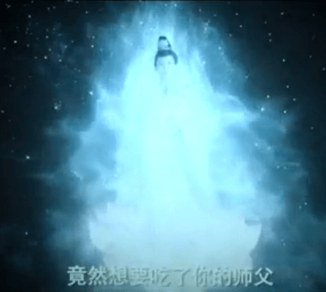
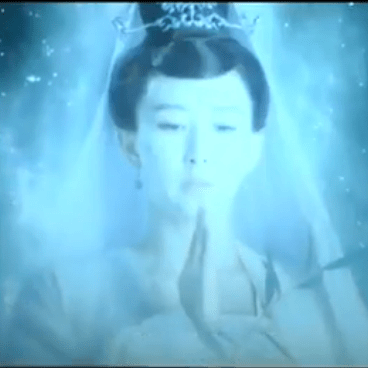
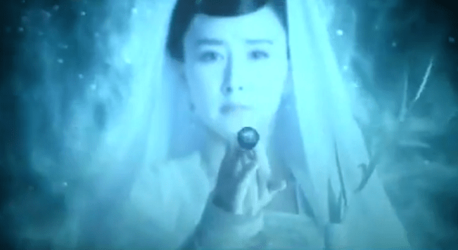
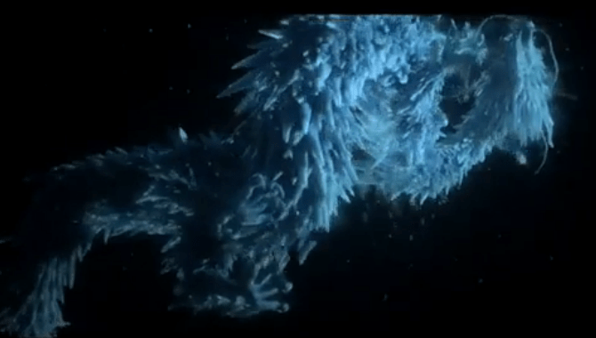
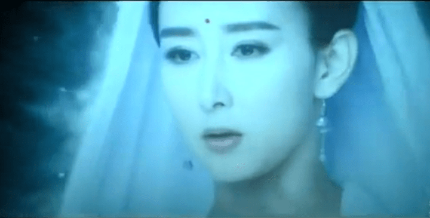
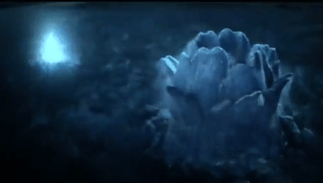
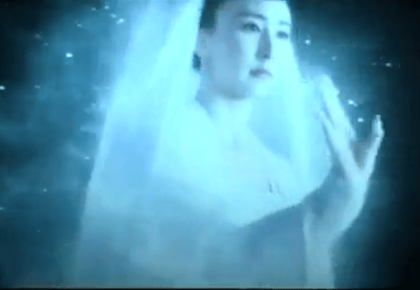
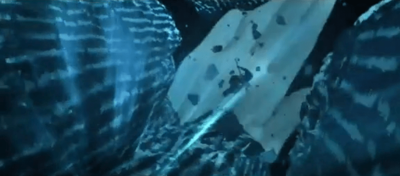
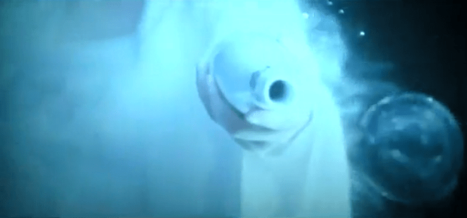

# 刚刚从电影院回来，《大话西游3》我看完了！

作者：wuliaojianke

TID：21824

<title>1</title> <link href="../Styles/Style.css" type="text/css" rel="stylesheet">

# 1

*本帖最後由 斯佳摩妮 於 2016-9-16 19:14 編輯*

总的来说，情节并不多，细算也就是一刹那吧。
观音姐姐好美啊，女神范十足，收服孙悟空。
<ignore_js_op>

**QQ截图20160916152601.png** *(134.34 KB, 下載次數: 0)*

[下載附件](forum.php?mod=attachment&aid=NjQxOTd8NDU0ODhiMWN8MTY3NDA2ODkwM3wxODIzMHwyMTgyNA%3D%3D&nothumb=yes)

2016-9-16 19:04 上傳

<ignore_js_op>

**QQ截图20160916152619.png** *(115.75 KB, 下載次數: 0)*

[下載附件](forum.php?mod=attachment&aid=NjQxOTh8ZDA5NDE2YjJ8MTY3NDA2ODkwM3wxODIzMHwyMTgyNA%3D%3D&nothumb=yes)

2016-9-16 19:05 上傳

用杨柳枝甩出一滴水珠（不是柳叶），竟然变作滔天巨浪。
<ignore_js_op>

**QQ截图20160916152647.png** *(189.22 KB, 下載次數: 0)*

[下載附件](forum.php?mod=attachment&aid=NjQxOTl8ZDlkN2ZmY2J8MTY3NDA2ODkwM3wxODIzMHwyMTgyNA%3D%3D&nothumb=yes)

2016-9-16 19:06 上傳

然后化为一条巨型冰龙，被猴子从内部敲得粉碎。
<ignore_js_op>

**QQ截图20160916152718.png** *(204.87 KB, 下載次數: 0)*

[下載附件](forum.php?mod=attachment&aid=NjQyMDB8M2I1YjA1MWR8MTY3NDA2ODkwM3wxODIzMHwyMTgyNA%3D%3D&nothumb=yes)

2016-9-16 19:07 上傳

继续念咒，散落在大地上的冰水又汇成一只巨型莲花，逐渐合拢了小小的猴子。
<ignore_js_op>

**QQ截图20160916152742.png** *(194.32 KB, 下載次數: 0)*

[下載附件](forum.php?mod=attachment&aid=NjQyMDF8MmM0Y2UyNWF8MTY3NDA2ODkwM3wxODIzMHwyMTgyNA%3D%3D&nothumb=yes)

2016-9-16 19:07 上傳

<ignore_js_op>

**QQ截图20160916152756.png** *(168.62 KB, 下載次數: 0)*

[下載附件](forum.php?mod=attachment&aid=NjQyMDJ8MGM3YzdmNGV8MTY3NDA2ODkwM3wxODIzMHwyMTgyNA%3D%3D&nothumb=yes)

2016-9-16 19:08 上傳

猴子向上逃窜，想飞出莲口，却被观音手掌一翻拍回花底。
<ignore_js_op>

**QQ截图20160916152809.png** *(152.69 KB, 下載次數: 0)*

[下載附件](forum.php?mod=attachment&aid=NjQyMDN8MjI3NTYxNmJ8MTY3NDA2ODkwM3wxODIzMHwyMTgyNA%3D%3D&nothumb=yes)

2016-9-16 19:09 上傳

<ignore_js_op>

**QQ截图20160916152827.png** *(310.33 KB, 下載次數: 0)*

[下載附件](forum.php?mod=attachment&aid=NjQyMDR8YjllMzhkMzJ8MTY3NDA2ODkwM3wxODIzMHwyMTgyNA%3D%3D&nothumb=yes)

2016-9-16 19:11 上傳

最后巨莲收成球状，带着猴子缩小成水珠回到净瓶里了。
<ignore_js_op>

**QQ截图20160916152902.png** *(188.73 KB, 下載次數: 0)*

[下載附件](forum.php?mod=attachment&aid=NjQyMDV8NGQ5NmU1ODR8MTY3NDA2ODkwM3wxODIzMHwyMTgyNA%3D%3D&nothumb=yes)

2016-9-16 19:13 上傳

至始至终，菩萨也没有变得太大，拍猴子那只巨掌貌似和《大话西游1》里捏它的原理差不多。

<title>2</title> <link href="../Styles/Style.css" type="text/css" rel="stylesheet">

# 2

有 钻肚入腹吗，猴心不算 <title>3</title> <link href="../Styles/Style.css" type="text/css" rel="stylesheet">

# 3

> [pockycat 發表於 2016-9-14 23:35](https://giantessnight.cf/gnforum2012/forum.php?mod=redirect&goto=findpost&pid=308505&ptid=21824)
> 有 钻肚入腹吗，猴心不算

除了那条冰龙和猴心，没有入腹
铁扇公主的肚子没人钻
<title>4</title> <link href="../Styles/Style.css" type="text/css" rel="stylesheet">

# 4

這電影是剛上映麻~?
只想看看觀音收服悟空的那一段XD <title>5</title> <link href="../Styles/Style.css" type="text/css" rel="stylesheet">

# 5

> [gn02340348 發表於 2016-9-15 08:34](https://giantessnight.cf/gnforum2012/forum.php?mod=redirect&goto=findpost&pid=308528&ptid=21824)
> 這電影是剛上映麻~?
> 只想看看觀音收服悟空的那一段XD

是啊，昨天刚上映的，内容神马的就那么回事吧，就像你说的，值得关注的只有观音那一段呼呼 <title>6</title> <link href="../Styles/Style.css" type="text/css" rel="stylesheet">

# 6

也去看了 实话 这次导演虽然和1是一个人 却没有安排这样的镜头  不知道为什么 <title>7</title> <link href="../Styles/Style.css" type="text/css" rel="stylesheet">

# 7

> [wuliaojianke 發表於 2016-9-15 08:58](https://giantessnight.cf/gnforum2012/forum.php?mod=redirect&goto=findpost&pid=308532&ptid=21824)
> 也去看了 实话 这次导演虽然和1是一个人 却没有安排这样的镜头  不知道为什么 ...

没有安排什么样的镜头？ <title>8</title> <link href="../Styles/Style.css" type="text/css" rel="stylesheet">

# 8

LZ不说我还真不知道原来已经上了0.0 不过有这些镜头已经不错了我觉得，毕竟是西游不是巨大娘游（ <title>9</title> <link href="../Styles/Style.css" type="text/css" rel="stylesheet">

# 9

> [yugijimoh 發表於 2016-9-15 10:53](https://giantessnight.cf/gnforum2012/forum.php?mod=redirect&goto=findpost&pid=308548&ptid=21824)
> LZ不说我还真不知道原来已经上了0.0 不过有这些镜头已经不错了我觉得，毕竟是西游不是巨大娘游（ ...

相信未来一定会出现我们圈内自制的巨大娘游 <title>10</title> <link href="../Styles/Style.css" type="text/css" rel="stylesheet">

# 10

P谢谢楼主 祝你中秋快乐 <title>11</title> <link href="../Styles/Style.css" type="text/css" rel="stylesheet">

# 11

> [pockycat 發表於 2016-9-16 00:19](https://giantessnight.cf/gnforum2012/forum.php?mod=redirect&goto=findpost&pid=308614&ptid=21824)
> P谢谢楼主 祝你中秋快乐

同乐同乐，等待未来的惊喜吧 <title>12</title> <link href="../Styles/Style.css" type="text/css" rel="stylesheet">

# 12

*本帖最後由 xnr 於 2016-9-18 22:47 編輯*

求下载地址，求上传枪版的，谢谢！

找到了一个迅雷种子：
magnet:?xt=urn:btih:5791610F51A6F76FC4AD6BF651CEE445C7E28FE6
<title>13</title> <link href="../Styles/Style.css" type="text/css" rel="stylesheet">

# 13

  好像是强版的链接，清晰版的估计没有呢 <title>14</title> <link href="../Styles/Style.css" type="text/css" rel="stylesheet">

# 14

同去看过的来说说自己的看法，特效方面比以前进步了，这点毋庸置疑。胡静的观音扮相也确实挺漂亮，尤其是其中念经时候的嘴唇特写很赞。但是相对之前星爷的前两部，我怎么感觉新版里面观音姐姐好像跟孙猴子实力差不多的样子，过程中总感觉有点儿紧张，直到最后猴子被水滴包裹以后才有松了一口气的感觉......老版里面的全程高冷，交手的短短几回合里面猴子可是一丁点儿便宜都没占到，这回先变出来的冰龙（水龙？）还被猴子拆了，这不符合我心目中观音姐姐的实力表现啊。而且全程估计是为了表现特技水平，二者基本上没有直接的肢体接触，除了最后那一巴掌，我还是更喜欢老版直接简单粗暴的捏在手里的设计，虽然只有短短的几秒钟，但是感觉能这么直接就别费这么大劲儿用什么法术了......但这段总体而言还是超过了自己的预期，为了这几分钟买张票也值了（其他的情节就不谈了，我真的好几次克制住了自己提前退场的欲望，一直骗自己后面观音姐姐还会再出来的......） <title>15</title> <link href="../Styles/Style.css" type="text/css" rel="stylesheet">

# 15

> [a5436060 發表於 2016-9-19 09:34](https://giantessnight.cf/gnforum2012/forum.php?mod=redirect&goto=findpost&pid=308953&ptid=21824)
> 同去看过的来说说自己的看法，特效方面比以前进步了，这点毋庸置疑。胡静的观音扮相也确实挺漂亮，尤其是其 ...

哈哈，确实，老版的更加高冷，捏猴子的那一刻更是让人有匹敌佛祖的感觉。但观音毕竟是观音，没人会把她摆到那种俯瞰众神的位置。最后还是靠道具取胜的。其实感觉要是她用手直接来的话，也不是做不到的。 <title>16</title> <link href="../Styles/Style.css" type="text/css" rel="stylesheet">

# 16

> [斯佳摩妮 發表於 2016-9-19 19:14](https://giantessnight.cf/gnforum2012/forum.php?mod=redirect&goto=findpost&pid=308993&ptid=21824)
> 哈哈，确实，老版的更加高冷，捏猴子的那一刻更是让人有匹敌佛祖的感觉。但观音毕竟是观音，没人会把她 ...

下载之后发现不能看，你能看吗？

另外你的截图是哪里来的呢？谢谢
<title>17</title> <link href="../Styles/Style.css" type="text/css" rel="stylesheet">

# 17

楼主  拍猴子和大话1里的原理是什么啊  总觉得是观音变大了 <title>18</title> <link href="../Styles/Style.css" type="text/css" rel="stylesheet">

# 18

6666666666，正在脑补GTS情节，水水更健康。 <title>19</title> <link href="../Styles/Style.css" type="text/css" rel="stylesheet">

# 19

> [xnr 發表於 2016-9-20 00:53](https://giantessnight.cf/gnforum2012/forum.php?mod=redirect&goto=findpost&pid=309015&ptid=21824)
> 下载之后发现不能看，你能看吗？
> 
> 另外你的截图是哪里来的呢？谢谢

我也看不了啊。。。。白下了。。。我看的是这个
[http://www.tongbuyy.com/xijupian/dahuaxiyou/1-1.html](http://www.tongbuyy.com/xijupian/dahuaxiyou/1-1.html)
<title>20</title> <link href="../Styles/Style.css" type="text/css" rel="stylesheet">

# 20

> [wuliaojianke 發表於 2016-9-20 12:16](https://giantessnight.cf/gnforum2012/forum.php?mod=redirect&goto=findpost&pid=309030&ptid=21824)
> 楼主  拍猴子和大话1里的原理是什么啊  总觉得是观音变大了

原理么，我感觉观音没有变大，只是猴子接近她的同时她改变了自己手掌的空间规则
不管你猴子尺寸如何，在她手上只能是这么小。

<title>21</title> <link href="../Styles/Style.css" type="text/css" rel="stylesheet">

# 21

> [斯佳摩妮 發表於 2016-9-20 20:03](https://giantessnight.cf/gnforum2012/forum.php?mod=redirect&goto=findpost&pid=309051&ptid=21824)
> 原理么，我感觉观音没有变大，只是猴子接近她的同时她改变了自己手掌的空间规则
> 不管你猴子尺寸如何，在 ...

  给你站内信啦，注意查收</ignore_js_op></ignore_js_op></ignore_js_op></ignore_js_op></ignore_js_op></ignore_js_op></ignore_js_op></ignore_js_op></ignore_js_op>