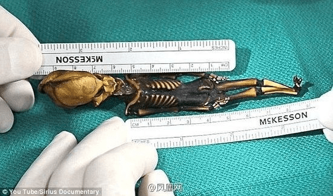

# 刚才看到新闻，智利发现的变异的小人类....

作者：大井

TID：14279

<title>1</title> <link href="../Styles/Style.css" type="text/css" rel="stylesheet">

# 1

<ignore_js_op>

**IMG_3762.JPG** *(93.14 KB, 下載次數: 0)*

[下載附件](forum.php?mod=attachment&aid=MzQwMTR8MzhkMGI4NDV8MTY3NDA2ODkzMXwxODIzMHwxNDI3OQ%3D%3D&nothumb=yes)

2013-4-25 22:59 上傳

**智利惊现罕见变异人骨 完整骷髅架仅15厘米高**   10年前，智利发现一个小骷髅架，其外形酷似人类，但却只有6英寸(约15厘米)长。当时人们对此众说纷纭。不过，现在有专家证实称，这个被命名为“阿塔卡马人型生物(又称‘阿拉木图’)”的骷髅架，现通过DNA测试已确定是一个基因突变的人的骷髅。
    英国《每日邮报》4月24日援引智利当地媒体报道称，在2003年10月19日，一个名为奥斯卡·穆尼奥斯的人在拉诺里亚城寻找具有历史价值的东西时，在一个废弃的教堂旁边发现了这个小骷髅架。当时骷髅被包在白布里面，大约有一支钢笔的长度。骷髅呈深色，有着坚硬的牙齿。与人类所不同的是它有9根肋骨。
　在当时有人认为这是胎儿的骨架，有的人说是猴子的遗骸，甚至还有人说这是外星人的骷髅。“我可以肯定地说，这绝对不是猴子的骨架，而是一个基因突变的男性骨架，而且这名男性在生下来活了六至八年时间。”加州斯坦福大学医学院干细胞生物学加里·诺兰主任说。

_________
真的好小...也就是说小人类的存在也是可能的了....这罕见的基因突变要是研究出来......
<title>2</title> <link href="../Styles/Style.css" type="text/css" rel="stylesheet">

# 2

我觉得这是个假消息，可信度不高。 <title>3</title> <link href="../Styles/Style.css" type="text/css" rel="stylesheet">

# 3

> s-man 發表於 2013-4-25 23:23 
> 我觉得这是个假消息，可信度不高。

我感觉这回这个是真的...youtube上也有...网上也有图片...各大新闻媒体都报道了...
<title>4</title> <link href="../Styles/Style.css" type="text/css" rel="stylesheet">

# 4

真真假假 假假真真 以真亂假 以假亂真@@ <title>5</title> <link href="../Styles/Style.css" type="text/css" rel="stylesheet">

# 5

变异 <title>6</title> <link href="../Styles/Style.css" type="text/css" rel="stylesheet">

# 6

你們難道覺得可以研發給a片
做出來又能怎樣······· <title>7</title> <link href="../Styles/Style.css" type="text/css" rel="stylesheet">

# 7

假的                      <title>8</title> <link href="../Styles/Style.css" type="text/css" rel="stylesheet">

# 8

我|看|這|個|可|能|性|也|是|不|大|，應|該|是|假|的|。 <title>9</title> <link href="../Styles/Style.css" type="text/css" rel="stylesheet">

# 9

本來也想發這篇的..不過覺得可信度不高就沒發了@@
就當是一種想像吧XDD <title>10</title> <link href="../Styles/Style.css" type="text/css" rel="stylesheet">

# 10

真是假时假亦真，假是真时真亦假。 <title>11</title> <link href="../Styles/Style.css" type="text/css" rel="stylesheet">

# 11

以我这个生物学研2的眼光看有百分之000.1的几率是真的 <title>12</title> <link href="../Styles/Style.css" type="text/css" rel="stylesheet">

# 12

在网上确实有很多报道，ChinaDaily上面也在4月25日报道了这个新闻，目前看来是真的，不过我好奇这个小人是生存在什么时代，家里是不是有姐姐妹妹，如果是现代，那么我也不知道他是不是幸运，幸运的地方是可以实现缩小的愿望去真正实际的感受，不好的地方嘛，呵呵，仅仅一只猫咪也可以很容易的把他吞下…… <title>13</title> <link href="../Styles/Style.css" type="text/css" rel="stylesheet">

# 13

总觉得可信度不高的样子
但是貌似好多地方都发这个了
好神奇 <title>14</title> <link href="../Styles/Style.css" type="text/css" rel="stylesheet">

# 14

假的吧.. <title>15</title> <link href="../Styles/Style.css" type="text/css" rel="stylesheet">

# 15

不知會不會有基因突變,將來有18公尺的女巨人 <title>16</title> <link href="../Styles/Style.css" type="text/css" rel="stylesheet">

# 16

怎么看怎么像模型啊、、、怎么没有基因突变的女巨人。。 <title>17</title> <link href="../Styles/Style.css" type="text/css" rel="stylesheet">

# 17

就跟几年前的巨人照片一样，造假的 <title>18</title> <link href="../Styles/Style.css" type="text/css" rel="stylesheet">

# 18

老新闻了 假的 <title>19</title> <link href="../Styles/Style.css" type="text/css" rel="stylesheet">

# 19

really? <title>20</title> <link href="../Styles/Style.css" type="text/css" rel="stylesheet">

# 20

前年的新闻，不知道又怎么炒作出来了 <title>21</title> <link href="../Styles/Style.css" type="text/css" rel="stylesheet">

# 21

明明就是真的
說假的一定都沒再看新聞 <title>22</title> <link href="../Styles/Style.css" type="text/css" rel="stylesheet">

# 22

真假暂且不论，为什么你们都觉得这就是微缩人类呢，也可能是碰巧长成人形的其他物种吧？ <title>23</title> <link href="../Styles/Style.css" type="text/css" rel="stylesheet">

# 23

那不是金属么？ <title>24</title> <link href="../Styles/Style.css" type="text/css" rel="stylesheet">

# 24

> 那不是金属么？

呵，我也是这么想的。看着不像骨头哦 <title>25</title> <link href="../Styles/Style.css" type="text/css" rel="stylesheet">

# 25

即使真有这个尺寸的并能存活的人，也没法保持一般人类的智力的啦 <title>26</title> <link href="../Styles/Style.css" type="text/css" rel="stylesheet">

# 26

怎么那么像异形，而且那骨架好像铁做的，会不会是异形的模型啊，感觉好假 <title>27</title> <link href="../Styles/Style.css" type="text/css" rel="stylesheet">

# 27

说不定它是外星人来着， <title>28</title> <link href="../Styles/Style.css" type="text/css" rel="stylesheet">

# 28

估计我这辈子是等不到这一天的到来了 <title>29</title> <link href="../Styles/Style.css" type="text/css" rel="stylesheet">

# 29

就算是真的叶轮不上咱们。。。 <title>30</title> <link href="../Styles/Style.css" type="text/css" rel="stylesheet">

# 30

外星人的实验产物 <title>31</title> <link href="../Styles/Style.css" type="text/css" rel="stylesheet">

# 31

什么样的报道都有 认真就输了 <title>32</title> <link href="../Styles/Style.css" type="text/css" rel="stylesheet">

# 32

就算是真的，看一看这个骨骼造型，再自己脑补一下原型。。。。我觉得我还是保持原样吧 <title>33</title> <link href="../Styles/Style.css" type="text/css" rel="stylesheet">

# 33

感觉不靠谱...这样的人类能活6、7年...怎么做到的？ <title>34</title> <link href="../Styles/Style.css" type="text/css" rel="stylesheet">

# 34

额，就没人顶楼主吗，哪我顶一下，谢谢楼主的分享 <title>35</title> <link href="../Styles/Style.css" type="text/css" rel="stylesheet">

# 35

卧槽！应该是真的吧 <title>36</title> <link href="../Styles/Style.css" type="text/css" rel="stylesheet">

# 36

假的吧，太小了，怎么可能 <title>37</title> <link href="../Styles/Style.css" type="text/css" rel="stylesheet">

# 37

估计是假的，没有大量的报道吧。 <title>38</title> <link href="../Styles/Style.css" type="text/css" rel="stylesheet">

# 38

那玩意就一模型吧。。可信度不高。。 <title>39</title> <link href="../Styles/Style.css" type="text/css" rel="stylesheet">

# 39

然而发现了也并没有什么卵用 <title>40</title> <link href="../Styles/Style.css" type="text/css" rel="stylesheet">

# 40

应该类似于外星人那类的消息，外国人就是爱幻想 <title>41</title> <link href="../Styles/Style.css" type="text/css" rel="stylesheet">

# 41

看起来好像是真的...不过也可能是某电影截图ps <title>42</title> <link href="../Styles/Style.css" type="text/css" rel="stylesheet">

# 42

与人类所不同的是它有9根肋骨。
————————————————————
人类有几根肋骨？ <title>43</title> <link href="../Styles/Style.css" type="text/css" rel="stylesheet">

# 43

感觉不可信啊            </ignore_js_op>