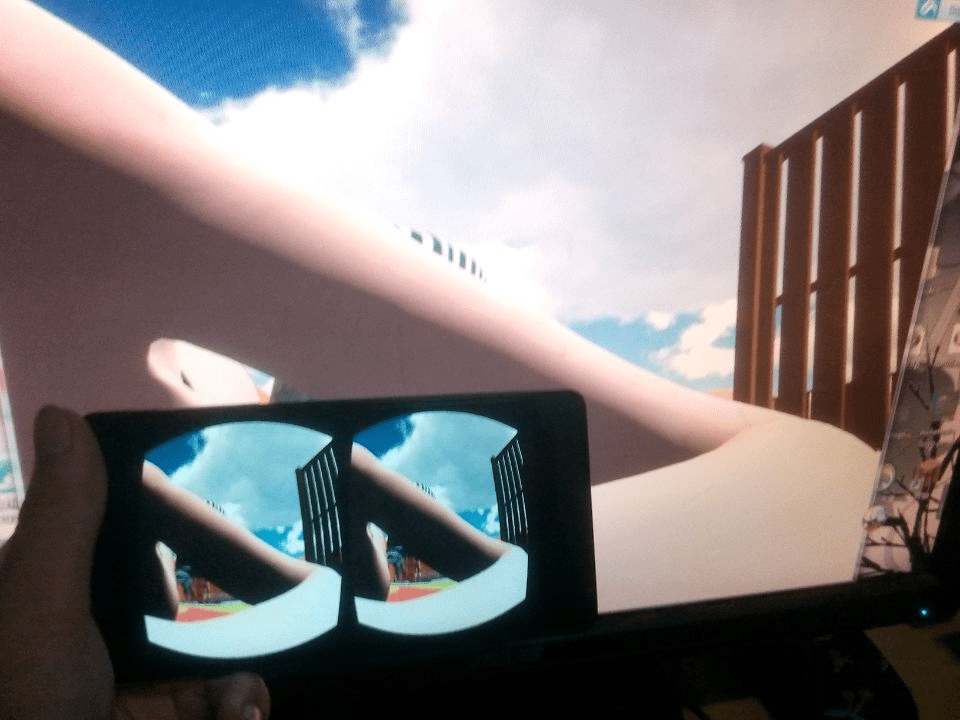

# 利用TrinusGyre+VR眼睛体验gts

作者：qreeper

TID：21917

<title>1</title> <link href="../Styles/Style.css" type="text/css" rel="stylesheet">

# 1

偶然间发现了这个软件，然后经过了两个小时的调试...(第一次用一直瞎摸，最后也算是鼓捣好了)终于算是“亲身”体会到了
原本打算直接用论坛里某大神的The_Playing_Room的，但是因为当初玩了以后就删掉了，再下载的话浪费时间...
于是我翻出来个0.42的那个什么Dream
既然是体验，我二话不说进入了那个dust关卡
刚开始倒是没什么....但是我走到了手指那里时感受到了平时dalao们写的文里面的感觉
但是具体什么感觉我也说不清楚，走了一会儿到了欧派那边的时候才能明白“像山一样”是什么样了
走到乳沟里面，望着两边的两座山我心中不禁感慨万千
接着我就迫不及待的往胖次进发，因为胖次里面空间太大，不小心就掉了进去（嘿嘿嘿）
（掉进去的时候真的是懵的，四周看了十几秒才明白自己的处境）
....
总之更多的是只可意会不可言传
再附个游泳池关卡的图

<title>2</title> <link href="../Styles/Style.css" type="text/css" rel="stylesheet">

# 2

 <ignore_js_op>[BB7B1B5975074CAA3005B6C043272201.jpg](forum.php?mod=attachment&aid=NjQ2Nzh8NDMzMjBjNmZ8MTY3NDA2Nzc1M3wxODIzMHwyMTkxNw%3D%3D&nothumb=yes) *(65.01 KB, 下載次數: 12)*

[下載附件](forum.php?mod=attachment&aid=NjQ2Nzh8NDMzMjBjNmZ8MTY3NDA2Nzc1M3wxODIzMHwyMTkxNw%3D%3D&nothumb=yes)

2016-10-2 22:35 上傳  

</ignore_js_op> <title>3</title> <link href="../Styles/Style.css" type="text/css" rel="stylesheet">

# 3

不说了，我去下载The_Playing_Room了
这么廉价就能体验gts，你心动了吗 <title>4</title> <link href="../Styles/Style.css" type="text/css" rel="stylesheet">

# 4

就算不是VR游戏也可以转化成左右格式么 <title>5</title> <link href="../Styles/Style.css" type="text/css" rel="stylesheet">

# 5

[http://giantessnight.com/gnforum ... iewthread&tid=20860](http://giantessnight.com/gnforum2012/forum.php?mod=viewthread&tid=20860)

一直有在用 现在用gear VR了 效果绝对比一般纸盒好... (虽然很多人主观觉得cardboardVR眼镜原理都一样) <title>6</title> <link href="../Styles/Style.css" type="text/css" rel="stylesheet">

# 6

真好啊，天生就有“vr眼睛”，真好啊/笑 <title>7</title> <link href="../Styles/Style.css" type="text/css" rel="stylesheet">

# 7

> 泡面 發表於 2016-10-2 23:19
> http://giantessnight.com/gnforum ... iewthread&tid=20860
> 
> 一直有在用 现在用gear VR了 效果绝对比一般 ...

难道有啥不一样的吗Σ(°Д°;
(虽然说我用的也不是传统cardboard) <title>8</title> <link href="../Styles/Style.css" type="text/css" rel="stylesheet">

# 8

> baidulaji 發表於 2016-10-2 22:49
> 就算不是VR游戏也可以转化成左右格式么

理论上都是可以的...
但是未免有那么几个游戏“特殊”... <title>9</title> <link href="../Styles/Style.css" type="text/css" rel="stylesheet">

# 9

虽然VR眼睛挺好的，不过我带上就头晕眼花的
享受不了高科技产品啊  挺遗憾的 <title>10</title> <link href="../Styles/Style.css" type="text/css" rel="stylesheet">

# 10

手机能玩the playing room？ <title>11</title> <link href="../Styles/Style.css" type="text/css" rel="stylesheet">

# 11

真的吗？正好我有dream，可以尝试一下，多谢楼主点播！ <title>12</title> <link href="../Styles/Style.css" type="text/css" rel="stylesheet">

# 12

那个。。。那个软件具体是怎么操作啊，我不会用。。。 <title>13</title> <link href="../Styles/Style.css" type="text/css" rel="stylesheet">

# 13

> [qreeper 發表於 2017-1-15 19:07](https://giantessnight.cf/gnforum2012/forum.php?mod=redirect&goto=findpost&pid=320416&ptid=21917)
> 那个。。。那个软件具体是怎么操作啊，我不会用。。。

百度有很多教程的啊...
再不行去找个中文翻译的。