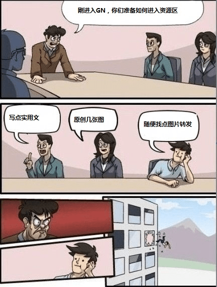

# 到GN公司面試

作者：gop2345

TID：15783

<title>1</title> <link href="../Styles/Style.css" type="text/css" rel="stylesheet">

# 1

圖片轉載自某群

<ignore_js_op>

**GN.jpg** *(38.89 KB, 下載次數: 1)*

[下載附件](forum.php?mod=attachment&aid=Mzg3NTN8N2ZkNTY1YjJ8MTY3NDA2NzY3OXwxODIzMHwxNTc4Mw%3D%3D&nothumb=yes)

2013-12-16 17:12 上傳

<title>2</title> <link href="../Styles/Style.css" type="text/css" rel="stylesheet">

# 2

面试官你不能介样子啊，你得把他扔出窗外啊 <title>3</title> <link href="../Styles/Style.css" type="text/css" rel="stylesheet">

# 3

槽点够了 <title>4</title> <link href="../Styles/Style.css" type="text/css" rel="stylesheet">

# 4

一般不都是扔出窗外的那套嘛

<title>5</title> <link href="../Styles/Style.css" type="text/css" rel="stylesheet">

# 5

 <ignore_js_op>[cde287f81a4c510fb49afd116159252dd52aa581.jpg](forum.php?mod=attachment&aid=Mzg3NTR8NDhlZDNlODd8MTY3NDA2NzY3OXwxODIzMHwxNTc4Mw%3D%3D&nothumb=yes) *(81.37 KB, 下載次數: 13)*

[下載附件](forum.php?mod=attachment&aid=Mzg3NTR8NDhlZDNlODd8MTY3NDA2NzY3OXwxODIzMHwxNTc4Mw%3D%3D&nothumb=yes)

2013-12-16 19:19 上傳  

</ignore_js_op> <title>6</title> <link href="../Styles/Style.css" type="text/css" rel="stylesheet">

# 6

> archer 發表於 2013-12-16 19:20 
> 一般不都是扔出窗外的那套嘛

nice~！
就应该这样

<title>7</title> <link href="../Styles/Style.css" type="text/css" rel="stylesheet">

# 7

我突然懂了~~~~！ <title>8</title> <link href="../Styles/Style.css" type="text/css" rel="stylesheet">

# 8

槽点满满，已经不能直视了··· <title>9</title> <link href="../Styles/Style.css" type="text/css" rel="stylesheet">

# 9

槽点多的不知道该怎么吐了 <title>10</title> <link href="../Styles/Style.css" type="text/css" rel="stylesheet">

# 10

观众A表示吐槽不能... <title>11</title> <link href="../Styles/Style.css" type="text/css" rel="stylesheet">

# 11

吐槽：實踐效率市場假說錯惹嗎～～～～～～（回音）？ <title>12</title> <link href="../Styles/Style.css" type="text/css" rel="stylesheet">

# 12

这让广大无业游民活不活了啊。。。 <title>13</title> <link href="../Styles/Style.css" type="text/css" rel="stylesheet">

# 13

额，略雷啊 <title>14</title> <link href="../Styles/Style.css" type="text/css" rel="stylesheet">

# 14

話說我也是隨便找圖轉發而進入gn的....... <title>15</title> <link href="../Styles/Style.css" type="text/css" rel="stylesheet">

# 15

这......想想当年的咱也是连大脑都没经过就发了一堆图，结果被某“大神”（貌似是十八大叉子来着）一顿猛喷，新人都是青涩的哟 <title>16</title> <link href="../Styles/Style.css" type="text/css" rel="stylesheet">

# 16

> [447825856 發表於 2013-12-25 15:16](https://giantessnight.cf/gnforum2012/forum.php?mod=redirect&goto=findpost&pid=211352&ptid=15783)
> 这......想想当年的咱也是连大脑都没经过就发了一堆图，结果被某“大神”（貌似是十八大叉子来着） ...

What? 竟有此事，我完全不记得了啊

<title>17</title> <link href="../Styles/Style.css" type="text/css" rel="stylesheet">

# 17

我似乎突然明白了点什么 <title>18</title> <link href="../Styles/Style.css" type="text/css" rel="stylesheet">

# 18

這這這...GN到底是怎樣的啊... <title>19</title> <link href="../Styles/Style.css" type="text/css" rel="stylesheet">

# 19

经济基础决定上层建筑 <title>20</title> <link href="../Styles/Style.css" type="text/css" rel="stylesheet">

# 20

咦？楼主你这是逼良为娼的节奏吗？ <title>21</title> <link href="../Styles/Style.css" type="text/css" rel="stylesheet">

# 21

看了好几遍终于看懂了。。。 <title>22</title> <link href="../Styles/Style.css" type="text/css" rel="stylesheet">

# 22

什么意思。。没太看懂 <title>23</title> <link href="../Styles/Style.css" type="text/css" rel="stylesheet">

# 23

额  这个是要脑补的节奏 <title>24</title> <link href="../Styles/Style.css" type="text/css" rel="stylesheet">

# 24

真是日狗了的节奏啊，槽点满满 <title>25</title> <link href="../Styles/Style.css" type="text/css" rel="stylesheet">

# 25

看了第一遍就笑了秒懂...... <title>26</title> <link href="../Styles/Style.css" type="text/css" rel="stylesheet">

# 26

我竟不知道你们说的槽点在哪，是我太年轻了吗？ <title>27</title> <link href="../Styles/Style.css" type="text/css" rel="stylesheet">

# 27

作为新人，我为何看不出槽点 <title>28</title> <link href="../Styles/Style.css" type="text/css" rel="stylesheet">

# 28

3年前的槽点现在已经看不懂了吗= =ll <title>29</title> <link href="../Styles/Style.css" type="text/css" rel="stylesheet">

# 29

原来如此！！。。。。。。。。。。 <title>30</title> <link href="../Styles/Style.css" type="text/css" rel="stylesheet">

# 30

……槽点何在？看不出来啊！ <title>31</title> <link href="../Styles/Style.css" type="text/css" rel="stylesheet">

# 31

好像没什么不对，哈哈哈哈 <title>32</title> <link href="../Styles/Style.css" type="text/css" rel="stylesheet">

# 32

現在加入論壇比較嚴格了嘛？

我當年還自己畫圖跟寫文
只是當初申請論壇好像比較沒有限制！ <title>33</title> <link href="../Styles/Style.css" type="text/css" rel="stylesheet">

# 33

没看到槽点在哪……::>_<::/> <title>34</title> <link href="../Styles/Style.css" type="text/css" rel="stylesheet">

# 34

不太懂是什么意思,求大神解释 <title>35</title> <link href="../Styles/Style.css" type="text/css" rel="stylesheet">

# 35

是什么意思?还是有点看不懂 <title>36</title> <link href="../Styles/Style.css" type="text/css" rel="stylesheet">

# 36

还在资源区外苦苦挣扎的表示orz <title>37</title> <link href="../Styles/Style.css" type="text/css" rel="stylesheet">

# 37

好像并没有什么不对吗~ <title>38</title> <link href="../Styles/Style.css" type="text/css" rel="stylesheet">

# 38

然而当初我什么都没做。。。呵哈哈                      <title>39</title> <link href="../Styles/Style.css" type="text/css" rel="stylesheet">

# 39

2333333333333333好逗这个梗</ignore_js_op>