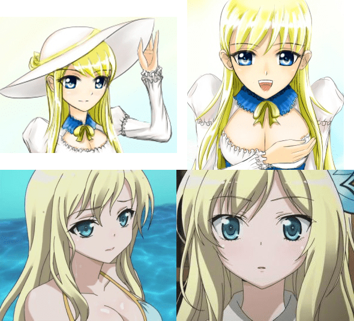

# 制作GTS漫画的一个重要问题

作者：ckw

TID：11497

<title>1</title> <link href="../Styles/Style.css" type="text/css" rel="stylesheet">

# 1

很多人应该都知道我在准备绘制GTS漫画，现在遇到了一个比较棘手的问题请大家帮帮忙。
优秀的漫画都有非常细致严谨的人物设定，但是难免会遇到极为雷同的设定。
（也有说日本动漫产业发展到今天这个地步，基本上所有人物角色设定都涵盖了，很难逃脱其阴影了）

我正在准备的一部GTS漫画就是以我这张比较受欢迎的插画为蓝本的：（2011年4月发布的）
[http://giantessnight.com/gnforum ... p;extra=&page=1](http://giantessnight.com/gnforum/viewthread.php?tid=9942&extra=&page=1)

但是后来发现与2011年10月新番《我的朋友很少》当中的【柏崎星奈】极为雷同：
百度百科：[http://baike.baidu.com/view/2969905.htm](http://baike.baidu.com/view/2969905.htm)

属性设定极为相似：
柏崎星奈——学园理事长的独生女。金发碧眼、童颜巨乳的美女，成绩优秀且运动万能，因为外貌和女王性格受到男性崇拜，除了个性之外都很完美。
我的设定——巨人国公主，独生女。其余同上（金发碧眼、童颜巨乳的美女。。。

外貌也极为神似：（下面部分取自动画截图）
<ignore_js_op>

**xnr-rou.jpg** *(276.62 KB, 下載次數: 0)*

[下載附件](forum.php?mod=attachment&aid=MjcwMDJ8OWU0NWM5M2Z8MTY3NDA2ODcxOXwxODIzMHwxMTQ5Nw%3D%3D&nothumb=yes)

2012-1-1 21:29 上傳

之所以这个问题棘手是因为：我今后设计的其他GTS角色仍然有可能在不知不觉当中与现有动漫角色雷同。
那么现在我有三条路可以走：
1\. 无视，我画我的，该怎样就怎样，就当没看到（幸好我不够宅）。
但这样可能会被观众说抄袭某角色，或者歪曲某角色，而我本人又会觉得委屈，这明明是我的原创呀。

2\. 避开，刻意的增加属性或者修改外貌，已达到不抄袭不雷同的境界。
但这样做设计上会非常难，花费更多的时间，甚至根本就是无用功。

3\. 附和，看到类似的角色就贴上去好了，大部分属性和设定动漫界人士已经帮你设计好了，省时省力，大不了就说是某角色的平行世界同人作好了。
但这样基本上都逃不过同人作的标签了，而且遇到死忠FANS，一旦不如意会被喷的很惨。

以上，欢迎大家提出好的意见和建议，非常感谢！

[ *本帖最後由 xnr 於 2012-1-1 21:29 編輯* ] <title>2</title> <link href="../Styles/Style.css" type="text/css" rel="stylesheet">

# 2

簡單來說，自從日本動漫開始把頭髮弄出各種見鬼的顏色以後，之後幾十年就不斷覆蓋覆蓋，總不能不重合吧？對於我個人來說，1是最好的選擇。只要把一個角色的背景啊設定什麼的都給幹得穩穩妥妥的，怎麼可能會出現完全的重疊呢？這樣噴子的話語也只是全無根據的亂掃射了吧？

當然最好還是追隨自己內心的感受了，喜歡就做，不喜歡就不做好了 <title>3</title> <link href="../Styles/Style.css" type="text/css" rel="stylesheet">

# 3

只要画风不同的话很难说是抄袭吧...
而且设定这种东西 真的其实都差不了多少
只要妹子够萌 能够撸的起来就萌大奶了吧
话说 我也喜欢肉啊~ <title>4</title> <link href="../Styles/Style.css" type="text/css" rel="stylesheet">

# 4

.
你想太多。
你真的想太多。
再說了就算抄襲那又怎樣，ACG文化誕生至今出現幾百億個虛擬妹子了，重複的一堆好嗎
 <title>5</title> <link href="../Styles/Style.css" type="text/css" rel="stylesheet">

# 5

天下文章是一家，你抄我来我抄他，抄来抄去有变化。

按不知哪来的流言说法，“全世界有两个/三个人和你一模一样的”。

你的设定和柏崎星奈 就楼主图来说，只是构图和色系相似，表情神态气质都有不同，而且漫画又不是写真集，人物是需要通过事件来立体化。相似度99%的双胞胎们是通过“性格”和“历史”来区分，面对同一件事，即便是双胞胎，都未必同一态度，只要有一点点小偏差，就可以“失之毫厘谬之千里”，被造就成两个不同的人。你的主角总不会和柏崎星奈要做同样的事情，而且柏崎星奈不会是gts。

从星座来划分，全世界只有12个主要原创的人格（若按星期分，则60种）；生肖12种；血型（不算稀有类型），全世界只有四种；全部积2880种性格，加入性别因素5760种；加入年龄，文化背景等等因素……好，就算10万种性格特征吧，说实在的，不是专门研究这些的人，哪有时间精力去分辨和记忆它~~

持“抄袭说”的读者一定有，而且部分已经形成一种习惯：习惯去比较相似处，忽略不同，下意识的把所有作品有关连的部分统和为一，最后达到神的领域——男性全部抄袭亚当！女性全部抄袭夏娃！动物们更是长着全族同一的脸DX

说真的……咱们本身也是父母和历史上某些人物的类复制品吧。

说到底，不怕角色有雷同，是怕被读者指为抄袭。三国里张松用过目不忘的小伎俩，害的曹操把写了多少年的书付之一炬，那家伙气量够，遇到这号事，也怕后世落下骂名，没办法。

[ *本帖最後由 vivian 於 2012-1-2 12:34 編輯* ] <title>6</title> <link href="../Styles/Style.css" type="text/css" rel="stylesheet">

# 6

我個人認為XNR大不用擔心這種事
外型類似的角色ACG滿街跑
也不見很多人在吵
只要想辦法讓你這位角色的劇情豐富有趣就可以了 <title>7</title> <link href="../Styles/Style.css" type="text/css" rel="stylesheet">

# 7

沒那樣的事。
要達到稱為"同人"的條件還很多，如果不是刻意去同人的話，隨著劇情發展就會有明顯的不同
相反的，如果有人硬要說X兄的原創是同人的話，那它顯然對這個角色的認識還不夠
不用擔心，創作自己的吧！ <title>8</title> <link href="../Styles/Style.css" type="text/css" rel="stylesheet">

# 8

我覺得有個人特色比較重要

就是讓人一看到圖就能馬上反應

這張圖是某某畫的

以大大的風格來說我覺得已經很棒了

角色重疊在所難免，但是只要畫出來有特色就好了 <title>9</title> <link href="../Styles/Style.css" type="text/css" rel="stylesheet">

# 9

=-=人物设定来来去去就那几个元素了... <title>10</title> <link href="../Styles/Style.css" type="text/css" rel="stylesheet">

# 10

(閱

只能說,您真的想太多了...

現在漫畫那麼多,角色重複率根本高到不行,光是一個角色屬性什麼的,很容易就在另一部找到,尤其又是這種金髮巨乳大小姐,根本多到不行...更不用說知名的屬性了,重覆率高到爆表.舉vivan的漫畫中長出現的黑長髮好色女好了,就這個模組就在h漫中見過幾百遍了,能告發vivan的人都可排隊到美國去了..

放心,若是出商業本,某個廚網根本不會拿這一方面來找碴,不過建議您還是別親自到別的英文網站用英文來用,也盡量改成口述的,把圖去掉

據我所知,某個廚網至少有4~5個人以上每天stand by在這裡,要是被他們斷章取義,任為您是以某漫畫為構想...倒是後可就有點兒麻煩了呢

最後...什麼時後要畫縮小女同人本呢,全國縮小女普及化啟動 <title>11</title> <link href="../Styles/Style.css" type="text/css" rel="stylesheet">

# 11

世界上的飛機都是抄萊特兄弟的了？這理論可不行啊。
成品跟別人的有一點像，一個小處像樣，可是自家也具有自家特色，不然怎有同種類競爭和品牌？
或許我解釋山寨、冒牌不夠力，但是有理性的人是能夠分辦事非的。

最後，我有點是覺得，樓主心裡是害怕？怕自己的設計沒個性？ <title>12</title> <link href="../Styles/Style.css" type="text/css" rel="stylesheet">

# 12

要说抄袭的话，动漫里面长得像水银灯的妹子多了去了~~
lz明显多虑啦，再说我实在是没看出来lz的作品有什么抄袭的地方~~ <title>13</title> <link href="../Styles/Style.css" type="text/css" rel="stylesheet">

# 13

当我看到某部电视剧疯狂无限抄袭犬夜叉的时候确实是有够不爽的…… <title>14</title> <link href="../Styles/Style.css" type="text/css" rel="stylesheet">

# 14

无所谓抄袭  写出自己的个性就好
人设雷同神马的是浮云
君不见 多少雷同的傲娇角色
只要人物性格鲜明  故事引人入胜 就好

[ *本帖最後由 qi982325161 於 2012-1-4 19:16 編輯* ] <title>15</title> <link href="../Styles/Style.css" type="text/css" rel="stylesheet">

# 15

只能說，這是神洲辯證法的一個特殊發展，是人類知識史上一個特異點。
1:
lz的假設太簡單了。就好像說「咱們的好羊羊有戴了帽子，喜羊羊沒有，所以咱們沒有抄襲」的相反推論法。
即是:金发碧眼、童颜巨乳、独生女、成绩优秀且运动万能的都是克隆人!
閣下與我一樣是黑髮、御宅、gts愛好、二十多歲甚至是中國人，就算高矮胖不同，在這個GN中要找到與閣下相同的4個特色非常容易，但是閣下不能我，我也不是但丁，假使我與但丁有10項地方相同。
那即是神馬呢?
閣下將人的分類看得太太太死板了。即使同樣是金发碧眼、童颜巨乳、独生女、成绩优秀且运动万能，她們的樣貌都不一樣!(噢，說到重點了，她們物理上的外貌根本就不一樣，同樣是黑髮，難道你會分不清但丁與xnr?我相信，假如有個人走出來指責你抄襲，那一定是fuzzy logic的人工智能了。人工智能:「當然了，黑髮、御宅、gts愛好、二十多歲甚至是中國人5點符合，不是抄襲難道是人有相似?」)
假如，真的是假如，存在閣下所擔心的抄襲驚魂，那我只能說，大家的眼睛真的是狗眼了，連自己的老婆都會認錯 (眾:黑長直髮、二十多歲、童颜巨乳、独生女、成绩优秀且运动万能，我...我就算不看外形，單靠這6個特徵怎會在神洲大學區中認錯!)
而顾况的所有畫都是抄襲前人 (眾:當然!黑髮、古裝、女姓、坐著、連身高與種族都一樣，根本就是畫同一個人!)
ps1:風格、外貌、人種>金发碧眼、童颜巨乳、独生女、成绩优秀且运动万能
ps2:這....這是宣傳(唸作生存)策略嗎?

[ *本帖最後由 wtman 於 2012-1-5 17:24 編輯* ] <title>16</title> <link href="../Styles/Style.css" type="text/css" rel="stylesheet">

# 16

我只是帮顶的~不要说我挖坟~ <title>17</title> <link href="../Styles/Style.css" type="text/css" rel="stylesheet">

# 17

不用担心 本意从出发就没有抄袭 最多只能算巧合的雷同  很多地方是不一样的 是原创的</ignore_js_op>