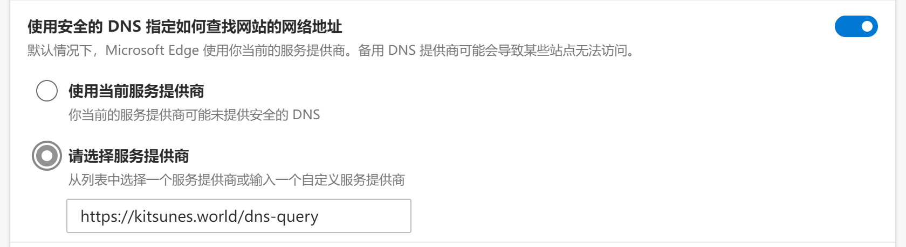
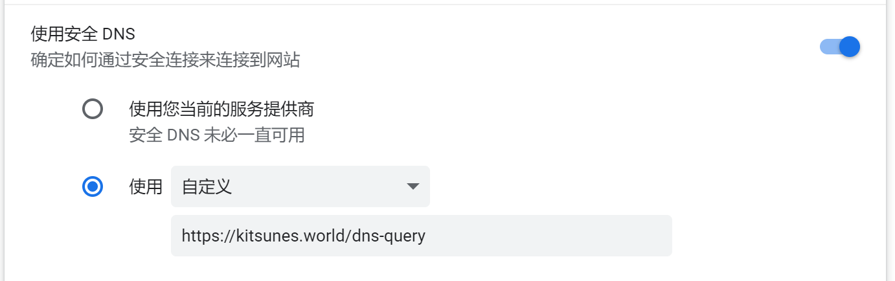
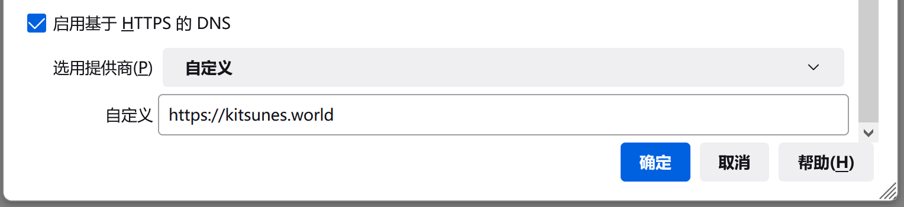
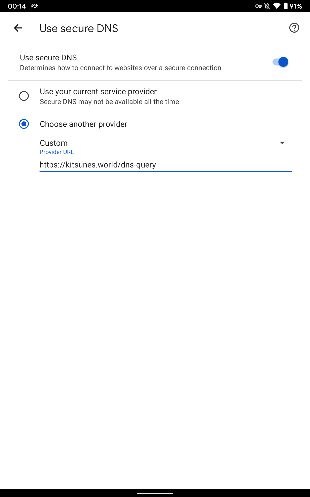
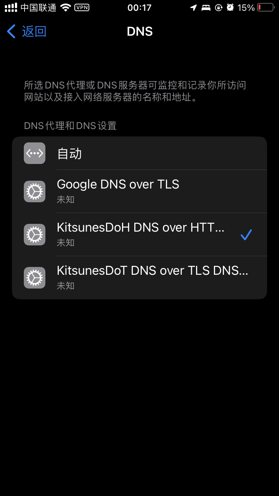

# 加密 DNS 访问 GN 续

作者：Foobarz

TID：33656

<title>1</title> <link href="../Styles/Style.css" type="text/css" rel="stylesheet">

# 1

*本帖最後由 Foobarz 於 2022-7-11 00:19 編輯*

续的是 [这个帖子](https://giantessnight.com/gnforum2012/forum.php?mod=viewthread&tid=33533&extra=page%3D1) 。但是 Android 9-12 用的私人DNS是基于 DNS over TLS 的，现在更流行的大概是另一种叫做 DNS over HTTPS 的加密 DNS 方案。

所以这两个有啥区别？ DNS over TLS 会单独用到 853 端口，因此即使请求和响应本身都已加密，具有网络可见性的任何人都发现来回的 DoT 流量。DNS over HTTPS 则把DNS 查询和响应伪装在其他 HTTPS 流量里面，因为202年了，不太可能整个屏蔽 HTTPS 流量，所以 DNS over HTTPS 更难被干扰的样子。

不过还要泼一盆冷水，加密 DNS 只能解决像 GN 这种只是被 DNS 污染的问题，对于维基百科或者 e-hentai 那种 SNI 阻断，或者 Google 级 VVVIP 待遇就无能为力了。（结论就是不如一直开着梯子（x））

（后面就把 DNS over HTTPS 叫做 DoH 了）
至于有什么 DoH 服务器嘛……自己搜索一下不难找到，或者如果你信得过我的话，用我自己的也没问题 ： [https://kitsunes.world/dns-query](https://kitsunes.world/dns-query)
然后下面演示 Windows 上 Chrome/Edge/Firefox ，Android 上 Chrome 以及 iOS 怎么用，剩下的自己搜索一下应该也能找到教学。（国产浏览器就算了，赶紧换掉。）

Edge : 在“设置-隐私、搜索和服务-安全性-使用安全的 DNS 指定如何查找网站的网络地址” 里填上上面的地址。
<ignore_js_op>

**屏幕截图 2022-07-11 000609.png** *(81.46 KB, 下載次數: 0)*

[下載附件](forum.php?mod=attachment&aid=OTc1Nzd8NGNkOWFiNTV8MTY3NDA2OTMxOXwxODIzMHwzMzY1Ng%3D%3D&nothumb=yes)

2022-7-11 00:06 上傳

Chrome：在“设置-隐私设置和安全性-安全-高级”里打开“使用安全DNS”，然后选择自定义填上上面的地址。 <ignore_js_op>

**屏幕截图 2022-07-11 001025.png** *(48.88 KB, 下載次數: 0)*

[下載附件](forum.php?mod=attachment&aid=OTc1Nzh8OTNkZDgwMjd8MTY3NDA2OTMxOXwxODIzMHwzMzY1Ng%3D%3D&nothumb=yes)

2022-7-11 00:10 上傳

Firefox：在“设置-常规-连接设置”里启用“使用基于 HTTPS 的 DNS”，再选择自定义填上上面的地址。
<ignore_js_op>

**屏幕截图 2022-07-11 001208.png** *(32.32 KB, 下載次數: 0)*

[下載附件](forum.php?mod=attachment&aid=OTc1Nzl8YzNkNDZjNDF8MTY3NDA2OTMxOXwxODIzMHwzMzY1Ng%3D%3D&nothumb=yes)

2022-7-11 00:12 上傳

Android 版 Chrome ：在“设置-隐私设置和安全性-使用安全 DNS”里，先选择使用安全 DNS，再选择“另选一个提供商-自定义”，填上上面的地址。
<ignore_js_op>

**Screenshot_20220711-001420.png** *(68.22 KB, 下載次數: 0)*

[下載附件](forum.php?mod=attachment&aid=OTc1ODB8MWFmNzU5NjB8MTY3NDA2OTMxOXwxODIzMHwzMzY1Ng%3D%3D&nothumb=yes)

2022-7-11 00:16 上傳

iOS、iPadOS （14 以上） 和 macOS （12以上）： 先安装下面的描述文件，然后打开“设置-通用-VPN、DNS和设备管理”，在 DNS 中选择一个 DNS 服务器。（KitsuneDOH）

<ignore_js_op>

**IMG_2198.PNG** *(141.84 KB, 下載次數: 0)*

[下載附件](forum.php?mod=attachment&aid=OTc1ODF8ODY3NGRkZTR8MTY3NDA2OTMxOXwxODIzMHwzMzY1Ng%3D%3D&nothumb=yes)

2022-7-11 00:19 上傳

<title>2</title> <link href="../Styles/Style.css" type="text/css" rel="stylesheet">

# 2

 <ignore_js_op>

[dns_kitsunes.mobileconfig](forum.php?mod=attachment&aid=OTc1NzZ8YmVlNTlkZmV8MTY3NDA2OTMxOXwxODIzMHwzMzY1Ng%3D%3D)

2022-7-10 23:57 上傳

點擊文件名下載附件

3.75 KB, 下載次數: 36

iOS/macOS 用描述文件。</ignore_js_op> <title>3</title> <link href="../Styles/Style.css" type="text/css" rel="stylesheet">

# 3

终于有林檎能用的DOH手段了，实在是太好了 <title>4</title> <link href="../Styles/Style.css" type="text/css" rel="stylesheet">

# 4

您的DOH服务器是不是停止服务了？
有没有别的DOH服务器推荐？ <title>5</title> <link href="../Styles/Style.css" type="text/css" rel="stylesheet">

# 5

> [juliazhu1978 發表於 2022-7-19 13:36](https://giantessnight.cf/gnforum2012/forum.php?mod=redirect&goto=findpost&pid=509886&ptid=33656)
> 您的DOH服务器是不是停止服务了？
> 有没有别的DOH服务器推荐？

至于别的 DoH 服务器的话，自己搜索一下不难找吧？</ignore_js_op></ignore_js_op></ignore_js_op></ignore_js_op></ignore_js_op>