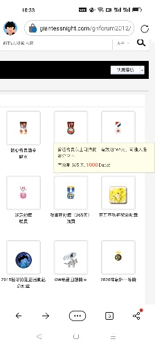

# 勋章的门槛好高

作者：realGNfans11

TID：34601

<title>1</title> <link href="../Styles/Style.css" type="text/css" rel="stylesheet">

# 1

门槛真的有必要这么高吗(>﹏ <title>2</title> <link href="../Styles/Style.css" type="text/css" rel="stylesheet">

# 2

 <ignore_js_op>[Screenshot_2022-12-22-10-33-03-70_df198e732186825c8df26e3c5a10d7cd.jpg](forum.php?mod=attachment&aid=MTAxMTI4fDc3ZDY2ZDBlfDE2NzQwNjUwMjJ8MTgyMzB8MzQ2MDE%3D&nothumb=yes) *(22.97 KB, 下載次數: 8)*

[下載附件](forum.php?mod=attachment&aid=MTAxMTI4fDc3ZDY2ZDBlfDE2NzQwNjUwMjJ8MTgyMzB8MzQ2MDE%3D&nothumb=yes)

2022-12-22 10:36 上傳  

</ignore_js_op> <title>3</title> <link href="../Styles/Style.css" type="text/css" rel="stylesheet">

# 3

稍微做点贡献，混点奖励点就有了。如果只是想水+混日常积分可能慢一点。 <title>4</title> <link href="../Styles/Style.css" type="text/css" rel="stylesheet">

# 4

如果我没有记错的话 早些时候回复一次是有50点数的，现在回复给的点数变少了，但勋章并没有变得便宜。 <title>5</title> <link href="../Styles/Style.css" type="text/css" rel="stylesheet">

# 5

> [年轻即装逼 發表於 2022-12-22 15:22](https://giantessnight.cf/gnforum2012/forum.php?mod=redirect&goto=findpost&pid=522514&ptid=34601)
> 如果我没有记错的话 早些时候回复一次是有50点数的，现在回复给的点数变少了，但勋章并没有变得便宜。 ...

原本180天时限的漫画狂勋章已经延长到365天了，算是变相降价
<title>6</title> <link href="../Styles/Style.css" type="text/css" rel="stylesheet">

# 6

降低奖励点的初衷是为了让大家都出来说话吗...只能算是止血之策了。确实更难拿分了 <title>7</title> <link href="../Styles/Style.css" type="text/css" rel="stylesheet">

# 7

现在只能积少成多了，否则的话确实很难再达到 <title>8</title> <link href="../Styles/Style.css" type="text/css" rel="stylesheet">

# 8

上传的图片好糊(´-ω-`)
现在回复一次是20积分，其实也就是回复50次，这么看来似乎又不是很高了 <title>9</title> <link href="../Styles/Style.css" type="text/css" rel="stylesheet">

# 9

我确实有点太咸鱼了                     <title>10</title> <link href="../Styles/Style.css" type="text/css" rel="stylesheet">

# 10

> MaHL 發表於 2022-12-23 11:21
> 我确实有点太咸鱼了

我记得以前还要权限要求的，买了勋章之后权限不够也进不去，不清楚现在是怎么设定的 <title>11</title> <link href="../Styles/Style.css" type="text/css" rel="stylesheet">

# 11

这个论坛有评分功能的，只是很多人不知道/不用 <title>12</title> <link href="../Styles/Style.css" type="text/css" rel="stylesheet">

# 12

> MaHL 發表於 2022-12-23 11:18
> 上传的图片好糊(´-ω-`)
> 现在回复一次是20积分，其实也就是回复50次，这么看来似乎又不是很高了 ...

其实不止五十次，进漫画区至少是要3000积分的，不然买了勋章会分不够进不去漫画区 <title>13</title> <link href="../Styles/Style.css" type="text/css" rel="stylesheet">

# 13

那我稍微回复一下稍微挣一点分吧，感觉确实很难凑够 <title>14</title> <link href="../Styles/Style.css" type="text/css" rel="stylesheet">

# 14

论坛其实主要还是贡献机制比较占主导地位。包括写文章发资源啥的，包括优质长评这些，奖励点的权重还是比较高的。光靠简单回复确实比较难以涨经验 <title>15</title> <link href="../Styles/Style.css" type="text/css" rel="stylesheet">

# 15

攒到1000了也不要换，换了你会发现等级会掉光，漫画区的帖子你还是看不了，因为权限不够，估计也得2000点再换最合适 <title>16</title> <link href="../Styles/Style.css" type="text/css" rel="stylesheet">

# 16

确实是这样，一直咸的话就很慢了 <title>17</title> <link href="../Styles/Style.css" type="text/css" rel="stylesheet">

# 17

就挺难，发个评论都不一定发的出来

<title>18</title> <link href="../Styles/Style.css" type="text/css" rel="stylesheet">

# 18

就花积分买了勋章之后发现权限又不够了 <title>19</title> <link href="../Styles/Style.css" type="text/css" rel="stylesheet">

# 19

等一次比赛写一篇三千字的小小说水一水这分数就可以拿到了，并不需要多么长的时间——三千字一分钟三十字两个小时不到。 <title>20</title> <link href="../Styles/Style.css" type="text/css" rel="stylesheet">

# 20

真的有些贵，1000积分，一天也赞不了太多积分。 <title>21</title> <link href="../Styles/Style.css" type="text/css" rel="stylesheet">

# 21

> [ASQTTR 發表於 2022-12-24 19:48](https://giantessnight.cf/gnforum2012/forum.php?mod=redirect&goto=findpost&pid=522702&ptid=34601)
> 等一次比赛写一篇三千字的小小说水一水这分数就可以拿到了，并不需要多么长的时间——三千字一分钟三十字两 ...

写文章还是有点难度的(´-ω-`)                    
<title>22</title> <link href="../Styles/Style.css" type="text/css" rel="stylesheet">

# 22

之前攒了1000积分 买了勋章之后发现权限不够— <title>23</title> <link href="../Styles/Style.css" type="text/css" rel="stylesheet">

# 23

第一次发帖这么多人回复(・◇・)   <title>24</title> <link href="../Styles/Style.css" type="text/css" rel="stylesheet">

# 24

买那些需要用的我看就行了吧？其他的买那么多干什么，除非你有多余的积分 <title>25</title> <link href="../Styles/Style.css" type="text/css" rel="stylesheet">

# 25

啊，没在回帖积分多的时候，多回帖好后悔啊，现在积分好慢 <title>26</title> <link href="../Styles/Style.css" type="text/css" rel="stylesheet">

# 26

确实不进行创作的情况下积分涨的就是很慢 <title>27</title> <link href="../Styles/Style.css" type="text/css" rel="stylesheet">

# 27

看我，花1000买个大冤种勋章 <title>28</title> <link href="../Styles/Style.css" type="text/css" rel="stylesheet">

# 28

确实 已经注册快一年了 积分还不到一千。。。 <title>29</title> <link href="../Styles/Style.css" type="text/css" rel="stylesheet">

# 29

勋章要买得攒积分，不然进了分享区有些也不给你看或者下载（不过这种的数量不多就是了） <title>30</title> <link href="../Styles/Style.css" type="text/css" rel="stylesheet">

# 30

漫画区里其实还有不少帖子是权限要50才能进的_(:зゝ∠)_ <title>31</title> <link href="../Styles/Style.css" type="text/css" rel="stylesheet">

# 31

同感，积分也是没怎么涨，还是说话少了哎 <title>32</title> <link href="../Styles/Style.css" type="text/css" rel="stylesheet">

# 32

慢慢攒吧，需要注意的是权限问题，不然的话可能买了勋章不能看 <title>33</title> <link href="../Styles/Style.css" type="text/css" rel="stylesheet">

# 33

不能水帖，水回复，不过也可以写文来多搞点积分嘛（） <title>34</title> <link href="../Styles/Style.css" type="text/css" rel="stylesheet">

# 34

对于我这种不会写文的咸鱼来说只能慢慢攒分了，现在三千多分买个漫画勋章估计有好多帖都进不去，悲 <title>35</title> <link href="../Styles/Style.css" type="text/css" rel="stylesheet">

# 35

对于我这种社恐来说在人家的文章下面评头论足简直要我的命（） <title>36</title> <link href="../Styles/Style.css" type="text/css" rel="stylesheet">

# 36

因為論壇積分是有作用的，所以論壇大部分對於積分的管理比較嚴格，比如洗留言的行為等
但其實論壇裡的創作者，乃至論壇的管理者，甚至站長
都是用愛發電去維護、活躍這個論壇
這是一個正向循環，老實說看完一篇文章，給一點小小的心得30字左右，或是給作者一個信心的喊話
都是給創作者很好的回饋，讓他們更有創作慾望
老實說連小學生都能夠在看完一篇文章有個100自觀後感
對於大人的各位來說，鼓勵自己喜歡的作者是一件很困難的事情嗎?

<title>37</title> <link href="../Styles/Style.css" type="text/css" rel="stylesheet">

# 37

我就是，没什么文采，这么多年都是靠日常混积分，也就买过两次徽章n <title>38</title> <link href="../Styles/Style.css" type="text/css" rel="stylesheet">

# 38

新注册的用户想混混积分也太难了 <title>39</title> <link href="../Styles/Style.css" type="text/css" rel="stylesheet">

# 39

其实漫画区里也没什么，在你攒够漫画区积分之前圈内大部分好看的作品你都看过一遍了。 <title>40</title> <link href="../Styles/Style.css" type="text/css" rel="stylesheet">

# 40

建議水他個三年就拿到了（滑稽）