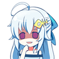

# 匿名投票：gts性幻想之中你的H是主動型還是被動型

作者：Senkile

TID：20885

<title>1</title> <link href="../Styles/Style.css" type="text/css" rel="stylesheet">

# 1

再說一下 這回想調查的就是：為了滿足生理需求你是哪種類型（所以給了巨大化和縮小化2种 不管在你的性幻想是想當巨人還是小人都可以

性幻想的場景限定
**就是H**
**就是SEX**
**就是性交**

舉個例子：
縮小後主動型就是用自己的外生殖器去摩擦gts的某些身體部位 來滿足自己

被動型就是喜歡自己躺着 被gts的身體部位來蹂躪 從而釋放出來

巨大化也一樣 主動型就是主動去找山脈啊 星球之類的滿足自己
被動型就是把其他小人放在身上 然後自己躺着不動 等他們來滿足自己（很難啊
<title>2</title> <link href="../Styles/Style.css" type="text/css" rel="stylesheet">

# 2

怎么有2票VV姐→_→                         <title>3</title> <link href="../Styles/Style.css" type="text/css" rel="stylesheet">

# 3

竟然可以选两项，果断放弃巨大化的情况 <title>4</title> <link href="../Styles/Style.css" type="text/css" rel="stylesheet">

# 4

黄种人主动，白种人被动，都是缩小 <title>5</title> <link href="../Styles/Style.css" type="text/css" rel="stylesheet">

# 5

明明是种m性趣，为何还要选主动上→_→ <title>6</title> <link href="../Styles/Style.css" type="text/css" rel="stylesheet">

# 6

一般是被动的吧 毕竟得享受屈辱感 <title>7</title> <link href="../Styles/Style.css" type="text/css" rel="stylesheet">

# 7

喜欢无意识的缩小被动 <title>8</title> <link href="../Styles/Style.css" type="text/css" rel="stylesheet">

# 8

看到标题我还以为是S和M（滑稽
其实我还是比较主动的233 <title>9</title> <link href="../Styles/Style.css" type="text/css" rel="stylesheet">

# 9

1.2选项是留给妹子的还是缩小女类型... <title>10</title> <link href="../Styles/Style.css" type="text/css" rel="stylesheet">

# 10

当然是被动型。。。。。。。 <title>11</title> <link href="../Styles/Style.css" type="text/css" rel="stylesheet">

# 11

看来大家大多数都是M啊-_- <title>12</title> <link href="../Styles/Style.css" type="text/css" rel="stylesheet">

# 12

我去，选巨大主动的是不好多女s啊啊啊。。。 <title>13</title> <link href="../Styles/Style.css" type="text/css" rel="stylesheet">

# 13

会是小人+被动型吧，普通，毕竟喜欢gts的M居多。。。 <title>14</title> <link href="../Styles/Style.css" type="text/css" rel="stylesheet">

# 14

被玩弄，被呵護，被虐待，被照顧，被污辱，被保護

基本上都是被動的 <title>15</title> <link href="../Styles/Style.css" type="text/css" rel="stylesheet">

# 15

看来我的喜好和大多数人一样2333333333333333333 <title>16</title> <link href="../Styles/Style.css" type="text/css" rel="stylesheet">

# 16

前兩項應該講明,自己已是巨大化的美女,而不是男性或醜女 <title>17</title> <link href="../Styles/Style.css" type="text/css" rel="stylesheet">

# 17

果然大部分人都喜欢被动⊙▽⊙ <title>18</title> <link href="../Styles/Style.css" type="text/css" rel="stylesheet">

# 18

果然还是M多……看来我这种因好奇(H)进行探索为主的算是小众中的小众了吧
拘束以后XXX！ <title>19</title> <link href="../Styles/Style.css" type="text/css" rel="stylesheet">

# 19

好多被动的                <title>20</title> <link href="../Styles/Style.css" type="text/css" rel="stylesheet">

# 20

果然被动最多。。。 <title>21</title> <link href="../Styles/Style.css" type="text/css" rel="stylesheet">

# 21

我个人觉得喜欢gts的多数都倾向于m吧。。当然我也是被动_(:з」∠)_ <title>22</title> <link href="../Styles/Style.css" type="text/css" rel="stylesheet">

# 22

我觉得被动才有虐的感觉 <title>23</title> <link href="../Styles/Style.css" type="text/css" rel="stylesheet">

# 23

缩小被动型。。。。。 <title>24</title> <link href="../Styles/Style.css" type="text/css" rel="stylesheet">

# 24

主動有可能會變得更小 <title>25</title> <link href="../Styles/Style.css" type="text/css" rel="stylesheet">

# 25

都是被动的啊，让我这个主动的情何以堪 <title>26</title> <link href="../Styles/Style.css" type="text/css" rel="stylesheet">

# 26

1,2项是巨大，3,4项是缩小，对吧。。。。。。 <title>27</title> <link href="../Styles/Style.css" type="text/css" rel="stylesheet">

# 27

额，投错了，缩小应该投被动型的，总而言之GTS要主动吧，这样比较有感觉的说 <title>28</title> <link href="../Styles/Style.css" type="text/css" rel="stylesheet">

# 28

我以为被主动型是自己通过某种方式去变小了，被动就是被其他人变小 <title>29</title> <link href="../Styles/Style.css" type="text/css" rel="stylesheet">

# 29

本来就是匿名论坛还有什么羞耻的，我是讨厌巨大化，缩小是完全的被动型www <title>30</title> <link href="../Styles/Style.css" type="text/css" rel="stylesheet">

# 30

那个缩小的galgame不就是主动型 <title>31</title> <link href="../Styles/Style.css" type="text/css" rel="stylesheet">

# 31

无所谓都好。。。 <title>32</title> <link href="../Styles/Style.css" type="text/css" rel="stylesheet">

# 32

個人比較傾向縮小被動型的 <title>33</title> <link href="../Styles/Style.css" type="text/css" rel="stylesheet">

# 33

縮小後我不論是被動或主動都喜歡，想要照顧身體比自己大很多的女孩，也想被她照顧
兩種欲求都有 <title>34</title> <link href="../Styles/Style.css" type="text/css" rel="stylesheet">

# 34

GTS很明显是种m性质更浓的兴趣吧。。少部分的s其实也是建立在m的基础上的 <title>35</title> <link href="../Styles/Style.css" type="text/css" rel="stylesheet">

# 35

考虑到身高，怎么主动都逃不开被动吧 <title>36</title> <link href="../Styles/Style.css" type="text/css" rel="stylesheet">

# 36

> [hb245705061 發表於 2016-8-2 15:45](https://giantessnight.cf/gnforum2012/forum.php?mod=redirect&goto=findpost&pid=302029&ptid=20885)
> 考虑到身高，怎么主动都逃不开被动吧

同意。。。其实缩小后都无所谓啦有区别嘛？
只要是缩小了我其实是不在意啦，不过果然还是主动不起来www
所以说我是抖M嘛www

<title>37</title> <link href="../Styles/Style.css" type="text/css" rel="stylesheet">

# 37

在被缩小的时候好像也就只有被动了吧，怎么主动啊 <title>38</title> <link href="../Styles/Style.css" type="text/css" rel="stylesheet">

# 38

这个……基本上都是4吧…… <title>39</title> <link href="../Styles/Style.css" type="text/css" rel="stylesheet">

# 39

> [DJDUKE 發表於 2016-8-17 02:44](https://giantessnight.cf/gnforum2012/forum.php?mod=redirect&goto=findpost&pid=304344&ptid=20885)
> 在被缩小的时候好像也就只有被动了吧，怎么主动啊

额 比如某些图片里的
把女主绑在床上
然后一堆小人在女主身上
类似的主动？
<title>40</title> <link href="../Styles/Style.css" type="text/css" rel="stylesheet">

# 40

> [qi982325161 發表於 2016-8-20 18:32](https://giantessnight.cf/gnforum2012/forum.php?mod=redirect&goto=findpost&pid=304983&ptid=20885)
> 额 比如某些图片里的
> 把女主绑在床上
> 然后一堆小人在女主身上

这。。。。好像是挺主动的，我好想看过这样的，K姐的一个视频
<title>41</title> <link href="../Styles/Style.css" type="text/css" rel="stylesheet">

# 41

缩小后自然是被动型啦 <title>42</title> <link href="../Styles/Style.css" type="text/css" rel="stylesheet">

# 42

首先呢，没想过自己巨大化的感觉0.0具体主动还是被动还是不太清楚。不过如果缩小的话还是被动好了（我果然还是有抖M属性的）（捂脸）当然前提是一定要是温柔系的啊QAQ <title>43</title> <link href="../Styles/Style.css" type="text/css" rel="stylesheet">

# 43

主动型，而且巨大娘无意识 <title>44</title> <link href="../Styles/Style.css" type="text/css" rel="stylesheet">

# 44

问题不分男女吗…… <title>45</title> <link href="../Styles/Style.css" type="text/css" rel="stylesheet">

# 45

1.2选项是留给妹子的还是缩小女类型...
<title>46</title> <link href="../Styles/Style.css" type="text/css" rel="stylesheet">

# 46

哈哈哈，果然一样是抖m <title>47</title> <link href="../Styles/Style.css" type="text/css" rel="stylesheet">

# 47

主动！我要等上山顶  <title>48</title> <link href="../Styles/Style.css" type="text/css" rel="stylesheet">

# 48

话说即使出现gt的选项也不要紧嘛&…… <title>49</title> <link href="../Styles/Style.css" type="text/css" rel="stylesheet">

# 49

感觉gts应该还是以被动型为主吧，哈哈 <title>50</title> <link href="../Styles/Style.css" type="text/css" rel="stylesheet">

# 50

看来我和大多数人的选择一致 <title>51</title> <link href="../Styles/Style.css" type="text/css" rel="stylesheet">

# 51

被动的话会有很多期待 <title>52</title> <link href="../Styles/Style.css" type="text/css" rel="stylesheet">

# 52

男的应该没人选1,2吧，都是留给妹子的 <title>53</title> <link href="../Styles/Style.css" type="text/css" rel="stylesheet">

# 53

肯定是被动，而且啊，一点也不想我被巨大化，那是什么鬼 <title>54</title> <link href="../Styles/Style.css" type="text/css" rel="stylesheet">

# 54

听说可以选两种，不过我只选了缩小主动，虽然我也是有点m <title>55</title> <link href="../Styles/Style.css" type="text/css" rel="stylesheet">

# 55

我觉得这的人基本都有些M吧...不然怎么会喜欢巨大的妹子 <title>56</title> <link href="../Styles/Style.css" type="text/css" rel="stylesheet">

# 56

我们这里还是抖M最多呀 <title>57</title> <link href="../Styles/Style.css" type="text/css" rel="stylesheet">

# 57

难道gts还有s取向的人吗？莫非有软妹在？ <title>58</title> <link href="../Styles/Style.css" type="text/css" rel="stylesheet">

# 58

一下暴露了妹子的人数 <title>59</title> <link href="../Styles/Style.css" type="text/css" rel="stylesheet">

# 59

我觉得喜欢这种东西的男的都有点m
女的相反 <title>60</title> <link href="../Styles/Style.css" type="text/css" rel="stylesheet">

# 60

我缩小，被动型。。都变小了就不希望花力气了233 <title>61</title> <link href="../Styles/Style.css" type="text/css" rel="stylesheet">

# 61

当然是被动了啊...
gts就是被妹子支配啊
<title>62</title> <link href="../Styles/Style.css" type="text/css" rel="stylesheet">

# 62

肯定是被动吧！毕竟是m…… <title>63</title> <link href="../Styles/Style.css" type="text/css" rel="stylesheet">

# 63

不喜欢自己巨大化，很喜欢自己缩小化，特别喜欢unbirth <title>64</title> <link href="../Styles/Style.css" type="text/css" rel="stylesheet">

# 64

我想被动...因为会感觉好屈辱啊... <title>65</title> <link href="../Styles/Style.css" type="text/css" rel="stylesheet">

# 65

喜欢无意识的被动的类型。。。 <title>66</title> <link href="../Styles/Style.css" type="text/css" rel="stylesheet">

# 66

被动居然这么多的嘛    <title>67</title> <link href="../Styles/Style.css" type="text/css" rel="stylesheet">

# 67

我的选择应该是相当小众的吧，巨大化被动和缩小化主动…… <title>68</title> <link href="../Styles/Style.css" type="text/css" rel="stylesheet">

# 68

还是喜欢缩小后的被动型 <title>69</title> <link href="../Styles/Style.css" type="text/css" rel="stylesheet">

# 69

喜欢被动型。毕竟喜欢gts的被支配感 <title>70</title> <link href="../Styles/Style.css" type="text/css" rel="stylesheet">

# 70

还是喜欢缩小的 被动 比较有屈辱感 变大就不会了吧 我又不是妹子 <title>71</title> <link href="../Styles/Style.css" type="text/css" rel="stylesheet">

# 71

我们抖M都是这样被动的，无意识就更好了（ <title>72</title> <link href="../Styles/Style.css" type="text/css" rel="stylesheet">

# 72

我最愛登聖母峰和洞窟拉~~~~ <title>73</title> <link href="../Styles/Style.css" type="text/css" rel="stylesheet">

# 73

当然是缩小被动，好吧我m <title>74</title> <link href="../Styles/Style.css" type="text/css" rel="stylesheet">

# 74

emm果断选后两项，哈哈，如果只选一项的话被动吧 <title>75</title> <link href="../Styles/Style.css" type="text/css" rel="stylesheet">

# 75

肯定是被动型的吧！！！ <title>76</title> <link href="../Styles/Style.css" type="text/css" rel="stylesheet">

# 76

1和2是什么鬼、居然还有那么多人选？ <title>77</title> <link href="../Styles/Style.css" type="text/css" rel="stylesheet">

# 77

喜欢无意识的缩小主动 <title>78</title> <link href="../Styles/Style.css" type="text/css" rel="stylesheet">

# 78

当然是被动被塞进下面挤压蹂躏啦 <title>79</title> <link href="../Styles/Style.css" type="text/css" rel="stylesheet">

# 79

当然是主动了，有种...的感觉
<title>80</title> <link href="../Styles/Style.css" type="text/css" rel="stylesheet">

# 80

还是主动有感觉吧。。 <title>81</title> <link href="../Styles/Style.css" type="text/css" rel="stylesheet">

# 81

居然被动型居多？                                              <title>82</title> <link href="../Styles/Style.css" type="text/css" rel="stylesheet">

# 82

m向爱好当然是被动赛高拉~ <title>83</title> <link href="../Styles/Style.css" type="text/css" rel="stylesheet">

# 83

看投票的结果似乎大家都觉得应该是大的那一方主动，不过无论大小，完全被动的话就像被强X，很难得到快感 <title>84</title> <link href="../Styles/Style.css" type="text/css" rel="stylesheet">

# 84

我就想知道选第一个的有没有妹子 <title>85</title> <link href="../Styles/Style.css" type="text/css" rel="stylesheet">

# 85

都变得那么小了哪还有主动的权利呢 <title>86</title> <link href="../Styles/Style.css" type="text/css" rel="stylesheet">

# 86

。。难道就我选了34吗。。 <title>87</title> <link href="../Styles/Style.css" type="text/css" rel="stylesheet">

# 87

就不能我不参与进去在边上看么。因为还是偏向被动型，参与进去可能要凉凉。。 <title>88</title> <link href="../Styles/Style.css" type="text/css" rel="stylesheet">

# 88

如果是理想~我主动被动都喜欢。 <title>89</title> <link href="../Styles/Style.css" type="text/css" rel="stylesheet">

# 89

感觉男女选择都不一样吧 <title>90</title> <link href="../Styles/Style.css" type="text/css" rel="stylesheet">

# 90

个人比较喜欢无意识。 <title>91</title> <link href="../Styles/Style.css" type="text/css" rel="stylesheet">

# 91

选巨大的都是妹子吗？ <title>92</title> <link href="../Styles/Style.css" type="text/css" rel="stylesheet">

# 92

巨大化哪种情况都好（ '▿ ' ） <title>93</title> <link href="../Styles/Style.css" type="text/css" rel="stylesheet">

# 93

必须被动啊，那种羞辱的感觉，啧啧，想想就受不了。 <title>94</title> <link href="../Styles/Style.css" type="text/css" rel="stylesheet">

# 94

当然是被动型了，主动性正好和我们的巨大性幻想相反不是么 <title>95</title> <link href="../Styles/Style.css" type="text/css" rel="stylesheet">

# 95

啧啧，我居然两种都有???? <title>96</title> <link href="../Styles/Style.css" type="text/css" rel="stylesheet">

# 96

果断强攻，抖S了解一下
<title>97</title> <link href="../Styles/Style.css" type="text/css" rel="stylesheet">

# 97

肯定巨大娘主动，小人被动啦.
<title>98</title> <link href="../Styles/Style.css" type="text/css" rel="stylesheet">

# 98

果断被动啦，毕竟弱势的那一方是没有选择权的 <title>99</title> <link href="../Styles/Style.css" type="text/css" rel="stylesheet">

# 99

绝望感对抖m来说还是很有冲击力的，肯定被动啦 <title>100</title> <link href="../Styles/Style.css" type="text/css" rel="stylesheet">

# 100

这个……如果有对方巨大化的情况会更好 <title>101</title> <link href="../Styles/Style.css" type="text/css" rel="stylesheet">

# 101

当然是被动型･･･ <title>102</title> <link href="../Styles/Style.css" type="text/css" rel="stylesheet">

# 102

当然是被动被动被动，重要的事情说三遍，难道我是抖m…… <title>103</title> <link href="../Styles/Style.css" type="text/css" rel="stylesheet">

# 103

肯定是被动啊，感觉大部分同好都是这样的选择 <title>104</title> <link href="../Styles/Style.css" type="text/css" rel="stylesheet">

# 104

缩小化，加被动型才能理解gts的真谛 <title>105</title> <link href="../Styles/Style.css" type="text/css" rel="stylesheet">

# 105

般是被動的吧 畢竟得享受屈辱感 <title>106</title> <link href="../Styles/Style.css" type="text/css" rel="stylesheet">

# 106

被动型，想想被强行塞入就。。嘿嘿嘿。。 <title>107</title> <link href="../Styles/Style.css" type="text/css" rel="stylesheet">

# 107

如果是理想~我主动被动都喜欢。
<title>108</title> <link href="../Styles/Style.css" type="text/css" rel="stylesheet">

# 108

缩小果断被动型啊 <title>109</title> <link href="../Styles/Style.css" type="text/css" rel="stylesheet">

# 109

在下老抖M了 肯定选被动型啊 今后找女朋友应该也会是找偏S一点的吧=。= 不过肥宅是找不到女朋友的（悲） <title>110</title> <link href="../Styles/Style.css" type="text/css" rel="stylesheet">

# 110

我想收缩，但女人是不知道我的时候，我很小。 成长没有很多选择。 <title>111</title> <link href="../Styles/Style.css" type="text/css" rel="stylesheet">

# 111

我大概会是。。主动型吧 <title>112</title> <link href="../Styles/Style.css" type="text/css" rel="stylesheet">

# 112

希望看到妹子巨大化，不过我还是做小的那个吧 <title>113</title> <link href="../Styles/Style.css" type="text/css" rel="stylesheet">

# 113

还有，为什么会去主动呢，话说这兴趣不是抖m居多吗，不应该都喜欢被巨大娘抓起来跳戏吗 <title>114</title> <link href="../Styles/Style.css" type="text/css" rel="stylesheet">

# 114

被动型还是正常的，毕竟没有反抗才有绝望感。。。