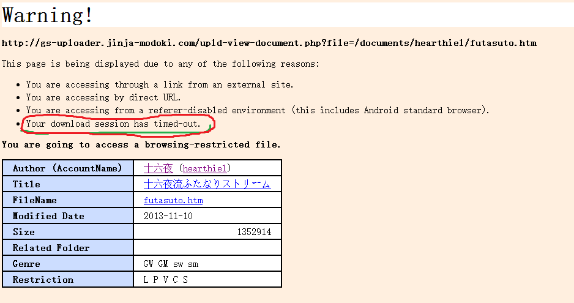
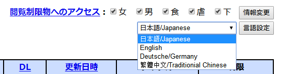

# 十六夜扶她文原文挂了。。。。。

作者：充气的妹妹

TID：23129

<title>1</title> <link href="../Styles/Style.css" type="text/css" rel="stylesheet">

# 1

1.3M的那个，我去看时，显示已经过了下载期限。。。。求各位大佬来个度盘啊。。。QWQ真心的。 <title>2</title> <link href="../Styles/Style.css" type="text/css" rel="stylesheet">

# 2

如图。。。。。好心酸啊。。。。。。。。。。。。。。。。。
<title>3</title> <link href="../Styles/Style.css" type="text/css" rel="stylesheet">

# 3

 <ignore_js_op>[QQ截图20170522154159.png](forum.php?mod=attachment&aid=Njc5NzJ8OWUzZTYyMjR8MTY3NDA2NzYxMHwxODIzMHwyMzEyOQ%3D%3D&nothumb=yes) *(18.76 KB, 下載次數: 1)*

[下載附件](forum.php?mod=attachment&aid=Njc5NzJ8OWUzZTYyMjR8MTY3NDA2NzYxMHwxODIzMHwyMzEyOQ%3D%3D&nothumb=yes)

2017-5-22 15:45 上傳  

</ignore_js_op> <title>4</title> <link href="../Styles/Style.css" type="text/css" rel="stylesheet">

# 4

你只需要点击文档题目就可以打开全文了 <title>5</title> <link href="../Styles/Style.css" type="text/css" rel="stylesheet">

# 5

*本帖最後由 餃子 於 2017-5-22 19:08 編輯*

这不是挂了，你从外部链接直接进文章都会提示这个，点一下标题或者文档名就进去了而且他这个提示只是说你进不去是因为以下原因之一，你不能直接进去的原因是you are accessing through a link from a external site
<title>6</title> <link href="../Styles/Style.css" type="text/css" rel="stylesheet">

# 6

> 1945911 發表於 2017-5-22 18:27
> 你只需要点击文档题目就可以打开全文了

点了。。。。然后重新弹回来了。。。。求大佬给个度盘啊。QWQ <title>7</title> <link href="../Styles/Style.css" type="text/css" rel="stylesheet">

# 7

> 餃子 發表於 2017-5-22 19:05
> 这不是挂了，你从外部链接直接进文章都会提示这个，点一下标题或者文档名就进去了 ...

点了无数次。。。。。都弹回来了。。。。求大佬给个度盘吧。  真心的，我晚上可以花5h翻译全文的。   真心求度盘 ，谢谢大佬啊！    <title>8</title> <link href="../Styles/Style.css" type="text/css" rel="stylesheet">

# 8

> [shike123 發表於 2017-5-22 19:06](https://giantessnight.cf/gnforum2012/forum.php?mod=redirect&goto=findpost&pid=333306&ptid=23129)
> 点了。。。。然后重新弹回来了。。。。求大佬给个度盘啊。QWQ

restriction都勾上了吗。。。这篇LPVCS限制都有
[http://gs-uploader.jinja-modoki.com/upld-index.php](http://gs-uploader.jinja-modoki.com/upld-index.php)
先登GS主页，列表右上方那个Access browsing-restricted contents :，五个勾都打上再点Change info灰色按钮就可以了
<title>9</title> <link href="../Styles/Style.css" type="text/css" rel="stylesheet">

# 9

> 餃子 發表於 2017-5-22 19:10
> restriction都勾上了吗。。。这篇LPVCS限制都有
> http://gs-uploader.jinja-modoki.com/upld-index.php
> 先 ...

哦。。。好像没有。。。。。谢谢，我再试试。 <title>10</title> <link href="../Styles/Style.css" type="text/css" rel="stylesheet">

# 10

给你放度盘了。。。我觉得就是你没勾选好阅读限制
链接：[http://pan.baidu.com/s/1miSHV7a](http://pan.baidu.com/s/1miSHV7a) 密码：pynq <title>11</title> <link href="../Styles/Style.css" type="text/css" rel="stylesheet">

# 11

> [餃子 發表於 2017-5-22 19:13](https://giantessnight.cf/gnforum2012/forum.php?mod=redirect&goto=findpost&pid=333310&ptid=23129)
> 给你放度盘了。。。我觉得就是你没勾选好阅读限制
> 链接：http://pan.baidu.com/s/1miSHV7a 密码：pynq ...

谢谢！   刚弄上，大佬就给度盘了。。。还是万分感谢！
<title>12</title> <link href="../Styles/Style.css" type="text/css" rel="stylesheet">

# 12

会外文真的很重要！！！ 只能坐等翻译了 <title>13</title> <link href="../Styles/Style.css" type="text/css" rel="stylesheet">

# 13

我这里看没事，应该是你个人问题。在界面的语言设置上面，有各种限制，可以都勾上。
不懂外语的话可以设置繁中，一般就能阅览所有了。

<ignore_js_op>

**QQ图片20170523033409.png** *(13.58 KB, 下載次數: 0)*

[下載附件](forum.php?mod=attachment&aid=Njc5ODR8NmViNWE3ZGF8MTY3NDA2NzYxMXwxODIzMHwyMzEyOQ%3D%3D&nothumb=yes)

2017-5-23 03:34 上傳</ignore_js_op>