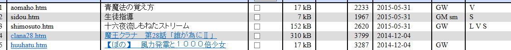

# 十六夜更新文章了

作者：Jozetto

TID：19088

<title>1</title> <link href="../Styles/Style.css" type="text/css" rel="stylesheet">

# 1

  然而对还在啃初级新标日的我来说这并没有什么卵用。
<title>2</title> <link href="../Styles/Style.css" type="text/css" rel="stylesheet">

# 2

 <ignore_js_op>[搜狗截图15年06月03日2207_1.png](forum.php?mod=attachment&aid=NTIyMDN8NjA0ZGQwZDZ8MTY3NDA2ODE0NXwxODIzMHwxOTA4OA%3D%3D&nothumb=yes) *(15.53 KB, 下載次數: 23)*

[下載附件](forum.php?mod=attachment&aid=NTIyMDN8NjA0ZGQwZDZ8MTY3NDA2ODE0NXwxODIzMHwxOTA4OA%3D%3D&nothumb=yes)

2015-6-3 22:08 上傳  

</ignore_js_op> <title>3</title> <link href="../Styles/Style.css" type="text/css" rel="stylesheet">

# 3

直接给链接不就好了，为啥还要截图
<title>4</title> <link href="../Styles/Style.css" type="text/css" rel="stylesheet">

# 4

 这都上个月的事情啦。。有个很长的排泄系列。。一倍到100亿 <title>5</title> <link href="../Styles/Style.css" type="text/css" rel="stylesheet">

# 5

话说显示黑色的链接怎么看 <title>6</title> <link href="../Styles/Style.css" type="text/css" rel="stylesheet">

# 6

同新标日路过。。。。。。。。 <title>7</title> <link href="../Styles/Style.css" type="text/css" rel="stylesheet">

# 7

我希望这次的女巨人不要太大了。 <title>8</title> <link href="../Styles/Style.css" type="text/css" rel="stylesheet">

# 8

显示黑色的在右上角那里打勾就能看了。。。
我也很晚才发现。。。 <title>9</title> <link href="../Styles/Style.css" type="text/css" rel="stylesheet">

# 9

請問大大有連結嗎?(想看... <title>10</title> <link href="../Styles/Style.css" type="text/css" rel="stylesheet">

# 10

十六夜的文字又开始爆炸了