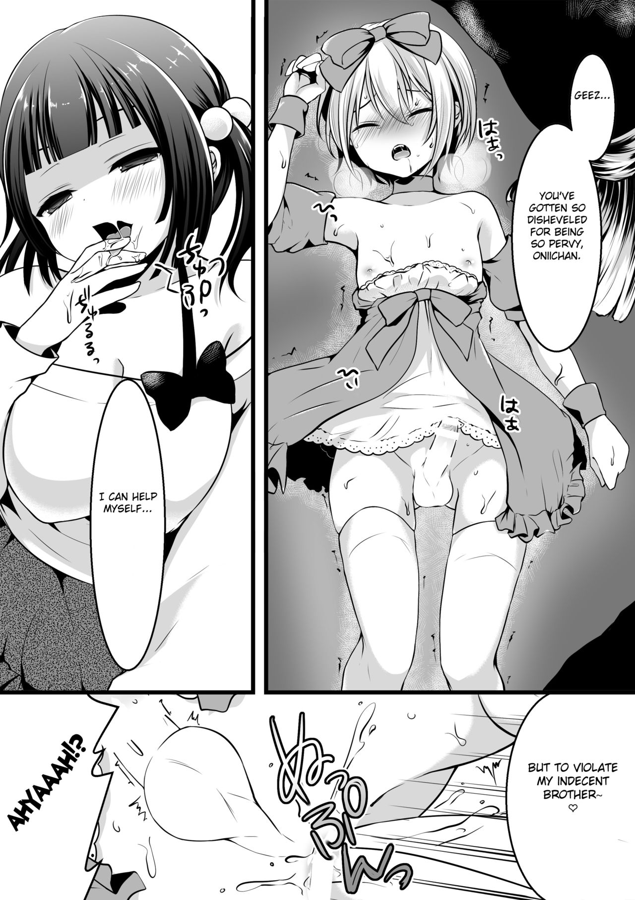
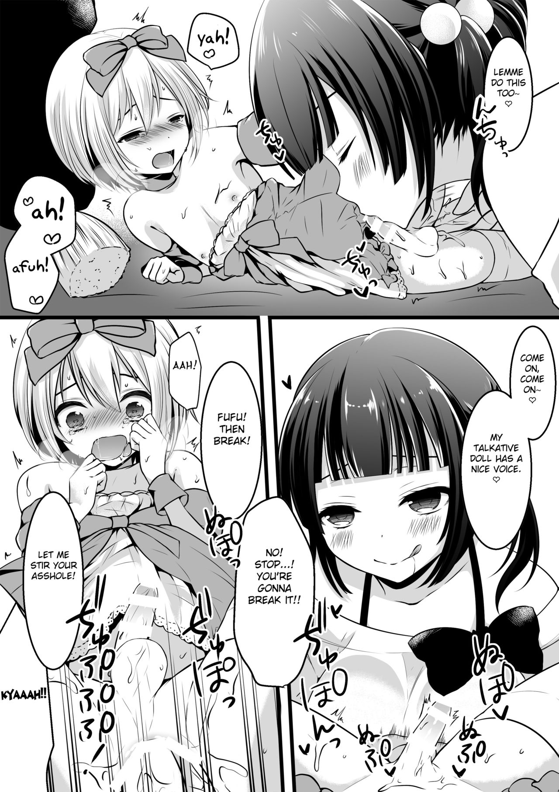
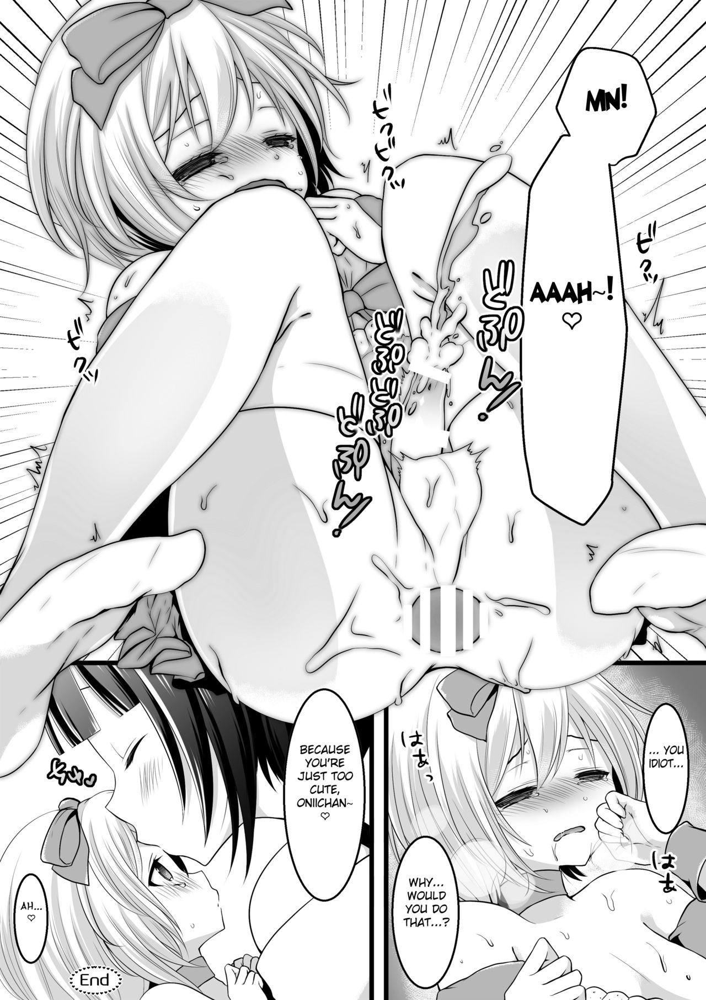
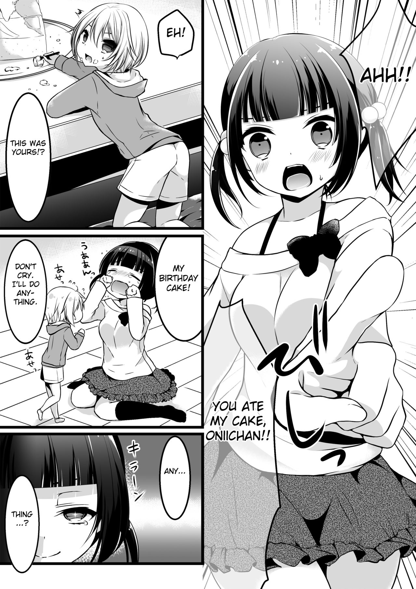
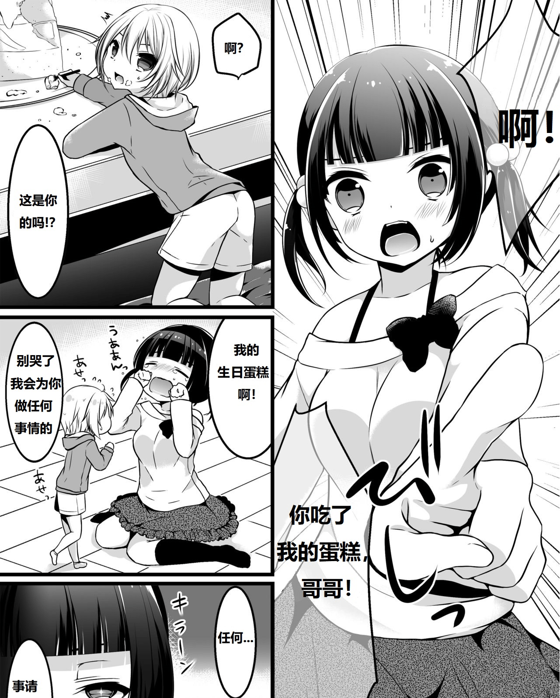

# 原图有打码，翻译是否需要进行反向工程

作者：racer0725

TID：32235

<title>1</title> <link href="../Styles/Style.css" type="text/css" rel="stylesheet">

# 1

本帖将主要探讨2个问题：
第一个问题
在翻译图片的时候，翻译者是否需要把那些原图中因种种原因，而打上的马赛克和白条，进行手动的复原工程？比如说我今天刚在论坛发布的一组图片，链接：[https://giantessnight.com/gnforu ... id=32232&extra=](https://giantessnight.com/gnforum2012/forum.php?mod=viewthread&tid=32232&extra=)
这张图片，我是否需要进行手动复原工程? 我没有无码版，我也觉得这个短篇漫画因为当地的法律不会有无码版本
<ignore_js_op>

**44.jpg** *(335.6 KB, 下載次數: 0)*

[下載附件](forum.php?mod=attachment&aid=OTI4NzN8NzhiZjhkODJ8MTY3NDA2NTcxOHwxODIzMHwzMjIzNQ%3D%3D&nothumb=yes)

2021-12-13 22:37 上傳

<ignore_js_op>

**45.jpg** *(381.61 KB, 下載次數: 0)*

[下載附件](forum.php?mod=attachment&aid=OTI4NzR8ZmZhNDcyYjh8MTY3NDA2NTcxOHwxODIzMHwzMjIzNQ%3D%3D&nothumb=yes)

2021-12-13 22:41 上傳

<ignore_js_op>

**46.jpg** *(342.98 KB, 下載次數: 0)*

[下載附件](forum.php?mod=attachment&aid=OTI4NzV8MmQ0ZTMyNGV8MTY3NDA2NTcxOHwxODIzMHwzMjIzNQ%3D%3D&nothumb=yes)

2021-12-13 22:43 上傳

第二个问题
如果翻译过程中，图片部分的对话框是半透明/透明，翻译是否需要还原移除原文字的过程对图片造成的破坏？或者直接用白色填满对话框，然后再在上面嵌入文字？
还原了图片的翻译图片和原图的对比（翻译后的图片有些不完整，下半部分被意外删除了一部分，翻译修复版在原帖）
原图
<ignore_js_op>

**39.jpg** *(392.75 KB, 下載次數: 0)*

[下載附件](forum.php?mod=attachment&aid=OTI4Nzd8YTA0M2U4MzV8MTY3NDA2NTcxOHwxODIzMHwzMjIzNQ%3D%3D&nothumb=yes)

2021-12-13 22:49 上傳

翻译后的图片
<ignore_js_op>

**39.jpg** *(577.46 KB, 下載次數: 0)*

[下載附件](forum.php?mod=attachment&aid=OTI4NzZ8MTBmZjNmNTd8MTY3NDA2NTcxOHwxODIzMHwzMjIzNQ%3D%3D&nothumb=yes)

2021-12-13 22:49 上傳

两张图片对比，可以发现出原图中的文字移除后，不可避免地会造成一定的图片破环，下面翻译后的图片是被修补过的
<title>2</title> <link href="../Styles/Style.css" type="text/css" rel="stylesheet">

# 2

啊这，看翻译者自己的意愿和能力吧

如果有那么强的能力和时间当然是修图更好……

<title>3</title> <link href="../Styles/Style.css" type="text/css" rel="stylesheet">

# 3

看翻译的能力吧，如果翻译真的nb的话那当然修图好。如果翻译的能力不足那还是不要多搞了 <title>4</title> <link href="../Styles/Style.css" type="text/css" rel="stylesheet">

# 4

能力强肯定怎么样都可以，只要够好什么都不是问题 <title>5</title> <link href="../Styles/Style.css" type="text/css" rel="stylesheet">

# 5

没有关系，LSP心中无码，原作者用来安放文字的地方，一般没有关键信息，看不看的到，对我来说基本没有影响，比起质量，更看重数量，大大加油。不会日语的LSP流下泪水。（手动滑稽） <title>6</title> <link href="../Styles/Style.css" type="text/css" rel="stylesheet">

# 6

第一个问题，我的看法是不置可否。
其一，原作者肯定有uncensored版本，仍然选择只发布了censored版；
其二，只要不是太夸张到吸睛的码，对观感的影响相对较小。与之相对的，个人感觉拟声拟态词的翻译对读者的观感提升更重要。
其三，从译者角度来说，去黑条/白条较为复杂、工作量较大。而去马赛克的话大体上是要补画了。
其四，只要有爱，什么都可以去尝试、去做。

第二个问题，这仍是个在工作量和画面质量之间求平衡的问题。无论如何，肯定是保持半透明对话框/泡，并且不损伤/修补背景的情况是最佳的。

这里简单列几个本人在自学过程中觉得比较好的修图、嵌字教程吧，既有方法论也有实操技巧。但大体上，这既是技术活，又是“用爱发电”的体力活，得看爱有多少了。
[【嵌字教程】零基础到初级](https://www.bilibili.com/video/BV1P7411s7uH)
[【漫画嵌字】漫画汉化之6分钟嵌字教程（汉化基础教程）](https://www.bilibili.com/video/BV1eW411y7Nz)
[人类高质量_女性的个人空间](https://space.bilibili.com/30821734)
[字体的分类与鉴别【蕾米莉亚的嵌字课堂——第三期重置版】](https://www.bilibili.com/video/BV1DK4y1X7i8)
[Typesetting Tutorial (English)](https://nekyou.com/2020/01/06/typesetting-tutorial/)

<title>7</title> <link href="../Styles/Style.css" type="text/css" rel="stylesheet">

# 7

1\. 看译者的意愿吧，作为看客来说，能去码当然好，不能去也不会去说什么，毕竟原作就是有码的（不过本来无码却加上码的反向操作就不好了）
2\. 个人观点还是尊重原作，尽可能的不去破坏原作风格，除非无法避免</ignore_js_op></ignore_js_op></ignore_js_op></ignore_js_op></ignore_js_op>