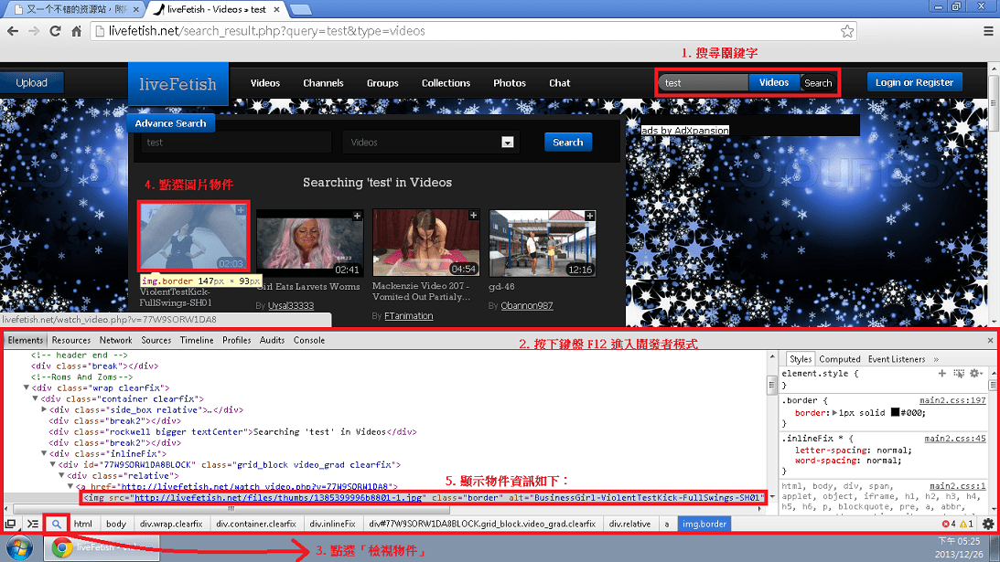
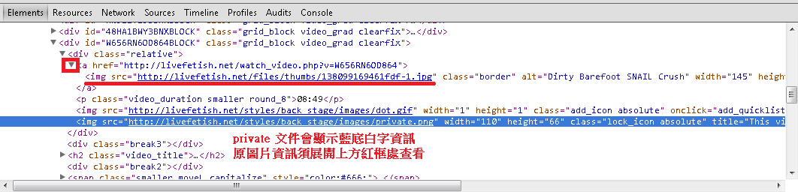

# 又一个不错的资源站，附Private视频下载方法.

作者：HEllNO

TID：15837

<title>1</title> <link href="../Styles/Style.css" type="text/css" rel="stylesheet">

# 1

*本文章最後由 Cod1945 於 2013-12-25 16:05 編輯*

因为自己所在的场所不方便，暂时不能发图片，但我会尽量用文字说明清楚.

-
1.URL: Livefetish.net，需注册免费账号，这是我见过与GTS相关最大的视频资源库，内容范围很广.

2.注册账号是免费的，填写信息就可以了. 然后在最上面点击Videos即可进入所有在线视频列表
（注意：据自己的观察，这个站的视频是没有审核机制的，或只是象征性审核，所以某些内容可能会引起不适，请从右侧Categories选择对应的内容观看）

3.没有Private标记的视频可直接观看，由于广告较多，搭配Chrome+Adblock体验更好.

4.重点是带有Private标记的视频，观看这部分视频有两个办法
  1)加发布者为好友
  2)一个自己无意间找到的方法：
     1]将光标放在Private标记上
     2]向下缓慢移动，光标会变成手掌型，此时其指向的即是Private视频的缩略图，而非Private标记
     3]依浏览器不同，复制图片地址，形式为livefetish点net/files/thumbs/XXXX-X点jpg
     4]按照这个网站缩略图与视频本体的命名规则：将上述URL当中的thumbs改为videos，XXXX-X.jpg改为XXXX.flv(删掉横杠及之后的数字，后缀改为flv，个别的时候需要改为mp4)
     5]下载，对99.9%的视频应该都有效；也可以用这个办法下载非Private的视频，因为在线观看速度经常很慢，下载相对快些.

各位慢用，先闪了. <title>2</title> <link href="../Styles/Style.css" type="text/css" rel="stylesheet">

# 2

直接用 search 找影片，也可以快速跳到步驟 4-2。

另外，要頁面資訊可以直接於該搜尋頁面按下鍵盤上的 F12 鍵，開啟開發者工具尋找相應的網址比較方便。
<title>3</title> <link href="../Styles/Style.css" type="text/css" rel="stylesheet">

# 3

注册什么的，表示激活不能 <title>4</title> <link href="../Styles/Style.css" type="text/css" rel="stylesheet">

# 4

郵箱沒收到信.............. <title>5</title> <link href="../Styles/Style.css" type="text/css" rel="stylesheet">

# 5

哦沒是被丟到垃圾信件了 <title>6</title> <link href="../Styles/Style.css" type="text/css" rel="stylesheet">

# 6

機活時給我「帳號不存在」 <title>7</title> <link href="../Styles/Style.css" type="text/css" rel="stylesheet">

# 7

> 月食 發表於 2013-12-25 17:26 
> 注册什么的，表示激活不能

看看是不是激活邮件被归类到垃圾邮件了。把Activation Code填进去确定以后可能会出现该用户已激活的提示，这时候直接登陆就可以了...
<title>8</title> <link href="../Styles/Style.css" type="text/css" rel="stylesheet">

# 8

感觉太杂了，还是算了 <title>9</title> <link href="../Styles/Style.css" type="text/css" rel="stylesheet">

# 9

> Cod1945 發表於 2013-12-25 21:03 
> 看看是不是激活邮件被归类到垃圾邮件了。把Activation Code填进去确定以后可能会出现该用户已激活的提示 ...

不过确实是提示账号激活了，不过就是怎么也登陆不上，点击确定也只是在原界面刷新一下而已，还是提示要登录，貌似要跪
<title>10</title> <link href="../Styles/Style.css" type="text/css" rel="stylesheet">

# 10

*本文章最後由 sdsd789 於 2013-12-26 12:03 編輯*

事实上根本不需要注册，按楼主的方法直接下载要更方便，我下载都是满速

对楼主的感谢无以言表 <title>11</title> <link href="../Styles/Style.css" type="text/css" rel="stylesheet">

# 11

用楼主方法下载无论如何缩略图都出不来livefetish点net/files/thumbs/XXXX-X点jpg的格式，不知道啥情况 <title>12</title> <link href="../Styles/Style.css" type="text/css" rel="stylesheet">

# 12

这个资源 逆天了~好多好多好多 好东东，赶紧下赶紧下~谢谢楼主 分享！ <title>13</title> <link href="../Styles/Style.css" type="text/css" rel="stylesheet">

# 13

*本文章最後由 tony12345678 於 2013-12-30 23:25 編輯*

> cbfcool 發表於 2013-12-26 16:07 
> 用楼主方法下载无论如何缩略图都出不来livefetish点net/files/thumbs/XXXX-X点jpg的格式，不知道啥情况 ...

以下為使用 Chrome 的範例（其他瀏覽器的開發者工具請自行摸索）。

圖有點小，可能要開新分頁才能看得比較清楚。

<ignore_js_op>

**01.png** *(573.63 KB, 下載次數: 1)*

[下載附件](forum.php?mod=attachment&aid=Mzg4NDF8NTJiZDVhODN8MTY3NDA2ODM2NnwxODIzMHwxNTgzNw%3D%3D&nothumb=yes)

2013-12-26 17:35 上傳

<ignore_js_op>

**02.png** *(20.39 KB, 下載次數: 1)*

[下載附件](forum.php?mod=attachment&aid=Mzg4NDJ8Y2Y0YjRiMzh8MTY3NDA2ODM2NnwxODIzMHwxNTgzNw%3D%3D&nothumb=yes)

2013-12-26 17:35 上傳

<title>14</title> <link href="../Styles/Style.css" type="text/css" rel="stylesheet">

# 14

碉堡了。要买的片子也不用买了 <title>15</title> <link href="../Styles/Style.css" type="text/css" rel="stylesheet">

# 15

激活后重新刷新页面，激活不了 <title>16</title> <link href="../Styles/Style.css" type="text/css" rel="stylesheet">

# 16

用户不存在啊…… <title>17</title> <link href="../Styles/Style.css" type="text/css" rel="stylesheet">

# 17

比较好奇lz是如何发现这伟大的秘密的 <title>18</title> <link href="../Styles/Style.css" type="text/css" rel="stylesheet">

# 18

楼主能再详细说说下载方法吗，我也弄不出livefetish点net/files/thumbs/XXXX-X点jpg的格式，而且真不知怎样下载啊，谢谢 <title>19</title> <link href="../Styles/Style.css" type="text/css" rel="stylesheet">

# 19

谢谢，已经学会用，但貌似有些时候所有的都无效，不知是何原因 <title>20</title> <link href="../Styles/Style.css" type="text/css" rel="stylesheet">

# 20

希望楼主能提供几个比较好的视频，本人比较懒 <title>21</title> <link href="../Styles/Style.css" type="text/css" rel="stylesheet">

# 21

这个网站貌似已经不能用了 <title>22</title> <link href="../Styles/Style.css" type="text/css" rel="stylesheet">

# 22

求解答怎么下载 谢谢 <title>23</title> <link href="../Styles/Style.css" type="text/css" rel="stylesheet">

# 23

费了我1个多小时 才搞定
哎，智商被压制了 <title>24</title> <link href="../Styles/Style.css" type="text/css" rel="stylesheet">

# 24

哎，智商一直被被压制中。咋就不会整啊，求胖猪 <title>25</title> <link href="../Styles/Style.css" type="text/css" rel="stylesheet">

# 25

网站好像挂了…… <title>26</title> <link href="../Styles/Style.css" type="text/css" rel="stylesheet">

# 26

貌似是挂了吧 <title>27</title> <link href="../Styles/Style.css" type="text/css" rel="stylesheet">

# 27

没有挂啊 ？                <title>28</title> <link href="../Styles/Style.css" type="text/css" rel="stylesheet">

# 28

这网站老帅了 感谢楼主的分享 以及超强的探索能力…… <title>29</title> <link href="../Styles/Style.css" type="text/css" rel="stylesheet">

# 29

账号不存在 <title>30</title> <link href="../Styles/Style.css" type="text/css" rel="stylesheet">

# 30

怎么下呀 <title>31</title> <link href="../Styles/Style.css" type="text/css" rel="stylesheet">

# 31

感谢楼主提供的方法，都不需要注册了 <title>32</title> <link href="../Styles/Style.css" type="text/css" rel="stylesheet">

# 32

多谢楼主分享 终于能下载了 <title>33</title> <link href="../Styles/Style.css" type="text/css" rel="stylesheet">

# 33

感谢楼主 <title>34</title> <link href="../Styles/Style.css" type="text/css" rel="stylesheet">

# 34

有这样的方法啊，哈哈，有好多private的视频想看，谢谢lz，马上去试试看看好不好使 <title>35</title> <link href="../Styles/Style.css" type="text/css" rel="stylesheet">

# 35

亲测，有效，谢谢lz无私奉献，这下可以大饱眼福了，哈哈 <title>36</title> <link href="../Styles/Style.css" type="text/css" rel="stylesheet">

# 36

在图标上缓慢下移，到图片边缘的时候，会变成手型，点右键，点属性，就可以看到连接了，不要看你浏览器底部的地址栏里反映出来的链接</ignore_js_op></ignore_js_op>