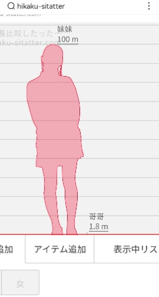
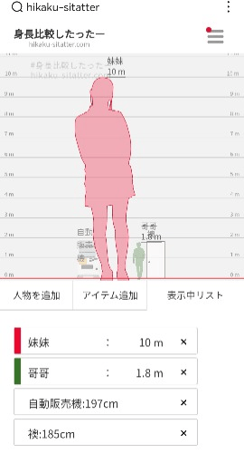
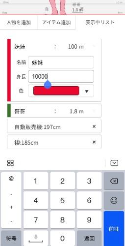

# 发现了一个可以做身高对比的网站

作者：神樂♀

TID：34069

<title>1</title> <link href="../Styles/Style.css" type="text/css" rel="stylesheet">

# 1

https://hikaku-sitatter.com/
操作简单，有物品的对比 <title>2</title> <link href="../Styles/Style.css" type="text/css" rel="stylesheet">

# 2

效果如图
可以有和物体的对比，但身高上限为1000m
没有明显的比较，但有一种朦胧的美，而且身体各部位的差距更加直观和明显，可以为广大作者提供思路（大概） <title>3</title> <link href="../Styles/Style.css" type="text/css" rel="stylesheet">

# 3

 <ignore_js_op>[Screenshot_20220907_231659_com.baidu.searchbox_edit_565573486260050.jpg](forum.php?mod=attachment&aid=OTkxMjJ8NTg5N2U0ZGZ8MTY3NDA2NTMwMHwxODIzMHwzNDA2OQ%3D%3D&nothumb=yes) *(17.27 KB, 下載次數: 1)*

[下載附件](forum.php?mod=attachment&aid=OTkxMjJ8NTg5N2U0ZGZ8MTY3NDA2NTMwMHwxODIzMHwzNDA2OQ%3D%3D&nothumb=yes)

2022-9-7 23:18 上傳  

</ignore_js_op> <ignore_js_op>[Screenshot_20220907_231728_com.baidu.searchbox_edit_565591207279839.jpg](forum.php?mod=attachment&aid=OTkxMjN8NDJhYjM1NDF8MTY3NDA2NTMwMHwxODIzMHwzNDA2OQ%3D%3D&nothumb=yes) *(23.7 KB, 下載次數: 0)*

[下載附件](forum.php?mod=attachment&aid=OTkxMjN8NDJhYjM1NDF8MTY3NDA2NTMwMHwxODIzMHwzNDA2OQ%3D%3D&nothumb=yes)

2022-9-7 23:18 上傳  

</ignore_js_op> <ignore_js_op>[Screenshot_20220907_231718_com.baidu.searchbox_edit_565585470027236.jpg](forum.php?mod=attachment&aid=OTkxMjR8ZTQxYzk0NWV8MTY3NDA2NTMwMHwxODIzMHwzNDA2OQ%3D%3D&nothumb=yes) *(23.3 KB, 下載次數: 0)*

[下載附件](forum.php?mod=attachment&aid=OTkxMjR8ZTQxYzk0NWV8MTY3NDA2NTMwMHwxODIzMHwzNDA2OQ%3D%3D&nothumb=yes)

2022-9-7 23:18 上傳  

</ignore_js_op> <title>4</title> <link href="../Styles/Style.css" type="text/css" rel="stylesheet">

# 4

这个很有意思，因为我们一般很难想象体积的变化，原来6m其实已经很大了 <title>5</title> <link href="../Styles/Style.css" type="text/css" rel="stylesheet">

# 5

挺好玩儿，不过上限1000米有点耐人寻味呢 <title>6</title> <link href="../Styles/Style.css" type="text/css" rel="stylesheet">

# 6

看起来挺有意思的，不过好像极限有点小呢 <title>7</title> <link href="../Styles/Style.css" type="text/css" rel="stylesheet">

# 7

挺好的，也能够满足一下大部分的幻想啦 <title>8</title> <link href="../Styles/Style.css" type="text/css" rel="stylesheet">

# 8

虽然但是，也好有感觉的，那种压迫感还是能够感受到 <title>9</title> <link href="../Styles/Style.css" type="text/css" rel="stylesheet">

# 9

喜欢这种身高对比，很多作者的作品里也有 <title>10</title> <link href="../Styles/Style.css" type="text/css" rel="stylesheet">

# 10

确实单看剪影的轮廓有一种模糊的美，而且更为突出极端的大小差。哇 <title>11</title> <link href="../Styles/Style.css" type="text/css" rel="stylesheet">

# 11

看起来确实不错，有一种朦胧的美感 <title>12</title> <link href="../Styles/Style.css" type="text/css" rel="stylesheet">

# 12

虽然比例差到最大就已经是一条线了 但比想象中有意思哎