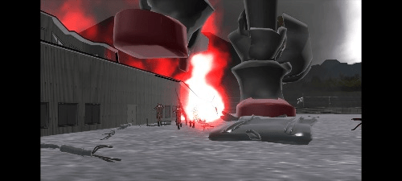
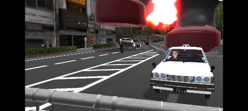
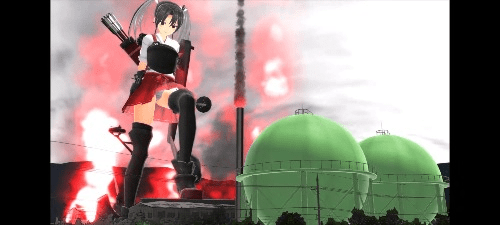
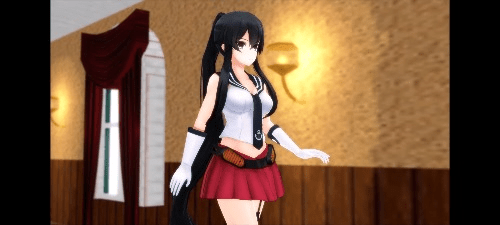
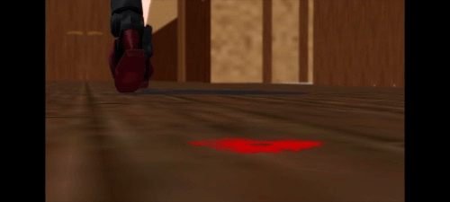

# 发现了一个质量非常高的mmd作者

作者：libnx

TID：34200

<title>1</title> <link href="../Styles/Style.css" type="text/css" rel="stylesheet">

# 1

推特https://twitter.com/rsk_crush?t=QfI6viAAM7fbqOgWg0UgBQ&s=09，我认为是圈内质量最高的mmd作者，不知道大家还知不知道类似的推荐一下 <title>2</title> <link href="../Styles/Style.css" type="text/css" rel="stylesheet">

# 2

 <ignore_js_op>[Screenshot_2022-10-02-09-52-54-847_com.miui.gallery.jpg](forum.php?mod=attachment&aid=OTk2MDl8NDZjNDEzNzB8MTY3NDA2OTI5M3wxODIzMHwzNDIwMA%3D%3D&nothumb=yes) *(25.46 KB, 下載次數: 0)*

[下載附件](forum.php?mod=attachment&aid=OTk2MDl8NDZjNDEzNzB8MTY3NDA2OTI5M3wxODIzMHwzNDIwMA%3D%3D&nothumb=yes)

2022-10-2 10:01 上傳  

</ignore_js_op> <ignore_js_op>[Screenshot_2022-10-02-09-54-33-256_com.miui.gallery.jpg](forum.php?mod=attachment&aid=OTk2MTB8NjU2NTFjNzB8MTY3NDA2OTI5M3wxODIzMHwzNDIwMA%3D%3D&nothumb=yes) *(29.9 KB, 下載次數: 1)*

[下載附件](forum.php?mod=attachment&aid=OTk2MTB8NjU2NTFjNzB8MTY3NDA2OTI5M3wxODIzMHwzNDIwMA%3D%3D&nothumb=yes)

2022-10-2 10:02 上傳  

</ignore_js_op> <ignore_js_op>[Screenshot_2022-10-02-09-55-22-896_com.miui.gallery.jpg](forum.php?mod=attachment&aid=OTk2MTF8YjI3ZDU5YTB8MTY3NDA2OTI5M3wxODIzMHwzNDIwMA%3D%3D&nothumb=yes) *(27.56 KB, 下載次數: 0)*

[下載附件](forum.php?mod=attachment&aid=OTk2MTF8YjI3ZDU5YTB8MTY3NDA2OTI5M3wxODIzMHwzNDIwMA%3D%3D&nothumb=yes)

2022-10-2 10:02 上傳  

</ignore_js_op> <ignore_js_op>[Screenshot_2022-10-02-09-55-58-842_com.miui.gallery.jpg](forum.php?mod=attachment&aid=OTk2MTJ8ODgzMmQ3ZjZ8MTY3NDA2OTI5M3wxODIzMHwzNDIwMA%3D%3D&nothumb=yes) *(27.02 KB, 下載次數: 0)*

[下載附件](forum.php?mod=attachment&aid=OTk2MTJ8ODgzMmQ3ZjZ8MTY3NDA2OTI5M3wxODIzMHwzNDIwMA%3D%3D&nothumb=yes)

2022-10-2 10:02 上傳  

</ignore_js_op> <ignore_js_op>[Screenshot_2022-10-02-09-57-16-248_com.miui.gallery.jpg](forum.php?mod=attachment&aid=OTk2MTN8ZGNhZmRmNjR8MTY3NDA2OTI5M3wxODIzMHwzNDIwMA%3D%3D&nothumb=yes) *(13.4 KB, 下載次數: 1)*

[下載附件](forum.php?mod=attachment&aid=OTk2MTN8ZGNhZmRmNjR8MTY3NDA2OTI5M3wxODIzMHwzNDIwMA%3D%3D&nothumb=yes)

2022-10-2 10:02 上傳  

</ignore_js_op> <title>3</title> <link href="../Styles/Style.css" type="text/css" rel="stylesheet">

# 3

诶话说什么是mmd啊到底，好像我也不很清楚，但感觉类似风格的应该还是gonzres做的最好，不是吗。当然我不知道他是不是mmd了.. <title>4</title> <link href="../Styles/Style.css" type="text/css" rel="stylesheet">

# 4

> freepenguin2 發表於 2022-10-2 12:15
> 诶话说什么是mmd啊到底，好像我也不很清楚，但感觉类似风格的应该还是gonzres做的最好，不是吗。当然我不知 ...

类型不一样，gonzre主要是做giga的，这位主要内容是残忍踩踏的 <title>5</title> <link href="../Styles/Style.css" type="text/css" rel="stylesheet">

# 5

> [freepenguin2 發表於 2022-10-2 12:15](https://giantessnight.cf/gnforum2012/forum.php?mod=redirect&goto=findpost&pid=516926&ptid=34200)
> 诶话说什么是mmd啊到底，好像我也不很清楚，但感觉类似风格的应该还是gonzres做的最好，不是吗。当然我不知 ...

有个软件叫MMD MikuMikuDance
<title>6</title> <link href="../Styles/Style.css" type="text/css" rel="stylesheet">

# 6

> [libnx 發表於 2022-10-2 14:28](https://giantessnight.cf/gnforum2012/forum.php?mod=redirect&goto=findpost&pid=516934&ptid=34200)
> 类型不一样，gonzre主要是做giga的，这位主要内容是残忍踩踏的

啊这样，原来是风格不同的缘故。
<title>7</title> <link href="../Styles/Style.css" type="text/css" rel="stylesheet">

# 7

> [餃子 發表於 2022-10-2 18:46](https://giantessnight.cf/gnforum2012/forum.php?mod=redirect&goto=findpost&pid=516946&ptid=34200)
> 有个软件叫MMD MikuMikuDance

哈哈哈，原来如此，确实不很了解这些了，只是看而不懂..
<title>8</title> <link href="../Styles/Style.css" type="text/css" rel="stylesheet">

# 8

> [freepenguin2 發表於 2022-10-2 12:15](https://giantessnight.cf/gnforum2012/forum.php?mod=redirect&goto=findpost&pid=516926&ptid=34200)
> 诶话说什么是mmd啊到底，好像我也不很清楚，但感觉类似风格的应该还是gonzres做的最好，不是吗。当然我不知 ...

MMD的确是Miku Miku Dance这个软件的名字。

但是如今，Miku Miku Dance也已经是非常非常老的软件了。

所以一般，骑士“MMD风格”的东西，现在也都统称为MMD了。

有代表性的比如说VR Chat，大多数人都很喜欢用MMD风格的模型。

毕竟事到如今，“MMD”可以用各种软件制作，比如甚至Source Film Maker什么的。

虽然我具体不太了解，但是感觉很多复杂的渲染和Shader什么的，MMD已经不擅长了？
<title>9</title> <link href="../Styles/Style.css" type="text/css" rel="stylesheet">

# 9

> [狐乐 發表於 2022-10-4 03:42](https://giantessnight.cf/gnforum2012/forum.php?mod=redirect&goto=findpost&pid=517034&ptid=34200)
> MMD的确是Miku Miku Dance这个软件的名字。
> 
> 但是如今，Miku Miku Dance也已经是非常非常老的软件了。

对，我一直感觉mmd是一种风格来着，毕竟如果真的是软件，那也太古老了
<title>10</title> <link href="../Styles/Style.css" type="text/css" rel="stylesheet">

# 10

技术看上去应该还是初学者，不过剧情质量确实挺高的，话说这个作者很神秘啊，连关注都要通过才行 <title>11</title> <link href="../Styles/Style.css" type="text/css" rel="stylesheet">

# 11

这位算是踩踏控，最新作是个百倍缩小，个人还是很喜欢的ww