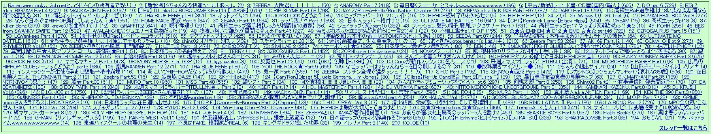

# 只有我一个人觉得日本的BBS排版反人类吗。。。

作者：罗三炮

TID：16972

<title>1</title> <link href="../Styles/Style.css" type="text/css" rel="stylesheet">

# 1

*本帖最後由 餃子 於 2014-6-1 14:15 編輯*

GS完全搞不清排版啊喂，据说是最大BBS的2ch也这样啊，也没有用户头像啥的，就感觉一堆字直接丢在那儿。楼层还不能直接附图，只能附上图的链接点开看，这TM是逗我呢
日本国内是没有discuz之类的模板吗！求百度贴吧占领日本市场啊喂，墙了大陆IP也可以啊
总觉得只有论坛是这样。。。博客视频网之类的都和国内差不多。。。

<ignore_js_op>

**J6BER1M9O9{18JHD3Q~59.jpg** *(386.45 KB, 下載次數: 2)*

[下載附件](forum.php?mod=attachment&aid=NDMzNTV8MmEyOGRjYTl8MTY3NDA2ODk2NXwxODIzMHwxNjk3Mg%3D%3D&nothumb=yes)

2014-6-1 14:06 上傳

↑这尼玛什么玩意儿逗我。。。

<title>2</title> <link href="../Styles/Style.css" type="text/css" rel="stylesheet">

# 2

一直受不了国内Discuz这么乱的模版的。。。

其实我很喜欢日本的那种匿名版一样的，纯粹只看信息的地方。

相比之下，文字一行，表情两行，头像四行，签名八行。。。。你TM在逗我？ <title>3</title> <link href="../Styles/Style.css" type="text/css" rel="stylesheet">

# 3

 哎。。。会觉得反人类的吗？   我到是国内国外的我都很习惯。。。能找到需要的东西就行了啊。。
国内的这种用处最大在于让人会珍惜自己的账号吧。。。。匿名版的话 我想做啥都行吧 <title>4</title> <link href="../Styles/Style.css" type="text/css" rel="stylesheet">

# 4

*本帖最後由 ssn21 於 2014-6-1 13:57 編輯*

主要是日本的BBS文化起始，发展都比国内快不止一步，那批BBS的早期用户在互联网的洪荒时代恐怕就已经习惯了这样简洁（陋）的设计，硬要改的话也会不习惯吧....瞎猜的

不过这样节省空间是肯定的了

2CH的话有专用的2CH浏览器，看起来版面会好一些
<title>5</title> <link href="../Styles/Style.css" type="text/css" rel="stylesheet">

# 5

不是太习惯，但是能忍，所需要的信息一般也找得到。我还是喜欢discuz <title>6</title> <link href="../Styles/Style.css" type="text/css" rel="stylesheet">

# 6

喜欢国内的大部分论坛 我觉得也挺简洁的 而且重要帖子 资源等有高亮有各种强调 不用搜索也可以一目了然 比较贴近我这种人类的使用习惯 <title>7</title> <link href="../Styles/Style.css" type="text/css" rel="stylesheet">

# 7

匿名版有匿名版的优点，DZ的话更注重交互性吧 <title>8</title> <link href="../Styles/Style.css" type="text/css" rel="stylesheet">

# 8

你点右下角，有个选项，能排序成一行一个主题 <title>9</title> <link href="../Styles/Style.css" type="text/css" rel="stylesheet">

# 9

他们最后还是会喜欢中国风格的，他们那种太老了，几十年都不变的，等老人都退休了怎么办？
<title>10</title> <link href="../Styles/Style.css" type="text/css" rel="stylesheet">

# 10

其实对于无力翻墙的我，这都不重要 <title>11</title> <link href="../Styles/Style.css" type="text/css" rel="stylesheet">

# 11

看到这张图片，我只想说，这都写的啥，一个字都看不懂。。。。。。 <title>12</title> <link href="../Styles/Style.css" type="text/css" rel="stylesheet">

# 12

这个确实看着眼疼...... <title>13</title> <link href="../Styles/Style.css" type="text/css" rel="stylesheet">

# 13

都行吧，目标只是那些需要的，其他都可以无视 <title>14</title> <link href="../Styles/Style.css" type="text/css" rel="stylesheet">

# 14

基于不会日语的我，完全不觉得有什么关系 <title>15</title> <link href="../Styles/Style.css" type="text/css" rel="stylesheet">

# 15

日本的BBS的模块确实很不好，反人类操作和排版，毕竟discuz也可以匿名，也轻松。</ignore_js_op>