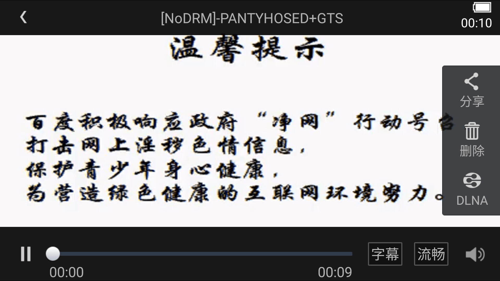

# 可恶的百度云盘！竟然和谐了！我没下载下来啊！

作者：琉璃灬岁月

TID：22118

<title>1</title> <link href="../Styles/Style.css" type="text/css" rel="stylesheet">

# 1

<ignore_js_op>

**Screenshot_2016-11-04-00-10-28-002_com.baidu.netdisk.png** *(598.14 KB, 下載次數: 0)*

[下載附件](forum.php?mod=attachment&aid=NjU0MDh8ZmQ0NmE3ZjF8MTY3NDA2NzgyM3wxODIzMHwyMjExOA%3D%3D&nothumb=yes)

2016-11-4 00:14 上傳

难道这些审核员还看网盘里的内容呢！
后悔没有下载到本地，谁有这个啊！
<title>2</title> <link href="../Styles/Style.css" type="text/css" rel="stylesheet">

# 2

骚年，没用的，碰到这种事也只能认了。 <title>3</title> <link href="../Styles/Style.css" type="text/css" rel="stylesheet">

# 3

23333333开扫的时候我就已经觉得不对了，买移动硬盘吧大兄弟，比云保险多了 <title>4</title> <link href="../Styles/Style.css" type="text/css" rel="stylesheet">

# 4

笨，添加压缩包啊，我有一半的视频都已经牺牲了，现在学乖了，横竖办过会员之后，可以在线解压看 <title>5</title> <link href="../Styles/Style.css" type="text/css" rel="stylesheet">

# 5

想不和谐的办法
把别人分享给你的资源。下载下来 改个名字，然后再上传上去
只要你不分享出去 就不会被检测到

那些被和谐的视频 基本都是传了N次的 <title>6</title> <link href="../Styles/Style.css" type="text/css" rel="stylesheet">

# 6

做成图片格式压缩包。。。保险。。 <title>7</title> <link href="../Styles/Style.css" type="text/css" rel="stylesheet">

# 7

360云盘，安全存储的云盘 <title>8</title> <link href="../Styles/Style.css" type="text/css" rel="stylesheet">

# 8

> 田棒棒 發表於 2016-11-4 08:53
> 在百度担心资源被和谐的话，就是，除了压缩和做私密分享，还有文件改名也不容易被找。因为和谐听说基本是关 ...

我最近倒是为了找出老资源本名，比如sizezone的。找了很多次。压缩设密改名这个建议不错。解压后还是原来名字就行了。 <title>9</title> <link href="../Styles/Style.css" type="text/css" rel="stylesheet">

# 9

> luffyoo 發表於 2016-11-4 08:28
> 笨，添加压缩包啊，我有一半的视频都已经牺牲了，现在学乖了，横竖办过会员之后，可以在线解压看 ...

压缩还得设置密码。老早听说度娘可以自己解压审核里面的内容的。。就是不知道是否正确不过为了保险还是设密稳妥 <title>10</title> <link href="../Styles/Style.css" type="text/css" rel="stylesheet">

# 10

360云盘，安全存储的云盘 <title>11</title> <link href="../Styles/Style.css" type="text/css" rel="stylesheet">

# 11

兄弟我刚刚去youtube找了一下也没有。。。连最大的视频网站都没有。。。真的没人帮得了你了</ignore_js_op>