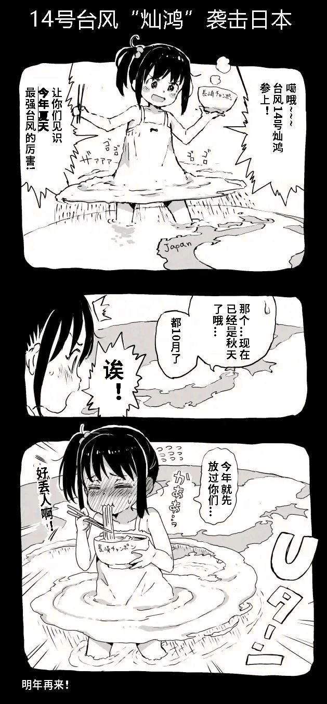

# 台风都能GTS化了么 酷

作者：Vanmilos

TID：29682

<title>1</title> <link href="../Styles/Style.css" type="text/css" rel="stylesheet">

# 1

如图：
<ignore_js_op>

**c79f252aa1081690051a9e1feb9d667.jpg** *(237.52 KB, 下載次數: 8)*

[下載附件](forum.php?mod=attachment&aid=ODU2ODR8ZDU1NTZjOTJ8MTY3NDA2NjI3MHwxODIzMHwyOTY4Mg%3D%3D&nothumb=yes)

2020-10-15 17:26 上傳

    <ignore_js_op>

**ddbd8729df8d55ae02a4bb37b0a6ee0.jpg** *(242.58 KB, 下載次數: 2)*

[下載附件](forum.php?mod=attachment&aid=ODU2ODV8ZjE4M2RmZGJ8MTY3NDA2NjI3MHwxODIzMHwyOTY4Mg%3D%3D&nothumb=yes)

2020-10-15 17:26 上傳

我好像在论坛里没看过有人发这个， 就转过来了（应该没有火星吧）。

感觉也挺有意思的，印象中好像看过巨大娘破坏台风的文章，但是不记得有把台风描写成女巨人的
<title>2</title> <link href="../Styles/Style.css" type="text/css" rel="stylesheet">

# 2

快进到进入台风眼—— <title>3</title> <link href="../Styles/Style.css" type="text/css" rel="stylesheet">

# 3

[禦免なさい筆下的娘化台風“燦鴻醬”](https://giantessnight.com/gnforum2012/forum.php?mod=viewthread&tid=29657&extra=page%3D1)

之前有人發過了 還是感謝你的資訊
<title>4</title> <link href="../Styles/Style.css" type="text/css" rel="stylesheet">

# 4

  把台风拟人化的话，我记得有个“台风酱”还是“台风娘”就是了。主角能看到事物的拟人形态（还是灵体来着），有次在电视上看到台风要来的消息，而且看语气还不是第一次，应该是发生过几次了，如果对台风巨大娘化感兴趣的话我建议可以去看看

PS:在论坛内搜了下”台风“、”飓风“都搜不到，应该是我在其他地方看到的， <title>5</title> <link href="../Styles/Style.css" type="text/css" rel="stylesheet">

# 5

为什么不是御姐！！！（震声） <title>6</title> <link href="../Styles/Style.css" type="text/css" rel="stylesheet">

# 6

4楼还是厉害啊， 看来确实撞车了

emmmmm 5楼的老哥搜关键词都没搜到 帖子真的是深藏不漏 <title>7</title> <link href="../Styles/Style.css" type="text/css" rel="stylesheet">

# 7

*本帖最後由 Airfry 於 2020-10-16 22:50 編輯*

不知道编辑后会不会有提醒，就用新楼层来再说说吧
其实台风娘早就有相关的图和文了，上次找不到是用了简体的“台风”，后来想了下改为用繁体的“颱風”后就搜出了以前看的短篇文章《颱風》：[https://giantessnight.com/gnforu ... =%E9%A2%B1%E9%A2%A8](https://giantessnight.com/gnforum2012/forum.php?mod=viewthread&tid=21885&highlight=%E9%A2%B1%E9%A2%A8)

这个是搜到的图：[https://giantessnight.com/gnforu ... =%E9%A2%B1%E9%A2%A8](https://giantessnight.com/gnforum2012/forum.php?mod=viewthread&tid=17396&highlight=%E9%A2%B1%E9%A2%A8)
以及以前就有大佬整合过的帖子：[https://giantessnight.com/gnforu ... =%E9%A2%B1%E9%A2%A8](https://giantessnight.com/gnforum2012/forum.php?mod=viewthread&tid=25516&highlight=%E9%A2%B1%E9%A2%A8)（这几个帖子下面的回复也有些其他同好找到的资源）

<title>8</title> <link href="../Styles/Style.css" type="text/css" rel="stylesheet">

# 8

你发重复了！好像确实撞贴了，几天前坛内有人发过跟你一模一样的内容 <title>9</title> <link href="../Styles/Style.css" type="text/css" rel="stylesheet">

# 9

台风娘我还是最喜欢但大的的这篇
[https://giantessnight.com/dgustory/other_story/twind.htm](https://giantessnight.com/dgustory/other_story/twind.htm) <title>10</title> <link href="../Styles/Style.css" type="text/css" rel="stylesheet">

# 10

> [Airfry 發表於 2020-10-16 22:46](https://giantessnight.cf/gnforum2012/forum.php?mod=redirect&goto=findpost&pid=450168&ptid=29682)
> 不知道编辑后会不会有提醒，就用新楼层来再说说吧
> 其实台风娘早就有相关的图和文了，上次找不到是用了简体 ...

细啊老哥 整合辛苦了
这次学到了，要简体繁体都试试看，说不定又能在论坛找到宝贝了
<title>11</title> <link href="../Styles/Style.css" type="text/css" rel="stylesheet">

# 11

这个之前好像看到有人发过和你一样的</ignore_js_op></ignore_js_op>