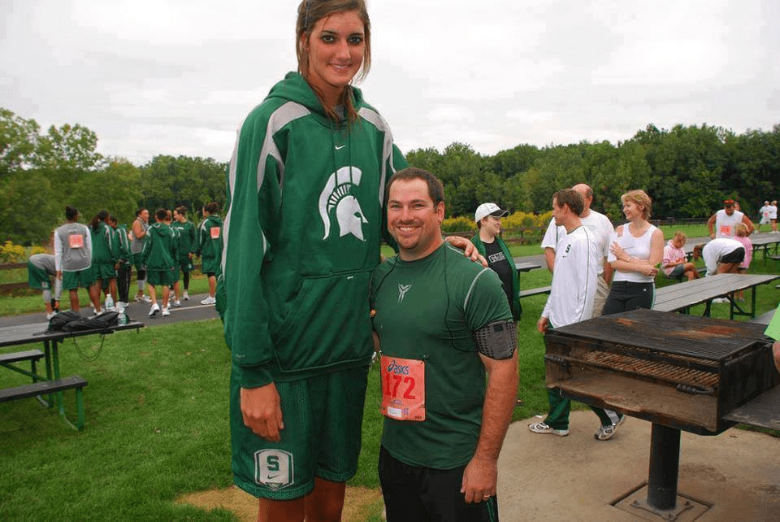

# 史上相差最多身高的情侶？

作者：Solexight

TID：15737

<title>1</title> <link href="../Styles/Style.css" type="text/css" rel="stylesheet">

# 1

<ignore_js_op>

**995259_330070633797814_1668835799_n.jpg** *(81.73 KB, 下載次數: 0)*

[下載附件](forum.php?mod=attachment&aid=Mzg2NzR8NWE5YzNkMWN8MTY3NDA2OTkzOHwxODIzMHwxNTczNw%3D%3D&nothumb=yes)

2013-12-12 13:29 上傳

找的新聞出處 請自行翻譯
[http://www.mlive.com/weddings/in ... allyssa_dehaan.html](http://www.mlive.com/weddings/index.ssf/2011/12/aaron_clark_to_allyssa_dehaan.html)

女主角叫做Allyssa DeHaan 長得滿漂亮的
身高 約205公分
在GOOGLE圖片鍵入Allyssa DeHaan可以找到很多圖..
應該是在GTS圈變成一個幻想的對象了...

手邊有很多原創或是相關資源..但是求獎勵點..不求多
至少想知道這個評分系統有在運作..不然說真的我有時也很懶得發上來..

<title>2</title> <link href="../Styles/Style.css" type="text/css" rel="stylesheet">

# 2

男的多高?
我所知的,有差一公尺,是男矮女不算高 <title>3</title> <link href="../Styles/Style.css" type="text/css" rel="stylesheet">

# 3

幸福的男人。 <title>4</title> <link href="../Styles/Style.css" type="text/css" rel="stylesheet">

# 4

看她的服装，她是什么运动的运动员吗？ <title>5</title> <link href="../Styles/Style.css" type="text/css" rel="stylesheet">

# 5

我猜她跳高是个好手 <title>6</title> <link href="../Styles/Style.css" type="text/css" rel="stylesheet">

# 6

她是籃球+排球運動好手 真的找到滿多她的圖片 <title>7</title> <link href="../Styles/Style.css" type="text/css" rel="stylesheet">

# 7

seems 240cm</ignore_js_op>