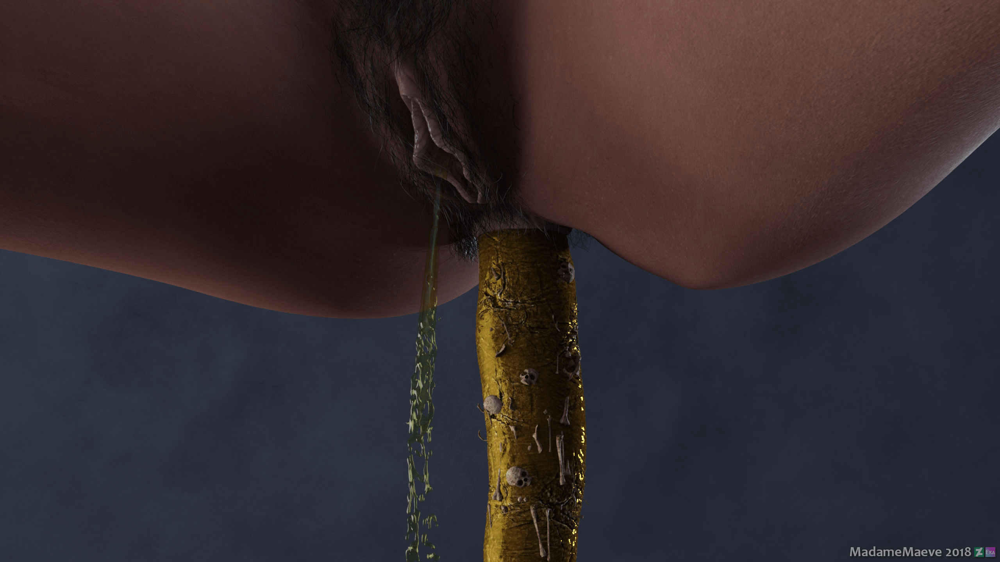
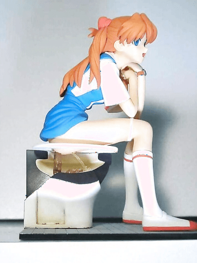

# 吃小人后杀死和消化

作者：heroneverdie

TID：26105

<title>1</title> <link href="../Styles/Style.css" type="text/css" rel="stylesheet">

# 1

在很多故事中，小人被吃下后很快就被胃液杀死和消化了，最后随粪便排出的还有一些小人的骨头。可是这似乎不符合人的生理特性。人体内胃液的主要成分是盐酸，酸性虽然强，具有足够的杀伤力，但是腐蚀性一般般，很难把食物消化。最多就是加上胃的蠕动挤压，把小人变成一团碎屑。进入小肠，各类消化酶才是腐蚀消化的主力军。

另外，人体应该是可以消化骨头的，所以正常情况下不应该还有小人骨头出现在粪便中。
<title>2</title> <link href="../Styles/Style.css" type="text/css" rel="stylesheet">

# 2

很簡單 因為除非有特殊配件(例如劍，手機，衣服等)可明確標示被消化的小人，否則骨頭是最能在圖中標示的 <title>3</title> <link href="../Styles/Style.css" type="text/css" rel="stylesheet">

# 3

胃液的主要成分是水，不是盐酸，盐酸只是调pH让胃蛋白酶活性高一点而已
本来就是幻想的东西，变大变小这些事就已经不科学了，何必再去想消化成什么样
作者说是什么样就是什么样，我还看过幽门直接连肛门，肚子里没肠子的奇文，别想太多了 <title>4</title> <link href="../Styles/Style.css" type="text/css" rel="stylesheet">

# 4

你都能接受你在故事中被变小那接受故事中的人只能把人消化成骨头有什么难的。 <title>5</title> <link href="../Styles/Style.css" type="text/css" rel="stylesheet">

# 5

> [xiakls 發表於 2018-11-25 21:15](https://giantessnight.cf/gnforum2012/forum.php?mod=redirect&goto=findpost&pid=391410&ptid=26105)
> 你都能接受你在故事中被变小那接受故事中的人只能把人消化成骨头有什么难的。 ...

在原则上，被变小本身只是不可思议，但并不是完全不可能，也没有违背自然界的什么基本原理，但消化后剩下骨头就不合理了。
<title>6</title> <link href="../Styles/Style.css" type="text/css" rel="stylesheet">

# 6

有吃就有拉，女主人的便便里的骨头正是能表明女主人吃掉的是活生生的人而不是普通的食物，而夹着骨头的便便被女主人像排出普通的便便一样从肛门出来更能体会被吃者下场的凄惨，凌乱的骨头夹杂在恶臭的便便中被女主人随意排出，落入马桶内，最后被冲进下水道 <ignore_js_op>

**IMG_5260.JPG** *(253.55 KB, 下載次數: 1)*

[下載附件](forum.php?mod=attachment&aid=NzU1NjN8MjdkODExNmZ8MTY3NDA2NjY3NnwxODIzMHwyNjEwNQ%3D%3D&nothumb=yes)

2018-11-26 10:51 上傳

<ignore_js_op>

**IMG_5186.JPG** *(79.07 KB, 下載次數: 1)*

[下載附件](forum.php?mod=attachment&aid=NzU1NjJ8NTI2OGY0ZjJ8MTY3NDA2NjY3NnwxODIzMHwyNjEwNQ%3D%3D&nothumb=yes)

2018-11-26 10:51 上傳

<title>7</title> <link href="../Styles/Style.css" type="text/css" rel="stylesheet">

# 7

> [幸存者 發表於 2018-11-26 02:58](https://giantessnight.cf/gnforum2012/forum.php?mod=redirect&goto=findpost&pid=391425&ptid=26105)
> 在原则上，被变小本身只是不可思议，但并不是完全不可能，也没有违背自然界的什么基本原理，但消化后剩下 ...

从实际上来讲，变小这件事本身是完全荒谬不切实际的，仅仅是幻想而已。对于幻想来说，它的表达性才是重要的。如果翔里没有骨头，那这些东西和公厕的偷拍视频有什么区别。相比之下，变小是最不切实际的东西了
<title>8</title> <link href="../Styles/Style.css" type="text/css" rel="stylesheet">

# 8

看设定吧，我记得是P站还是什么，被完全消化了，骨头都不剩不说，从屁股出来，竟然还能活，不知道那些人脑洞有多大，活了就算了，还脱离厕所的束缚，至于有没有和女主人在一起生活，我就不知道，这类型的文都差不多太监了，图片视频漫画就不知道了，应该差不多吧
<title>9</title> <link href="../Styles/Style.css" type="text/css" rel="stylesheet">

# 9

变小要释放不少能量吧 e=mc∧2 <title>10</title> <link href="../Styles/Style.css" type="text/css" rel="stylesheet">

# 10

本来就是幻想的东西     不必要那么较真   根据个人的兴趣喜好就行了   我还是接受不了消化  太残忍了 <title>11</title> <link href="../Styles/Style.css" type="text/css" rel="stylesheet">

# 11

变小理论上基本不可能，缩小原子简直异想天开，减少细胞的话现在做不到，而且就算这样缩小后，我们的缩小人类的心脏也承受不住负荷，也随时会被冻死。目前想到有微小可能性可能实现的方法是科在生物学发展到一定程度后有没有可能制造无脑迷你克隆小人，再链接本体大脑进行操控。 <title>12</title> <link href="../Styles/Style.css" type="text/css" rel="stylesheet">

# 12

[https://www.bilibili.com/video/a ... 2410301623168748829](https://www.bilibili.com/video/av26568756?from=search&seid=2410301623168748829)
我以前看的科普视频说蛋白质是在胃这一步被分解的啊 <title>13</title> <link href="../Styles/Style.css" type="text/css" rel="stylesheet">

# 13

体积越大消化越难，但是体积缩小后，相对于身体内各种器官组织的密度也就降低了，如果人缩的足够小，可以轻易捏死或者折断骨头，就好比你捏死蚂蚁一样</ignore_js_op></ignore_js_op>