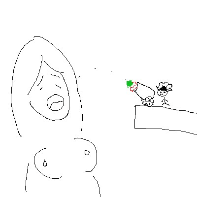
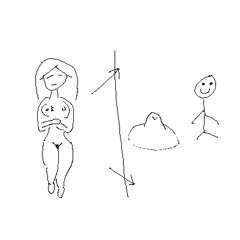
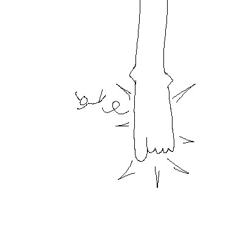
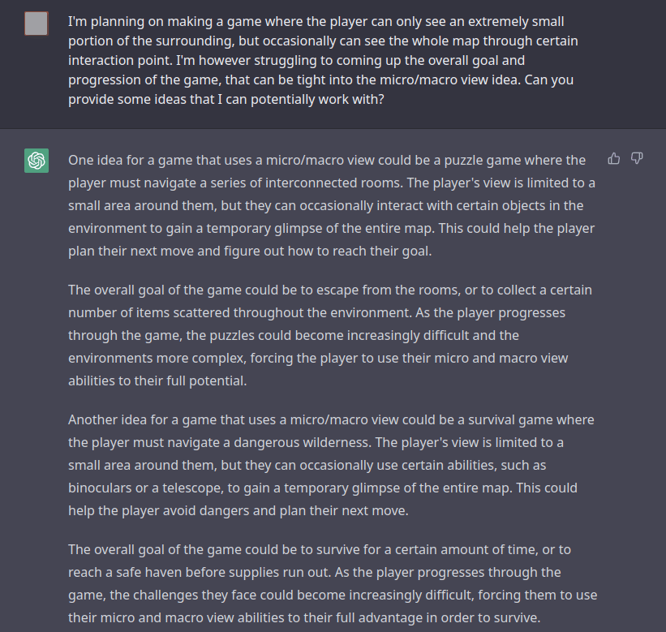

# 各位來決定我接下來要做什麼遊戲吧

作者：3213213210

TID：34523

<title>1</title> <link href="../Styles/Style.css" type="text/css" rel="stylesheet">

# 1

*本帖最後由 3213213210 於 2022-12-8 12:00 編輯*

編輯：因為突然開始有拉鋸戰的傾向，把票池改為投票前可見

前情提要：[https://giantessnight.com/gnforu ... iewthread&tid=34510](https://giantessnight.com/gnforum2012/forum.php?mod=viewthread&tid=34510)

不能說反應踴躍，不過也收集到一些可以用的目標了
這些小技術理論上可以套到單一作品的大量小章節裡，
但是經驗說明了「總之把餅畫大再慢慢填坑」的結果不是半成品就是胎死腹中，
所以盡早逼自己做出個選擇比較好
偏偏我又很優柔寡斷，所以再來借助一次群眾之力吧

我想了一些可能的製作題材，給大家投票決定：

1.餵公主吃果（抓時機按空白鍵）
小人女僕嘗試把草莓送進個巨人嘴裡
第一關就是直接抬起來丟進去，後面再變成大砲發射之類的，
然後如果打歪會有某種好笑的事發生，比方說被奶子彈飛之類的
示意圖：
<ignore_js_op>

**spaceTiming.jpg** *(23.99 KB, 下載次數: 0)*

[下載附件](forum.php?mod=attachment&aid=MTAwODQwfDA1M2FlYmM3fDE2NzQwNjUyMzR8MTgyMzB8MzQ1MjM%3D&nothumb=yes)

2022-12-7 13:42 上傳

（我發誓正式做的話畫面會比這個精緻）
（第一時間的構想是餵食更小的小人，不過各方面都會很麻煩所以算了）

2.分割畫面同步實況（全景和特寫同步呈現）
畫面左半邊有GTS的完整影像，右半邊則是玩家操作的小人，畫面聚焦在GTS身上某個小地方
至於遊戲目標……不知道，還沒想到，咬奶頭裡面會噴出收集品之類的
<ignore_js_op>

**splitScreen.jpg** *(23.49 KB, 下載次數: 0)*

[下載附件](forum.php?mod=attachment&aid=MTAwODQxfGUyYjVkN2JlfDE2NzQwNjUyMzR8MTgyMzB8MzQ1MjM%3D&nothumb=yes)

2022-12-7 13:47 上傳

（應該會搭配傳送門之類的設定減少圖像繪製需求）

3.踩踏閃躲遊戲（上下左右移動+衝刺翻滾鍵）
你知道的，縮小學園那個踩踏小遊戲，
只是做成玩家移動有加速度還有衝刺與冷卻機制
<ignore_js_op>

**dodgeThis.jpg** *(17.87 KB, 下載次數: 0)*

[下載附件](forum.php?mod=attachment&aid=MTAwODQyfDhlODUyMjFmfDE2NzQwNjUyMzR8MTgyMzB8MzQ1MjM%3D&nothumb=yes)

2022-12-7 14:14 上傳

坦白說這只是拿來湊數的，不過真的當選的話我會努力想個有趣吸引人的目標

4.其他
如果都覺得不夠，也歡迎留言你的想法，
各位也可以使用論壇的評分系統來表達自己的意見
比方說，如果有人留言「我想要縮小學園保健室橋段的HD版本」，
然後那個留言得到了100個獎勵點，那我就放棄之前的所有想法做那個
但是我依舊會盡量把規模和長度壓到最小，所以成品很可能跟你想的不一樣

最後，各位應該也發現了，我畫畫很爛，卻沒爛到會主動尋求外部支援
專業人士可以在十分鐘做完的素描我大概會花上一整天，
所以除非你能提供素材，否則勸各位別抱著「如果這樣要求就可以看到很多性感CG」的心態發言，那個盡頭只會是失望

……就這樣，歡迎留言
<title>2</title> <link href="../Styles/Style.css" type="text/css" rel="stylesheet">

# 2

虽然前情看起来都在吵架，但是这篇灵魂画师给我看乐了 <title>3</title> <link href="../Styles/Style.css" type="text/css" rel="stylesheet">

# 3

我觉得最刺激的还是躲猫猫，被抓到要么被吃掉要么被踩死或者ub <title>4</title> <link href="../Styles/Style.css" type="text/css" rel="stylesheet">

# 4

> [DJDUKE 發表於 2022-12-7 15:10](https://giantessnight.cf/gnforum2012/forum.php?mod=redirect&goto=findpost&pid=521308&ptid=34523)
> 我觉得最刺激的还是躲猫猫，被抓到要么被吃掉要么被踩死或者ub

這其實不好設計，因為玩家會想讓自己被抓……
<title>5</title> <link href="../Styles/Style.css" type="text/css" rel="stylesheet">

# 5

踩踏躲闪这个感觉挺带感的喔，虽然大多数人可能不感冒 <title>6</title> <link href="../Styles/Style.css" type="text/css" rel="stylesheet">

# 6

躲闪就挺不错了，哈哈，希望倍率足够 <title>7</title> <link href="../Styles/Style.css" type="text/css" rel="stylesheet">

# 7

> [freepenguin2 發表於 2022-12-8 11:12](https://giantessnight.cf/gnforum2012/forum.php?mod=redirect&goto=findpost&pid=521412&ptid=34523)
> 躲闪就挺不错了，哈哈，希望倍率足够

要做那個的話倍率不太可能調太大
畫面上至少得能同時顯示腳的位置、玩家的位置、可以跑的位置，
太大太小都會失恆，玩家在FHD畫面裡只剩一個像素點的話遊戲根本玩不了
翻滾速度也得考慮，如果人太小跑太慢、閃躲的反應時間太長，就從動作遊戲變策略遊戲了

……不過放心，倍率也不會太小，因為玩家角色越小，要畫的東西就越少
<title>8</title> <link href="../Styles/Style.css" type="text/css" rel="stylesheet">

# 8

> [3213213210 發表於 2022-12-7 15:28](https://giantessnight.cf/gnforum2012/forum.php?mod=redirect&goto=findpost&pid=521310&ptid=34523)
> 這其實不好設計，因為玩家會想讓自己被抓……

可以設計成每次被抓就會越屈服，逃離成功自我尊嚴提高。(屈服會降低逃跑能力，但會增加服從膜拜侍奉相關技能。)(反之亦然)
被抓巨娘的殘虐心就減少，玩法就越少。但可以提升部分巨娘的好感度(依個性不同，有些S的可能就要盡量閃躲，她才會高興)
不被抓，巨娘就會升級，甚至會出現新的巨娘。

<title>9</title> <link href="../Styles/Style.css" type="text/css" rel="stylesheet">

# 9

*本帖最後由 3213213210 於 2022-12-8 13:32 編輯*

> [天眼神月 發表於 2022-12-8 12:55](https://giantessnight.cf/gnforum2012/forum.php?mod=redirect&goto=findpost&pid=521419&ptid=34523)
> 可以設計成每次被抓就會越屈服，逃離成功自我尊嚴提高。(屈服會降低逃跑能力，但會增加服從膜拜侍奉相關 ...

這樣大概更糟，因為你還是以被抓為前提在玩的
這是色情遊戲經常出現的根本性矛盾，就是遊戲要贏了才能前進，但是輸了才有獎勵，
所以一直贏的玩家反而什麼都得不到
但是一直輸又沒有新東西看，所以你得贏兩步輸一步，搞得遊戲目標混亂到不行

遊戲的獎勵就是該給達成目標的玩家，
所以如果真的要做，我應該會做成玩家是要舔遍女性的變態，但是被發現就會馬上沒命
立刻，馬上，直接被斷頭或是拍成肉醬，到重新嘗試不會超過一張圖片，
如果要玩潛行遊戲就給我好好認真潛行
<title>10</title> <link href="../Styles/Style.css" type="text/css" rel="stylesheet">

# 10

> [3213213210 發表於 2022-12-8 13:31](https://giantessnight.cf/gnforum2012/forum.php?mod=redirect&goto=findpost&pid=521421&ptid=34523)
> 這樣大概更糟，因為你還是以被抓為前提在玩的
> 這是色情遊戲經常出現的根本性矛盾，就是遊戲要贏了才能前進 ...

我是想說可以做成2個結局，(服從跟戰勝的)，因為不只服從，像我比較偏好戰勝那一塊。戰勝可以說比較像是版上「焦冥小虫」的H星人那個故事。

<title>11</title> <link href="../Styles/Style.css" type="text/css" rel="stylesheet">

# 11

2号的身体探索就很不错呀，目的的话可以设置一些任务
比如说收集n个乳汁、触发几次敏感点什么的

或者主角再小一点，加个饥饿值什么的直接变成开放世界生存类游戏（笑）。
谁又不想在巨大少女的身体上求生捏？ 虽然做起来可能有些难度。
<title>12</title> <link href="../Styles/Style.css" type="text/css" rel="stylesheet">

# 12

> [天眼神月 發表於 2022-12-8 15:48](https://giantessnight.cf/gnforum2012/forum.php?mod=redirect&goto=findpost&pid=521423&ptid=34523)
> 我是想說可以做成2個結局，(服從跟戰勝的)，因為不只服從，像我比較偏好戰勝那一塊。戰勝可以說比較像是 ...

雖然我是說規模和長度盡量壓低，
但是兩個結局要平等的話，戰勝路線就不能太長，
以潛行遊戲這種以學習環境和AI為主的類型來說，可能會連Demo都不夠用……
……除非你這個回覆被灌獎勵點，那我就試試看

<title>13</title> <link href="../Styles/Style.css" type="text/css" rel="stylesheet">

# 13

> [MonGreen 發表於 2022-12-8 16:25](https://giantessnight.cf/gnforum2012/forum.php?mod=redirect&goto=findpost&pid=521428&ptid=34523)
> 2号的身体探索就很不错呀，目的的话可以设置一些任务
> 比如说收集n个乳汁、触发几次敏感点什么的

設計上主要會考量的點，應該會是要怎麼確保玩家「能夠認知到左右兩邊是同步進行的」
比方說如果要去摸奶頭，玩家是不是只要盯著全身照的像素點移動就好？
如果要爬上某個部位，是不是其實不看全身照也可以前進？
如果只要看著一邊就能前進，那體驗上跟丟張圖片放在遊戲旁邊不會差多少
要訓練玩家一直左右交互看，需要不少相應的事件，可能像是電燈開關或生理反應之類的

單就這方面來講生存遊戲其實可行，生存遊戲總是需要建設，全身照就等於無時無刻即時更新的小地圖了
但是確實很難做，主要是後期目標很難參考其他遊戲
生存遊戲通常會在某個時間點變成冒險與征服遊戲，
GTS身上是有什麼好冒險征服的，從尿道接水管回基地嗎，
全身插管以後這遊戲還有什麼能玩的
或許可以設定成裝置會被生理反應破壞，利用全身照地圖掌握建設狀態，
但建設似乎也沒辦法選位置，尿又沒辦法從腋下噴出來
如果改成某種熱能收集器或許可行，但依舊沒改變資源位置被人體結構決定的事實，
如果資源在哪裡挖都沒差，那一開始把場景設在GTS身上就沒意義了……

不，我想我還是會以有頭有尾的小遊戲為目標，但有勇者想挑戰的話請自便
<title>14</title> <link href="../Styles/Style.css" type="text/css" rel="stylesheet">

# 14

> [3213213210 發表於 2022-12-8 17:28](https://giantessnight.cf/gnforum2012/forum.php?mod=redirect&goto=findpost&pid=521435&ptid=34523)
> 設計上主要會考量的點，應該會是要怎麼確保玩家「能夠認知到左右兩邊是同步進行的」
> 比方說如果要去摸奶 ...

很有道理，建设资源收集装置或者像寄生虫那样在体表安个家这样应该是行不通的。生存游戏最主要应该是探索、收集、建设这三个，而这种大小的gts本身就有很多探索要素和收集要素。
至于建设要素，我认为【不能建设或者直接不在gts上建设】，完全可以建设在房间的某处（例如床底下、台灯灯罩、床头柜）
等需要资源的时候，可以出征前往gts身上收集资源; 越到后期解锁的科技越多; 一次收集的资源就越多（比如资源搬运无人机之类的）
当然，有些资源可能不会在一个gts上找到，可以尝试【多gts】以获取其他资源（比如futa）

至于左右多视角同步问题，不妨换个思路，可以弄成“小地图”、然后设计个“大地图”随时按键查看，玩家也可以标注资源点之类的
为什么要用大地图？ 因为如果皮肤的缝隙都能当路走的话，那么地图可能真的很大，肉眼可能看不出来玩家在大地图上移动......
而小地图则可以让玩家明确“我确实在移动”

然后你会发现，这个游戏很无聊，找资源、食物、升级什么的，接下来就可以加入剧情、任务、随机事件来丰富这个枯燥的游戏。
<title>15</title> <link href="../Styles/Style.css" type="text/css" rel="stylesheet">

# 15

> [MonGreen 發表於 2022-12-8 18:13](https://giantessnight.cf/gnforum2012/forum.php?mod=redirect&goto=findpost&pid=521439&ptid=34523)
> 很有道理，建设资源收集装置或者像寄生虫那样在体表安个家这样应该是行不通的。生存游戏最主要应该是探索 ...

先不講細節問題，這已經變成生存遊戲為主軸了，
如果最後遊戲的主要互動是建築挖礦自動化，那GTS內容就會變得很雞肋（食之無味、棄之可惜）

怎麼樣算雞肋，我有個簡單的標準來想這個問題：
如果我今天在論壇Po了遊戲，下面有人回覆要求解包或存檔，
那其他人會說「不，奉勸你自己進入遊戲才有完整體驗」，
還是「給你，我剛浪費了三小時的人生，你不需要一起受苦」？
不是說你給的點子不可能做得有趣，
只是在生存遊戲的前提下，我想得到的事件都可以用更有效率的遊戲形式來呈現，
像是單純的循環時間軸開放世界

就當我太爛，但生存遊戲這題材我實在不太想碰

<title>16</title> <link href="../Styles/Style.css" type="text/css" rel="stylesheet">

# 16

2号的身体探索希望玩家主动去同时兼顾左右两侧的话，我有个比较粗暴的想法是类似红灯停绿灯行的那种，除了右侧看路以外也要注意左侧的gts表情状态之类的，比如睁眼闭眼，比如刺激程度，亦或者只是单纯的gts在做自己的事造成的“地图现象”，玩家移动过快会导致gts做一些动作导致右侧地形改变，甚至玩家被直接击中导致被打到不知道哪里，需要重新对照全身照和右侧的局部地形找出自己的大致方位；或者就传统的一二三木头人那种被发现直接失败；亦或者被发现后切入另一条故事分支？我想这样相对来说应该比较容易收尾，克服重重困难抵达一些目标地点，目标地点不同就对应不同结局这种感觉？ <title>17</title> <link href="../Styles/Style.css" type="text/css" rel="stylesheet">

# 17

> [wdy123321123 發表於 2022-12-8 23:30](https://giantessnight.cf/gnforum2012/forum.php?mod=redirect&goto=findpost&pid=521461&ptid=34523)
> 2号的身体探索希望玩家主动去同时兼顾左右两侧的话，我有个比较粗暴的想法是类似红灯停绿灯行的那种，除了 ...

根本上可行，不過我想的路線偏向從一個傳送門出來然後被限制移動範圍，
因為特寫畫面的東西必須特別精緻，如果放玩家太自由，繪畫工作量會上升不少
「要找到自己位置」算是很初期就當成目標的，不過「依據大環境的狀態變化影響特寫環境的行為策略」我倒還沒想到
分支路線會引發一些遊玩流程上的問題，主要是怕自己錯過BE的焦慮感，
可能靠個樞紐地區讓玩家可以隨時回舊地方，要怎麼掰故事就以後再說
<title>18</title> <link href="../Styles/Style.css" type="text/css" rel="stylesheet">

# 18

> [3213213210 發表於 2022-12-8 11:59](https://giantessnight.cf/gnforum2012/forum.php?mod=redirect&goto=findpost&pid=521414&ptid=34523)
> 要做那個的話倍率不太可能調太大
> 畫面上至少得能同時顯示腳的位置、玩家的位置、可以跑的位置，
> 太大太小 ...

哈哈，1000倍其实也算够用了。好几个踩踏游戏都是这个大小。然后就是希望画面能精细点，足控不能看着个猪蹄冲吧（夸张了，但确实是同理）
<title>19</title> <link href="../Styles/Style.css" type="text/css" rel="stylesheet">

# 19

> [freepenguin2 發表於 2022-12-9 09:39](https://giantessnight.cf/gnforum2012/forum.php?mod=redirect&goto=findpost&pid=521486&ptid=34523)
> 哈哈，1000倍其实也算够用了。好几个踩踏游戏都是这个大小。然后就是希望画面能精细点，足控不能看着个猪 ...

當然會比預覽精緻，但動作遊戲的話最終還是會以畫面可讀性為優先，不會太精緻
視覺的優先考量會是怎麼呈現玩家位置、翻滾狀態和腳的攻擊傾向，
踩下來以後足控按暫停可以多快尻出來不在考量範圍內
<title>20</title> <link href="../Styles/Style.css" type="text/css" rel="stylesheet">

# 20

> [3213213210 發表於 2022-12-9 11:35](https://giantessnight.cf/gnforum2012/forum.php?mod=redirect&goto=findpost&pid=521493&ptid=34523)
> 當然會比預覽精緻，但動作遊戲的話最終還是會以畫面可讀性為優先，不會太精緻
> 視覺的優先考量會是怎麼呈 ...

嗯，反正尽可能地做好些就行了。开始期待ing
<title>21</title> <link href="../Styles/Style.css" type="text/css" rel="stylesheet">

# 21

> [freepenguin2 發表於 2022-12-10 00:31](https://giantessnight.cf/gnforum2012/forum.php?mod=redirect&goto=findpost&pid=521527&ptid=34523)
> 嗯，反正尽可能地做好些就行了。开始期待ing

現在是分割畫面領先快兩倍 你可能得去拉票了
應該說請去拉票 我已經發現畫全身照有多麻煩了 如果可以畫隻腳就做完遊戲就太好了
<title>22</title> <link href="../Styles/Style.css" type="text/css" rel="stylesheet">

# 22

> [3213213210 發表於 2022-12-10 00:42](https://giantessnight.cf/gnforum2012/forum.php?mod=redirect&goto=findpost&pid=521529&ptid=34523)
> 現在是分割畫面領先快兩倍 你可能得去拉票了
> 應該說請去拉票 我已經發現畫全身照有多麻煩了 如果可以畫隻 ...

哈哈哈，没法拉票啊。怪楼主一开始为什么要把高难度加进去了（捂脸）
<title>23</title> <link href="../Styles/Style.css" type="text/css" rel="stylesheet">

# 23

草稿看乐了
终于也决定做个游戏了吗
我投分屏的那个
感觉现在2D游戏现在靠AI有辅助的情况下，准备素材没有以前那么辛苦了
很多灵感其实都是边做边想出来的，草图和最终结果不知道会差多少
总之加油 <title>24</title> <link href="../Styles/Style.css" type="text/css" rel="stylesheet">

# 24

> [wxy112300 發表於 2022-12-11 03:39](https://giantessnight.cf/gnforum2012/forum.php?mod=redirect&goto=findpost&pid=521636&ptid=34523)
> 草稿看乐了
> 终于也决定做个游戏了吗
> 我投分屏的那个

AI輔助繪圖我也玩了不少，輔助的潛力也非常充分，
但各種細節控制還是需要相當的技術和經驗
現在有個大重點是說服玩家「大小畫面是同一世界」，
同時有兩張影像要考慮的話，AI的隨機性就很麻煩了
而且不管用什麼模型和關鍵字，我都沒辦法做出不包含乳房的乳頭特寫，
搞到最後直接用畫的大概比較快，反正兩邊都很簡陋也是種一致性

不過說到AI，我昨天請AI給個製作方向靈感……
<ignore_js_op>

**Screenshot_20221210_213541.png** *(177.68 KB, 下載次數: 0)*

[下載附件](forum.php?mod=attachment&aid=MTAwOTQwfDQ2ODg4NTI2fDE2NzQwNjUyNTN8MTgyMzB8MzQ1MjM%3D&nothumb=yes)

2022-12-11 12:39 上傳

……他還真的給得出來
我看接下來都請AI給建議好了，比在Discord上找人還有效率……</ignore_js_op></ignore_js_op></ignore_js_op></ignore_js_op>