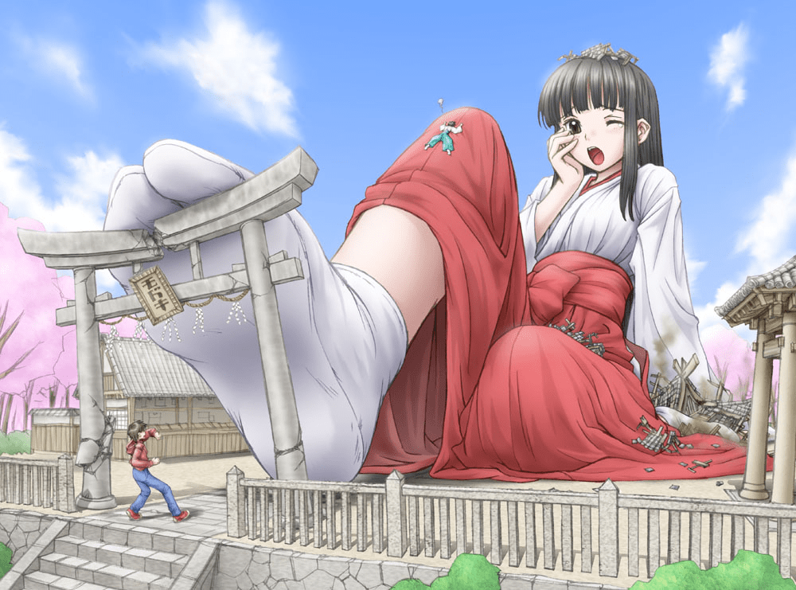

# 各位同志喜不喜欢和服呢

作者：四糸乃

TID：22737

<title>1</title> <link href="../Styles/Style.css" type="text/css" rel="stylesheet">

# 1

总觉得巨大娘穿着和服，踏着木屐搞破坏和虐待小人的话会很好看呢?如果还是扶她就更棒了，丝质和服裙摆里有一个大帐篷的景象真是让人欲罢不能啊 <title>2</title> <link href="../Styles/Style.css" type="text/css" rel="stylesheet">

# 2

和服是挺不错的，不过那木屐，把脚弄成羊角似的。 <title>3</title> <link href="../Styles/Style.css" type="text/css" rel="stylesheet">

# 3

和服木屐足袋还是很赞的……

不要扶她。 <title>4</title> <link href="../Styles/Style.css" type="text/css" rel="stylesheet">

# 4

想在木屐上被足袋踩碎，简直是完美的死法 <title>5</title> <link href="../Styles/Style.css" type="text/css" rel="stylesheet">

# 5

不要虐待啊，我不喜欢虐待题材 <title>6</title> <link href="../Styles/Style.css" type="text/css" rel="stylesheet">

# 6

前面都好好的...最后一句什么鬼！搭帐篷？？ <title>7</title> <link href="../Styles/Style.css" type="text/css" rel="stylesheet">

# 7

和服 制服什么的都很棒 但是扶她......口味还是重了点 <title>8</title> <link href="../Styles/Style.css" type="text/css" rel="stylesheet">

# 8

和前面有人講的一樣 不要扶他 其他都好 <title>9</title> <link href="../Styles/Style.css" type="text/css" rel="stylesheet">

# 9

不喜欢旗袍，和服，木屐。另外不要扶他。 <title>10</title> <link href="../Styles/Style.css" type="text/css" rel="stylesheet">

# 10

扶她出去，其他的都可以接受 <title>11</title> <link href="../Styles/Style.css" type="text/css" rel="stylesheet">

# 11

额...不要扶她，其它的属性我也非常喜欢，感觉身着和服的巨大娘可以优雅地蹂躏城市和小人，和法术超能力等等也很相配。 <title>12</title> <link href="../Styles/Style.css" type="text/css" rel="stylesheet">

# 12

扶她出去= =
和服木屐足袋的话还是很不错的 <title>13</title> <link href="../Styles/Style.css" type="text/css" rel="stylesheet">

# 13

其實不知道是不是因為二次元美圖看多了，對於日式服裝(和服/巫女服)都挺能接受/腦補的

相對而言，韓國那個腰帶綁到肚子上的裙子穿法，感覺上就是怎麼看怎麼憋扭

順便附上個舊圖 <title>14</title> <link href="../Styles/Style.css" type="text/css" rel="stylesheet">

# 14

 <ignore_js_op>[20060401_hakuto.jpg](forum.php?mod=attachment&aid=NjcxNjR8YmQzYmJmMzR8MTY3NDA2NzY4NXwxODIzMHwyMjczNw%3D%3D&nothumb=yes) *(166.77 KB, 下載次數: 0)*

[下載附件](forum.php?mod=attachment&aid=NjcxNjR8YmQzYmJmMzR8MTY3NDA2NzY4NXwxODIzMHwyMjczNw%3D%3D&nothumb=yes)

2017-3-11 06:57 上傳  

</ignore_js_op> <title>15</title> <link href="../Styles/Style.css" type="text/css" rel="stylesheet">

# 15

不要扶她，坚决不要！ <title>16</title> <link href="../Styles/Style.css" type="text/css" rel="stylesheet">

# 16

不喜欢，和服想看的地方看不到 <title>17</title> <link href="../Styles/Style.css" type="text/css" rel="stylesheet">

# 17

不错不错，不过不知道为什么没当看到和服。就吧这和中国的裹足想在一起了 <title>18</title> <link href="../Styles/Style.css" type="text/css" rel="stylesheet">

# 18

> [冰西瓜 發表於 2017-3-10 23:00](https://giantessnight.cf/gnforum2012/forum.php?mod=redirect&goto=findpost&pid=325888&ptid=22737)
> 不要虐待啊，我不喜欢虐待题材

那你的文章为什么都是虐待？
<title>19</title> <link href="../Styles/Style.css" type="text/css" rel="stylesheet">

# 19

> [大撸若愚 發表於 2017-3-11 10:47](https://giantessnight.cf/gnforum2012/forum.php?mod=redirect&goto=findpost&pid=325938&ptid=22737)
> 不喜欢，和服想看的地方看不到

那是因为你看到的和服贴身体贴的不够紧
<title>20</title> <link href="../Styles/Style.css" type="text/css" rel="stylesheet">

# 20

本来说的好好的，但是怎么就开始futa了呢 <title>21</title> <link href="../Styles/Style.css" type="text/css" rel="stylesheet">

# 21

和服什麼的是可以接受的   但扶他的話....不敢想 <title>22</title> <link href="../Styles/Style.css" type="text/css" rel="stylesheet">

# 22

和服完全大丈夫，木履也是蛮不错滴（最好是裸足啦，裸足赛高！）虐待勉强可以但是过于血腥的不要（个人比较喜欢温柔系的，诶嘿嘿）扶她我就受不了了（美国觉得女孩有雀斑可爱，韩国觉得女孩有大长腿可爱，日本觉得女孩有小虎牙可爱，你们那，觉得女孩有大OO可爱是几个意思啊喂！） <title>23</title> <link href="../Styles/Style.css" type="text/css" rel="stylesheet">

# 23

很好啊，和服，穿不穿胖次都很好啊 <title>24</title> <link href="../Styles/Style.css" type="text/css" rel="stylesheet">

# 24

和服很喜欢啊~~ 不过有点不太分得清和服和浴衣。。似乎浴衣就是不穿足袋的样子？ <title>25</title> <link href="../Styles/Style.css" type="text/css" rel="stylesheet">

# 25

和服还是很有意味的大帐篷就算了吧 <title>26</title> <link href="../Styles/Style.css" type="text/css" rel="stylesheet">

# 26

和服=真空。。。是这么说的 <title>27</title> <link href="../Styles/Style.css" type="text/css" rel="stylesheet">

# 27

对木屐足袋的喜爱不亚于jk... <title>28</title> <link href="../Styles/Style.css" type="text/css" rel="stylesheet">

# 28

一定要是和服吗？汉服也不错啊 <title>29</title> <link href="../Styles/Style.css" type="text/css" rel="stylesheet">

# 29

和服配太刀是我最喜欢的动漫属性，所以在gts里和服最爱，配上木屐和白丝是最好的足控福利（至少我是这么想的）