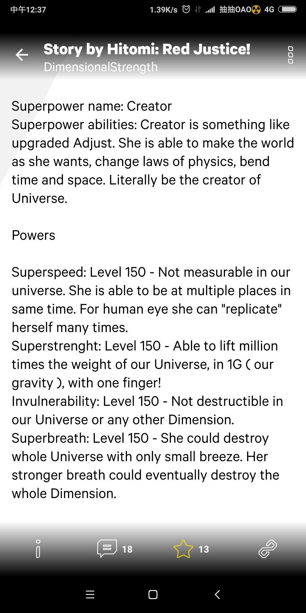

# 各位有喜欢怪力娘超性能娘的同好吗～

作者：hellscythe

TID：26444

<title>1</title> <link href="../Styles/Style.css" type="text/css" rel="stylesheet">

# 1

大概就是未必需要巨大，可是却拥有身体力量能颠覆物理法则的小说......（夸张的可以手搓中子星物质什么的
我一直很喜欢这种类型的小说，在pixiv上搜索超性能娘小说可以找到很多日语系的，比如
id=8873092
id=8490073
id=9015808
以及在bilibili上看到类似题材的
av37643671
想知道有没有相关的论坛或讨论群什么的呢~ <title>2</title> <link href="../Styles/Style.css" type="text/css" rel="stylesheet">

# 2

悲伤的有好多链接发不出来.......
<title>3</title> <link href="../Styles/Style.css" type="text/css" rel="stylesheet">

# 3

有同样癖好但不知道去怎么搜索这类作品，也很少看到这类作品，还以为只有我一个人对... <title>4</title> <link href="../Styles/Style.css" type="text/css" rel="stylesheet">

# 4

边变成gts边用超能力破坏更爽吧...
其实两个单独来我都可以接受 <title>5</title> <link href="../Styles/Style.css" type="text/css" rel="stylesheet">

# 5

日輕：《野生的最終BOSS出現了》※已出漫畫版

裡面的最終boss女神 阿蘿維納斯 就是這樣的角色

隨便貼一段

阿萝维纳斯天真无邪的笑着，却手下不留情的以各种攻击逼近。
––––只要双方处在一片空间下便能将对方的一切耐性贯穿的绝对致死能力；
––––能将受到的攻击全数反弹的能力；
––––反转时间将对手的存在抹消的能力；
––––无论过程如何，最后一定会是自己去的胜利的因果干涉能力；
––––将败北的事实强制赋予对手的能力；
––––能靠眼神将目所能及之物尽数毁灭的能力；
––––将对手的所有能力无效化的能力；
––––通过破坏攻击这一概念来封印对手的攻击，通过粉碎防御这一概念以消除对手的防御；
––––从其他所有神话里的神明身上取得的能力；
––––似曾相识的某本科幻小说里的能力；
她动用了她所能想到的一切，但却还是无法令露法斯消失。
会感到愉快也是没有办法的吧。

“没错……尽情享受把阿萝维纳斯，我会将这一切承受下来！”
<title>6</title> <link href="../Styles/Style.css" type="text/css" rel="stylesheet">

# 6

压力吗斯涅!这个可以有 <title>7</title> <link href="../Styles/Style.css" type="text/css" rel="stylesheet">

# 7

> [la12345 發表於 2019-2-19 10:52](https://giantessnight.cf/gnforum2012/forum.php?mod=redirect&goto=findpost&pid=397769&ptid=26444)
> 压力吗斯涅!这个可以有

组织的话英文区还有个superwomanmania论坛 也是类似的

<title>8</title> <link href="../Styles/Style.css" type="text/css" rel="stylesheet">

# 8

> [la12345 發表於 2019-2-19 10:55](https://giantessnight.cf/gnforum2012/forum.php?mod=redirect&goto=findpost&pid=397770&ptid=26444)
> 组织的话英文区还有个superwomanmania论坛 也是类似的

我倒是也经常上这个论坛，印象比较深刻的作者有Dru和conceptfan......推荐一个画师吧，mots929这是制作这类插图和视频的作者，画风还算精致视频也挺好看的（
<title>9</title> <link href="../Styles/Style.css" type="text/css" rel="stylesheet">

# 9

> [hellscythe 發表於 2019-2-19 12:42](https://giantessnight.cf/gnforum2012/forum.php?mod=redirect&goto=findpost&pid=397781&ptid=26444)
> 我倒是也经常上这个论坛，印象比较深刻的作者有Dru和conceptfan......推荐一个画师吧，mots929这是制作这 ...

国内还是找不到组织呢。。。
<title>10</title> <link href="../Styles/Style.css" type="text/css" rel="stylesheet">

# 10

要不要大家一起建一个贴吧什么的呢 <title>11</title> <link href="../Styles/Style.css" type="text/css" rel="stylesheet">

# 11

> [hellscythe 發表於 2019-2-19 12:42](https://giantessnight.cf/gnforum2012/forum.php?mod=redirect&goto=findpost&pid=397781&ptid=26444)
> 我倒是也经常上这个论坛，印象比较深刻的作者有Dru和conceptfan......推荐一个画师吧，mots929这是制作这 ...

mots的da账号好像注销了？
<title>12</title> <link href="../Styles/Style.css" type="text/css" rel="stylesheet">

# 12

> [la12345 發表於 2019-2-19 15:14](https://giantessnight.cf/gnforum2012/forum.php?mod=redirect&goto=findpost&pid=397791&ptid=26444)
> mots的da账号好像注销了？

是呀注销了，不过他最近似乎开了新的网站
<title>13</title> <link href="../Styles/Style.css" type="text/css" rel="stylesheet">

# 13

关于这个我想起来很久以前看过的一个小说《魔族公主的一存》，主角就挺无敌的 <title>14</title> <link href="../Styles/Style.css" type="text/css" rel="stylesheet">

# 14

你好有的呢，而且关于这方面的话，欧美人创作的更多，因为有supergirl的漫画影响而存在。 <title>15</title> <link href="../Styles/Style.css" type="text/css" rel="stylesheet">

# 15

这个的英文关键词是什么？想在E站上搜搜看
<title>16</title> <link href="../Styles/Style.css" type="text/css" rel="stylesheet">

# 16

超性能娘怪力娘一般在欧美那边比较多啦 .d站有一些这种题材作品，也有相关的论坛和discord.国内我也是一直没有找到过组织啦..另外楼主说的那几部小说倒是都看过，只不过是机翻的只能看个半懂.(๑˙ー˙๑) <title>17</title> <link href="../Styles/Style.css" type="text/css" rel="stylesheet">

# 17

> [Dibdabdu 發表於 2019-2-19 23:35](https://giantessnight.cf/gnforum2012/forum.php?mod=redirect&goto=findpost&pid=397830&ptid=26444)
> 这个的英文关键词是什么？想在E站上搜搜看

ehentai上的资源基本找不到......或许可以去英文社区翻翻看？比如superwomanmania和devianart
<title>18</title> <link href="../Styles/Style.css" type="text/css" rel="stylesheet">

# 18

*本帖最後由 kidkevin036 於 2019-2-20 12:39 編輯*

歐美其實很多超性能娘或是怪力娘都是那種肌肉很誇張的DA站有個作者叫做DimensionalStrength

<ignore_js_op>

**Screenshot_2019-02-20-12-37-20-170_com.deviantart.android.damobile.png** *(281.31 KB, 下載次數: 0)*

[下載附件](forum.php?mod=attachment&aid=NzY2Mjd8YzNiNWRlYTB8MTY3NDA2Njg3MnwxODIzMHwyNjQ0NA%3D%3D&nothumb=yes)

2019-2-20 12:38 上傳

這篇女主一般體型下可以舉起1000000次宇宙的重量

<title>19</title> <link href="../Styles/Style.css" type="text/css" rel="stylesheet">

# 19

emmmmmmmm一拳女超人吗？ <title>20</title> <link href="../Styles/Style.css" type="text/css" rel="stylesheet">

# 20

喜欢超能肌肉女巨人 哈哈哈 <title>21</title> <link href="../Styles/Style.css" type="text/css" rel="stylesheet">

# 21

> [kidkevin036 發表於 2019-2-20 12:36](https://giantessnight.cf/gnforum2012/forum.php?mod=redirect&goto=findpost&pid=397867&ptid=26444)
> 歐美其實很多超性能娘或是怪力娘都是那種肌肉很誇張的DA站有個作者叫做DimensionalStrength

这位也是我很喜欢的作者啦，相比于夸张肌肉还是跟喜欢正常体型的.........conceptfan和曾经在brawna上的randomizer都是风格类似的作者
<title>22</title> <link href="../Styles/Style.css" type="text/css" rel="stylesheet">

# 22

既然受众这么多能开个新的版么（ <title>23</title> <link href="../Styles/Style.css" type="text/css" rel="stylesheet">

# 23

*本帖最後由 prprpr 於 2019-2-20 23:33 編輯*

大家好，我是来自大马喜欢怪力娘的朋友，不知道各位熟悉discord吗XD？要不要加入中文为媒介语言的怪力娘discord group？
新建立的QQ群：959094598 （怪力娘同好会） <title>24</title> <link href="../Styles/Style.css" type="text/css" rel="stylesheet">

# 24

> [prprpr 發表於 2019-2-20 18:58](https://giantessnight.cf/gnforum2012/forum.php?mod=redirect&goto=findpost&pid=397886&ptid=26444)
> 大家好，我是来自大马喜欢怪力娘的朋友，不知道各位熟悉discord吗XD？要不要加入中文为媒介语言的怪力娘di ...

可以呀一直想找个group或论坛什么的........链接发我一下吧
<title>25</title> <link href="../Styles/Style.css" type="text/css" rel="stylesheet">

# 25

安心院熏染，怪盗亚森（安利艾特），都是性能上不可思议的人物 <title>26</title> <link href="../Styles/Style.css" type="text/css" rel="stylesheet">

# 26

> [prprpr 發表於 2019-2-20 18:58](https://giantessnight.cf/gnforum2012/forum.php?mod=redirect&goto=findpost&pid=397886&ptid=26444)
> 大家好，我是来自大马喜欢怪力娘的朋友，不知道各位熟悉discord吗XD？要不要加入中文为媒介语言的怪力娘di ...

能发下即时邀请吗，，，

<title>27</title> <link href="../Styles/Style.css" type="text/css" rel="stylesheet">

# 27

话说B站那个是我委托定制的呢哈哈哈 <title>28</title> <link href="../Styles/Style.css" type="text/css" rel="stylesheet">

# 28

> [la12345 發表於 2019-2-19 14:39](https://giantessnight.cf/gnforum2012/forum.php?mod=redirect&goto=findpost&pid=397790&ptid=26444)
> 要不要大家一起建一个贴吧什么的呢

我觉得可以！然后建论坛，邀同好！
<title>29</title> <link href="../Styles/Style.css" type="text/css" rel="stylesheet">

# 29

> [JackieShake 發表於 2019-2-22 00:14](https://giantessnight.cf/gnforum2012/forum.php?mod=redirect&goto=findpost&pid=397993&ptid=26444)
> 我觉得可以！然后建论坛，邀同好！

现 身 说 法 大佬tql，，，</ignore_js_op>