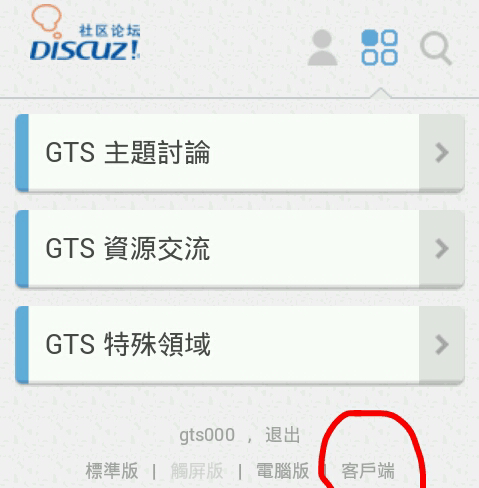

# 各位有没有人用客户端登陆GN的？

作者：447175661

TID：18245

<title>1</title> <link href="../Styles/Style.css" type="text/css" rel="stylesheet">

# 1

我一直都是用电脑登陆的，今天用手机登录看到下面有“电脑版，手机版，客户端”
但是下载了客户端却发现不会用
有没有用客户端的教我一下。。。 <title>2</title> <link href="../Styles/Style.css" type="text/css" rel="stylesheet">

# 2

 <ignore_js_op>[Qu*](forum.php?mod=attachment&aid=NDg4ODJ8NmVmZGZiODV8MTY3NDA2NzcxM3wxODIzMHwxODI0NQ%3D%3D&nothumb=yes) *(170.82 KB, 下載次數: 0)*

[下載附件](forum.php?mod=attachment&aid=NDg4ODJ8NmVmZGZiODV8MTY3NDA2NzcxM3wxODIzMHwxODI0NQ%3D%3D&nothumb=yes)

2014-12-14 21:32 上傳  

</ignore_js_op> <title>3</title> <link href="../Styles/Style.css" type="text/css" rel="stylesheet">

# 3

那玩意是 Discuz! 的，我觉得没什么用…… <title>4</title> <link href="../Styles/Style.css" type="text/css" rel="stylesheet">

# 4

我是用psv登的。(应该没有别人了吧) <title>5</title> <link href="../Styles/Style.css" type="text/css" rel="stylesheet">

# 5

用那个登陆难道有更多的福利么？ <title>6</title> <link href="../Styles/Style.css" type="text/css" rel="stylesheet">

# 6

> [shangen 發表於 2014-12-15 20:25](https://giantessnight.cf/gnforum2012/forum.php?mod=redirect&goto=findpost&pid=241746&ptid=18245)
> 我是用psv登的。(应该没有别人了吧)

3ds登陆的ヽ(≧Д≦)ノ 开个玩笑
<title>7</title> <link href="../Styles/Style.css" type="text/css" rel="stylesheet">

# 7

这难道有客户端？一直用电脑登的。。。 <title>8</title> <link href="../Styles/Style.css" type="text/css" rel="stylesheet">

# 8

只习惯电脑登陆的版面
<title>9</title> <link href="../Styles/Style.css" type="text/css" rel="stylesheet">

# 9

> [shangen 發表於 2014-12-15 20:25](https://giantessnight.cf/gnforum2012/forum.php?mod=redirect&goto=findpost&pid=241746&ptid=18245)
> 我是用psv登的。(应该没有别人了吧)

我也是不过我的PSV网速略
<title>10</title> <link href="../Styles/Style.css" type="text/css" rel="stylesheet">

# 10

> [玩偶.残响 發表於 2015-7-28 21:44](https://giantessnight.cf/gnforum2012/forum.php?mod=redirect&goto=findpost&pid=263714&ptid=18245)
> 我也是不过我的PSV网速略

psv最好改一下dns代理啦 <title>11</title> <link href="../Styles/Style.css" type="text/css" rel="stylesheet">

# 11

原来还有客户端的么          <title>12</title> <link href="../Styles/Style.css" type="text/css" rel="stylesheet">

# 12

表示不会用。。。。 <title>13</title> <link href="../Styles/Style.css" type="text/css" rel="stylesheet">

# 13

觉得用电脑登比较靠谱。。。。 <title>14</title> <link href="../Styles/Style.css" type="text/css" rel="stylesheet">

# 14

还是觉得电脑版的好，尤其是那个一直切换图片的版块 <title>15</title> <link href="../Styles/Style.css" type="text/css" rel="stylesheet">

# 15

用電腦而已...

其他平台不太可靠 <title>16</title> <link href="../Styles/Style.css" type="text/css" rel="stylesheet">

# 16

GN还有客户端？
第一次知道 <title>17</title> <link href="../Styles/Style.css" type="text/css" rel="stylesheet">

# 17

第一次知道GN还有客户端+1    <title>18</title> <link href="../Styles/Style.css" type="text/css" rel="stylesheet">

# 18

我这号别人送的哈哈哈… <title>19</title> <link href="../Styles/Style.css" type="text/css" rel="stylesheet">

# 19

用电脑登录，用手机感觉有时候卡
<title>20</title> <link href="../Styles/Style.css" type="text/css" rel="stylesheet">

# 20

用手机登陆的看不了图片 <title>21</title> <link href="../Styles/Style.css" type="text/css" rel="stylesheet">

# 21

客户端没看见过啊，网页能用就没有在想过其他登录方式了 <title>22</title> <link href="../Styles/Style.css" type="text/css" rel="stylesheet">

# 22

难道有客户端么？没见过啊 <title>23</title> <link href="../Styles/Style.css" type="text/css" rel="stylesheet">

# 23

客户端只是给一些低级爪机提供的吧