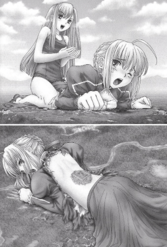

# 各位谁有这本漫画？

作者：25041

TID：28863

<title>1</title> <link href="../Styles/Style.css" type="text/css" rel="stylesheet">

# 1

以前不知道在哪里看过 <title>2</title> <link href="../Styles/Style.css" type="text/css" rel="stylesheet">

# 2

 <ignore_js_op>[sample_4c13391ad012a71364c949af2a215904d9b30c32.jpg](forum.php?mod=attachment&aid=ODMzMzd8MjQyMGY2ZTR8MTY3NDA2NjQyNXwxODIzMHwyODg2Mw%3D%3D&nothumb=yes) *(64.6 KB, 下載次數: 2)*

[下載附件](forum.php?mod=attachment&aid=ODMzMzd8MjQyMGY2ZTR8MTY3NDA2NjQyNXwxODIzMHwyODg2Mw%3D%3D&nothumb=yes)

2020-6-9 04:09 上傳  

</ignore_js_op> <title>3</title> <link href="../Styles/Style.css" type="text/css" rel="stylesheet">

# 3

這不是漫畫 是小說插圖 應該是ICECAT的作品 <title>4</title> <link href="../Styles/Style.css" type="text/css" rel="stylesheet">

# 4

白兔早期作品，是单图，我好像曾经在eh上看到过 <title>5</title> <link href="../Styles/Style.css" type="text/css" rel="stylesheet">

# 5

e站搜索:fate unlimited works
<title>6</title> <link href="../Styles/Style.css" type="text/css" rel="stylesheet">

# 6

> zhaoqiang 發表於 2020-6-9 21:50
> e站搜索:fate unlimited works

我刚刚找了，没有啊，兄弟 <title>7</title> <link href="../Styles/Style.css" type="text/css" rel="stylesheet">

# 7

> [25041 發表於 2020-6-10 04:27](https://giantessnight.cf/gnforum2012/forum.php?mod=redirect&goto=findpost&pid=438916&ptid=28863)
> 我刚刚找了，没有啊，兄弟

好像是火山の杨的作品，很久之前的了，往最早的几页
<title>8</title> <link href="../Styles/Style.css" type="text/css" rel="stylesheet">

# 8

看画风应该是白兔老师以前的单图，这种画风我记得还有这面码的。
<title>9</title> <link href="../Styles/Style.css" type="text/css" rel="stylesheet">

# 9

这是个单图
以前的
叫无线足制
很久很久之前的一个系列了
里面得小说配图 全是这种的 <title>10</title> <link href="../Styles/Style.css" type="text/css" rel="stylesheet">

# 10

你可以去E站搜 gts feet   后面全都是这种 fgo的本子还是很受欢迎的  就是有些都是残片