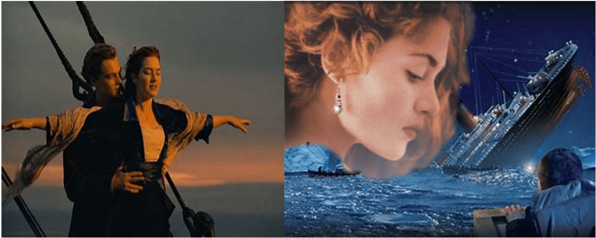

# 名场面如果变成巨大娘的互动……

作者：咸の一批

TID：33687

<title>1</title> <link href="../Styles/Style.css" type="text/css" rel="stylesheet">

# 1

如题，如果把一些影视作品、动漫中的名场面变成巨大娘的互动，会怎么样？ <title>2</title> <link href="../Styles/Style.css" type="text/css" rel="stylesheet">

# 2

你要找哪個場景、你要怎麼變、你要變哪裡、要保留多少原始故事，
你至少也先舉個例子，誰知道你想講怎樣的狀況 <title>3</title> <link href="../Styles/Style.css" type="text/css" rel="stylesheet">

# 3

脑补了一个场面 泰坦尼克号从撞冰山变成撞露丝了
<title>4</title> <link href="../Styles/Style.css" type="text/css" rel="stylesheet">

# 4

 <ignore_js_op>[脑补图.png](forum.php?mod=attachment&aid=OTc2ODN8MWI5MDEyZGZ8MTY3NDA2NTQ4NXwxODIzMHwzMzY4Nw%3D%3D&nothumb=yes) *(705.55 KB, 下載次數: 1)*

[下載附件](forum.php?mod=attachment&aid=OTc2ODN8MWI5MDEyZGZ8MTY3NDA2NTQ4NXwxODIzMHwzMzY4Nw%3D%3D&nothumb=yes)

2022-7-15 13:08 上傳  

</ignore_js_op> <title>5</title> <link href="../Styles/Style.css" type="text/css" rel="stylesheet">

# 5

> [wenjingzhi 發表於 2022-7-15 13:08](https://giantessnight.cf/gnforum2012/forum.php?mod=redirect&goto=findpost&pid=509479&ptid=33687)
> 脑补了一个场面 泰坦尼克号从撞冰山变成撞露丝了

入口即化的冰山是吧哈哈哈。如果把泰坦尼克号改成gts，那一定是温柔系的，好耶。
<title>6</title> <link href="../Styles/Style.css" type="text/css" rel="stylesheet">

# 6

唐可可喊了句太好听了吧，可惜因为太小，香音没听见。。 <title>7</title> <link href="../Styles/Style.css" type="text/css" rel="stylesheet">

# 7

> 3213213210 發表於 2022-7-15 10:23
> 你要找哪個場景、你要怎麼變、你要變哪裡、要保留多少原始故事，
> 你至少也先舉個例子，誰知道你想講怎樣的 ...

所有的名场景，都可以纳入我标题的范畴，不要让所谓的例子禁锢了你的思维。 <title>8</title> <link href="../Styles/Style.css" type="text/css" rel="stylesheet">

# 8

有一个巨大娘前来买瓜……你这瓜保熟吗