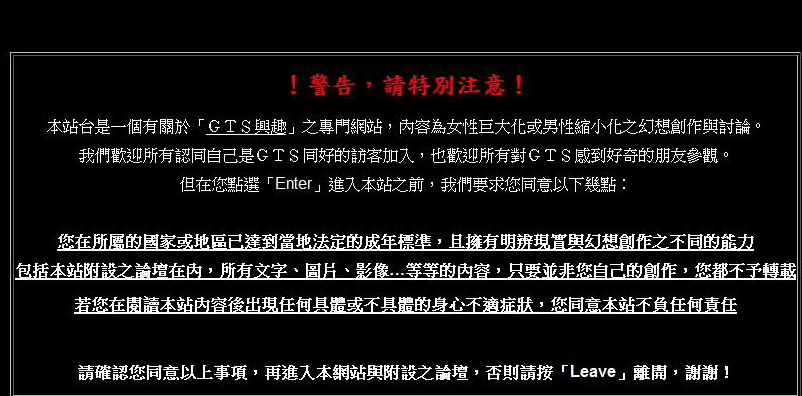

# 吐露心聲

作者：狐狸

TID：6960

<title>1</title> <link href="../Styles/Style.css" type="text/css" rel="stylesheet">

# 1

怎么说呢？这个论坛给我带来过激动也给我带来苦恼…因为我只是单纯的GTS仰慕者…我是个洁身自好的人…对于黄色等洪水猛兽实在不能接受…大与小之间的落差的确给部分人带来刺激、激动…我想除了外面勾进来这个群体的同好，聚在这里开始也只是为了单纯的GTS感受，可是放眼望去…不堪入目的东西…太多了…国外的同好作品就不至于这么杯具…难道单纯之道找不到痛快，原创者为了增加文艺性而掺和色情元素？原来GTs吧有百度看着…洪水猛兽被剔除…给人的感觉就是难忘…

[ *本帖最後由 cccc2468cccc 於 2010-3-2 21:25 編輯* ] <title>2</title> <link href="../Styles/Style.css" type="text/css" rel="stylesheet">

# 2

现在没有了束缚…色B得逞了…反正没有恐怖主义，没有纳粹…文章发出来呗！我的作品就从没有过一丝黄色，但一篇准备继续下去的小说却被删除…因为涉及到我的爱好——二战德军武裝力量，無宣傳意圖…逐渐的，乌烟瘴气，一片狼籍…给人对这个特殊文化的印象逐渐由不可思议到热情、变态…能被别人接受吗？希望这个网站不要让误入者脸红遮眼…还大家一个清新纯真的GTS空间！

[ *本帖最後由 cccc2468cccc 於 2010-3-3 06:27 編輯* ] <title>3</title> <link href="../Styles/Style.css" type="text/css" rel="stylesheet">

# 3

对于up主的疑惑，我说说自己的看法。
当然，GTS和色情不可混为一谈，up主希望就这一点分清界限，我非常理解。
但，必须强调的一个事实是，但丁建站之初，就把GN定位为18禁的论坛。
昂首挺胸地登入18禁论坛，却又大肆指责其他同好的作品如何如何色情，这是一种非常不妥的行为。

另外up主提到的那个……啥（不方便说出来），我的观点就是，无论是哪个论坛，太敏感的话题都是能避则避。 

————————————————————————————————————————
我的ID名亮了……

[ *本帖最後由 18X 於 2010-3-2 21:44 編輯* ] <title>4</title> <link href="../Styles/Style.css" type="text/css" rel="stylesheet">

# 4

记得进论坛之前有提示18X的吧...还写的很详细呢
LS的ID 确实亮了 <title>5</title> <link href="../Styles/Style.css" type="text/css" rel="stylesheet">

# 5

簡單版：認真你就輸了。但丁自己掏腰包開這個論壇就是爲了讓大家來收集和交流色情資源的，樓主這麼說是想讓但丁關論壇走人么。
————————————————————————————————————
複雜版：什麽叫黃，什麽是色，是張殊凡小朋友的很黃很暴力么？
人活著就要吃飯，吃飯就要剝奪其他生物的生命，任何人都覺著理所當然。
人活在社會就要發展，發展就要讓環境開路，森林砍砍，荒山炸炸什麽的，也就這麼過去了。
人活著要創造財富，創造財富過程中就會引發競爭，競爭就會演變成戰爭，幸好人類都是愛好和平的，還打了2次世界大戰呢。
人活著就要繁衍後代，可惜現在找不到老婆只好在家打打飛機，你說我一不殘骸生命，二不破壞環境，三不引發戰爭，滿足一下性需求怎麼就不行了呢？

你喜歡什麽我們沒有條件去干涉，但是請不要把二戰法西斯拿出來，討論黨衛隊請到“鐵血鷹巢”還是什麽地方，國際社會是不允許存在宣揚法西斯的東西的。而且，論壇的人員構成比較複雜，有臺灣 大陸 港澳 日本 等多個國家的組成，歷史 國際問題儘量迴避，或者儘量遮掩，以免造成不必要的麻煩。
————————————————————————————————————

打完發現已經不是SF了..........

發現某人出現，你的ID......

[ *本帖最後由 wjd1985 於 2010-3-2 22:20 編輯* ] <title>6</title> <link href="../Styles/Style.css" type="text/css" rel="stylesheet">

# 6

厄…認真啊…我只是來談天的…沒有别的意思…十八禁不代表黃啊…只是未成年人抵製誘惑能力差罷了 <title>7</title> <link href="../Styles/Style.css" type="text/css" rel="stylesheet">

# 7

再抱怨下去，對你沒有任何好處~~
會刪文，有可能是因為某些原因吧，理由我也不知道。

不過，此貼也透露太多二戰德x的某某「檔」。

[ *本帖最後由 hubert 於 2010-3-2 23:02 編輯* ] <title>8</title> <link href="../Styles/Style.css" type="text/css" rel="stylesheet">

# 8

但丁早久在論壇的首頁說了
現在說這些一點意義也沒有阿(攤手) <title>9</title> <link href="../Styles/Style.css" type="text/css" rel="stylesheet">

# 9

 <ignore_js_op>[01.jpg](forum.php?mod=attachment&aid=MTc5MTZ8ZDAxOTA3OTJ8MTY3NDA2ODkxOHwxODIzMHw2OTYw&nothumb=yes) *(161.57 KB, 下載次數: 0)*

[下載附件](forum.php?mod=attachment&aid=MTc5MTZ8ZDAxOTA3OTJ8MTY3NDA2ODkxOHwxODIzMHw2OTYw&nothumb=yes)

2010-3-2 23:17 上傳  

</ignore_js_op> <title>10</title> <link href="../Styles/Style.css" type="text/css" rel="stylesheet">

# 10

嘛……LZ的话可以理解，却实为了迎合部分同好有不少重口的资源，确实有不少看不惯的地方。本人也是只喜欢LOLI温柔系GTS，一直到现在也就挖了个快写不下去的坑……其实一方面是想改如何应对宅男在YYGTS时所喜欢的情节，一方面又是如何尽量避免自己厌恶的部分，于是坑且是填不上了，没了18X的成分的话基本上全文就没能拿得出手的地儿了 本人曾非常讨厌的一些GTS设定，现在已经做到眼不见心不烦了……LZ加油吧

PS：表成战帖……

[ *本帖最後由 chazi8 於 2010-3-2 23:33 編輯* ] <title>11</title> <link href="../Styles/Style.css" type="text/css" rel="stylesheet">

# 11

嘿朋友，我和你正好相反
我最愛的就是極致的色情，充滿腥膻色的文章，我也敢說，我翻譯改寫的文章沒有一篇不是重口味的，那麼，照你的話說，我也覺得板上充斥著毫無色情元素，單純的文章簡直莫名其妙，那我就可以在這裡大聲疾呼＂希望這個網站不要讓同好看了昏昏欲睡…還大家一個充滿激情的GTS空間吧！＂

我能說這種話嗎？

就算沒有人反對我這麼作，我也不會作出這種事，因為我知道什麼是尊重他人，懂得尊重論壇上所有同伴的興趣，所以當我看到不合我胃口的文章，我也會試著去欣賞，至少不會去將別人的興趣貶的一文不值。

那麼，你可以尊重我喜愛重口味的興趣嗎？朋友？ <title>12</title> <link href="../Styles/Style.css" type="text/css" rel="stylesheet">

# 12

你要明白大多数人的爱好，不能为了牵就你一个人就节约这么多的卫生纸，实在看不惯你也可以学但丁自己建个论坛啊，就叫做[www.nodirtygiantess.com](http://www.nodirtygiantess.com)，恩，就这样，自己当老大，看不惯谁就和谐谁，谁发黄就和谐谁，岂不快哉，不过估计没几个人会去你的论坛。 <title>13</title> <link href="../Styles/Style.css" type="text/css" rel="stylesheet">

# 13

就是個建議嘛…我就是希望發文章要註明一下這個…或者來個純潔區… <title>14</title> <link href="../Styles/Style.css" type="text/css" rel="stylesheet">

# 14

1.  萝卜白菜各有所爱，要认识到世界的差异性，尊重彼此的兴趣爱好。

2.  GTS资源有无数的种类，楼主喜欢纯洁的GTS，自己去创作才是唯一的正道，而且我相信你一定能找到属于自己的群体。其实我的作品都是蛮纯洁的，基本上没有18X，但是凭我创作的数量和质量，不仅为我自己创造了一片天空，也为我赢得了大家的支持和赞赏。

3.  我们来这里就是“单纯”讨论GTS相关的任何话题，这个“单纯”就是以围绕GTS为核心，其他任何话题都要“本能、自发”的避免，而且其他话题在这里也无任何意义。你会在这里问谁喜欢漂亮的军服和武器吗？当然不会，而你如果要问谁喜欢XX党的军队，那你就犯了大忌，这在其他任何论坛里都是一样的。比如个人头像就“没必要”带有任何“色彩”，因为这跟GTS无任何关系，反而不利于你在这个群体中的交流。每个论坛都有自己的性质，要找自己其他兴趣的同好要到其他论坛，这一点一定要分辨清楚。

最后，还是想起我那句话：
“我想圈子里的人大多都犯了这两个错误：
1\. 在网络上发现GTS圈子之前，以为自己是世界上唯一的。
2\. 在网络上发现GTS圈子之后，以为所有同好都跟自己是一样的。” <title>15</title> <link href="../Styles/Style.css" type="text/css" rel="stylesheet">

# 15

LZ有没有考虑过，GTS癖好的成因是什么？ <title>16</title> <link href="../Styles/Style.css" type="text/css" rel="stylesheet">

# 16

那个谁谁谁不是曰过：“食色，性也。”

建议lz，不喜欢的就自动过滤吧。 <title>17</title> <link href="../Styles/Style.css" type="text/css" rel="stylesheet">

# 17

“国外的同好作品就不至于这么杯具”

去国外的GTS网站看一看，你会发现这里的口味已经是很清淡的了。 <title>18</title> <link href="../Styles/Style.css" type="text/css" rel="stylesheet">

# 18

> 原帖由 *xnr* 於 2010-3-2 20:29 發表 
> “国外的同好作品就不至于这么杯具”
> 
> 去国外的GTS网站看一看，你会发现这里的口味已经是很清淡的了。

哈哈哈~~~这句话很好地描述了真实状况。
我不知道楼主喜欢GTS的成因是什么，但是你不要要求别人改变去适应你的需要……这句是双关的：你不应该；也不可能做到……如果你要纯洁的GTS系，就像要在世界上找不说谎的人一样~~你想想，为什么会有GTS…… <title>19</title> <link href="../Styles/Style.css" type="text/css" rel="stylesheet">

# 19

LZ你的观点是不正确的
我们论坛有各种各样的爱好范围
你不喜欢重口可以不看，去看轻口味的不就好了？
别说没有轻口味的作品，那只是你不认真找而已 <title>20</title> <link href="../Styles/Style.css" type="text/css" rel="stylesheet">

# 20

。。。。。。额。。。。。。也就是个爱好问题 <title>21</title> <link href="../Styles/Style.css" type="text/css" rel="stylesheet">

# 21

> 原帖由 *xnr* 於 2010-3-3 12:29 發表 
> “国外的同好作品就不至于这么杯具”
> 
> 去国外的GTS网站看一看，你会发现这里的口味已经是很清淡的了。

十分同意...混到現在我連gt的性描寫都可以看的很開心
以前我從沒想過我會有這一天... <title>22</title> <link href="../Styles/Style.css" type="text/css" rel="stylesheet">

# 22

我晕一个月了这个帖子还在第一页